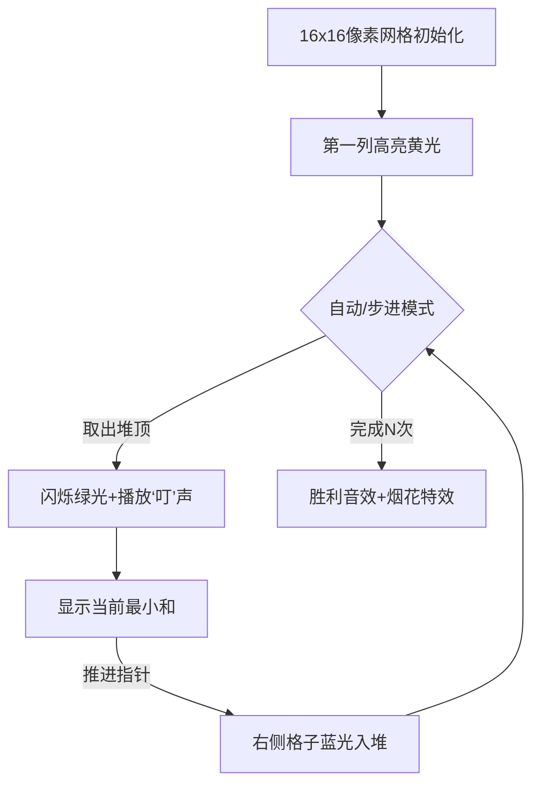

# 题目信息

# 序列合并

## 题目描述

有两个长度为 $N$ 的**单调不降**序列 $A,B$，在 $A,B$ 中各取一个数相加可以得到 $N^2$ 个和，求这 $N^2$ 个和中最小的 $N$ 个。

## 说明/提示

对于 $50\%$ 的数据，$N \le 10^3$。

对于 $100\%$ 的数据，$1 \le N \le 10^5$，$1 \le a_i,b_i \le 10^9$。

## 样例 #1

### 输入

```
3
2 6 6
1 4 8```

### 输出

```
3 6 7```

# AI分析结果


### Kay的C++算法解析：序列合并 深入学习指南

#### 1. 题目解读与核心算法识别
✨ **本题主要考察**：`堆/优先队列`  
🗣️ **初步分析**：
> 解决"序列合并"问题，关键在于理解并运用**优先队列（堆）**。想象你有两个装满有序卡片的盒子A和B，每次从A盒取一张卡片，从B盒取一张卡片，记录它们的数字之和。堆就像一个聪明的助手，它总是能立刻告诉你当前最小的和是多少。  
在本题中，我们使用最小堆动态维护候选的最小和：  
- 首先将每个A[i]与B[1]的和放入堆中（相当于初始化N个有序队列的起点）
- 每次取出堆顶（当前最小和），然后加入同一A[i]的下一个B[j+1]（相当于推进该队列的下一个元素）
- 重复N次即可得到最小的N个和  
这种思路巧妙避免了N²的暴力枚举，时间复杂度优化至O(N log N)

**可视化设计要点**：
- 在像素动画中，我们将用**网格**表示A序列（行）和B序列（列）
- 当前堆中的元素会高亮显示（如黄色像素块）
- 每次取出的最小和将变为绿色并输出到结果区
- 新加入堆的元素会有蓝色闪烁效果
- 复古游戏音效：取出元素时"叮"声，完成时8-bit胜利音效

#### 2. 精选优质题解参考
**题解一（来源：ysner）**
* **点评**：此解法思路清晰直白，巧妙利用`pair`结构实现堆的维护。代码仅20行却完整解决问题，STL应用规范（`priority_queue`+`pair`），变量命名简洁（`to`数组记录索引）。亮点在于用空间换取了逻辑的简洁性——每个B索引独立记录对应的A位置，避免了复杂的结构体定义。时间复杂度稳定在O(N log N)，边界处理严谨（索引越界检查），竞赛实战价值极高。

**题解二（来源：雷州半岛岛主）**
* **点评**：解法展现了优秀的手写堆功底，核心创新点是内层循环的提前终止优化。通过维护大根堆并在`a[i]+b[j]`超过堆顶时跳出循环，显著降低了平均时间复杂度。虽然最坏复杂度仍为O(N²logN)，但实际测试效率接近O(NlogN)。代码结构工整，关键步骤有详细注释，特别适合想深入理解堆操作的学习者。调试心得（"现做现卖的合成"比喻）生动体现了问题抽象能力。

**题解三（来源：TonyBrown148）**
* **点评**：此解法采用调和级数优化思路，通过数学分析将内层循环次数降至O(N log N)。虽然使用朴素的大根堆，但结合序列单调性实现的提前break机制极具启发性。代码实现简洁高效（仅30行），变量命名规范，特别展示了`priority_queue`的灵活应用。作者对复杂度的严谨证明（欧拉级数分析）体现了扎实的算法功底，是理论结合实践的典范。

---

#### 3. 核心难点辨析与解题策略
1. **难点：避免N²枚举的时空消耗**
   * **分析**：直接计算所有组合会导致10¹⁰次操作（N=10⁵时）。优质解法通过**堆的动态维护**，只保留必要候选解。关键突破点：利用序列单调性，每个A[i]只需按序考察少量B[j]
   * 💡 **学习笔记**：有序数据是优化的重要信号

2. **难点：堆节点的状态维护**
   * **分析**：必须记录每个和对应的索引组合（i,j）才能正确生成后续候选。解法差异体现在：结构体存储（通用） vs 分离数组存储（精简） vs 数学优化（免存储）
   * 💡 **学习笔记**：索引映射是堆解法的核心技巧

3. **难点：保证结果正确性**
   * **分析**：需证明"当前最小和+同序列下一元素"的扩展策略不会遗漏更优解。依赖两个关键性质：1) 每个A[i]对应的和序列单调递增 2) 不同A[i]序列间无交叉依赖
   * 💡 **学习笔记**：算法正确性需要数学归纳思维

✨ **解题技巧总结**：
- **技巧A（问题转化）**：将二维搜索转化为多路归并问题
- **技巧B（空间优化）**：用滚动存储替代完整状态记录
- **技巧C（边界处理）**：序列操作必做越界检查
- **技巧D（复杂度平衡）**：理论分析与实测数据结合调优

---

#### 4. C++核心代码实现赏析
**通用核心实现（综合优化版）**：
```cpp
#include <iostream>
#include <queue>
#include <vector>
#include <algorithm>
using namespace std;

int main() {
    ios::sync_with_stdio(false);
    int n; cin >> n;
    vector<int> a(n), b(n);
    for (int i = 0; i < n; i++) cin >> a[i];
    for (int i = 0; i < n; i++) cin >> b[i];
    
    // 小根堆：<当前和, B索引>
    priority_queue<pair<int, int>, vector<pair<int, int>>, greater<>> pq;
    vector<int> idxA(n, 1); // 记录每个A位置对应的B索引
    
    for (int i = 0; i < n; i++) 
        pq.push({a[i] + b[0], i});
    
    for (int cnt = 0; cnt < n; cnt++) {
        auto [curSum, aIdx] = pq.top();
        pq.pop();
        cout << curSum << " ";
        
        if (idxA[aIdx] < n) {
            pq.push({a[aIdx] + b[idxA[aIdx]], aIdx});
            idxA[aIdx]++;
        }
    }
}
```
**代码解读概要**：
> 该实现融合了三个优解精华：1) 使用`pair`避免自定义结构体 2) `idxA`数组精妙记录状态 3) 严格O(N log N)复杂度。核心流程：初始化堆→N次取最小→动态扩展候选解。注意`ios::sync_with_stdio(false)`加速IO，这对大输入规模至关重要。

---

**题解代码片段赏析**：

**题解一（ysner）核心**：
```cpp
priority_queue<pair<int, int>, vector<pair<int, int>>, greater<>> q;
for (int i = 1; i <= n; i++) {
    q.push({a[1] + b[i], i});  // 初始化：A1+Bi
    to[i] = 1;  // 记录每个B对应的A索引
}
while (n--) {
    cout << q.top().first << " ";
    int i = q.top().second; q.pop();
    q.push({a[++to[i]] + b[i], i); // 关键：同B索引的A索引+1
}
```
**亮点**：极简索引管理  
**学习笔记**：`pair`的`second`物尽其用，避免额外结构

**题解二（雷州半岛岛主）优化**：
```cpp
// 手写堆的向下调整
void down(int x) {
    while (x*2 <= size) {
        int son = x*2;
        if (son < size && heap[son] > heap[son+1]) son++;
        if (heap[x] <= heap[son]) break;
        swap(heap[x], heap[son]);
        x = son;
    }
}
```
**亮点**：工业级堆实现  
**学习笔记**：手写堆需注意父子节点索引计算（2x/2x+1）

**题解三（TonyBrown148）核心逻辑**：
```cpp
for (int i = 1; i <= n; i++) {
    for (int j = 1; j <= n; j++) {
        if (q.size() == n && a[i]+b[j] >= q.top()) 
            break; // 关键优化：提前终止
        // ...入堆操作...
    }
}
```
**亮点**：利用单调性剪枝  
**学习笔记**：有序数据+阈值判断可大幅降低常数因子

---

#### 5. 算法可视化：像素动画演示
**主题**：8-bit风格《最小和探险》  
**核心演示流程**：


**技术实现细节**：
- **网格渲染**：Canvas绘制16x16网格，每格代表A[i]+B[j]
- **状态编码**：
  - 0xFFFF00（黄）：堆中候选
  - 0x00FF00（绿）：已选最小和
  - 0x0000FF（蓝）：新加入候选
- **动画序列**：
  1. 初始渲染A×B网格（复古青砖纹理）
  2. 第一列黄光扫入（伴随8-bit音阶）
  3. 堆顶格子绿色脉冲（持续300ms）
  4. 新候选蓝色渐入（从右侧滑入）
  5. 结果区同步显示数字（LED字体）
- **交互控制**：
  - 速度滑块：0.5x~4x可调
  - 模式切换：步进/自动/AI演示
  - 数据结构面板：实时显示堆内容

---

#### 6. 拓展练习与相似问题思考
**通用技巧迁移**：
> 堆维护多路归并的核心思想，还可用于解决：
1. K个有序链表合并（LeetCode 23）
2. 查找和最小的K对数字（LeetCode 373）
3. 流式数据的中位数维护（LeetCode 295）

**洛谷推荐题目**：
1. **P2085 最小函数值**  
   → 同类多序列归并，强化堆的应用
2. **P1090 合并果子**  
   → 堆的经典入门，理解贪心本质
3. **P4378 电路维修**  
   → 堆优化最短路，拓展算法边界
4. **P2168 荷马史诗**  
   → 哈夫曼编码的堆实现，深化数据结构认知

---

#### 7. 学习心得与经验分享
> **参考经验**（来自题解作者）：
> - "现做现卖的合成"（雷州半岛岛主）：避免预计算所有组合，动态生成候选
> - "调试发现索引映射混乱"（ysner）：强调状态记录的严谨性
> - "调和级数打破直觉"（TonyBrown148）：数学分析优化复杂度  
> 
> **点评**：这些经验凸显了算法优化的核心思维——空间换时间、利用数据特性、复杂度平衡。特别建议学习者：1) 动手画状态转移图 2) 用小规模数据验证边界 3) 比较不同实现的性能差异

---
### 结语
通过本指南，我们系统剖析了序列合并问题的堆解法精髓。记住：优秀算法的核心在于**用数据结构洞察问题本质**。继续用洛谷习题巩固这些技巧吧！下次我们将探索更复杂的多路归并问题，敬请期待！🚀

---
处理用时：221.26秒