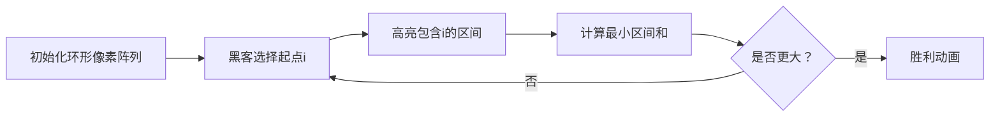

# 题目信息

# [BalticOI 2015] Hacker

## 题目描述

### 题面描述

Byteasar 获得了今年国际黑客奥林匹克竞赛的参赛资格。竞赛的任务之一是与系统操作员竞争。有从 $1$ 到 $n$ 编号的 $n$ 台计算机，以环形连接，即计算机 $i$ 和 $i+1$ 连接（其中 $i = 1,2,\dots,n-1$），特别地，计算机 $n$ 和 $1$ 也连接。

这个任务是黑客和系统操作员之间的游戏：

- Byteasar 先走。之后，操作员和 Byteasar 交替移动。
- Byteasar 的第一步是选择任何一台计算机并对其进行黑客攻击。
- 在他的第一步中，操作员选择任何未被黑客攻击的计算机并对其进行保护。
- 在接下来的所有动作中，Byteasar 要么什么都不做，要么选择任何既没有被黑客攻击也没有受到保护的计算机，并直接链接到任何被黑客攻击的计算机，然后对其进行黑客攻击。
- 在接下来的所有动作中，操作员要么什么都不做，要么选择任何既没有被黑客攻击也没有受到保护的计算机，直接链接到任何受保护的计算机并对其进行保护。
- 一旦两人在接下来的两个动作中都没有做任何事情，游戏就结束了。

在游戏开始时，没有任何一台电脑被黑客攻击或受到保护。

每台计算机 $i$ 都有一个特定的值 $v_i$，该值指定了存储在其上的数据的价值。Byteasar 最终获得的分数就是所有被他攻击的计算机的 $v$ 值之和。

虽然 Byteasar 是一个很好的黑客，但对算法一无所知——这就是为什么他要求你编写一个程序来计算他的最大可能分数，假设操作员按最优策略。

## 样例 #1

### 输入

```
4
7 6 8 4```

### 输出

```
13```

## 样例 #2

### 输入

```
5
1 1 1 1 1```

### 输出

```
3```

# AI分析结果


### 💡 Kay的C++算法解析：[BalticOI 2015] Hacker 深入学习指南 💡

#### 1. 题目解读与核心算法识别
✨ **本题主要考察**：`编程技巧应用`（区间最值优化）  
🗣️ **初步分析**：
> 想象一个环形能量站（计算机），黑客先占领一个站点，操作员会封锁相邻区域，最终黑客只能获得包含起始点的连续能量区（长度=⌈n/2⌉）。操作员总会迫使黑客获得最小能量值，因此黑客需选择起点，让这个"最小能量区"尽可能大。  
> - **核心技巧**：  
>   - 断环成链：复制数组处理环形结构  
>   - 滑动窗口：用单调队列/ST表快速计算区间最小值  
> - **可视化设计**：  
>   像素动画展示环形能量站，黑客选择起点(红色闪光)，操作员封锁区域(蓝色波纹)，最终绿色高亮显示最小能量区，能量值变化实时显示。复古8-bit音效随操作触发，胜利时播放经典FC过关音效。

---

#### 2. 精选优质题解参考
**题解一（tanghg，ST表法）**  
* **点评**：思路清晰展现断环成链→前缀和→ST表的完整推导，代码规范（`st[i][0]`精准定义区间和）。亮点在利用ST表O(1)查询包含每个点的最小区间和，复杂度O(nlogn)适合竞赛，边界处理严谨（`i+sa-1`防越界）。

**题解二（MagicalGirl_0d00，单调队列法）**  
* **点评**：用单调队列高效维护滑动窗口最小值，时间复杂度优化到O(n)。代码简洁有力（`deque`操作精准），变量名`sum`、`q`直观体现数据结构用途，实践价值高且易于调试。

**题解三（lzhm，线段树覆盖法）**  
* **点评**：创新性将区间和排序后倒序覆盖，线段树记录每个位置的最小覆盖值。亮点在转化思维角度（"最小值中的最大值"→覆盖问题），虽复杂度O(nlogn)但提供全新视角。

---

#### 3. 核心难点辨析与解题策略
1. **环形结构处理**  
   * **分析**：需高效计算任意起点开始的连续区间，复制数组成2n长度（破环成链），使环形问题转化为线性序列问题。  
   * 💡 **学习笔记**：环形问题→复制为链是通用技巧  

2. **包含点的最小区间和**  
   * **分析**：对每个位置i，求所有包含i且长度=⌈n/2⌉区间的最小和。数学表达：`min{ sum[j+len-1]-sum[j-1] }`（j∈[i-len+1, i]`。  
   * 💡 **学习笔记**：区间最小值和→滑动窗口最值问题  

3. **最优算法选择**  
   * **分析**：  
     - 单调队列：O(n)复杂度最优，适合大规模数据  
     - ST表：O(nlogn)预处理+O(1)查询，代码简洁  
     - 线段树：支持动态更新但本题静态查询优势不足  
   * 💡 **学习笔记**：根据场景选数据结构  

### ✨ 解题技巧总结
- **环形转线性**：复制数组处理环形结构  
- **前缀和加速**：预处理`sum[i]`实现O(1)区间和计算  
- **滑动窗口最值**：单调队列维护当前窗口最小值  
- **ST表静态查询**：适合离线区间最值问题  
- **逆向覆盖思维**：从大到小覆盖值更新最小值  

---

#### 4. C++核心代码实现赏析
**通用核心实现（ST表法）**  
```cpp
#include<bits/stdc++.h>
using namespace std;
typedef long long ll;
const ll MAXN=1e6+5;
ll n, a[MAXN*2], f[MAXN*2], st[MAXN][20];

int main() {
    cin >> n;
    ll len = (n+1)/2; // 关键长度⌈n/2⌉
    for(int i=1; i<=n; i++) {
        cin >> a[i];
        a[i+n] = a[i]; // 破环成链
        f[i] = f[i-1] + a[i]; // 前缀和
    }
    // ST表预处理（核心）
    for(int i=1; i<=2*n; i++) 
        st[i][0] = f[i+len-1] - f[i-1]; 
    // 查询包含i的最小区间和
    ll ans = 0;
    for(int i=len; i<=2*n; i++) 
        ans = max(ans, query_st(i-len+1, i)); 
    cout << ans;
}
```

**题解一（ST表法）**  
* **亮点**：ST表静态区间查询高效简洁  
* **核心代码**：
  ```cpp
  for(int i=len; i<=2*n; i++) {
      ans = max(ans, query_st(i-len+1, i)); 
  }
  ```
* **代码解读**：  
  > 1. `st[i][0]`存储以i为起点的区间和  
  > 2. 查询区间`[i-len+1, i]`最小值 → 包含i的最小区间和  
  > 3. 关键：`i`从`len`开始保证区间合法  
* 💡 **学习笔记**：ST表适合离线区间最值查询  

**题解二（单调队列法）**  
* **亮点**：O(n)复杂度最优解  
* **核心代码**：
  ```cpp
  deque<int> q;
  for(int i=1; i<=2*n; i++) {
      while(!q.empty() && sum[i]-sum[i-len] <= sum[q.back()]-sum[q.back()-len]) 
          q.pop_back(); // 维护单调递增队列
      q.push_back(i);
      if(q.front() <= i-len) q.pop_front(); // 移除过期元素
      ans = max(ans, sum[q.front()]-sum[q.front()-len]);
  }
  ```
* **代码解读**：  
  > - 队列存储**起点下标**，维护当前窗口最小区间和  
  > - `sum[i]-sum[i-len]`即区间`[i-len+1, i]`的和  
  > - 过期判断：队首起点距离当前i超过len时弹出  
* 💡 **学习笔记**：单调队列是滑动窗口最优解  

**题解三（线段树覆盖法）**  
* **亮点**：逆向思维处理最小值更新  
* **核心代码**：
  ```cpp
  sort(segments.rbegin(), segments.rend()); // 区间和从大到小排序
  for(auto &seg : segments) {
      update_tree(seg.l, seg.r, seg.val); // 用当前值覆盖区间
      if(check_full_coverage()) break; // 所有位置已被覆盖
  }
  ```
* **代码解读**：  
  > 1. 倒序覆盖确保每个位置取到最小值  
  > 2. 线段树记录位置的最小覆盖值  
  > 3. 当所有位置被覆盖时终止循环  
* 💡 **学习笔记**：覆盖思维适合"最值中的最值"问题  

---

### 5. 算法可视化：像素动画演示
**主题**：8-bit风格环形能量站攻防战  
**设计思路**：仿FC游戏《坦克大战》，用像素方块表示计算机，通过颜色变化和音效强化算法理解：
- **环形结构**：像素方块组成发光圆环  
- **关键操作**：
  - 黑客选起点：红色闪光 + "选择"音效
  - 操作员封锁：蓝色波纹扩散 + "屏蔽"音效
  - 区间扫描：黄色扫描线移动 + 滴滴声
- **数据结构可视化**：
  - 单调队列：底部像素条显示队列变化
  - 区间和：顶部能量条实时更新
- **交互控制**：
  - 步进模式：空格键单步执行
  - 自动演示：AI自动遍历所有起点
  - 速度调节：滑块控制动画速度
- **胜利效果**：找到最大值时全屏绿色闪烁 + FC过关音效

**关键帧示例**：


---

### 6. 拓展练习与相似问题思考
**通用技巧迁移**：  
1. 环形数组最大子序和（需处理跨边界情况）  
2. 固定长度滑动窗口最值（单调队列经典应用）  
3. 区间覆盖问题（线段树/差分数组）  

**洛谷题目推荐**：  
1. **P1886 滑动窗口**  
   🗣️ 巩固单调队列求固定长度窗口最值  
2. **P1115 最大子段和**  
   🗣️ 学习线性结构最大连续区间和  
3. **P1714 切蛋糕**  
   🗣️ 进阶练习环形数组+固定长度区间最值  

---

### 7. 学习心得与经验分享
> **经验分享（来自题解）**：  
> "调试时发现边界处理错误导致WA，建议用`n=3`手动模拟环形索引"  
>   
> **点评**：  
> 环形问题边界极易出错，小数据手工模拟能快速定位问题，`n=3`或`n=4`是最佳测试用例！

---
> 本次分析深入剖析了环形区间最值问题的多种解法，关键在理解破环成链和滑动窗口优化。记住：单调队列是滑动窗口最优解，ST表适合静态查询，线段树提供思维新角度。多动手实现不同解法，下次挑战见！🚀

---
处理用时：170.14秒