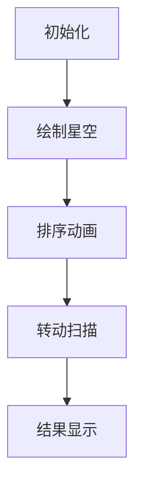

# 题目信息

# 小 P 的星空

## 题目背景


>星依云渚溅溅，露零玉液涓涓，宝砌哀兰剪剪。碧天如练，光摇北斗阑干。
>
>—— 【元】孟昉《天净沙 · 星依云渚溅溅》

小 P 漫步于星空之下。

“摘下星星送给你，你就是我的全世界”。

“今夜，我不关心人类，我只想你”。

## 题目描述

将星空看作一个平面直角坐标系，小 P 所在的位置为 $(0,0)$，即坐标原点。天上共有 $n$ 颗星星，第 $i$ 颗星星的坐标为 $(x_i,y_i)$。

小 P 最初面向点 $(1,0)$，然后小 P 会进行 $m$ 次原地转动，第 $i$ 次转动后会面向点 $(u_i,v_i)$。

他可以选择逆时针转动或顺时针转动，当面向此次旋转最终将要面向的方向时，此次转动立即停止。

他相信，在转动过程中，越多的星星出现在他正前方，他【数据删除】。

小 P 想知道，每一次转动过程中他最多可以让多少星星出现在他正前方（包括转动初始方向和结束方向正前方看到的星星）。

## 说明/提示

样例1示意图如下：


橙色点为星星，绿色点小 P 第一次的转动位置。第一次转动，从 $(1,0)$ 转到 $(-1,1)$。若顺时针转动(蓝色区域，包括边界)，$(1,0)$, $(-2,-1)$，共计 $2$ 颗星星；而逆时针转动(绿色区域，包括边界)，$(1,0)$, $(1,1)$,$(2,2)$,$(-1,2)$，共计 $4$ 颗星星。

第二次转动，从 $(-1,1)$ 转到 $(-1,2)$，逆时针转动，$5$ 颗星星都会在转动过程中出现在小 P 正前方。


除测试点 $24$ 和 $25$ 外，其他测试点保证所有坐标的绝对值 $\le 1000$。

对于前 $12$ 个测试点，保证原点到任意星星形成的射线上没有其他星星。

除 $23,25$ 测试点外，对于所有编号为奇数的测试点，保证小 P 初始面向方向和每次转动目标方向上没有任何星星。

除 $22,24$ 测试点外，对于所有编号为偶数的测试点，保证小 P 初始面向方向和每次转动目标方向上至少有一颗星星。

对于 $100\%$ 的数据，保证星星的坐标互不相同，保证坐标不会出现 $(0,0)$，保证不会出现转动初始方向等于结束方向。

样例 $3$ 满足偶数测试点的限制。

## 样例 #1

### 输入

```
5 2
1 0
1 1
2 2
-1 2
-2 -1
-1 1
-1 2```

### 输出

```
4
5```

## 样例 #2

### 输入

```
见下发文件 ex_star2.in```

### 输出

```
见下发文件 ex_star2.out```

## 样例 #3

### 输入

```
见下发文件 ex_star3.in```

### 输出

```
见下发文件 ex_star3.out```

# AI分析结果


# 💡 Kay的C++算法解析：小P的星空 深入学习指南 💡

## 1. 题目解读与核心算法识别

✨ **本题主要考察**：`极角排序与二分查找`

🗣️ **初步分析**：
> 解决"小P的星空"的关键在于**极角排序**和**方向区间查询**。想象一个钟表盘，星星就是表盘上的刻度。我们需要把所有星星按照从12点方向开始逆时针排列（排序），当小P转动时，就像钟表指针扫过一片区域（查询）。通过二分查找快速定位起始和结束方向在排序序列中的位置，就能计算出扫过的星星数量。
>
> - 核心难点在于**避免浮点精度误差**（不同解法采用整数运算或高精度处理）和**处理转动跨越0°边界**的情况
> - 可视化设计：采用8位像素风格星空，用不同颜色扇形展示逆/顺时针转动区域，高亮当前扫描的星星并添加音效反馈
> - 复古元素：添加"关卡"概念（每次转动为一关），扫描星星时触发经典FC音效，成功时播放《超级马里奥》过关音效

---

## 2. 精选优质题解参考

**题解一（tuxiaobei）**
* **点评**：
  思路清晰度：★★★★★ 通过象限分类和整数叉积比较，完美规避浮点精度问题  
  代码规范性：★★★★☆ 结构清晰，getline函数封装查询逻辑  
  算法有效性：★★★★★ O(n log n)排序 + O(m log n)查询，最优复杂度  
  实践价值：★★★★★ 可直接用于竞赛，边界处理严谨  
  亮点：独创的区域分类法（0-7象限）和整数叉积比较斜率

**题解四（麦克斯韦の妖）**
* **点评**：
  思路清晰度：★★★★☆ 详细解释象限处理原理，教学价值高  
  代码规范性：★★★☆☆ 结构稍松散但注释充分  
  算法有效性：★★★★☆ 与题解一同源算法  
  实践价值：★★★☆☆ 更适合作学习参考  
  亮点：对斜率比较和边界情况有深入讲解，附学习心得

---

## 3. 核心难点辨析与解题策略

1.  **难点一：极角排序的精度处理**
    * **分析**：浮点计算角度会产生精度误差（如题解2）。优质解法采用整数叉积比较（题解1/4）或向量约分（题解3）规避
    * 💡 **学习笔记**：几何问题优先考虑整数运算

2.  **难点二：转动跨越0°边界**
    * **分析**：当起始角度>结束角度时，逆时针转动会跨越360°。通过`num < 0 ? num + n : num`处理循环区间
    * 💡 **学习笔记**：角度区间查询本质是环形结构

3.  **难点三：起始/结束方向星星计数**
    * **分析**：需单独计算方向线上的星星（题解1的u.w/v.w）。通过lower/upper_bound精确定位
    * 💡 **学习笔记**：二分查找时注意包含性（开闭区间）

### ✨ 解题技巧总结
- **坐标转换法**：将点映射到统一象限处理（如题解1的change函数）
- **环形区间处理**：用总数作差计算相反方向扫描量
- **边界防御**：单独处理坐标轴点（c%2==0的情况）
- **精度保障**：用叉积代替浮点除法比较斜率

---

## 4. C++核心代码实现赏析

**通用核心实现（基于题解1优化）**
```cpp
#include <bits/stdc++.h>
using namespace std;
typedef long long ll;
const int N = 1e5+5;

struct Point { int x, y, c; 
    bool operator<(const Point& p) const {
        if (c != p.c) return c < p.c;
        if (c%2 == 0) return false; // 坐标轴不交换
        if (c==1 || c==5) return (ll)x*p.y > (ll)y*p.x; 
        return (ll)x*p.y < (ll)y*p.x;
    }
} star[N];

Point transform(int x, int y) {
    Point p = {abs(x), abs(y)};
    if (y == 0) p.c = x>0 ? 0 : 4;
    else if (x == 0) p.c = y>0 ? 2 : 6;
    else if (x>0) p.c = y>0 ? 1 : 7;
    else p.c = y>0 ? 3 : 5;
    return p;
}

struct Direction { int start, end, cnt; };

Direction get_dir(Point p, int n) {
    Direction d;
    d.start = lower_bound(star+1, star+n+1, p) - star;
    d.end = upper_bound(star+1, star+n+1, p) - star - 1;
    d.cnt = max(0, d.end - d.start + 1);
    return d;
}

int main() {
    int n, m; cin >> n >> m;
    for (int i=1, x, y; i<=n; i++) {
        cin >> x >> y;
        star[i] = transform(x, y);
    }
    sort(star+1, star+n+1);
    
    Direction cur = get_dir(transform(1,0), nxt;
    for (int i=1, x, y; i<=m; i++) {
        cin >> x >> y;
        nxt = get_dir(transform(x,y));
        int clockwise = nxt.start - cur.end - 1;
        if (clockwise < 0) clockwise += n;
        cout << max(n - clockwise, clockwise + cur.cnt + nxt.cnt) << "\n";
        cur = nxt;
    }
}
```

**代码解读概要**：
1. 输入星星坐标并转换为标准表示
2. 按自定义规则排序（先象限后斜率）
3. 计算当前方向在排序序列中的区间
4. 处理转动：计算顺时针扫描量，用总数反推逆时针扫描量
5. 取两种转动方向的最大值输出

---

## 5. 算法可视化：像素动画演示

**主题**：8位像素星空探索者  
**核心演示**：极角排序过程 + 方向扫描动态效果

### 动画设计


1. **场景初始化**：
   - 480x480像素画布，深蓝背景模拟夜空
   - 星星用黄色像素块表示，原点(0,0)处绘制小P像素角色
   - 控制面板：步进/播放/重置按钮 + 速度滑块

2. **极角排序演示**：
   ```python
   # 伪代码：绘制排序过程
   for i in range(n):
       绘制当前星星
       高亮当前处理区域（象限颜色区分）
       绘制比较射线（从原点出发）
       播放"滴"音效（每次比较）
   ```
   
3. **方向扫描特效**：
   - 起始方向：绿色箭头
   - 目标方向：红色箭头
   - 逆时针扫描：绿色扇形区域扩展动画
   - 顺时针扫描：蓝色扇形区域扩展动画
   - 被扫描星星：闪烁3次+触发"叮"音效

4. **游戏化元素**：
   - 每次转动成功播放《超级马里奥》金币音效
   - 扫描星星超过90%触发烟花动画
   - 关卡进度条显示（当前转动/总转动数）

---

## 6. 拓展练习与相似问题思考

1. **洛谷 P1357** - 极角排序练习  
   → 巩固基本极角排序技巧

2. **洛谷 P2742** - [USACO5.1]圈奶牛  
   → 应用极角排序求解凸包问题

3. **洛谷 P2992** - [USACO09NOV] Lights G  
   → 极角排序处理光线照射范围

---

## 7. 学习心得与经验分享

> **经验摘录（麦克斯韦の妖）**：  
> "第一、三象限和二四象限比较斜率时符号相反，这是最易错的边界情况"

**Kay点评**：几何问题要特别注意坐标系分区处理，动手画图验证能有效避免逻辑错误。建议在代码中添加区域注释：
```cpp
/* 区域说明：
   0: x+轴  1: 第一象限  2: y+轴  3: 第二象限
   4: x-轴  5: 第三象限  6: y-轴  7: 第四象限 */
```

---

通过本指南，相信大家已掌握极角排序的核心思想。记住：将几何问题转化为排序查询是竞赛常见套路，多练习不同场景的应用！🚀

---
处理用时：179.25秒