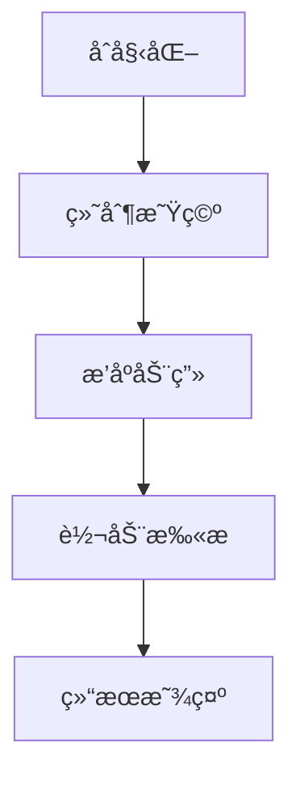

# 题目信æ¯

# å° P 的星空

## 题目背景


>星ä¾äº‘渚溅溅，露零ç‰æ¶²æ¶“涓，å®ç Œå“€å…°å‰ªå‰ªã€‚碧天如练，光摇北斗阑干。
>
>—— ã€å…ƒã€‘孟昉《天净沙 · 星ä¾äº‘渚溅溅》

å° P 漫步äºæ˜Ÿç©ºä¹‹ä¸‹ã€‚

“摘下星星é€ç»™ä½ ï¼Œä½ å°±æ˜¯æˆ‘的全世界â€ã€‚

“今夜，我ä¸å…³å¿ƒäººç±»ï¼Œæˆ‘åªæƒ³ä½ â€ã€‚

## 题目æè¿°

将星空看作一个平é¢ç›´è§’åæ ‡ç³»ï¼Œå° P 所在的ä½ç½®ä¸º $(0,0)$，å³åæ ‡åŸç‚¹ã€‚天上共有 $n$ 颗星星，第 $i$ 颗星星的å标为 $(x_i,y_i)$。

å° P 最åˆé¢å‘点 $(1,0)$，然åå° P 会进行 $m$ 次åŸåœ°è½¬åŠ¨ï¼Œç¬¬ $i$ 次转动å会é¢å‘点 $(u_i,v_i)$。

ä»–å¯ä»¥é€‰æ‹©é€†æ—¶é’ˆè½¬åŠ¨æˆ–顺时针转动，当é¢å‘此次旋转最终将è¦é¢å‘çš„æ–¹å‘时，此次转动立å³åœæ­¢ã€‚

他相信，在转动过程中，越多的星星出ç°åœ¨ä»–æ­£å‰æ–¹ï¼Œä»–ã€æ•°æ®åˆ é™¤ã€‘。

å° P 想知é“，æ¯ä¸€æ¬¡è½¬åŠ¨è¿‡ç¨‹ä¸­ä»–最多å¯ä»¥è®©å¤šå°‘星星出ç°åœ¨ä»–æ­£å‰æ–¹ï¼ˆåŒ…括转动åˆå§‹æ–¹å‘和结æŸæ–¹å‘æ­£å‰æ–¹çœ‹åˆ°çš„星星）。

## 说æ˜/æ示

样例1示æ„图如下：


æ©™è‰²ç‚¹ä¸ºæ˜Ÿæ˜Ÿï¼Œç»¿è‰²ç‚¹å° P 第一次的转动ä½ç½®ã€‚ç¬¬ä¸€æ¬¡è½¬åŠ¨ï¼Œä» $(1,0)$ 转到 $(-1,1)$。若顺时针转动(è“色区域，包括边界)，$(1,0)$, $(-2,-1)$，共计 $2$ 颗星星；而逆时针转动(绿色区域，包括边界)，$(1,0)$, $(1,1)$,$(2,2)$,$(-1,2)$，共计 $4$ 颗星星。

ç¬¬äºŒæ¬¡è½¬åŠ¨ï¼Œä» $(-1,1)$ 转到 $(-1,2)$，逆时针转动，$5$ 颗星星都会在转动过程中出ç°åœ¨å° P æ­£å‰æ–¹ã€‚


除测试点 $24$ å’Œ $25$ 外，其他测试点ä¿è¯æ‰€æœ‰å标的ç»å¯¹å€¼ $\le 1000$。

对äºå‰ $12$ 个测试点，ä¿è¯åŸç‚¹åˆ°ä»»æ„星星形æˆçš„射线上没有其他星星。

除 $23,25$ 测试点外，对äºæ‰€æœ‰ç¼–å·ä¸ºå¥‡æ•°çš„测试点，ä¿è¯å° P åˆå§‹é¢å‘æ–¹å‘å’Œæ¯æ¬¡è½¬åŠ¨ç›®æ ‡æ–¹å‘上没有任何星星。

除 $22,24$ 测试点外，对äºæ‰€æœ‰ç¼–å·ä¸ºå¶æ•°çš„测试点，ä¿è¯å° P åˆå§‹é¢å‘æ–¹å‘å’Œæ¯æ¬¡è½¬åŠ¨ç›®æ ‡æ–¹å‘上至少有一颗星星。

å¯¹äº $100\%$ çš„æ•°æ®ï¼Œä¿è¯æ˜Ÿæ˜Ÿçš„å标互ä¸ç›¸åŒï¼Œä¿è¯åæ ‡ä¸ä¼šå‡ºç° $(0,0)$，ä¿è¯ä¸ä¼šå‡ºç°è½¬åŠ¨åˆå§‹æ–¹å‘ç­‰äºç»“æŸæ–¹å‘。

样例 $3$ 满足å¶æ•°æµ‹è¯•ç‚¹çš„é™åˆ¶ã€‚

## 样例 #1

### 输入

```
5 2
1 0
1 1
2 2
-1 2
-2 -1
-1 1
-1 2```

### 输出

```
4
5```

## 样例 #2

### 输入

```
è§ä¸‹å‘文件 ex_star2.in```

### 输出

```
è§ä¸‹å‘文件 ex_star2.out```

## 样例 #3

### 输入

```
è§ä¸‹å‘文件 ex_star3.in```

### 输出

```
è§ä¸‹å‘文件 ex_star3.out```

# AI分æ结æœ


# 💡 Kayçš„C++算法解æ：å°P的星空 æ·±å…¥å­¦ä¹ æŒ‡å— ğŸ’¡

## 1. 题目解读ä¸æ ¸å¿ƒç®—法识别

✨ **本题主è¦è€ƒå¯Ÿ**：`æ角æ’åºä¸äºŒåˆ†æŸ¥æ‰¾`

ğŸ—£ï¸ **åˆæ­¥åˆ†æ**：
> 解决"å°P的星空"的关键在äº**æ角æ’åº**å’Œ**æ–¹å‘区间查询**。想象一个钟表盘，星星就是表盘上的刻度。我们需è¦æŠŠæ‰€æœ‰æ˜Ÿæ˜ŸæŒ‰ç…§ä»12点方å‘开始逆时针æ’列（æ’åºï¼‰ï¼Œå½“å°P转动时，就åƒé’Ÿè¡¨æŒ‡é’ˆæ‰«è¿‡ä¸€ç‰‡åŒºåŸŸï¼ˆæŸ¥è¯¢ï¼‰ã€‚通过二分查找快速定ä½èµ·å§‹å’Œç»“æŸæ–¹å‘在æ’åºåºåˆ—中的ä½ç½®ï¼Œå°±èƒ½è®¡ç®—出扫过的星星数é‡ã€‚
>
> - 核心难点在äº**é¿å…浮点精度误差**（ä¸åŒè§£æ³•é‡‡ç”¨æ•´æ•°è¿ç®—或高精度处ç†ï¼‰å’Œ**处ç†è½¬åŠ¨è·¨è¶Š0°边界**的情况
> - å¯è§†åŒ–设计：采用8ä½åƒç´ é£æ ¼æ˜Ÿç©ºï¼Œç”¨ä¸åŒé¢œè‰²æ‰‡å½¢å±•ç¤ºé€†/顺时针转动区域，高亮当å‰æ‰«æ的星星并添加音效å馈
> - å¤å¤å…ƒç´ ï¼šæ·»åŠ "å…³å¡"概念（æ¯æ¬¡è½¬åŠ¨ä¸ºä¸€å…³ï¼‰ï¼Œæ‰«æ星星时触å‘ç»å…¸FC音效，æˆåŠŸæ—¶æ’­æ”¾ã€Šè¶…级马里奥》过关音效

---

## 2. 精选优质题解å‚考

**题解一（tuxiaobei）**
* **点评**：
  æ€è·¯æ¸…晰度：★★★★★ 通过象é™åˆ†ç±»å’Œæ•´æ•°å‰ç§¯æ¯”较，完ç¾è§„é¿æµ®ç‚¹ç²¾åº¦é—®é¢˜  
  代ç è§„范性：★★★★☆ 结æ„清晰，getline函数å°è£…查询逻辑  
  算法有效性：★★★★★ O(n log n)æ’åº + O(m log n)查询，最优å¤æ‚度  
  å®è·µä»·å€¼ï¼šâ˜…★★★★ å¯ç›´æ¥ç”¨äºç«èµ›ï¼Œè¾¹ç•Œå¤„ç†ä¸¥è°¨  
  亮点：独创的区域分类法（0-7象é™ï¼‰å’Œæ•´æ•°å‰ç§¯æ¯”较斜ç‡

**题解四（麦克斯韦ã®å¦–）**
* **点评**：
  æ€è·¯æ¸…晰度：★★★★☆ 详细解释象é™å¤„ç†åŸç†ï¼Œæ•™å­¦ä»·å€¼é«˜  
  代ç è§„范性：★★★☆☆ 结æ„ç¨æ¾æ•£ä½†æ³¨é‡Šå……分  
  算法有效性：★★★★☆ ä¸é¢˜è§£ä¸€åŒæºç®—法  
  å®è·µä»·å€¼ï¼šâ˜…★★☆☆ 更适åˆä½œå­¦ä¹ å‚考  
  亮点：对斜ç‡æ¯”较和边界情况有深入讲解，附学习心得

---

## 3. 核心难点辨æä¸è§£é¢˜ç­–ç•¥

1.  **难点一：æ角æ’åºçš„精度处ç†**
    * **分æ**：浮点计算角度会产生精度误差（如题解2）。优质解法采用整数å‰ç§¯æ¯”较（题解1/4）或å‘é‡çº¦åˆ†ï¼ˆé¢˜è§£3）规é¿
    * 💡 **学习笔记**：几何问题优先考虑整数è¿ç®—

2.  **难点二：转动跨越0°边界**
    * **分æ**：当起始角度>结æŸè§’度时，逆时针转动会跨越360°。通过`num < 0 ? num + n : num`处ç†å¾ªç¯åŒºé—´
    * 💡 **学习笔记**：角度区间查询本质是ç¯å½¢ç»“æ„

3.  **难点三：起始/结æŸæ–¹å‘星星计数**
    * **分æ**：需å•ç‹¬è®¡ç®—æ–¹å‘线上的星星（题解1çš„u.w/v.w）。通过lower/upper_bound精确定ä½
    * 💡 **学习笔记**：二分查找时注æ„包å«æ€§ï¼ˆå¼€é—­åŒºé—´ï¼‰

### ✨ 解题技巧总结
- **å标转æ¢æ³•**：将点映射到统一象é™å¤„ç†ï¼ˆå¦‚题解1çš„change函数）
- **ç¯å½¢åŒºé—´å¤„ç†**：用总数作差计算相åæ–¹å‘扫æé‡
- **边界防御**：å•ç‹¬å¤„ç†å标轴点（c%2==0的情况）
- **精度ä¿éšœ**：用å‰ç§¯ä»£æ›¿æµ®ç‚¹é™¤æ³•æ¯”较斜ç‡

---

## 4. C++核心代ç å®ç°èµæ

**通用核心å®ç°ï¼ˆåŸºäºé¢˜è§£1优化）**
```cpp
#include <bits/stdc++.h>
using namespace std;
typedef long long ll;
const int N = 1e5+5;

struct Point { int x, y, c; 
    bool operator<(const Point& p) const {
        if (c != p.c) return c < p.c;
        if (c%2 == 0) return false; // å标轴ä¸äº¤æ¢
        if (c==1 || c==5) return (ll)x*p.y > (ll)y*p.x; 
        return (ll)x*p.y < (ll)y*p.x;
    }
} star[N];

Point transform(int x, int y) {
    Point p = {abs(x), abs(y)};
    if (y == 0) p.c = x>0 ? 0 : 4;
    else if (x == 0) p.c = y>0 ? 2 : 6;
    else if (x>0) p.c = y>0 ? 1 : 7;
    else p.c = y>0 ? 3 : 5;
    return p;
}

struct Direction { int start, end, cnt; };

Direction get_dir(Point p, int n) {
    Direction d;
    d.start = lower_bound(star+1, star+n+1, p) - star;
    d.end = upper_bound(star+1, star+n+1, p) - star - 1;
    d.cnt = max(0, d.end - d.start + 1);
    return d;
}

int main() {
    int n, m; cin >> n >> m;
    for (int i=1, x, y; i<=n; i++) {
        cin >> x >> y;
        star[i] = transform(x, y);
    }
    sort(star+1, star+n+1);
    
    Direction cur = get_dir(transform(1,0), nxt;
    for (int i=1, x, y; i<=m; i++) {
        cin >> x >> y;
        nxt = get_dir(transform(x,y));
        int clockwise = nxt.start - cur.end - 1;
        if (clockwise < 0) clockwise += n;
        cout << max(n - clockwise, clockwise + cur.cnt + nxt.cnt) << "\n";
        cur = nxt;
    }
}
```

**代ç è§£è¯»æ¦‚è¦**：
1. 输入星星å标并转æ¢ä¸ºæ ‡å‡†è¡¨ç¤º
2. 按自定义规则æ’åºï¼ˆå…ˆè±¡é™åæ–œç‡ï¼‰
3. 计算当å‰æ–¹å‘在æ’åºåºåˆ—中的区间
4. 处ç†è½¬åŠ¨ï¼šè®¡ç®—顺时针扫æé‡ï¼Œç”¨æ€»æ•°åæ¨é€†æ—¶é’ˆæ‰«æé‡
5. å–两ç§è½¬åŠ¨æ–¹å‘的最大值输出

---

## 5. 算法å¯è§†åŒ–：åƒç´ åŠ¨ç”»æ¼”示

**主题**：8ä½åƒç´ æ˜Ÿç©ºæ¢ç´¢è€…  
**核心演示**：æ角æ’åºè¿‡ç¨‹ + æ–¹å‘扫æ动æ€æ•ˆæœ

### 动画设计


1. **场景åˆå§‹åŒ–**：
   - 480x480åƒç´ ç”»å¸ƒï¼Œæ·±è“背景模拟夜空
   - 星星用黄色åƒç´ å—表示，åŸç‚¹(0,0)处绘制å°Påƒç´ è§’色
   - æ§åˆ¶é¢æ¿ï¼šæ­¥è¿›/播放/é‡ç½®æŒ‰é’® + 速度滑å—

2. **æ角æ’åºæ¼”示**：
   ```python
   # 伪代ç ï¼šç»˜åˆ¶æ’åºè¿‡ç¨‹
   for i in range(n):
       绘制当å‰æ˜Ÿæ˜Ÿ
       高亮当å‰å¤„ç†åŒºåŸŸï¼ˆè±¡é™é¢œè‰²åŒºåˆ†ï¼‰
       绘制比较射线（ä»åŸç‚¹å‡ºå‘）
       播放"æ»´"音效（æ¯æ¬¡æ¯”较）
   ```
   
3. **æ–¹å‘扫æ特效**：
   - 起始方å‘：绿色箭头
   - 目标方å‘：红色箭头
   - 逆时针扫æ：绿色扇形区域扩展动画
   - 顺时针扫æ：è“色扇形区域扩展动画
   - 被扫æ星星：闪çƒ3次+触å‘"å®"音效

4. **游æˆåŒ–元素**：
   - æ¯æ¬¡è½¬åŠ¨æˆåŠŸæ’­æ”¾ã€Šè¶…级马里奥》金å¸éŸ³æ•ˆ
   - 扫æ星星超过90%触å‘烟花动画
   - å…³å¡è¿›åº¦æ¡æ˜¾ç¤ºï¼ˆå½“å‰è½¬åŠ¨/总转动数）

---

## 6. 拓展练习ä¸ç›¸ä¼¼é—®é¢˜æ€è€ƒ

1. **洛谷 P1357** - æ角æ’åºç»ƒä¹   
   → 巩固基本æ角æ’åºæŠ€å·§

2. **洛谷 P2742** - [USACO5.1]圈奶牛  
   → 应用æ角æ’åºæ±‚解凸包问题

3. **洛谷 P2992** - [USACO09NOV] Lights G  
   → æ角æ’åºå¤„ç†å…‰çº¿ç…§å°„范围

---

## 7. 学习心得ä¸ç»éªŒåˆ†äº«

> **ç»éªŒæ‘˜å½•ï¼ˆéº¦å…‹æ–¯éŸ¦ã®å¦–）**：  
> "第一ã€ä¸‰è±¡é™å’ŒäºŒå››è±¡é™æ¯”较斜ç‡æ—¶ç¬¦å·ç›¸å，这是最易错的边界情况"

**Kay点评**：几何问题è¦ç‰¹åˆ«æ³¨æ„å标系分区处ç†ï¼ŒåŠ¨æ‰‹ç”»å›¾éªŒè¯èƒ½æœ‰æ•ˆé¿å…逻辑错误。建议在代ç ä¸­æ·»åŠ åŒºåŸŸæ³¨é‡Šï¼š
```cpp
/* 区域说æ˜ï¼š
   0: x+è½´  1: ç¬¬ä¸€è±¡é™  2: y+è½´  3: 第二象é™
   4: x-è½´  5: ç¬¬ä¸‰è±¡é™  6: y-è½´  7: ç¬¬å››è±¡é™ */
```

---

通过本指å—，相信大家已æŒæ¡æ角æ’åºçš„核心æ€æƒ³ã€‚è®°ä½ï¼šå°†å‡ ä½•é—®é¢˜è½¬åŒ–为æ’åºæŸ¥è¯¢æ˜¯ç«èµ›å¸¸è§å¥—路，多练习ä¸åŒåœºæ™¯çš„应用ï¼ğŸš€

---
处ç†ç”¨æ—¶ï¼š179.25秒