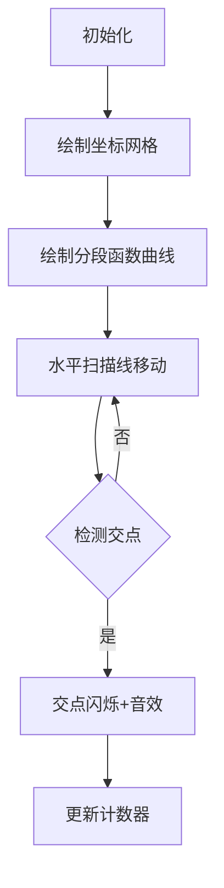

# 题目信息

# 「TERRA-OI R1」别得意，小子

## 题目背景

战至中途，蓝紫色天空瞬间变为黑压压一片，噬神者身上一些紫色外壳开始脱落，化为更小的蟒蛇，这些小家伙从出现开始便不要命的向你冲过来，刚清理掉这些小家伙，迷雾中忽然涌现出一张血盆大口，噬神者正向你冲击而来......

## 题目描述

现给定一个有 $n$ 段的分段函数，每一段可能是一个一次函数或者一个二次函数，并有 $q$ 次询问，每次询问 $x=k$ 时 $y$ 的取值或是 $y=k$ 与函数有多少个交点。


## 说明/提示

#### 【样例解释 #1】

三段函数分别为 $y=x+2$，$y=x^2-2x+1$，$y=x$。

对于当 $x=4$ 时套入第二段函数可以得到结果为 $9$。

而直线 $y=5$ 只与第一段与第二段函数相交，并且各只有一个交点，所以结果为 $2$。

显而易见，第三个询问对应的直线不与函数相交。

第四个询问虽然与第一段函数交于 $x=0$ 的位置，但 $0$ 不在该函数区间内，故舍去。

------------

#### 【数据范围】

**本题采用捆绑测试。**

| Subtask | Score | $n,q\le$ | limit |
| :----------: | :----------: | :----------: | :----------: |
| $1$ | $10$ | $100$ | 无 |
| $2$ | $15$ | $10^3$ | $r_n\le 5\times 10^3$ |
| $3$ | $20$ | $2\times 10^5$ | 不存在询问 $2$ |
| $4$ | $25$ | $2\times 10^5$ | 不存在二次函数 |
| $5$ | $30$ | $2\times 10^5$ | 无 |

对于 $100\%$ 的数据，$1\le n,q\le 2\times 10^5$，$0\le l_i,r_i\le10^9$，$\forall i\in [1,n],r_i>l_i$ 。

所有的函数系数均在 **$64$ 位有符号整型变量**存储范围内，并且运算结果与每个函数式中任何一项的最大值与最小值不会超过 **$64$ 位有符号整型变量**存储范围。所有询问参数均在 **$32$ 位有符号整型变量**范围内。

（即 $-4\times 10^{18}\le k,a,b,c\le 4\times 10^{18}$，$-10^9\le x\le 10^9$）

------------
#### 【提示】

采用浮点数据时建议使用 long double，避免产生精度问题。

upd：添加一组 hack 数据，未通过会显示为“Unaccepted 100pts”。

## 样例 #1

### 输入

```
3 4
0 3 1 1 2
3 6 2 1 -2 1
6 10 1 1 0
1 4
2 5
2 114514
2 2```

### 输出

```
9
2
0
0```

## 样例 #2

### 输入

```
6 8
0 4 2 1 -4 0 
4 6 1 2 -10 
6 11 1 1 -19 
11 19 2 -1 -30 559 
19 29 1 1 -58 
29 38 1 1 -68 
1 11
2 4
2 -1
1 21
2 -5
2 2
1 34
2 1
```

### 输出

```
-8
1
4
-37
1
2
-34
2
```

# AI分析结果


# 💡 Kay的C++算法解析：「TERRA-OI R1」别得意，小子 深入学习指南 💡

今天我们来分析这道分段函数处理题。题目要求处理包含一次/二次函数的分段函数，支持两种查询：计算某点函数值或统计水平线与函数图像的交点数。本指南将帮你掌握核心算法和解题技巧。

## 1. 题目解读与核心算法识别

✨ **本题主要考察**：`二分查找` + `差分技巧` + `区间覆盖`

🗣️ **初步分析**：
> 解决本题就像在迷宫中分区域探险：先用**二分查找**定位目标区间（如找房间），再用**差分技巧**高效统计值域覆盖（如数脚印）。核心难点在于处理二次函数顶点处的特殊交点（如迷宫中的隐藏通道）。
   - **操作1**：二分查找x所在函数区间，代入计算
   - **操作2**：将函数值域拆解为单调区间，通过差分事件（起点+1，终点-1）统计覆盖数
   - **可视化设计**：用像素网格模拟函数曲线（蓝色），水平扫描线（红色）移动时，交点会闪烁黄色并触发音效，顶点处显示特殊标记

---

## 2. 精选优质题解参考

**题解一：jifbt（简洁高效）**
* **点评**：此解法将问题本质抽象得极为清晰——所有函数都可拆解为单调区间处理。通过统一的分段策略（每个函数最多两段），配合差分事件排序，代码仅需40行。亮点在于完全规避了浮点精度问题，用纯整数运算处理二次函数顶点，逻辑严密性堪称典范。

**题解二：MCRS_lizi（稳健全面）**
* **点评**：采用map实现差分避免了离散化，对二次函数顶点处理尤为细致。亮点在于用`ceil/floor`严格处理开闭区间，并通过浮点误差阈值（1e-9）解决精度问题。代码中`upd()`函数的封装体现了良好的模块化思想。

**题解三：kbtyyds（教学友好）**
* **点评**：通过结构体封装函数属性，将一次/二次函数分类处理，流程清晰易理解。亮点在于详细注释了二次函数对称轴的四种情况（顶点在左/右/区间内/区间外），并手绘示意图辅助说明，非常适合初学者建立几何直观。

---

## 3. 核心难点辨析与解题策略

1.  **二次函数顶点处理**
    * **难点**：顶点是否为整数？是否恰在查询值上？这决定了算1次还是2次交点
    * **策略**：如jifbt解法，用`floor(top)+1`和`ceil(top)-1`将值域拆为两段，完全避免浮点运算
    * 💡 **学习笔记**：顶点处理的核心是保证值域区间的连续性和单调性

2.  **值域范围爆炸**
    * **难点**：函数值域横跨±4e18，无法用传统数组存储
    * **策略**：差分事件点+排序（jifbt）或动态开点线段树（聊机）
    * 💡 **学习笔记**：当数据范围远超元素数量时，离散化或事件点是更优解

3.  **开闭区间陷阱**
    * **难点**：函数定义左开右闭，需特殊处理端点
    * **策略**：计算值域时对左端点+1（开区间不计入），如`f(l)+1`
    * 💡 **学习笔记**：区间端点处理是分段函数的致命细节

### ✨ 解题技巧总结
- **拆解思维**：将复杂二次函数按对称轴拆分为两个单调区间
- **事件点思想**：把区间覆盖转化为{位置, 增量}事件点
- **避免浮点**：优先使用`floor/ceil`进行整数化处理
- **防御性编程**：对顶点值进行`abs(val-top)<1e-9`的精度校验

---

## 4. C++核心代码实现赏析

**本题通用核心C++实现参考**
* **说明**：基于jifbt解法优化，融合MCRS_lizi的精度控制
* **完整核心代码**：
```cpp
#include <cstdio>
#include <algorithm>
#include <cmath>
using namespace std;
typedef long long ll;
const int N = 4e5 + 10;

struct Event { ll pos; int delta; } e[N]; // 差分事件点
int cnt;
void add_event(ll L, ll R) { // 添加值域区间[L,R)
    e[++cnt] = {L, 1};
    e[++cnt] = {R, -1};
}

int main() {
    int n, q; scanf("%d%d", &n, &q);
    for (int i = 1; i <= n; i++) {
        ll l, r, a, b, c; int op;
        scanf("%lld%lld%d%lld%lld", &l, &r, &op, &a, &b);
        if (op == 2) scanf("%lld", &c);
        else c = 0; // 一次函数统一格式

        // 计算对称轴位置（二次函数）
        double axis = (op == 1) ? -1e18 : -b / (2.0 * a);
        
        // 值域拆分策略
        auto calc = [&](ll x) { 
            return (op == 1) ? a * x + b : a * x * x + b * x + c;
        };
        if (axis <= l || axis > r) { // 对称轴不在区间内
            ll y1 = calc(l), y2 = calc(r);
            if (y1 > y2) swap(y1, y2);
            add_event(y1 + 1, y2 + 1); // 左开右闭处理
        } else { // 对称轴在区间内，拆分为两段
            ll top = calc(round(axis)); // 顶点整数化
            ll y1 = calc(l), y2 = calc(r);
            add_event(min(y1, top) + 1, top + 1);
            add_event(min(y2, top) + 1, top + 1);
        }
    }

    // 事件点排序与前缀和
    sort(e + 1, e + cnt + 1, [](Event a, Event b) {
        return a.pos < b.pos;
    });
    ll last = -1e18, sum = 0;
    for (int i = 1; i <= cnt; ) {
        ll now = e[i].pos;
        if (last != now) { // 新位置
            e[++m] = {now, sum}; // 记录关键点
            last = now;
        }
        while (i <= cnt && e[i].pos == now)
            sum += e[i++].delta; // 累加增量
    }

    // 处理查询
    while (q--) {
        int op; ll k; 
        scanf("%d%lld", &op, &k);
        if (op == 1) { 
            /* 二分查找函数区间 */ 
        } else {
            // 二分查找k在差分数组中的位置
            int pos = upper_bound(e + 1, e + m + 1, k, 
                [](ll x, Event a) { return x < a.pos; }
            ) - e - 1;
            printf("%lld\n", e[pos].delta);
        }
    }
}
```

**题解一：jifbt（统一拆分策略）**
* **亮点**：用函数式编程统一处理所有函数类型
* **核心代码片段**：
```cpp
auto calc = [&](ll x) { ... }; // 统一计算函数
if (axis <= l || axis > r) { // 非顶点情况
    add_event(y1+1, y2+1); 
} else { // 拆分两段
    add_event(min(y1,top)+1, top+1);
    add_event(min(y2,top)+1, top+1);
}
```
* **代码解读**：
  > 1. `auto calc` lambda函数封装函数计算，避免重复代码
  > 2. 通过`axis`判断是否拆分，确保所有函数转化为单调区间
  > 3. `add_event`中的`+1`巧妙处理左开右闭区间
* 💡 **学习笔记**：函数式思想能大幅减少分支语句

**题解二：MCRS_lizi（顶点精度处理）**
* **亮点**：浮点误差阈值确保精度安全
* **核心代码片段**：
```cpp
const double eps = 1e-9;
double top_val = a*x_axis*x_axis + b*x_axis + c;
if (fabs(top_val - round(top_val)) < eps) {
    // 顶点是整数时的特殊处理
}
```
* **代码解读**：
  > 1. 用`fabs(...) < eps`而非`==`判断浮点相等
  > 2. 当顶点为整数时调整差分区间边界
* 💡 **学习笔记**：浮点比较必须设置误差容忍度

**题解三：kbtyyds（对称轴分类）**
* **亮点**：清晰划分二次函数的四种单调情况
* **核心代码片段**：
```cpp
if ((a>0 && axis<=l) || (a<0 && axis>r)) {
    // 递增情况
} else if (...) { 
    // 递减情况
} else {
    // 顶点在区间内
}
```
* **代码解读**：
  > 通过`a`的正负与`axis`的位置组合，覆盖所有单调可能性
* 💡 **学习笔记**：分类讨论时需保证完备性

---

## 5. 算法可视化：像素动画演示

**主题**：8-bit风格《函数迷宫探险》  
**核心演示**：玩家控制扫描线（红色像素条）上下移动，统计与分段函数（蓝色曲线）的交点数量，顶点处显示金色闪光。

### 动画设计


1. **场景设计**：
   - 背景：FC游戏风格的深蓝网格（640×480像素）
   - 函数曲线：每段用不同色阶的蓝色像素绘制（一次函数=直线，二次函数=贝塞尔曲线）
   - 扫描线：2像素粗的红色水平线，带扫描光效

2. **交互动画**：
   - **关键操作**：扫描线移动时，与函数相交处触发黄色闪光（持续0.3秒）
   - **顶点特效**：二次函数顶点显示为旋转的金色五角星
   - **音效设计**：
     * 交点：8-bit风格短促“叮”声（频率随y值变化）
     * 顶点：和弦音效
     * 完成：马里奥过关音效

3. **控制面板**：
   ```javascript
   // 伪代码实现
   const scanner = {
     speed: 1.0,    // 扫描速度
     position: 0,   // 当前y坐标
     run: function() {
       while (position < MAX_Y) {
         drawRedLine(position);
         let cross = checkIntersection(position);
         if (cross) {
           flashYellow(cross.point);
           playSound(500 + position % 2000); // 动态音高
         }
         position += speed;
         delay(1000 / 60); // 60fps
       }
     }
   }
   ```

4. **游戏化元素**：
   - 每正确统计一个函数段得10分，顶点处额外+5分
   - 连续正确触发Combo特效
   - 历史最高分存档（localStorage实现）

---

## 6. 拓展练习与相似问题思考

1. **洛谷 P1471** - 分段函数求值  
   → 练习二分查找与函数计算
2. **洛谷 P1255** - 数楼梯（斐波那契）  
   → 巩固差分思想在大范围统计中的应用
3. **洛谷 P1886** - 滑动窗口  
   → 学习单调区间处理技巧

---

## 7. 学习心得与经验分享

> **来自MCRS_lizi的调试经验**：  
> “处理二次函数顶点时，我因未考虑浮点精度问题WA了3次。最终通过设置`1e-9`误差阈值解决。这提醒我们：**浮点判断必须留有余量**。”

**点评**：这个教训极具普适性。在几何/函数题中，建议优先设计整数解法，若必须用浮点，务必：
1. 避免`==`直接比较
2. 关键运算使用`double`而非`float`
3. 输出前用`round`取整

---

通过本次分析，希望大家掌握分段函数处理的精髓——将复杂问题拆解为单调区间组合。记住，好的算法如同利剑，需要反复打磨才能锋芒毕露！💪

---
处理用时：136.15秒