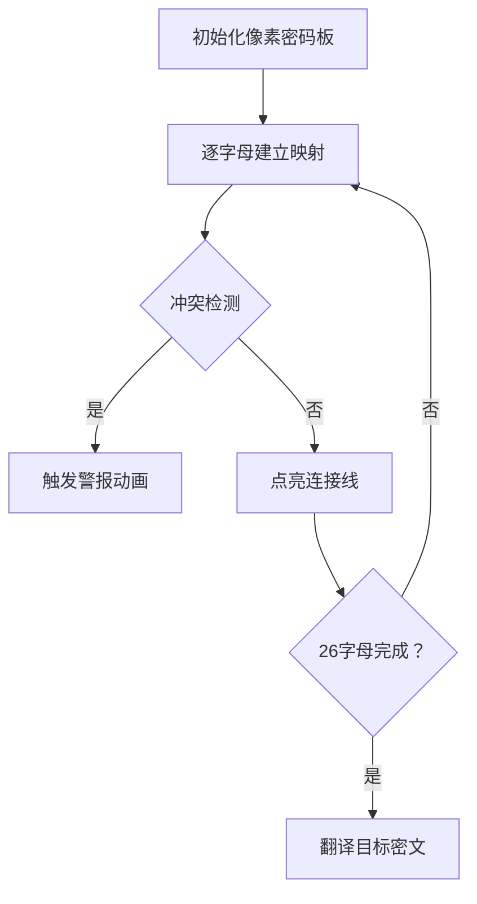

# 题目信息

# [NOIP 2009 提高组] 潜伏者

## 题目描述

R 国和 S 国正陷入战火之中，双方都互派间谍，潜入对方内部，伺机行动。历尽艰险后，潜伏于 S 国的 R 国间谍小 C 终于摸清了 S 国军用密码的编码规则：

1. S 国军方内部欲发送的原信息经过加密后在网络上发送，原信息的内容与加密后所得的内容均由大写字母 $\texttt{A}\sim\texttt{Z}$ 构成（无空格等其他字符）；
2. S 国对于每个字母规定了对应的密字。加密的过程就是将原信息中的所有字母替换为其对应的密字；
3. 每个字母只对应一个唯一的密字，不同的字母对应不同的密字。密字可以和原字母相同。

例如，若规定 $\tt A$ 的密字为 $\tt A$，$\tt B$ 的密字为 $\tt C$（其他字母及密字略），则原信息 $\tt ABA$ 被加密为 $\tt ACA$。

现在，小 C 通过内线掌握了 S 国网络上发送的一条加密信息及其对应的原信息。小 C 希望能通过这条信息，破译 S 国的军用密码。小 C 的破译过程是这样的：扫描原信息，对于原信息中的字母 $x$（代表任一大写字母），找到其在加密信息中的对应大写字母 $y$，并认为在密码里 $y$ 是 $x$ 的密字。如此进行下去直到停止于如下的某个状态：

1. 所有信息扫描完毕，$\texttt{A}\sim\texttt{Z}$ 所有 $26$ 个字母在原信息中均出现过并获得了相应的密字；
2. 所有信息扫描完毕，但发现存在某个（或某些）字母在原信息中没有出现；
3. 扫描中发现掌握的信息里有明显的自相矛盾或错误（违反 S 国密码的编码规则）。

例：

如某条信息 $\tt XYZ$ 被翻译为 $\tt ABA$ 就违反了“不同字母对应不同密字”的规则。

在小 C 忙得头昏脑涨之际，R 国司令部又发来电报，要求他翻译另外一条从 S 国刚刚截取到的加密信息。现在请你帮助小 C：通过内线掌握的信息，尝试破译密码。然后利用破译的密码，翻译电报中的加密信息。


## 说明/提示

【输入输出样例一说明】

原信息中的字母 $\tt A$ 和 $\tt B$ 对应相同的密字，输出 $\tt Failed$。

【输入输出样例二说明】

字母 $\tt Z$ 在原信息中没有出现，输出 $\tt Failed$。

NOIP2009 提高组第一题

## 样例 #1

### 输入

```
AA 
AB 
EOWIE

```

### 输出

```
Failed
```

## 样例 #2

### 输入

```
QWERTYUIOPLKJHGFDSAZXCVBN 
ABCDEFGHIJKLMNOPQRSTUVWXY 
DSLIEWO
```

### 输出

```
Failed 
```

## 样例 #3

### 输入

```
MSRTZCJKPFLQYVAWBINXUEDGHOOILSMIJFRCOPPQCEUNYDUMPP
YIZSDWAHLNOVFUCERKJXQMGTBPPKOIYKANZWPLLVWMQJFGQYLL
FLSO ```

### 输出

```
NOIP```

# AI分析结果


### 💡 Kay的C++算法解析：潜伏者 深入学习指南 💡

#### 1. 题目解读与核心算法识别
✨ **本题主要考察**：`映射应用与规则验证` (编程技巧应用)

🗣️ **初步分析**：
> 破译密码就像玩一场字母配对游戏：已知部分"密文-明文"组合（如A→X），需建立完整密码本并验证规则。核心是：
> - **建立双向映射**：确保每个密文字母唯一对应明文字母（如A不能同时映射X和Y）
> - **完整性检查**：26个字母必须全部出现在映射中
> - **冲突检测**：实时检查是否违反"一对一映射"规则
>
> 可视化设计思路：
> - **像素风格密码本**：用26个像素方块表示字母，建立映射时亮起连接线
> - **冲突高亮**：当同一密文字母尝试映射不同明文时，触发红色闪烁警报
> - **复古音效**：成功映射→8bit"滴"声，冲突→警报音，完成→胜利旋律
> - **游戏化进度**：每正确映射1字母得1分，满26分解锁翻译关卡

---

#### 2. 精选优质题解参考
**题解一（作者：CYJian）**
* **点评**：思路最严谨，采用双向映射（`mp`密文→明文，`mq`明文→密文）确保规则无死角。代码规范：① 变量名清晰（`book`计数未映射字母）② 边界处理周全（长度检查）③ 实时冲突检测高效。亮点在于双重映射验证，实践可直接用于竞赛。

**题解二（作者：陈嘉逸2012）**
* **点评**：最简洁的实现，单映射+`vis`数组验证。优势：① 逻辑直白（遍历时同步检测冲突）② 完整性检查优雅（遍历A-Z）③ 代码量少但功能完整。适合初学者理解映射本质，但缺少双向验证的理论说明。

**题解三（作者：qhr2023）**
* **点评**：数组版高效实现。亮点：① 用`mp[205]`替代map提升效率 ② `vis`数组记录明文出现 ③ 冲突检测与题解二类似但更紧凑。适合追求性能的场景，但可读性稍弱于map版本。

---

#### 3. 核心难点辨析与解题策略
1. **难点一：双向映射冲突检测**
   * **分析**：当密文A→X时，若再出现A→Y或B→X即冲突。优质解法均采用：① 存储现有映射 ② 新映射时检查一致性
   * 💡 **学习笔记**：映射需满足双射函数特性（一一对应）

2. **难点二：26字母完整性验证**
   * **分析**：必须确保每个字母都参与映射。解法：① 计数映射量（如`book--`）② 遍历A-Z检查`vis`标记
   * 💡 **学习笔记**：完整性是密码可用的前提

3. **难点三：输入边界处理**
   * **分析**：需处理：① 两串长度不等 ② 串长<26 ③ 翻译时缺映射。解法：前置长度检查+实时终止
   * 💡 **学习笔记**：边界检查应放在逻辑起点

✨ **解题技巧总结**
- **实时验证法**：建立映射时立即检查冲突（避免后置遍历）
- **状态标记术**：用`vis`数组记录字母出现情况
- **双射思维**：始终维护"一对一"映射的数学特性

---

#### 4. C++核心代码实现赏析
**通用核心实现参考**
```cpp
#include <iostream>
#include <map>
using namespace std;

int main() {
    string enc, orig, target; // 加密串/原文串/目标串
    map<char, char> cipher;   // 密文→明文映射
    map<char, bool> used;     // 明文使用标记
    
    cin >> enc >> orig >> target;
    if (enc.size() != orig.size()) { // 边界检查
        cout << "Failed"; return 0; 
    }

    for (int i = 0; i < enc.size(); ++i) {
        if (cipher.count(enc[i]) && cipher[enc[i]] != orig[i]) { 
            cout << "Failed"; return 0; // 密文冲突
        }
        if (!cipher.count(enc[i]) && used[orig[i]]) { 
            cout << "Failed"; return 0; // 明文冲突
        }
        cipher[enc[i]] = orig[i];
        used[orig[i]] = true;
    }

    if (cipher.size() != 26) { // 完整性验证
        cout << "Failed"; return 0; 
    }

    for (char c : target) cout << cipher[c]; // 翻译输出
}
```

**题解一核心片段赏析**
```cpp
for(int i=0;i<la;i++)
    if(mp[a[i]]==0&&mq[b[i]]==0)
        mp[a[i]]=b[i], mq[b[i]]=a[i], book--;
    else if(mp[a[i]]!=b[i]||mq[b[i]]!=a[i]) 
        ERROR
```
* **代码解读**：  
  > 通过`mp`和`mq`双map实现双向锁定。`book--`精妙计数未映射字母，任一映射冲突立即终止。  
* 💡 **学习笔记**：双向映射是验证"一一对应"的黄金标准

**题解二核心片段赏析**
```cpp
for(int i=0;i<a.size();i++){
    if(vis[b[i]]&&b[i]!=mp[a[i]]){
        cout<<"Failed"; return 0;
    }
    mp[a[i]]=b[i], vis[b[i]]=1;
}
```
* **代码解读**：  
  > 单映射+`vis`数组实现高效验证。`vis`标记明文是否被占用，避免多对一冲突。  
* 💡 **学习笔记**：`vis`数组可替代反向映射简化代码

---

#### 5. 算法可视化：像素动画演示
**主题**：8-bit密码破译特工  
**核心演示**：映射建立→冲突检测→完整性验证→密文翻译  



**动画关键帧**：
1. **密码板初始化**：26字母像素方块（FC红白机风格），连接线全灰
2. **建立映射**：
   - 取加密串第i字符→像素块绿色闪烁
   - 取原文串第i字符→蓝色闪烁
   - 画绿色连接线，播放"滴"声
3. **冲突检测**：
   - 尝试重复映射→红线交叉闪烁
   - 触发"警报"音效+屏幕震动
4. **翻译阶段**：
   - 目标密文字符→黄色高亮
   - 按连接线显示明文→字符像素翻转特效
5. **游戏化元素**：
   - 进度条：每映射1字母+1分（满26分过关）
   - 音效：成功→马里奥金币声，失败→塞尔达警报

---

#### 6. 拓展练习与相似问题
**通用技巧迁移**：
1. 字符串转换（如LeetCode 1153）
2. 编码解码验证（如Base58检查）
3. 双射函数实现（如密码学应用）

**洛谷推荐**：
1. **P1914 小书童——密码**  
   → 巩固字母映射与偏移计算
2. **P1012 [NOIP1998] 拼数**  
   → 拓展自定义映射规则应用
3. **P1598 垂直柱状图**  
   → 强化字符统计与完整性检查

---

#### 7. 学习心得与经验分享
> **经验摘录（作者lianghuahua）**：  
> "开始误以为只需翻译目标串，后意识到必须通过原文/密文建立完整26字母映射"  
>   
> **Kay点评**：  
> 这提醒我们：① 仔细审题明确最终目标 ② 分步验证中间结果 ③ 完整性检查不可省略

---

掌握映射验证思维，你也能成为密码破译专家！ 🕵️♂️

---
处理用时：136.80秒