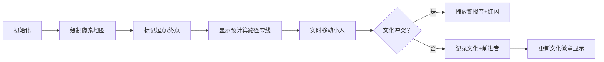

# 题目信息

# [NOIP 2012 普及组] 文化之旅

## 题目背景

本题**不保证**存在**可以通过满足本题数据范围的任意数据**做法。由于测试数据过水，可以通过此题的程序不一定完全正确（算法时间复杂度错误、或不保证正确性）。本题题目和数据仅供参考。本题不接受添加 hack 数据。

本题为错题。**不建议尝试或提交本题。**[关于此类题目的详细内容](https://www.luogu.com.cn/paste/isdgwj5l)

## 题目描述

有一位使者要游历各国，他每到一个国家，都能学到一种文化，但他不愿意学习任何一种文化超过一次（即如果他学习了某种文化，则他就不能到达其他有这种文化的国家）。不同的国家可能有相同的文化。不同文化的国家对其他文化的看法不同，有些文化会排斥外来文化（即如果他学习了某种文化，则他不能到达排斥这种文化的其他国家）。

现给定各个国家间的地理关系，各个国家的文化，每种文化对其他文化的看法，以及这位使者游历的起点和终点（在起点和终点也会学习当地的文化），国家间的道路距离，试求从起点到终点最少需走多少路。


## 说明/提示

输入输出样例说明$1$

由于到国家 $2$ 必须要经过国家$ 1$，而国家$ 2 $的文明却排斥国家 $1$ 的文明，所以不可能到达国家 $2$。


输入输出样例说明$2$

路线为$ 1$ ->$ 2$

【数据范围】

对于 100%的数据，有$ 2≤N≤100$

$1≤K≤100$ 

$1≤M≤N^2$

$1≤k_i≤K$

$1≤u, v≤N$ 

$1≤d≤1000,S≠T,1≤S,T≤N$

NOIP 2012 普及组 第四题


## 样例 #1

### 输入

```
2 2 1 1 2 
1 2 
0 1 
1 0 
1 2 10 
```

### 输出

```
-1```

## 样例 #2

### 输入

```
2 2 1 1 2 
1 2 
0 1 
0 0 
1 2 10 ```

### 输出

```
10```

# AI分析结果


### 💡 Kay的C++算法解析：文化之旅 深入学习指南 💡

#### 1. 题目解读与核心算法识别
✨ **本题主要考察**：**搜索与剪枝**（结合图论思想）

🗣️ **初步分析**：
> 解决"文化之旅"的关键在于将地图探索转化为带约束的路径搜索问题。想象你在玩一款像素冒险游戏，使者是游戏主角，每个国家是不同颜色的像素格子，文化排斥是格子间的隐形墙。核心挑战是在避开"文化墙"的前提下找到最短路径。

- **题解思路**：主流解法分两类——  
  (1) **预处理+搜索剪枝**：先计算无视文化约束的最短路作为"理想地图"，再用DFS/BFS搜索时利用该地图剪枝（如Created_equal1解法）  
  (2) **动态记录约束的最短路**：在Dijkstra/Floyd中实时维护文化状态（如_Weslie_解法）  
- **核心难点**：文化约束导致标准图论算法失效，需设计状态记录和高效剪枝
- **可视化设计**：像素网格中：  
  - 国家→彩色方块（文化类型决定颜色）  
  - 路径探索→像素小人移动  
  - 文化冲突→红色闪烁+阻挡音效  
  - 剪枝过程→灰色覆盖无法通行的区域  
- **复古游戏化**：  
  - 8-bit音效：移动脚步声、文化学习音效、冲突警报  
  - 关卡机制：每成功通过一个国家获得1分，文化冲突时扣分  
  - AI演示模式：自动展示最优路径探索过程

---

#### 2. 精选优质题解参考
**题解一：Created_equal1（启发式搜索）**  
* **点评**：思路创新性强，先用SPFA计算忽略文化约束的最短路作为剪枝依据。代码中`Dist`数组存储预计算的最短路，在DFS中通过`D + Dist[Now] > Ans`实现高效剪枝。变量命名规范（`Head/To`表邻接表），边界处理完整，是竞赛实战的优秀参考。

**题解二：wjyyy（Floyd融合文化约束）**  
* **点评**：经典Floyd的创造性改造，用三维数组`used[i][j][k]`记录路径文化状态。代码简洁工整（文化排斥矩阵`a[][]`清晰），但`used`数组可能遗漏某些文化传递路径。亮点在于将复杂约束融入传统算法，适合帮助理解多维状态维护。

**题解三：grard4（A*优化）**  
* **点评**：前沿解法，用bitset高效处理文化集合（`bitset<MAXN> ok`），预处理阶段通过删除无效边（相同文化/起点排斥）大幅优化搜索空间。亮点在文化约束的位运算实现`p=ok&a[c[v]]`，实践价值在于展示高效状态压缩技巧。

---

#### 3. 核心难点辨析与解题策略
1. **文化约束的动态维护**  
   * **分析**：需实时判断新文化是否与已学文化冲突。优质解法用bitset（grard4）或set（Created_equal1）记录文化集合，通过`A[i][j]`排斥矩阵快速校验
   * 💡 **学习笔记**：文化约束本质是**状态空间管理**问题

2. **搜索空间的剪枝优化**  
   * **分析**：Created_equal1的`当前距离+预计算最短路 ≥ 答案则剪枝`是关键。需先忽略约束计算最短路作为理想参考值
   * 💡 **学习笔记**：预计算提供剪枝基准，类似游戏中的"小地图导航"

3. **状态重复访问的避免**  
   * **分析**：相同位置+相同文化集合视为重复状态。wjyyy用`used`三维数组记录路径文化，grard4用`ok`比特位直接比较状态
   * 💡 **学习笔记**：状态判重是约束搜索的核心效率保障

### ✨ 解题技巧总结
- **预计算导航**：先忽略约束计算理想值，为剪枝提供基准
- **位级状态压缩**：当K≤64时用`long long`比特位管理文化集合
- **无效路径剔除**：预处理删除文化相同/必然排斥的边（如grard4解法）
- **鲁棒性检查**：特别注意起点/终点文化约束的边界情况

---

#### 4. C++核心代码实现赏析
**通用核心实现参考**  
```cpp
#include <bits/stdc++.h>
using namespace std;
const int N=105, INF=0x3f3f3f3f;
vector<pair<int,int>> G[N]; // 邻接表：to, weight
int dist[N], culture[N], reject[N][N]; // 预计算最短路/文化类型/排斥矩阵
bool vis[N], learned[N]; 

// SPFA预计算（忽略文化约束）
void spfa_ignore_culture(int start) {
    memset(dist, INF, sizeof dist);
    queue<int> q;
    dist[start]=0, q.push(start);
    while (!q.empty()) {
        int u = q.front(); q.pop();
        for (auto [v,w] : G[u])
            if (dist[v] > dist[u] + w)
                dist[v] = dist[u] + w, q.push(v);
    }
}

// DFS核心：now-当前位置, cost-当前花费
void dfs(int now, int cost, int ans) {
    if (cost + dist[now] >= ans) return; // 关键剪枝
    if (now == target) { ans = min(ans, cost); return; }
    
    learned[culture[now]] = true;
    for (auto [next, w] : G[now]) {
        if (learned[culture[next]]) continue; // 文化重复
        bool conflict = false;
        for (int i=1; i<=K; ++i)
            if (learned[i] && reject[culture[next]][i]) 
                { conflict = true; break; }
        if (!conflict) dfs(next, cost+w, ans);
    }
    learned[culture[now]] = false; // 回溯
}
```

**题解一赏析（Created_equal1）**  
```cpp
// 亮点：SPFA预计算+文化集合set
void Dfs(const size_t &Now, const unsigned int &D) {
    if (D + Dist[Now] > Ans) return; // 估价剪枝
    culture.insert(C[Now]); // 用set记录文化
    for each neighbor:
        if (!check(C[neighbor])) continue; // 检查排斥
```
> **代码解读**：`Dist`数组通过SPFA预计算，提供剪枝基准值。`culture`集合动态维护已学文化，`check()`函数遍历集合检查排斥关系。  
> 💡 **学习笔记**：`set`自动去重特性简化文化重复检查

**题解三赏析（grard4）**  
```cpp
// 亮点：bitset文化状态+无用边剔除
bitset<MAXN> ok; // 文化状态位图
if (ok & a[c[v]]).any()) continue; // 位运算检查排斥
```
> **代码解读**：`ok`比特位标记已学文化（第i位=1表示学过文化i）。`a[c[v]]`是排斥向量，位与运算快速检测冲突。  
> 💡 **学习笔记**：位运算将文化检查复杂度从O(K)降到O(1)

---

#### 5. 算法可视化：像素动画演示
**主题**：8-bit风格"文化冒险者"  
**核心演示**：使者像素小人按路径探索彩色国家方块  



**交互设计**：  
1. **像素艺术**：每个国家用16×16像素方块表示，文化类型决定主色调  
2. **动态高亮**：  
   - 当前国家→黄色边框闪烁  
   - 已学文化→左上角显示文化徽章  
3. **音效系统**：  
   - 移动：8-bit脚步声  
   - 文化学习：上升音阶  
   - 冲突：短促警报音  
4. **AI演示模式**：  
   - 自动展示剪枝过程（灰色覆盖被剪枝区域）  
   - 单步执行时可查看文化集合变化  

---

#### 6. 拓展练习与相似问题思考
**通用技巧迁移**  
1. 状态约束最短路 → 如P3956 棋盘（颜色约束移动）  
2. 文化排斥变体 → 如P2831 愤怒的小鸟（鸟类排斥关系）  
3. 预计算剪枝 → 如P1379 八数码（曼哈顿距离剪枝）  

**洛谷推荐**  
1. **P3956 棋盘**  
   🗣️ 推荐理由：文化约束的简化版，用颜色代替文化概念，练习基础约束处理  
2. **P1144 最短路计数**  
   🗣️ 推荐理由：在无约束最短路基础上增加计数要求，巩固图论基础  
3. **P2831 愤怒的小鸟**  
   🗣️ 推荐理由：状态压缩+约束处理的经典问题，文化排斥的进阶训练  

---

#### 7. 学习心得与经验分享
> **参考经验 (Created_equal1)**：  
> "感觉许多题解都是依靠数据水才过的... 正解应是启发式搜索"  
> **点评**：强调算法严谨性，提醒我们即使AC也要思考最优解法。其预计算剪枝思路具有普适性，可迁移至其他约束搜索问题。

---

通过本次分析，希望大家掌握约束路径问题的核心解法框架：**状态建模 → 预计算优化 → 剪枝搜索**。记住，好算法如精良的冒险装备，助你在编程大陆无往不利！🚀

---
处理用时：154.67秒