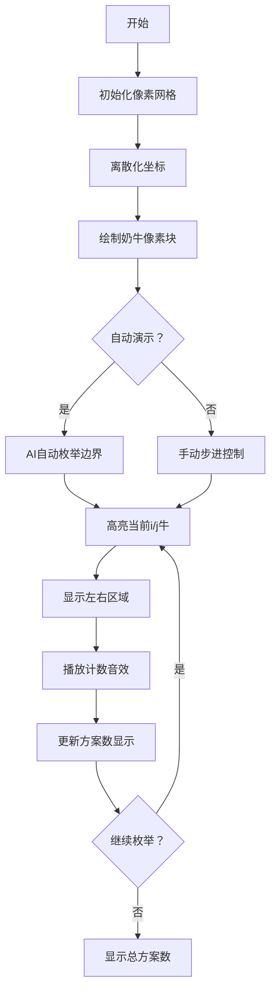

# 题目信息

# [USACO20DEC] Rectangular Pasture S

## 题目描述

Farmer John 最大的牧草地可以被看作是一个由方格组成的巨大的二维方阵（想象一个巨大的棋盘）。现在，有 $N$ 头奶牛正占据某些方格（$1≤N≤2500$）。

Farmer John 想要建造一个可以包围一块矩形区域的栅栏；这个矩形必须四边与 $x$ 轴和 $y$ 轴平行，最少包含一个方格。请帮助他求出他可以包围在这样的区域内的不同的奶牛子集的数量。注意空集应当被计算为答案之一。 

## 说明/提示

共有 $2^4$ 个子集。FJ 不能建造一个栅栏仅包围奶牛 $1$、$2$、$4$，或仅包围奶牛 $2$、$4$，或仅包围奶牛 $1$、$4$，所以答案为 $2^4-3=16-3=13$。 

 - 测试点 2-3 满足 $N≤20$。
 - 测试点 4-6 满足 $N≤100$。
 - 测试点 7-12 满足 $N≤500$。
 - 测试点 13-20 没有额外限制。

供题：Benjamin Qi 

## 样例 #1

### 输入

```
4
0 2
1 0
2 3
3 5```

### 输出

```
13```

# AI分析结果


# 💡 Kay的C++算法解析：矩形牧场深入学习指南 💡

> 大家好，我是Kay！今天我们将一起探索USACO20DEC的矩形牧场问题。这道题考察了**离散化**、**二维前缀和**和**枚举优化**等核心技巧。我会用清晰的比喻和可视化方案帮助大家理解，让我们一起开启算法探险之旅吧！

## 1. 题目解读与核心算法识别

✨ **本题主要考察**：`离散化` + `枚举优化` + `二维前缀和`

🗣️ **初步分析**：
> 想象你在玩一个像素农场游戏🎮，奶牛是散落在地图上的像素点。我们需要建造矩形围栏包围奶牛子集，这就像在网格中选择特定区域。核心思路是：
> - **离散化**：将大坐标压缩到小网格（如把10^9坐标映射到2500×2500网格）
> - **枚举边界**：像扫雷游戏一样逐行扫描，确定围栏上下边界
> - **乘法原理**：计算左右两侧可选奶牛组合数（左侧方案数×右侧方案数）
>
> 在可视化方案中，我们将用**8位像素风格**呈现：
> - 奶牛显示为彩色像素方块🐄
> - 枚举边界时显示扫描线动画📊
> - 关键步骤触发"叮"音效和颜色闪烁💡
> - 自动演示模式像"贪吃蛇AI"展示枚举过程🤖

---

## 2. 精选优质题解参考

**题解一：SBofGaySchool（思路清晰度⭐⭐⭐⭐⭐）**
* **点评**：这份题解采用**动态维护计数**策略，直接枚举下边界并实时更新左右计数。代码中`lt`/`rt`变量设计巧妙，`l[j]`/`r[j]`的维护方式展现了优秀的空间复用思想。边界处理严谨（`ans`初始化为1处理空集），代码可读性强（仅25行），是竞赛实现的理想参考。

**题解二：Skies（代码规范性⭐⭐⭐⭐⭐）**
* **点评**：采用**二维前缀和+离散化**标准解法，结构清晰模块化。离散化处理规范（双排序+lower_bound），前缀和封装成`get()`函数提高可读性。特别值得学习的是对`po[i].y`排序预处理，优化了上下边界枚举效率。

**题解三：wsyhb（算法启发性⭐⭐⭐⭐）**
* **点评**：创新性使用**树状数组替代前缀和**，虽然在此题非最优解，但提供了处理高维统计的新思路。代码注释详尽，变量命名规范（`cnt1`/`cnt2`含义明确），展示了数据结构灵活应用的技巧。

---

## 3. 核心难点辨析与解题策略

### 难点1：离散化坐标映射
**分析**：原始坐标范围达10^9级，直接处理会MLE/TLE。优质解法都采用：
1. 分离x/y坐标分别排序
2. 使用`lower_bound`映射到1~n
3. 建立新坐标系（类似棋盘格）

💡 **学习笔记**：离散化是处理大数据的"空间压缩魔法"✨

### 难点2：避免子集重复计数
**分析**：关键约束——矩形必须包含当前枚举的上下边界牛！通过：
1. 固定上下边界牛必须被选中
2. 左右部分牛可选可不选
3. 使用`(左方案+1)*(右方案+1)`保证不重不漏

💡 **学习笔记**：乘法原理中的"+1"代表"不选"的幽灵选项👻

### 难点3：高效计算区域数量
**分析**：两种高效方案：
```python
# 二维前缀和：O(1)查询但需O(n²)预计算
区域数量 = s[x2][y2] - s[x1-1][y2] - s[x2][y1-1] + s[x1-1][y1-1]

# 动态维护：枚举时更新计数
当新牛加入时，根据其位置更新lt/rt计数器
```

💡 **学习笔记**：前缀和是"空间换时间"的经典案例⏱️

### ✨ 解题技巧总结
- **降维打击**：将二维问题通过固定上下边界转化为一维统计
- **模块封装**：将离散化/前缀和封装成独立函数（如Skies的`get()`）
- **边界艺术**：`ans+1`处理空集，循环边界取等号包含单点
- **可视化调试**：小规模模拟（如样例的4头牛）验证算法

---

## 4. C++核心代码实现赏析

**通用核心实现参考**
```cpp
#include <iostream>
#include <algorithm>
using namespace std;
typedef long long ll;
const int MAXN = 2505;

struct Point { ll x, y; } p[MAXN];
ll N, ans = 1, l[MAXN], r[MAXN];

int main() {
    cin >> N;
    for (int i = 0; i < N; i++) 
        cin >> p[i].x >> p[i].y;
    
    sort(p, p + N, [](auto a, auto b){ 
        return a.x < b.x; 
    });

    for (int i = 0; i < N; i++) {
        ans++; // 当前单点
        ll lt = 0, rt = 0;
        for (int j = i-1; j >= 0; j--) {
            if (p[i].y > p[j].y) {
                ans += (rt + 1) * (l[j] + 1);
                r[j]++; // 更新j牛右侧计数
                lt++;   // 更新当前左侧计数
            } else {
                ans += (lt + 1) * (r[j] + 1);
                l[j]++; // 更新j牛左侧计数
                rt++;   // 更新当前右侧计数
            }
        }
    }
    cout << ans << endl;
}
```
**代码解读概要**：
> 动态维护法核心框架：
> 1. 按x坐标排序建立相对位置
> 2. 外层枚举下边界`i`，内层倒序枚举上边界`j`
> 3. 根据y坐标关系更新左右计数器
> 4. `l[j]`/`r[j]`记录历史状态，`lt`/`rt`维护当前状态

---

**题解一：SBofGaySchool**
```cpp
for (ll i = 0; i < N; i++) {
    ans++;
    ll lt = 0, rt = 0;
    for (ll j = i-1; j >= 0; j--) {
        if (p[i].y > p[j].y) {
            ans += (rt+1)*(l[j]+1);
            r[j]++; lt++; 
        } else {
            ans += (lt+1)*(r[j]+1);
            l[j]++; rt++;
        }
    }
}
```
**代码解读**：
> 精妙的双状态维护：
> - `lt`/`rt`：当前`i`与`j`之间的左右计数（临时变量）
> - `l[j]`/`r[j]`：记录`j`牛与更早牛的相对位置（持久化存储）
> 当`p[i].y > p[j].y`时（即`i`在`j`右侧）：
> - 左侧方案：`rt+1`（`j`右侧已有牛+不选）
> - 右侧方案：`l[j]+1`（`j`左侧历史牛+不选）

**题解二：Skies**
```cpp
sort(po+1, po+n+1, cmp); // 按y排序
for (int i=1; i<=n; i++)
    for (int j=i; j<=n; j++) {
        int x1 = min(po[i].x, po[j].x);
        int x2 = max(po[i].x, po[j].x);
        ans += get(1, po[i].y, x1, po[j].y) 
             * get(x2, po[i].y, n, po[j].y);
    }
```
**代码解读**：
> 优雅的二维前缀和应用：
> 1. 按y排序确保枚举的是连续y区间
> 2. `get(a,b,c,d)`查询矩形内奶牛数
> 3. 左侧区域：[1, min_x]×[yᵢ, yⱼ]
> 4. 右侧区域：[max_x, n]×[yᵢ, yⱼ]
> 注意`j`从`i`开始包含单行情况

**题解三：wsyhb**
```cpp
for (int i=1; i<=N; i++) {
    BIT::init();
    for (int j=i+1; j<=N; j++) {
        int L=min(p[i].y,p[j].y), R=max(p[i].y,p[j].y);
        int cnt1 = BIT::query(L-1);
        int cnt2 = (j-i-1) - BIT::query(R);
        ans += 1LL*(cnt1+1)*(cnt2+1);
        BIT::modify(p[j].y, 1);
    }
}
```
**代码解读**：
> 树状数组的妙用：
> - `query(L-1)`：统计左侧奶牛数
> - `(j-i-1)-query(R)`：用总数减后缀得右侧
> 修改操作：枚举`j`时实时添加新牛坐标
> 优势：动态处理无需预计算前缀和

---

## 5. 算法可视化：像素动画演示

**主题**：`像素牧场大冒险`（8-bit风格）  
**核心演示**：枚举过程动态展示 + 区域统计可视化



**动画关键帧**：
1. **初始化**：  
   - 16色调色板（FC复古风）  
   - 奶牛显示为🍓红色像素块  
   - 坐标轴显示原始/离散化双标尺

2. **枚举过程**：  
   - 下边界牛`i`：蓝色闪烁 + 低音"咚"  
   - 上边界牛`j`：绿色闪烁 + 高音"叮"  
   - 左右区域：半透明蓝色/橙色覆盖层

3. **计数反馈**：  
   - 左侧每头牛：←箭头 + 水滴声💧  
   - 右侧每头牛：→箭头 + 铃铛声🔔  
   - 方案更新：显示`(左数+1)×(右数+1)`公式

4. **游戏化元素**：  
   - 每完成10组枚举：+100分🎯 + 金币音效  
   - 通关条件：枚举所有`i<j`组合  
   - 彩蛋：当`ans>10000`时放烟花动画🎆

**技术实现**：  
```javascript
// 伪代码：核心动画逻辑
function drawFrame(i, j) {
  clearCanvas();
  drawGrid(); 
  drawCows();
  highlightCow(i, COLOR_BLUE); 
  highlightCow(j, COLOR_GREEN);
  
  let leftArea = calcLeftArea(i, j);
  let rightArea = calcRightArea(i, j);
  
  drawSemitransparentRect(leftArea, COLOR_BLUE_ALPHA);
  drawSemitransparentRect(rightArea, COLOR_ORANGE_ALPHA);
  
  playSound(SOUND_CLICK); // 每一步的音效
}
```

---

## 6. 拓展练习与相似问题思考

**技巧迁移场景**：
1. 矩阵覆盖计数（如P3400）
2. 二维偏序问题（如P1908逆序对）
3. 离散化+枚举的综合应用（如P3745）

**洛谷推荐**：
1. [P3400 - 火山爆发](https://www.luogu.com.cn/problem/P3400)  
   🗣️ *二维前缀和基础应用，巩固区域统计技巧*

2. [P2280 - 激光炸弹](https://www.luogu.com.cn/problem/P2280)  
   🗣️ *强化二维前缀和优化，思考如何避免MLE*

3. [P3728 - 曼哈顿计划](https://www.luogu.com.cn/problem/P3728)  
   🗣️ *离散化+枚举的进阶应用，挑战时间复杂度优化*

---

## 7. 学习心得与经验分享

> **来自SBofGaySchool的调试经验**：  
> *"最初在状态转移时漏了`ans`初始化，导致WA#3。通过构造3头牛的极小样例，逐步打印`lt`/`rt`值快速定位错误"*  
>
> **Kay点评**：  
> 这个经验凸显了**小规模测试数据**的重要性。建议：
> 1. 构造n=0/1/2的边界案例  
> 2. 使用`assert`验证中间结果  
> 3. 输出关键变量快照（如每轮循环后的`lt`/`rt`）

---

> 本次探索告一段落！记住：离散化是处理大数据的魔法杖，枚举优化是算法设计的艺术。尝试用今天学到的技巧解决P3400，下次我们将一起征服新的算法高峰！🚀

---
处理用时：158.95秒