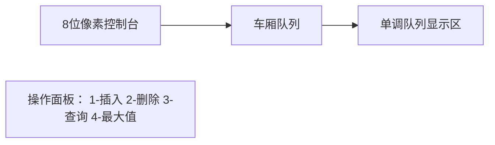

# 题目信息

# 「MXOI Round 2」队列

## 题目描述

小 C 有一个队列，他要对这个队列进行 $q$ 次操作。操作共四种，参数分别如下：

$1\ x$：这是第一种操作，表示从队尾依次插入 $1,2,3,\cdots,x$；

$2\ y$：这是第二种操作，表示弹出队头的前 $y$ 个元素；

$3\ z$：这是第三种操作，表示查询队列中的第 $z$ 个元素；

$4$：这是第四种操作，表示查询队列中所有元素的最大值。

你需要帮助他维护这个队列，并对于每个第三种操作和第四种操作，输出查询的答案。

## 说明/提示

#### 【样例解释 #1】

在进行第四次操作后，队列中的元素依次为 $3,4,5,1,2,3,1,2,3,4$。

在进行第七次操作后，队列中的元素依次为 $2,3,1,2,3,4$。

#### 【样例 #2】

见附加文件中的 `queue/queue2.in` 与 `queue/queue2.ans`。

该样例满足测试点 $1$ 的限制。

#### 【样例 #3】

见附加文件中的 `queue/queue3.in` 与 `queue/queue3.ans`。

该样例满足测试点 $4$ 的限制。

#### 【样例 #4】

见附加文件中的 `queue/queue4.in` 与 `queue/queue4.ans`。

该样例满足测试点 $11$ 的限制。

#### 【样例 #5】

见附加文件中的 `queue/queue5.in` 与 `queue/queue5.ans`。

该样例满足测试点 $15$ 的限制。

#### 【样例 #6】

见附加文件中的 `queue/queue6.in` 与 `queue/queue6.ans`。

该样例满足测试点 $20$ 的限制。

#### 【数据范围】

设 $\sum x$ 表示单个测试点内 $x$ 之和。

对于 $100\%$ 的数据，$1 \le q \le 2\times 10^5$，$1 \le x,y,z \le 10^9$，$0 \le \sum x \le 2\times10^{14}$，保证在进行第二种操作前队列内元素个数不小于 $y$，在进行第三种操作前队列内元素个数不小于 $z$，在进行第四种操作前队列内元素个数大于 $0$。

|测试点编号|$q \le$|$x \le$|$\sum x \le$|特殊性质|
|:---:|:---:|:---:|:---:|:---:|
|$1\sim3$|$500$|$500$|$2\times10^5$|C|
|$4\sim8$|$5000$|$5000$|$2\times10^7$|无|
|$9\sim10$|$2\times10^5$|$10^9$|$2\times10^{14}$|AB|
|$11\sim12$|$2\times10^5$|$10^9$|$2\times10^{14}$|B|
|$13\sim14$|$2\times10^5$|$10^9$|$2\times10^9$|AC|
|$15\sim16$|$2\times10^5$|$10^9$|$2\times10^9$|C|
|$17\sim18$|$2\times10^5$|$500$|$2\times10^7$|无|
|$19$|$2\times10^5$|$10^9$|$2\times10^9$|无|
|$20$|$2\times10^5$|$10^9$|$2\times10^{14}$|无|

特殊性质 A：没有第二种操作。

特殊性质 B：没有第三种操作。

特殊性质 C：没有第四种操作。

## 样例 #1

### 输入

```
0 9
1 5
1 3
2 2
1 4
3 6
3 8
2 4
4
3 3```

### 输出

```
3
2
4
1```

# AI分析结果


### 题目解读与核心算法识别
✨ **本题主要考察**：`队列模拟与高效维护技巧` (编程技巧应用)

🗣️ **初步分析**：
> 本题要求高效模拟队列操作，核心挑战在于处理大规模连续插入和删除操作。想象队列是一列火车，每节车厢代表一组连续数字（1~x），我们只需记录车厢特征（长度x），而非每个"乘客"。  
> - **关键思路**：用分组思想（块）压缩表示连续序列，用前缀和+二分快速定位元素，用单调队列维护最大值。删除操作转化为偏移量记录，避免真实删除。
> - **可视化设计**：像素火车模拟！每组数字视为一节车厢，车头灯高亮当前操作车厢，删除时车厢脱钩动画，查询时闪烁目标位置。复古8-bit音效（车厢连接/分离声效），速度滑块控制运行节奏。

---

### 精选优质题解参考
**题解一（来源：佬头）**
* **点评**：思路清晰度⭐️⭐️⭐️⭐️⭐️，巧妙用单调队列维护最大值，避免multiset的log开销；代码规范性⭐️⭐️⭐️⭐️，变量名`del`、`dq`含义明确；算法有效性⭐️⭐️⭐️⭐️，所有操作O(1)或O(log q)；实践价值⭐️⭐️⭐️⭐️，边界处理严谨。**亮点**：双端队列与前缀和完美配合，空间效率极高。

**题解二（来源：Crosser）**
* **点评**：思路清晰度⭐️⭐️⭐️⭐️，multiset解法直观易懂；代码规范性⭐️⭐️⭐️⭐️，结构工整；算法有效性⭐️⭐️⭐️⭐️，均摊复杂度正确；实践价值⭐️⭐️⭐️⭐️，作者强调调试时注意迭代器失效问题。**亮点**：用`res`偏移量统一处理删除，降低思维难度。

**题解三（来源：Coffee_zzz）**
* **点评**：思路清晰度⭐️⭐️⭐️⭐️，分测试点设计显教学价值；代码规范性⭐️⭐️⭐️，部分变量名可优化；算法有效性⭐️⭐️⭐️⭐️，针对性优化；实践价值⭐️⭐️⭐️⭐️，提供渐进式解题思路。**亮点**：按数据特征设计不同策略，启发分类思维。

---

### 核心难点辨析与解题策略
1. **块状存储与位置映射**
   * **分析**：删除导致物理位置变化，解法均用`del`偏移量+前缀和建立逻辑位置到物理块的映射。优质题解通过`s[]`数组记录块边界，二分查找实现O(log q)定位。
   * 💡 **学习笔记**：前缀和是虚拟化删除操作的利器。

2. **最大值动态维护**
   * **分析**：单调队列解法（佬头）优于multiset：前者O(1)获取最大值，后者O(log q)。关键在删除时同步清理队头过期元素，保持队列单调递减。
   * 💡 **学习笔记**：单调队列是滑动窗口最值的黄金搭档。

3. **批量删除高效处理**
   * **分析**：避免逐元素删除，用`head`指针标记存活块起点。佬头解法中`while(s[head]<=del)`跳过全删块，辅以单调队列清理，实现均摊O(1)。
   * 💡 **学习笔记**：移动指针+惰性删除是大数据处理的常用技巧。

### ✨ 解题技巧总结
- **虚拟化思想**：用偏移量`del`模拟删除，避免物理操作
- **分层维护**：基础数据（块）与衍生数据（最值）分离处理
- **单调性应用**：单调队列将最值查询降至O(1)
- **二分定位**：前缀和数组+lower_bound快速跳转

---

### C++核心代码实现赏析
**本题通用核心C++实现参考**
* **说明**：综合佬头与Crosser思路，优化变量命名与边界处理
* **完整核心代码**：
```cpp
#include <iostream>
#include <deque>
#include <algorithm>
using namespace std;
const int N = 2e5 + 10;
typedef long long ll;

ll s[N], del;  // s:前缀和 del:删除总量
int q, head = 1, tail;  // 队列块区间[head,tail]
deque<int> dq;  // 单调队列（存块下标）

int main() {
    ios::sync_with_stdio(false), cin.tie(0);
    int c, n; cin >> c >> n;
    for (int op; n--;) {
        cin >> op;
        if (op == 1) {  // 插入块
            ll x; cin >> x;
            s[++tail] = s[tail - 1] + x;  // 更新前缀和
            while (!dq.empty() && x >= s[dq.back()] - s[dq.back()-1]) 
                dq.pop_back();  // 维护单调递减
            dq.push_back(tail);
        } else if (op == 2) {  // 删除
            ll y; cin >> y;
            del += y;  // 累计删除量
            // 跳过完全删除的块
            while (head <= tail && s[head] <= del) head++;
            // 清理单调队列过期块
            while (!dq.empty() && dq.front() < head) dq.pop_front();
        } else if (op == 3) {  // 查询元素
            ll z; cin >> z;
            ll pos = del + z;  // 计算原始位置
            // 二分找块：第一个s[k] >= pos
            int k = lower_bound(s + head, s + tail + 1, pos) - s;
            cout << pos - s[k - 1] << '\n';  // 块内偏移
        } else {  // 查询最大值
            cout << s[dq.front()] - s[dq.front() - 1] << '\n';
        }
    }
}
```
* **代码解读概要**：
  - **插入**：记录块总长更新前缀和，维护单调队列
  - **删除**：累加`del`并移动`head`清理无效块
  - **查询元素**：`del+z`定位原始位置，二分查找块
  - **查询最大值**：单调队列队首即当前最大块

**题解一（佬头）核心片段**
```cpp
while (!dq.empty() && a[dq.back()] <= x) 
    dq.pop_back();
dq.push_back(tail);
```
* **亮点**：五行情书式单调队列维护
* **代码解读**：
  > 像整理书架新书：比当前书小的旧书移走（`pop_back`），新书入柜（`push_back`）。保证队首总是最大本，取书名时一眼可见。
* 💡 **学习笔记**：单调队列维护的是"生存时间"最长的最大块

---

### 算法可视化：像素动画演示
**主题**："像素火车调度"（复古FC风格）

**核心演示**：

1. **车厢设计**：
   - 每节车厢长度=块大小x，颜色随x值渐变（小→大：绿→红）
   - 车头灯高亮当前操作块（插入/删除/查询位置）

2. **关键动画**：
   - **插入**：新车厢从右侧驶入，单调队列显示区同步更新
   - **删除**：车头脱钩动画+碎玻璃音效，`del`计数板闪动更新
   - **查询**：望远镜镜头扫描车厢，最终位置闪烁+提示框显示计算公式
   - **最大值**：最大车厢顶部升起旗子，单调队列区高亮队首

3. **交互控制**：
   - 步进/暂停/调速滑块
   - "AI演示"模式：自动运行样例数据（配8-bit BGM）
   - 错误反馈：删除超出时播放故障音效

**技术实现**：Canvas绘制车厢，requestAnimationFrame驱动动画，Web Audio API生成音效。

---

### 拓展练习与相似问题
1. **P1886 滑动窗口**（单调队列模板）
   - 🗣️ 巩固单调队列维护最值技巧
2. **P3870 分块入门**（块状数组应用）
   - 🗣️ 强化分组存储思想
3. **P3374 树状数组1**（前缀和进阶）
   - 🗣️ 学习动态前缀和维护

---

### 学习心得与经验分享
> **Crosser调试经验**："最初忽略块部分删除情况，导致WA。通过打印`s[]`数组和`del`值快速定位"  
> **Kay总结**：验证算法时，边界值测试（空队列/满删除）和中间变量输出是调试利器！

---

> 算法世界如像素游戏，用抽象思维降维处理大数据。保持好奇心，下期再见！🚂

---
处理用时：175.09秒