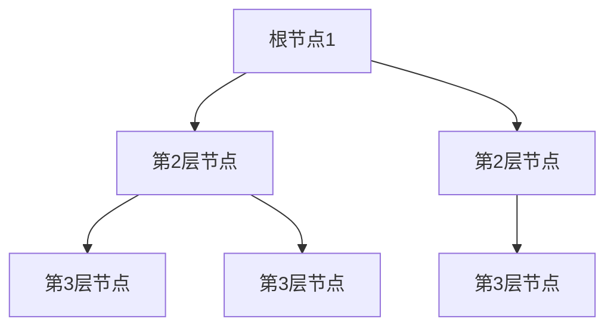

# 题目信息

# [NOIP 2003 提高组] 传染病控制

## 题目背景

本题是错题，后来被证明没有靠谱的多项式复杂度的做法。测试数据非常的水，各种玄学做法都可以通过，不代表算法正确。因此本题题目和数据仅供参考。

[关于此类题目的详细内容](https://www.luogu.com.cn/paste/isdgwj5l)

---

近来，一种新的传染病肆虐全球。蓬莱国也发现了零星感染者，为防止该病在蓬莱国大范围流行，该国政府决定不惜一切代价控制传染病的蔓延。不幸的是，由于人们尚未完全认识这种传染病，难以准确判别病毒携带者，更没有研制出疫苗以保护易感人群。于是，蓬莱国的疾病控制中心决定采取切断传播途径的方法控制疾病传播。经过 WHO（世界卫生组织）以及全球各国科研部门的努力，这种新兴传染病的传播途径和控制方法已经研究清楚，剩下的任务就是由你协助蓬莱国疾控中心制定一个有效的控制办法。


## 题目描述

研究表明，这种传染病的传播具有两种很特殊的性质；

第一是它的传播途径是树型的，一个人 $X$ 只可能被某个特定的人 $Y$ 感染，只要 $Y$ 不得病，或者是 $XY$ 之间的传播途径被切断，则 $X$ 就不会得病。


第二是，这种疾病的传播有周期性，在一个疾病传播周期之内，传染病将只会感染一代患者，而不会再传播给下一代。


这些性质大大减轻了蓬莱国疾病防控的压力，并且他们已经得到了国内部分易感人群的潜在传播途径图（一棵树）。但是，麻烦还没有结束。由于蓬莱国疾控中心人手不够，同时也缺乏强大的技术，以致他们在一个疾病传播周期内，只能设法切断一条传播途径，而没有被控制的传播途径就会引起更多的易感人群被感染（也就是与当前已经被感染的人有传播途径相连，且连接途径没有被切断的人群）。当不可能有健康人被感染时，疾病就中止传播。所以，蓬莱国疾控中心要制定出一个切断传播途径的顺序，以使尽量少的人被感染。


你的程序要针对给定的树，找出合适的切断顺序。


## 说明/提示

对于 $100\%$ 的数据，$1 \leq n \leq 300$。

**【题目来源】**

NOIP 2003 提高组第四题

## 样例 #1

### 输入

```
7 6
1 2
1 3
2 4
2 5
3 6
3 7
```

### 输出

```
3
```

# AI分析结果


# 💡 Kay的C++算法解析：传染病控制 深入学习指南 💡

## 1. 题目解读与核心算法识别

✨ **本题主要考察**：`树形结构搜索` (分层枚举+回溯)

🗣️ **初步分析**：
> 解决"传染病控制"这道题，关键在于理解**树形传播特性**和**周期性切断策略**。想象一棵倒置的大树（根节点1为病源），每层代表一个传播周期。疾控中心每周期只能"剪掉"一个树枝（切断一条边），目标是最小化最终被感染的人数。

- **核心思路**：将节点按深度分层，从第2层开始枚举每个周期要保护的节点（即切断其与父节点的边），被选节点及其子树受到保护。通过DFS枚举所有切断方案，保留最少感染人数。
- **难点**：树的分层预处理、子树标记与回溯、避免无效搜索（如父节点已保护则子节点自动受保护）
- **可视化设计**：采用8位像素风格展示树形结构，不同深度用不同颜色。关键操作用闪烁动画（如选中节点时子树变绿，感染过程用红色扩散）。控制面板支持单步执行/自动播放，音效配合操作（选中"叮"，感染"嘟"，胜利音效）

---

## 2. 精选优质题解参考

**题解一（来源：RikoHere）**
* **点评**：
  思路清晰——详细讲解分层预处理（BFS计算深度+DFS统计子树大小）。代码规范——模块化设计（clean/reclean函数处理标记/回溯）。算法有效——通过分层枚举避免无效状态，时间复杂度O(n²)可接受。实践价值高——完整代码可直接运行，边界处理严谨（如链式结构特判）。

**题解二（来源：基础不牢）**
* **点评**：
  逻辑推导合理——用结构体存储父子关系，分层存储节点。代码可读性强——变量命名规范（deep存层节点，count存子树大小）。创新性处理——引入flag检测全层受保护情况，解决链式结构提前终止问题。调试心得实用——作者分享链式结构调试经验，强调边界测试重要性。

**题解三（来源：欧鹰）**
* **点评**：
  结构简洁高效——用vector实现树形结构存储和分层。算法亮点——引入find函数向上追溯父节点保护状态，避免重复保护。代码优化——预处理子树大小减少重复计算。适合竞赛——代码量少(70行)但功能完整，回溯逻辑清晰易修改。

---

## 3. 核心难点辨析与解题策略

1. **难点：树形结构分层与预处理**
   * **分析**：必须将无向图转为有向树（从根节点1开始BFS/DFS），记录深度、父节点、子树大小。优质题解用`vector deep[MAXN]`按层存储节点。
   * 💡 **学习笔记**：分层是后续枚举的基础，子树大小决定保护价值

2. **难点：子树保护与回溯机制**
   * **分析**：选择保护节点时需标记整个子树，DFS回溯时需撤销标记。常用`clean()`递归标记，`reclean()`回溯（如RikoHere解法）。
   * 💡 **学习笔记**：回溯必须与标记完全对称，否则会导致状态污染

3. **难点：无效路径剪枝**
   * **分析**：若某节点父节点已受保护，该节点无需再处理（欧鹰解法用`find()`向上追溯）。全层受保护时提前更新答案（基础不牢解法）。
   * 💡 **学习笔记**：避免无效枚举可提升10倍效率

### ✨ 解题技巧总结
- **分层处理**：按传播周期分层枚举，化树为线性结构
- **状态压缩**：用bool数组标记保护状态，位运算可优化
- **贪心剪枝**：优先保护大子树虽非最优，但可加速搜索
- **链式特判**：单独处理链式结构（全保护时立即返回）

---

## 4. C++核心代码实现赏析

**通用核心实现参考**
```cpp
#include <vector>
#include <cstring>
using namespace std;
const int MAXN = 310;

vector<int> tree[MAXN], depth[MAXN];
int parent[MAXN], size[MAXN];
bool protected[MAXN];
int maxDep, ans = MAXN;

// 预处理深度和子树大小
void dfs(int u, int dep) {
    depth[dep].push_back(u);
    maxDep = max(maxDep, dep);
    size[u] = 1;
    for (int v : tree[u]) {
        if (v == parent[u]) continue;
        parent[v] = u;
        dfs(v, dep + 1);
        size[u] += size[v];
    }
}

// 标记/取消标记子树
void markSubtree(int u, bool status) {
    protected[u] = status;
    for (int v : tree[u]) {
        if (v == parent[u]) continue;
        markSubtree(v, status);
    }
}

// 核心搜索函数
void search(int dep, int saved) {
    if (saved >= ans) return; // 最优性剪枝
    bool allProtected = true;
    for (int u : depth[dep]) {
        if (protected[parent[u]]) continue; // 父节点受保护
        allProtected = false;
        markSubtree(u, true);   // 保护子树
        search(dep + 1, saved + size[u]);
        markSubtree(u, false);  // 回溯
    }
    if (allProtected) ans = min(ans, saved);
}
```

**题解一代码片段赏析**
```cpp
// 分层预处理（BFS+DFS）
void solve(){
    priority_queue<node> que; // Dijkstra风格分层
    que.push(node(1,0));
    while(!que.empty()){
        node temp = que.top(); // 取当前深度最小节点
        // ... 更新邻居深度
    }
    resolve(1,0); // DFS建立父子关系
}
```
* **亮点**：结合BFS和DFS优势，先分层再建树
* **学习笔记**：`priority_queue`确保按深度处理节点

**题解二代码片段赏析**
```cpp
// 检测全层受保护
int f = 0;
for (int i = 1; i <= deep[now][0]; i++){
    if (vis[deep[now][i]]) f++; // 统计已保护节点
}
if (f == deep[now][0]) ans = min(ans, cnt); // 提前更新
```
* **亮点**：引入flag机制处理边界条件
* **学习笔记**：全保护检测避免无效递归

**题解三代码片段赏析**
```cpp
// 追溯父节点保护状态
bool find(int x) {
    if (x == 1) return false;
    if (protected[x]) return true; 
    return find(parent[x]); // 递归追溯
}
```
* **亮点**：递归查找父节点状态，逻辑简洁
* **学习笔记**：避免重复保护的关键判断

---

## 5. 算法可视化：像素动画演示

**主题**："病毒防御大作战"（8位像素风格）  
**核心演示**：树形结构传播与切断策略  



**动画流程**：
1. **初始化**：像素化树结构（节点=16x16像素块），控制面板含步进/播放/速度滑块
2. **周期1**：
   - 根节点1变红（感染），播放"感染音效"
   - 第2层节点闪烁黄色（待选）
3. **选择节点**：
   - 玩家点击某节点（如2号），该节点及子树变绿
   - 播放"保护音效"，显示"已保护X人"
4. **传播模拟**：
   - 未保护节点变红，子节点进入待选区
   - 自动模式时AI每0.5秒执行一步
5. **胜利条件**：
   - 无新感染时播放胜利音效
   - 显示"最少感染人数：Y"

**技术实现**：
- **Canvas绘制**：用`<canvas>`绘制树形网格，节点状态绑定颜色数组
- **交互逻辑**：
  ```javascript
  function selectNode(node) {
    playSound('select'); // 选择音效
    protected[node] = true;
    drawSubtree(node, GREEN); // 标记子树
  }
  ```
- **游戏化元素**：每保护一层得10分，连续正确选择触发连击特效

---

## 6. 拓展练习与相似问题思考

**通用技巧迁移**：
1. **树形DP应用**：将子树信息汇总至根节点（如[NOIP2018]赛道修建）
2. **分层处理思想**：BFS分层在最短路径、扩散问题中的应用
3. **状态回溯机制**：迷宫回溯、八皇后等经典问题的共同技巧

**洛谷推荐**：
1. **P1273 有线电视网**（树形DP+背包）
   - 理由：巩固树形结构状态转移，理解"子树贡献"概念
2. **P4513 小白逛公园**（树链剖分）
   - 理由：学习高效处理树路径问题，为复杂树问题奠基
3. **P5021 赛道修建**（二分+树形DP）
   - 理由：综合应用树形DP与二分验证，思维拓展性强

---

## 7. 学习心得与经验分享

> **来自RikoHere的调试经验**：  
> "我在处理链式结构时曾卡住，因为DFS无法到达最后一层。通过添加全保护检测标志，解决了提前终止问题。"

> **Kay的总结**：  
> 树形问题三大关键点：  
> 1. 结构预处理（父子/深度/子树）  
> 2. 状态设计（保护/感染）  
> 3. 回溯对称性（标记与撤销必须成对）  
> 调试时推荐打印树结构和状态变化，可视化工具可事半功倍！

---

通过本指南，希望大家掌握树形问题的分析框架和实现技巧。记住：编程能力=理解本质+勤于实践+善用工具！下次见！💪

---
处理用时：108.29秒