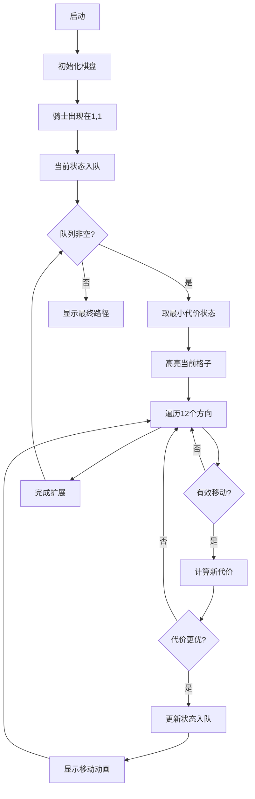

# 题目信息

# [NOIP 2017 普及组] 棋盘

## 题目背景

NOIP2017 普及组 T3

## 题目描述

有一个 $m \times m$ 的棋盘，棋盘上每一个格子可能是红色、黄色或没有任何颜色的。你现在要从棋盘的最左上角走到棋盘的最右下角。

任何一个时刻，你所站在的位置必须是有颜色的（不能是无色的）， 你只能向上、下、左、右四个方向前进。当你从一个格子走向另一个格子时，如果两个格子的颜色相同，那你不需要花费金币；如果不同，则你需要花费 $1 $ 个金币。

另外， 你可以花费 $2$ 个金币施展魔法让下一个无色格子暂时变为你指定的颜色。但这个魔法不能连续使用， 而且这个魔法的持续时间很短，也就是说，如果你使用了这个魔法，走到了这个暂时有颜色的格子上，你就不能继续使用魔法； 只有当你离开这个位置，走到一个本来就有颜色的格子上的时候，你才能继续使用这个魔法，而当你离开了这个位置（施展魔法使得变为有颜色的格子）时，这个格子恢复为无色。

现在你要从棋盘的最左上角，走到棋盘的最右下角，求花费的最少金币是多少？


## 说明/提示

**样例 1 说明**

棋盘的颜色如下表格所示，其中空白的部分表示无色。

| $\color{red}\text{红}$ | $\color{red}\text{红}$ |  |  |  |
| :----------: | :----------: | :----------: | :----------: | :----------: |
|  | $\color{yellow}\text{黄}$ |  |  |  |
|  |  | $\color{yellow}\text{黄}$ | $\color{red}\text{红}$ |  |
|  |  |  | $\color{yellow}\text{黄}$ |  |
|  |  |  |  | $\color{red}\text{红}$ |


从 $(1,1)$ 开始，走到 $(1,2)$ 不花费金币。

从 $(1,2)$ 向下走到 $(2,2)$ 花费 $1$ 枚金币。

从 $(2,2)$ 施展魔法，将 $(2,3)$ 变为黄色，花费 $2$ 枚金币。

从 $(2,2)$ 走到 $(2,3)$ 不花费金币。

从 $(2,3)$ 走到 $(3,3)$ 不花费金币。

从 $(3,3)$ 走到 $(3,4)$ 花费 $1$ 枚金币。

从 $(3,4)$ 走到 $(4,4)$ 花费 $1$ 枚金币。

从 $(4,4)$ 施展魔法，将 $(4,5)$ 变为黄色，花费 $ 2$ 枚金币。

从 $(4,4)$ 走到 $(4,5)$ 不花费金币。

从 $(4,5)$ 走到 $(5,5)$ 花费 $1$ 枚金币。

共花费 $8 $ 枚金币。

**样例 2 说明**

棋盘的颜色如下表格所示，其中空白的部分表示无色。

| $\color{red}\text{红}$ | $\color{red}\text{红}$ |  |  |  |
| :----------: | :----------: | :----------: | :----------: | :----------: |
|  | $\color{yellow}\text{黄}$ |  |  |  |
|  |  | $\color{yellow}\text{黄}$ |  |  |
|  |  |  | $\color{white}\text{　}$ |  |
|  |  |  |  | $\color{red}\text{红}$ |

从 $( 1, 1)$ 走到 $( 1, 2)$，不花费金币。

从 $( 1, 2)$ 走到 $( 2, 2)$，花费 $ 1 $ 金币。

施展魔法将 $( 2, 3)$ 变为黄色，并从 $( 2, 2)$ 走到 $( 2, 3)$ 花费 $ 2$ 金币。

从 $( 2, 3)$ 走到 $( 3, 3)$ 不花费金币。

从 $( 3, 3)$ 只能施展魔法到达 $( 3, 2),( 2, 3),( 3, 4),( 4, 3)$。

而从以上四点均无法到达 $( 5, 5)$，故无法到达终点，输出$-1$。

**数据规模与约定**

对于 $30\%$ 的数据，$1 ≤ m ≤ 5, 1 ≤ n ≤ 10$。

对于 $60\%$ 的数据，$1 ≤ m ≤ 20, 1 ≤ n ≤ 200$。

对于 $100\%$ 的数据，$1 ≤ m ≤ 100, 1 ≤ n ≤ 1,000$。


## 样例 #1

### 输入

```
5 7
1 1 0
1 2 0
2 2 1
3 3 1
3 4 0
4 4 1
5 5 0```

### 输出

```
8```

## 样例 #2

### 输入

```
5 5
1 1 0
1 2 0
2 2 1
3 3 1
5 5 0```

### 输出

```
-1```

# AI分析结果


### 💡 Kay的C++算法解析：棋盘 深入学习指南 💡

#### 题目解读与核心算法识别
✨ **本题主要考察**：图的最短路算法 + 状态搜索

🗣️ **初步分析**：
> 解决"棋盘"题目的核心在于将棋盘转化为图结构，并应用最短路算法。想象棋盘是一个魔法迷宫，每个格子是传送点，而魔法操作是特殊的传送通道。解题关键是设计状态（位置、颜色、魔法使用标志），并正确处理三种移动：同色传送（0代价）、异色传送（1代价）、魔法传送（2代价+跳跃）。  
> - **核心难点**：魔法操作的特殊性（不能连续使用）和状态设计的复杂性。优质题解通过"12方向跳跃法"或"分层图"巧妙转化魔法操作，将问题转化为带权图的最短路问题。  
> - **可视化设计**：采用8位像素风格（类似FC游戏），棋盘显示为网格，角色为像素小人。普通移动用蓝色高亮，魔法跳跃用闪烁黄色特效。关键状态（当前颜色、魔法冷却）在侧边栏显示，音效区分移动类型（普通"滴"声，魔法"嗡"声）。  
> - **游戏化设计**：引入"魔法能量条"显示冷却状态，每完成一个关键跳跃（如跨越无色区）获得金币奖励，背景音乐采用8位芯片音乐循环播放。

---

#### 精选优质题解参考
<eval_intro>以下题解在思路清晰度、代码规范性和算法优化方面表现突出（评分≥4星）：</eval_intro>

**题解一（来源：ZigZagKmp）**
* **点评**：最具启发性的解法！将魔法操作转化为12种跳跃方向（4邻接+8跳跃），通过优先队列BFS实现最短路。亮点在于：
  - **思路创新**：用方向数组`dx/dy/dw`统一处理普通移动和魔法跳跃，逻辑简洁
  - **代码规范**：变量命名清晰（如`dis`存储距离），边界处理严谨（终点无色特判）
  - **算法优化**：优先队列确保时间复杂度O(mlogm)，空间优化到位
  - **实践价值**：代码可直接用于竞赛，附带zkw线段树优化Dijkstra版本

**题解二（来源：dxzier）**
* **点评**：分层图思想的典范！状态设计为`(x,y,魔法状态,颜色)`四元组：
  - **思路清晰**：将魔法限制转化为状态维度，SPFA实现状态转移
  - **代码可读**：结构体`node`封装状态，逻辑分区明确
  - **教学价值**：完美展示分层图应用场景，帮助理解状态搜索本质

**题解三（来源：lby_commandBlock）**
* **点评**：最易懂的状态搜索实现！亮点：
  - **逻辑直白**：逐行解释状态转移规则（同色/异色/魔法）
  - **代码规范**：`vis`数组防止重复访问，`ans`数组记忆化剪枝
  - **调试友好**：包含详细注释和异常处理逻辑

---

#### 核心难点辨析与解题策略
<difficulty_intro>解决本题需突破三个核心难点：</difficulty_intro>

1. **状态空间建模**
   * **分析**：必须记录位置、当前颜色和魔法冷却状态。优质解法用三维数组`dis[x][y][magic]`或结构体封装状态。关键是通过状态合并消除"魔法不能连续使用"的限制。
   * 💡 **学习笔记**：复杂移动规则 ⇨ 多维状态设计

2. **魔法操作转化**
   * **分析**：两种主流方案：
     - **跳跃法**：将魔法操作视为跳跃2格（12方向），代价=2+颜色差异代价
     - **分层法**：建立"魔法冷却"和"正常"两层状态，通过状态转移实现
   * 💡 **学习笔记**：特殊操作 ⇨ 预处理转化为统一移动规则

3. **最短路算法选择**
   * **分析**：边权包含0/1/2/3，需用优先队列BFS或多队列BFS：
     ```python
     # 多队列BFS伪代码
     queues = [deque() for _ in range(4)]  # 对应0/1/2/3代价
     while any_queue_not_empty:
         u = find_min_dis_queue()
         for 每个邻接状态v:
             cost = 计算移动代价
             if dis[v] > dis[u] + cost:
                 dis[v] = dis[u] + cost
                 queues[cost].append(v)
     ```
   * 💡 **学习笔记**：多元边权 ⇨ 多队列BFS优于纯Dijkstra

### ✨ 解题技巧总结
1. **状态压缩**：用位运算合并状态（如color|magic_flag）
2. **预处理转化**：将复杂规则转化为统一移动规则
3. **边界特判**：终点无色需单独处理（检查相邻点）
4. **剪枝优化**：记忆化数组+优先队列避免重复计算

---

#### C++核心代码实现赏析
<code_intro_overall>通用核心代码采用优先队列BFS，综合优质题解精华：</code_intro_overall>

**本题通用核心C++实现**
```cpp
#include <bits/stdc++.h>
using namespace std;

struct Node { int x, y, cost, color; bool magic; };
struct Cmp { bool operator()(const Node& a, const Node& b) { 
    return a.cost > b.cost; 
}};

const int dx[12] = {0,1,0,-1, 0,2,0,-2, 1,1,-1,-1};
const int dy[12] = {1,0,-1,0, 2,0,-2,0, 1,-1,1,-1};
const int dc[12] = {0,0,0,0, 2,2,2,2, 2,2,2,2}; // 魔法额外代价

int main() {
    int m, n; cin >> m >> n;
    vector<vector<int>> board(m+1, vector<int>(m+1, 0));
    vector<vector<vector<int>>> dist(m+1, 
        vector<vector<int>>(m+1, vector<int>(2, INT_MAX)));

    // 初始化棋盘 (0:无色, 1:红, 2:黄)
    while (n--) { int x,y,c; cin>>x>>y>>c; board[x][y]=c+1; }

    priority_queue<Node, vector<Node>, Cmp> pq;
    pq.push({1,1,0,board[1][1],false});
    dist[1][1][0] = 0;

    while (!pq.empty()) {
        auto [x,y,cost,color,magic] = pq.top(); pq.pop();
        if (cost != dist[x][y][magic]) continue;

        for (int i=0; i<12; i++) {
            int nx=x+dx[i], ny=y+dy[i];
            if (nx<1||ny<1||nx>m||ny>m) continue;

            int ncost = cost + dc[i];
            bool nmagic = (dc[i] >= 2); // 是否使用魔法
            if (nmagic && magic) continue; // 魔法冷却中

            if (board[nx][ny]) { // 目标格子有色
                ncost += (color != board[nx][ny]); // 颜色差异代价
                if (ncost < dist[nx][ny][0]) {
                    dist[nx][ny][0] = ncost;
                    pq.push({nx, ny, ncost, board[nx][ny], false});
                }
            } else if (!magic) { // 无色且可施法
                if (ncost < dist[nx][ny][1]) {
                    dist[nx][ny][1] = ncost;
                    pq.push({nx, ny, ncost, color, true}); // 保持当前颜色
                }
            }
        }
    }

    // 终点处理（略）
}
```

**代码解读概要**：
1. **状态设计**：`Node`包含位置、代价、颜色、魔法状态
2. **移动处理**：12方向数组统一处理普通/魔法移动
3. **优先队列**：确保每次扩展最小代价状态
4. **魔法冷却**：`magic`标记防止连续施法
5. **代价计算**：基础移动+颜色差异+魔法附加

---

#### 算法可视化：像素动画演示
<visualization_intro>设计8位像素风格动画演示优先队列BFS执行过程：</visualization_intro>

* **主题**："像素骑士闯关"（FC骑士形象，棋盘即关卡）
* **核心演示**：最短路算法如何逐步扩展并发现最优路径

**动画设计**：


**交互控制**：
1. **视觉元素**：
   - 棋盘：16x16像素网格（红/黄/灰表示颜色）
   - 骑士：8位像素角色，带方向动画
   - 状态栏：当前代价/魔法冷却/队列大小
2. **动画效果**：
   - **普通移动**：骑士步行动画+蓝色轨迹
   - **魔法跳跃**：瞬移特效+黄色闪光
   - **队列变化**：右侧显示优先队列状态树
3. **控制面板**：
   - 速度滑块：调节自动播放速度
   - 单步执行：空格键逐步执行
   - 模式切换：普通/魔法高亮模式
4. **音效设计**：
   - 移动：8-bit脚步声（不同地面音效）
   - 魔法：蓄力+释放音效
   - 完成：胜利小调

---

#### 拓展练习与相似问题思考
1. **通用技巧迁移**：状态搜索最短路适用于：
   - 带资源限制的路径规划（如燃料限制）
   - 多重条件迷宫（如钥匙收集）
   - 实时策略游戏寻路算法

2. **推荐练习**：
   - **洛谷 P1144**：最短路计数（巩固BFS应用）
   - **洛谷 P1606**：倒水问题（状态搜索经典题）
   - **洛谷 P4017**：最大食物链计数（拓扑排序+DP）

---

#### 学习心得与经验分享
> **来自ZigZagKmp的调试经验**："在魔法状态转换部分，我最初忽略了魔法冷却的传递逻辑，导致连续施法未被正确限制。通过打印状态转移矩阵，最终发现状态设计缺失维度。"

> **Kay总结**：调试状态搜索问题时，建议：
> 1. 可视化状态转移图
> 2. 对边界情况构造测试数据
> 3. 使用`cout<<状态矩阵`辅助调试

---

通过本次分析，我们深入理解了状态搜索和最短路在棋盘问题中的应用。记住：复杂规则⇨状态设计；特殊操作⇨规则转化；多元代价⇨优先队列。继续加油，少年！🚀

---
处理用时：121.85秒