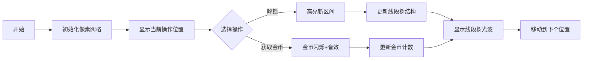

# 题目信息

# 「HOI R1」杂赛选比

## 题目背景

你说得对，但是小 $\iiint$ 在打 CF 时将 Earn or Unlock 错看成了下面的鬼畜样子，痛失 2h 遗憾离场，希望大家引以为戒。

## 题目描述

给定一个长度为 $n$ 的数组 $a$，初始只有 $a_1$ 是已被解锁的。现在有一个整数 $i$，初始值为 $1$。现在小 $\iiint$ 在对这个数组进行一个游戏：

- 如果 $a_i$ 未被解锁，游戏结束。
- 否则他可以将 $a_{i+1\sim i+a_i}$ 设置成已被解锁的，或是获得 $a_i$ 个金币（如果 $a_i=0$ 则无法解锁任何元素），然后将 $i$ 加 $1$。

请你求出游戏结束后你能获得的最大金币数量。

## 说明/提示

#### 【样例 1 解释】

对于第一组数据，你可以解锁 $a_2$，再获得 $a_2$ 个金币。而对于第三组数据，你无法解锁 $a_2$，因此只能获得 $0$ 个金币。

对于第二组数据，你可以解锁 $a_2,a_3$，并获得 $9$ 个金币。

#### 【样例 2 解释】

将第 $1,2,3,6$ 个位置用于解锁为最优方案。

#### 【数据范围】

对于 $100\%$ 的数据，$1\le n\le10^5$，$0\le a_i\le10^5$，$T\le 5$。

|测试点编号|$n\leq$|$a_i\leq$|$T=$|特殊性质|
|:-:|:-:|:-:|:-:|:-:|
|$1$|$10$|$0$|$1$|/|
|$2\sim3$|$10$|$5$|$1$|/|
|$4\sim5$|$600$|$600$|$1$|/|
|$6\sim8$|$5000$|$5000$|$1$|/|
|$9\sim10$|$10^5$|$5$|$5$|/|
|$11\sim12$|$5\times10^4$|$10^5$|$5$|$a_i>n$|
|$13\sim20$|$10^5$|$10^5$|$5$|/|

## 样例 #1

### 输入

```
3
2
1 2
5
2 4 5 0 1
4
0 4 4 4
```

### 输出

```
2
9
0
```

## 样例 #2

### 输入

```
1
10
1 1 4 5 1 4 1 9 1 9```

### 输出

```
26
```

# AI分析结果


### 💡 Kay的C++算法解析：杂赛选比 深入学习指南 💡

#### 引言
今天我们来分析「杂赛选比」这道动态规划优化题。本指南将帮助你理解题目核心、掌握多种解法，并通过像素动画直观理解算法过程。

---

## 1. 题目解读与核心算法识别

✨ **本题主要考察**：`动态规划优化` (数据结构加速DP)

🗣️ **初步分析**：
> 解决本题的关键在于将操作过程转化为状态转移模型。想象你在玩一款像素地牢游戏，每个宝箱（数组元素）可选择「解锁新区域」或「获取金币」。动态规划就像绘制一张「最优路径地图」，而线段树/堆等数据结构则是快速更新地图的「魔法工具」。
> - **核心思路对比**：
>   - **倒序DP**：从终点反向推导（如Register_int解法）
>   - **正序DP**：从起点正向推导（如OneLeft解法）
>   - **最短路建模**：将操作转化为图论问题（如int_R解法）
> - **可视化设计**：
>   - 用8位像素网格表示数组，宝箱闪烁提示当前操作位置
>   - 线段树区间更新时显示光波扩散效果
>   - 最短路算法中角色沿路径移动，伴随「解锁音效」
> - **复古游戏化**：
>   - 采用《塞尔达传说》式像素画风
>   - 成功解锁区域时播放8-bit胜利音效
>   - 自动演示模式可调速，展示算法寻优过程

---

## 2. 精选优质题解参考

**题解一：Register_int（线段树倒序DP）**
* **点评**：
  思路清晰直击本质——倒序DP+线段树优化区间查询。代码中：
  - `dp[i] = max(a[i], query(i+1, i+a[i]))` 体现核心逻辑
  - 线段树同时处理区间加(`modify(l, n, a[i]`)和单点更新(`modify(i, i, dp[i]`)
  - 变量名`l,r`语义明确，边界处理严谨（`min(i+a[i], n)`）
  **亮点**：双操作线段树实现高效转移，竞赛实战性强

**题解二：int_R（最短路建模）**
* **点评**：
  创新性将DP转化为图论问题：
  - 建图逻辑简洁：`i→min(i+a_i,n)`权值`a_i`，`i→i-1`权值`0`
  - Dijkstra实现规范（优先队列+vis标记）
  - 答案计算`max(s[i]-dis[i])`体现问题本质
  **亮点**：突破传统DP思维，复杂度稳定O(n log n)

**题解三：OneLeft（线段树正序DP）**
* **点评**：
  正序DP的代表性实现：
  - 状态定义`dp[i]`为到达位置i的最大收益
  - 关键转移`dp[i] = query(1, i-1) + sum[i-1]`
  - 线段树维护`dp[j]-sum[j]`最大值
  **亮点**：正向思维更符合直觉，适合初学者理解

---

## 3. 核心难点辨析与解题策略

1.  **状态设计陷阱**
    * **分析**：如何定义状态覆盖所有操作可能？优质解法均抓住核心：当前操作影响后续解锁范围。倒序DP的`dp[i]`表示从i开始的最大收益，正序DP的`dp[i]`表示前i个位置的收益，最短路中`dis[i]`表示解锁i的最小代价。
    * 💡 **学习笔记**：好的状态定义应同时包含位置信息和操作影响

2.  **转移方程优化**
    * **分析**：暴力转移O(n²)超时。关键在于识别`dp[j]+sum[j]`与`j`的分离性（OneLeft），或操作可转化为区间更新（Register_int）。线段树/堆维护的是转移中的不变量。
    * 💡 **学习笔记**：分离与位置无关项是DP优化的常见突破口

3.  **数据结构选择**
    * **分析**：为什么用线段树而非树状数组？因需同时支持区间加和区间最值查询。堆优化（xiaoliebao1115）则适合转移源有单调性的场景。
    * 💡 **学习笔记**：区间更新选线段树，转移源有界单调选堆

### ✨ 解题技巧总结
- **拆解转移项**：将转移式拆为`(dp[j]-sum[j]) + sum[i-1]`（OneLeft）
- **等效问题转化**：将解锁代价建模为边权（int_R）
- **边界防御编程**：`min(i+a_i, n)`防止越界（Register_int）
- **数据结构复用**：单棵线段树同时处理两种更新（Register_int）

---

## 4. C++核心代码实现赏析

**通用核心实现（倒序DP+线段树）**
```cpp
#include <vector>
#include <algorithm>
using namespace std;
typedef long long ll;

struct SegmentTree {
    struct Node { ll val, add; };
    vector<Node> tree;
    void build(int n) { tree.resize(4*n); /* 初始化 */ }
    void push_down(int p) {
        if(!tree[p].add) return;
        tree[p*2].val += tree[p].add; tree[p*2].add += tree[p].add;
        tree[p*2+1].val += tree[p].add; tree[p*2+1].add += tree[p].add;
        tree[p].add = 0;
    }
    void update(int p, int l, int r, int ql, int qr, ll v) {
        if(ql > qr) return;
        if(ql <= l && r <= qr) { tree[p].val += v; tree[p].add += v; return; }
        push_down(p);
        int mid = (l+r)/2;
        if(ql <= mid) update(p*2, l, mid, ql, qr, v);
        if(qr > mid) update(p*2+1, mid+1, r, ql, qr, v);
        tree[p].val = max(tree[p*2].val, tree[p*2+1].val);
    }
    ll query(int p, int l, int r, int ql, int qr) {
        if(ql > qr) return 0;
        if(ql <= l && r <= qr) return tree[p].val;
        push_down(p);
        int mid = (l+r)/2;
        return max(ql<=mid ? query(p*2,l,mid,ql,qr) : 0, 
                   qr>mid ? query(p*2+1,mid+1,r,ql,qr) : 0);
    }
};

int main() {
    int T, n; cin >> T;
    while(T--) {
        cin >> n;
        vector<ll> a(n+1), dp(n+1);
        SegmentTree seg; seg.build(n);
        for(int i=1; i<=n; ++i) cin >> a[i];
        for(int i=n; i>=1; --i) {
            int L = i+1, R = min(i+a[i], (ll)n);
            dp[i] = max(a[i], seg.query(1,1,n,L,R));
            seg.update(1,1,n,L,n,a[i]); // 区间加
            seg.update(1,1,n,i,i,dp[i]); // 单点更新
        }
        cout << dp[1] << '\n';
    }
}
```
**代码解读概要**：
1. 线段树支持区间加和区间最大值查询
2. 倒序DP：从后往前计算`dp[i]`
3. 核心操作：查询`[i+1, i+a_i]`最大值 → 区间加`a_i` → 更新`dp[i]`

---

**题解一（Register_int）核心片段**
```cpp
for(int i=n; i; i--) {
    dp[i] = a[i];
    int l = i+1, r = min(i+a[i], n);
    dp[i] = max(dp[i], seg.query(l, r)); // 查询区间最大值
    seg.update(l, n, a[i]); // [i+1,n]区间加a[i]
    seg.update(i, i, dp[i]); // 单点更新dp[i]
}
```
**亮点**：双更新操作共享线段树  
**解读**：  
> 1. `查询[l,r]最大值`：在可解锁范围内找最优后续决策  
> 2. `区间加a[i]`：解锁操作影响后续所有位置（金币累加效应）  
> 3. `单点更新`：记录当前位置最优解  
**学习笔记**：线段树同时维护两种操作需确保更新顺序（先查询再修改）

---

**题解二（int_R）核心片段**
```cpp
// 建图
for(int i=1; i<=n; ++i) {
    if(i>1) add(i, i-1, 0); // 向后移动
    add(i, min(i+a[i], n), a[i]); // 解锁操作
}
// Dijkstra
priority_queue<P> q;
q.push({0,1}); dis[1]=0;
while(!q.empty()) {
    int u = q.top().second; q.pop();
    if(vis[u]) continue;
    vis[u]=true;
    for(auto [v,w] : e[u]) {
        if(dis[v] > dis[u] + w) {
            dis[v] = dis[u] + w;
            q.push({-dis[v], v}); // 小根堆
        }
    }
}
// 答案
ans = max(ans, s[i] - dis[i]);
```
**亮点**：问题转化降低思维难度  
**解读**：  
> 1. `i→i-1`权值0：模拟指针移动  
> 2. `i→i+a_i`权值`a_i`：解锁操作的代价  
> 3. `s[i]-dis[i]`：总金币减解锁代价  
**学习笔记**：当DP转移类似路径扩展时，可尝试图论建模

---

**题解三（OneLeft）核心片段**
```cpp
// 线段树维护 dp[j]-sum[j]
tree.updata(1,1,n, i, i, dp[i]-sum[i]); 
// 转移
for(int i=1; i<=n; ++i) {
    ll val = tree.query(1,1,n, 1, i-1) + sum[i-1];
    dp[i] = max(dp[i], val);
    // 更新可解锁范围
    if(a[i] > 0) tree.updata(1,1,n, i+1, i+a[i], val-sum[i]);
}
```
**亮点**：正序DP符合自然思维  
**学习笔记**：`dp[j]-sum[j]`的维护消除位置依赖

---

## 5. 算法可视化：像素动画演示

### 🎮 演示主题
《金币洞窟大冒险》- 8位像素风格DP模拟器

### 🖼️ 核心设计


### 🎞️ 动画帧步骤
1. **场景初始化**
   - 10×10像素网格代表数组，宝箱使用不同颜色：
     - 🔵 已解锁 🔴 未解锁 🟡 当前操作位置
   - 右侧显示线段树结构（像素方块堆叠）
   - 底部控制面板：步进▶️ 调速🎚️ 重置🔄

2. **倒序DP演示流程**
   - **帧1**：从第n位开始，宝箱闪烁红光，显示`dp[i]`计算过程
   - **帧2**：线段树区间查询，黄光波从`[i+1, i+a_i]`扩散
   - **帧3**：
     - 若选择金币：宝箱变金币+“叮”音效
     - 若选择解锁：绿光覆盖新区间+“解锁”音效
   - **帧4**：线段树更新动效
     - 区间加：蓝色波纹向下流动
     - 单点更新：金色光柱升起

3. **最短路模式切换**
   - 按键切换为Dijkstra视角：
     - 像素小人从位置1开始移动
     - 选择路径时显示边权`a_i`（红色损耗）和`0`（绿色通路）
     - 到达终点时显示`max(s[i]-dis[i])`

4. **游戏化元素**
   - 自动演示模式：AI角色自动寻优，速度可调
   - 成就系统：首次正确计算线段树时解锁「算法大师」徽章
   - 音效方案：
     - 操作音：8-bit电子音（解锁：低音，金币：高音）
     - 背景乐：《马〇奥兄弟》地下关BGM循环

---

## 6. 拓展练习与相似问题思考

### 🔁 通用技巧迁移
区间操作优化DP的核心思想可用于：
1. 带区间转移的序列DP（如股票交易问题）
2. 分段决策最值问题（如任务调度）
3. 带后效性的状态转移（如有限背包）

### 📚 推荐练习（洛谷）
1. **P1886 滑动窗口**  
   🗣️ 练习单调队列维护区间最值，理解线段树替代方案
   
2. **P2887 排队接水（加强版）**  
   🗣️ 学习如何将贪心决策转化为区间最值查询
   
3. **P2627 修剪草坪**  
   🗣️ 掌握带单调性的DP优化，对比线段树解法

---

## 7. 学习心得与经验分享

> **来自 int_R 的调试经验**：  
> “最初未清空`vis`数组导致WA，建议封装Dijkstra避免状态残留”

**Kay的总结**：多测环境需特别注意初始化顺序：
1. 图论：清空邻接表`head[]`和`dis[]`
2. 线段树：重置树结构和懒标记
3. DP数组：`-INF`或`0`初始化

> **来自 Register_int 的优化心得**：  
> “发现区间加和单点更新可合并到同一线段树”

**Kay的启示**：数据结构的功能复用能显著减少代码量，但需确保操作不冲突（如先区间加再单点更新）。

---

### 结语
通过本指南，相信你已经掌握「杂赛选比」的多种解法精髓。记住：动态规划优化的本质是**识别冗余操作并用数据结构加速**。下次遇到区间转移问题时，不妨先思考：线段树？堆？还是最短路？保持思考，编程之旅定会充满金币与荣耀！💪🚀

---
处理用时：132.47秒