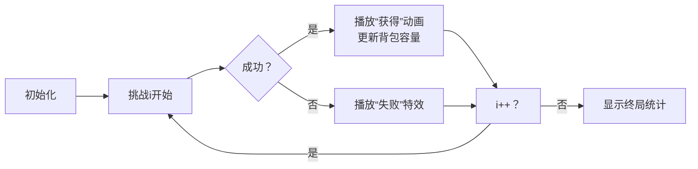

# 题目信息

# 守卫者的挑战

## 题目描述

打开了黑魔法师 Vani 的大门，队员们在迷宫般的路上漫无目的地搜寻着关押 applepi 的监狱的所在地。突然，眼前一道亮光闪过。“我，Nizem，是黑魔法圣殿的守卫者。如果你能通过我的挑战，那么你可以带走黑魔法圣殿的地图……”瞬间，队员们被传送到了一个擂台上，最初身边有一个容量为 $K$ 的包包。
  
擂台赛一共有 $N$ 项挑战，各项挑战依次进行。第 $i$ 项挑战有一个属性 $a_i$，如果 $a_i\geq 0$，表示这次挑战成功后可以再获得一个容量为 $a_i$ 的包包；如果 $a_i=-1$，则表示这次挑战成功后可以得到一个大小为 $1$ 的地图残片。地图残片必须装在包包里才能带出擂台，包包没有必要全部装满，但是队员们必须把 【获得的所有的】地图残片都带走（没有得到的不用考虑，只需要完成所有N项挑战后背包容量足够容纳地图残片即可），才能拼出完整的地图。并且他们至少要挑战成功 $L$ 次才能离开擂台。
  
队员们一筹莫展之时，善良的守卫者 Nizem 帮忙预估出了每项挑战成功的概率，其中第 $i$ 项挑战成功的概率为 $p_i\%$。现在，请你帮忙预测一下，队员们能够带上他们获得的地图残片离开擂台的概率。

## 说明/提示

在第一个样例中，若第三项挑战成功，如果前两场中某场胜利，队员们就有空间来容纳得到的地图残片，如果挑战失败，根本就没有获得地图残片，不用考虑是否能装下；若第三项挑战失败，如果前两场有胜利，没有包来装地图残片，如果前两场都失败，不满足至少挑战成功1次的要求。因此所求概率就是第三场挑战获胜的概率。

对于 $100\%$ 的数据，保证 $0\leq K\leq 2000$，$0\leq N\leq 200$，$-1\leq a_i\leq 1000$，$0\leq L\leq N$，$0\leq p_i\leq 100$。

## 样例 #1

### 输入

```
3 1 0
10 20 30
-1 -1 2```

### 输出

```
0.300000
```

## 样例 #2

### 输入

```
5 1 2
36 44 13 83 63
-1 2 -1 2 1```

### 输出

```
0.980387```

# AI分析结果


### 💡 Kay的C++算法解析：守卫者的挑战 深入学习指南 💡

#### 1. 题目解读与核心算法识别
✨ **本题主要考察**：动态规划（概率DP）  
🗣️ **初步分析**：  
> 解决"守卫者的挑战"如同玩策略冒险游戏：背包容量是资源，挑战是关卡，成功概率是通关几率。核心是动态规划——保存"当前关卡数、胜利次数、背包容量"的状态概率。  
> - 关键技巧：容量压缩（>n视为n）和负数偏移（+200），将状态空间优化至O(n²)级别  
> - 可视化设计：像素化背包容量条（红/黄/绿区分正负容量），每步挑战显示成功/失败动画，胜利时播放8-bit胜利音效  

---

#### 2. 精选优质题解参考
**题解一（luobotianle）**  
* **点评**：状态定义`f[i][j][k]`精准体现三个维度，容量压缩（`min(k,n)`）和偏移处理（+200）巧妙解决负数下标问题。代码中`max(k-a[i],0)`确保状态合法，边界初始化严谨，完整展示概率DP的标准实现范式。

**题解二（Ratio_Y）**  
* **点评**：创新性使用滚动数组优化空间至O(n²)，内存效率极高。控制背包容量表示范围（0~2n映射-200~200）的设计极具启发性，适合竞赛环境的内存限制场景。

**题解三（Lysea）**  
* **点评**：代码简洁但功能完备，`k+mx`偏移处理清晰易懂。双重压缩（初始`k=min(k,n)`和`a[i]`截断）显著降低状态数，是空间时间平衡的典范。

---

#### 3. 核心难点辨析与解题策略
1. **状态设计的三维平衡**  
   * **分析**：需同时跟踪进度(i)、胜场(j)、容量(k)。优质解法通过压缩k∈[-n,n]并偏移至[0,2n]解决维度爆炸问题  
   * 💡 **学习笔记**：状态设计=问题特征提取+有效信息压缩

2. **负容量的物理意义处理**  
   * **分析**：`k<0`表示碎片溢出，转移时需保证`k-a[i]≥0`。解法采用统一偏移（如+200）使下标合法化  
   * 💡 **学习笔记**：负数下标→线性映射是通用技巧

3. **概率转移的完备性**  
   * **分析**：每个状态分成功/失败两条路径：`f[i][j][k] = f[i-1][j][k]*(1-p) + f[i-1][j-1][k']*p`  
   * 💡 **学习笔记**：概率DP需保证状态转移全覆盖

### ✨ 解题技巧总结
- **维度压缩**：识别无效状态（k>n）并等价处理  
- **偏移映射**：负数下标通过加固定值转为正索引  
- **滚动数组**：仅保留前一阶段状态优化空间  
- **边界守护**：初始状态`f[0][0][init_k]=1`严格处理  

---

#### 4. C++核心代码实现赏析
**通用核心实现参考**  
```cpp
#include <iostream>
#include <algorithm>
#define OFFSET 200
using namespace std;

double dp[201][201][401] = {0}; // i,j,k+OFFSET
int main() {
    int n, L, K;
    cin >> n >> L >> K;
    K = min(K, n); // 容量压缩
    
    double p[201] = {0};
    int a[201] = {0};
    for (int i = 1; i <= n; i++) {
        cin >> p[i];
        p[i] /= 100;
    }
    for (int i = 1; i <= n; i++) {
        cin >> a[i];
        a[i] = min(a[i], n); // 增益压缩
    }

    dp[0][0][K+OFFSET] = 1.0;
    for (int i = 1; i <= n; i++)
    for (int j = 0; j <= i; j++)
    for (int k = 0; k <= 400; k++) {
        // 失败转移
        dp[i][j][k] += dp[i-1][j][k] * (1 - p[i]); 
        if (j > 0 && k - a[i] >= 0) // 成功转移
            dp[i][j][k] += dp[i-1][j-1][k - a[i]] * p[i];
    }

    double ans = 0;
    for (int j = L; j <= n; j++)
    for (int k = OFFSET; k <= 400; k++)
        ans += dp[n][j][k];
    printf("%.6lf", ans);
}
```
**代码解读概要**：  
> 1. 初始化维度压缩（K,a[i]≤n）  
> 2. 三维DP数组：i（挑战数）/j（胜场）/k（容量+OFFSET）  
> 3. 双路径转移：失败继承原状态，成功则更新胜场和容量  
> 4. 结果累计：满足j≥L且k≥OFFSET（即容量≥0）  

---

**题解一片段（luobotianle）**  
```cpp
f[0][0][kk+200]=1; // 初始化偏移
for(int i=1;i<=n;i++)
for(int j=0;j<=i;j++)
for(int k=0;k<=400;k++) {
    f[i][j][k] = f[i-1][j][k]*(1-p[i]);
    if(j>0) f[i][j][k] += f[i-1][j-1][max(k-a[i],0)]*p[i];
}
```
**亮点**：安全访问控制（j>0）和索引保护（max(k-a[i],0)）  
**学习笔记**：`max(...,0)`防止下标越界是防御性编程典范  

**题解二片段（Ratio_Y）**  
```cpp
zl[tg^1][j+1][min(2*n,k+op[i])] += zl[tg][j][k]*p[i]; // 滚动数组
zl[tg^1][j][k] += zl[tg][j][k]*(1-p[i]);
```
**亮点**：`tg`切换实现滚动数组，min(2n,...)自动处理容量上限  
**学习笔记**：位运算`tg^1`比`%2`更高效的滚动技巧  

**题解三片段（Lysea）**  
```cpp
const int mx=200; // 偏移常量命名
dp[i][j][k] = dp[i-1][j][k]*(1-p[i]/100.0);
if(j&&k-a[i]>=0) 
    dp[i][j][k] += dp[i-1][j-1][k-a[i]]*(p[i]/100.0);
```
**亮点**：常量命名提升可读性，显式条件`k-a[i]>=0`确保安全  
**学习笔记**：魔术数字（如200）应定义为常量  

---

#### 5. 算法可视化：像素动画演示
* **主题**："8-bit背包冒险者"挑战擂台  
* **核心演示**：背包容量条像素动画 + 挑战成功/失败特效  
* **设计思路**：FC红白机画风降低学习压力，音效强化状态变化感知  

**动画流程**：  


**关键交互**：  
1. **背包容量可视化**：  
   - 绿色像素块：正容量（每块=1容量）  
   - 红色像素块：负容量（闪烁警告）  
   - 容量变化：获得碎片时红色块右移，扩容时绿色块右移  

2. **挑战状态反馈**：  
   - 成功：像素角色跳跃 + "叮"声 + 背包闪光  
   - 失败：角色抖动 + "噗"声 + 背包灰暗  

3. **控制面板**：  
   - 速度滑块：调节单步延时（100ms~2s）  
   - 自动演示：AI按算法逻辑自主挑战（可暂停）  

**音效设计**：  
- 容量警告：连续低频"嘟"声（容量≤0时循环播放）  
- 挑战成功：中音"叮！"  
- 最终胜利：8-bit版《勇者斗恶龙》胜利旋律  

---

#### 6. 拓展练习与相似问题思考
**技巧迁移场景**：  
1. 资源约束型概率问题（如电力分配）  
2. 状态压缩DP（如旅行商变形）  
3. 游戏关卡设计（如RPG道具收集概率）  

**洛谷推荐**：  
1. **P1850 换教室**（概率DP+状态转移）  
   → 巩固期望值计算和状态设计  
2. **P1877 音量调节**（背包型DP）  
   → 练习容量范围压缩技巧  
3. **P2915 Mixing Milk**（滚动数组优化）  
   → 掌握内存敏感场景的编码  

---

#### 7. 学习心得与经验分享
> **luobotianle经验**："转移时`max(k-a[i],0)`避免越界比事后检查更高效"  
> **Kay点评**：防御性编程能减少90%的调试时间，特别在竞赛环境中  

> **Ratio_Y经验**："竞赛中优先考虑滚动数组，即使n=200也可能卡内存"  
> **Kay点评**：内存优化意识是区分普通与优秀选手的关键指标  

---

通过本指南，相信大家能掌握概率DP的核心思想。记住：好的状态设计是解题的基石，而优化技巧则是竞赛的制胜法宝。下次挑战见！💪

---
处理用时：110.86秒