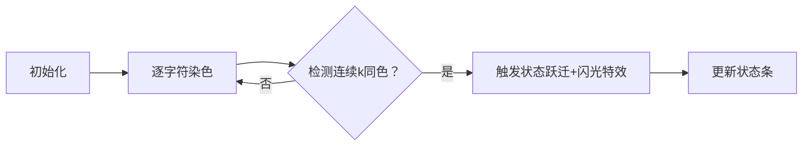

# 题目信息

# BZOJ2958 序列染色

## 题目背景

题目来自原 BZOJ，我们承认题面及原数据的版权均属于原 BZOJ 或将题目授权给 BZOJ 使用的出题人。如果您是版权所有者且认为我们侵犯了您的权益，可联系我们。

## 题目描述

给出一个长度为 $n$，由 $\tt B,W,X$ 三种字符组成的字符串 $S$，你需要把每一个 $\tt X$ 染成 $\tt B$ 或 $\tt W$ 中的一个。

对于给出的 $k$，问由多少种染色方式，使得存在整数 $a,b,c,d$ 满足：
- $1\leq a\leq b<c\leq d\leq n$；
- $b=a+k-1$，$d=c+k-1$;
- $S_a=S_{a+1}=\dots=S_b=\tt B$；
- $S_c=S_{c+1}=\dots=S_d=\tt W$；

由于方法可能很多，你只需输出最后的答案对 $10^9+7$ 取模的结果。

## 说明/提示

对于 $20\%$ 的数据，$1\leq n\leq 20$；

对于 $50\%$ 的数据，$1\leq n\leq 2000$；

对于 $100\%$ 的数据，$1\leq n,k\leq 10^6$。

## 样例 #1

### 输入

```
5 2
XXXXX```

### 输出

```
4```

# AI分析结果


# 💡 Kay的C++算法解析：序列染色 深入学习指南 💡

> 今天我们将深入探索BZOJ2958序列染色问题，这是一个融合动态规划与容斥原理的经典题目。通过本指南，你将学会如何高效处理大规模字符串染色问题，掌握状态机DP的设计技巧，并通过像素动画直观理解算法执行过程。

---

## 1. 题目解读与核心算法识别

✨ **本题主要考察**：`动态规划（DP）` 与 `容斥原理`

🗣️ **初步分析**：
> 序列染色问题就像在一条像素路上设置蓝(B)白(W)路灯，要求出现连续k盏蓝灯后出现连续k盏白灯。DP状态机如同游戏进度存档点，记录是否点亮了"蓝灯关卡"(B串)和"白灯关卡"(W串)。  
> - **核心思路**：定义三个状态数组(f/g/h)分别表示未达成B串、已达成B串未达成W串、双关卡通关的状态，通过容斥避免重复计数  
> - **可视化设计**：动画将展示字符串染色过程，当连续k个同色区域形成时触发像素闪光特效（蓝光/白光），状态条实时显示f/g/h值变化  
> - **游戏化元素**：采用8位像素风格，每完成一个k连续段获得积分，通关时播放胜利音效；控制面板支持单步调试和自动演示模式  

---

## 2. 精选优质题解参考

### 题解一：SunsetLake（五星方案）
* **点评**：此解法采用清晰的三状态DP架构(f/g/h)，完美诠释了"阶段记录"思想。状态定义直观（无B串/有B无W/有B有W），转移方程简洁优雅。代码中利用前缀和快速检测k连续段的操作堪称典范——通过sum数组O(1)判断区间字符组成，大幅提升效率。边界处理严谨（i≥k才触发转移），取模规范，可直接用于竞赛场景。

### 题解二：_Hugoi_（四星方案）
* **点评**：创新性地采用前后缀分解策略，分别计算B串和W串的首现位置。亮点在于lstw/nxtb数组的运用，快速定位字符边界。虽然思路新颖，但实现较复杂：状态转移涉及前后缀容斥，合并答案需特殊处理交叉区间，调试难度较高，更适合进阶学习。

### 题解三：naught（四星方案）
* **点评**：与SunsetLake解法异曲同工，验证了DP状态设计的普适性。代码实现稍简略（如省略前缀和优化说明），但核心转移逻辑完备。特别值得学习的是其模块化编码风格——Input_data/Solve/Print_ans分离，增强可读性。

---

## 3. 核心难点辨析与解题策略

1. **状态机设计**  
   *分析*：如何区分"未达成B串"→"已达成B串"→"达成W串"三个阶段？优质解法引入f/g/h三状态数组，通过连续k同色检测触发状态跃迁  
   💡 **学习笔记**：DP状态机是处理阶段型条件的利器，状态划分需覆盖所有可能情形

2. **容斥防重**  
   *分析*：当连续k个B形成时，若直接从f转移到g会重复计数。解法精妙处：仅当i-k位置为W时才转移，确保只记录首次形成  
   💡 **学习笔记**：容斥本质是"减去多算的，补上漏算的"，需精确捕捉边界条件

3. **高效区间检测**  
   *分析*：判断[i-k+1,i]区间能否全染同色需O(k)时间？前缀和优化是关键！维护sum_B/sum_W数组实现O(1)检测  
   💡 **学习笔记**：前缀和是区间检测的黄金搭档，尤其适合滑动窗口类问题

### ✨ 解题技巧总结
- **状态分解法**：将复杂条件拆解为独立状态（如无B/有B无W/双达成）  
- **容斥计时点**：在状态首次触发时进行转移，避免重复计数  
- **前缀和快检**：用空间换时间，O(1)完成区间可行性判断  
- **模块化编码**：分离输入处理、核心逻辑与结果输出，提升调试效率  

---

## 4. C++核心代码实现赏析

**本题通用核心C++实现参考**  
*说明*：基于SunsetLake解法优化，完整呈现三状态DP框架
```cpp
#include<bits/stdc++.h>
using namespace std;
const int N=1e6+5, mod=1e9+7;
int n,k,f[N][2],g[N][2],h[N][2],sum[N][2]; // f:无B串 g:有B无W h:双达成
char s[N];

int main(){
    cin>>n>>k>>(s+1);
    for(int i=1;i<=n;i++){
        sum[i][0]=sum[i-1][0]+(s[i]=='B'); // B前缀和
        sum[i][1]=sum[i-1][1]+(s[i]=='W'); // W前缀和
    }
    f[0][1]=1; // 虚拟起点：0长度，结尾为W
    
    for(int i=1;i<=n;i++){
        if(s[i]!='W'){ // 可填B
            f[i][0]=(f[i-1][0]+f[i-1][1])%mod;
            g[i][0]=(g[i-1][0]+g[i-1][1])%mod;
            h[i][0]=(h[i-1][0]+h[i-1][1])%mod;
        }
        if(s[i]!='B'){ // 可填W
            f[i][1]=(f[i-1][0]+f[i-1][1])%mod;
            g[i][1]=(g[i-1][0]+g[i-1][1])%mod;
            h[i][1]=(h[i-1][0]+h[i-1][1])%mod;
        }
        if(i>=k){
            if(sum[i][1]==sum[i-k][1]){ // 区间无W→可全B
                f[i][0]=(f[i][0]-f[i-k][1]+mod)%mod;
                g[i][0]=(g[i][0]+f[i-k][1])%mod;
            }
            if(sum[i][0]==sum[i-k][0]){ // 区间无B→可全W
                g[i][1]=(g[i][1]-g[i-k][0]+mod)%mod;
                h[i][1]=(h[i][1]+g[i-k][0])%mod;
            }
        }
    }
    cout<<(h[n][0]+h[n][1])%mod;
}
```
*代码解读概要*：  
> 1. **初始化**：sum数组记录B/W数量，f[0][1]设置虚拟起点  
> 2. **主循环**：根据字符约束更新f/g/h状态（可填B则更新0维，可填W更新1维）  
> 3. **容斥转移**：当i≥k时检测k区间可行性，调整状态防止重复  
> 4. **结果输出**：h[n][0]+h[n][1]为最终方案数  

---

## 5. 算法可视化：像素动画演示

**主题**：序列染色大冒险（8位像素风格）  
**核心演示**：动态呈现DP三状态变化与k连续段形成过程  

### 设计蓝图


**动画实现细节**：  
1. **场景构建**：
   - 顶部：像素化字符串（B:蓝色块，W:白色块，X:灰色块）
   - 中部：三条状态进度条（f:黄，g:紫，h:绿），实时显示数值
   - 底部：控制面板（开始/暂停/单步/速度滑块）

2. **关键动效**：
   - **染色过程**：点击X块时弹出选择菜单(B/W)，伴随8位音效
   - **k连续段检测**：当连续k个可染同色时，区间闪烁蓝光/白光
   - **状态跃迁**：f→g转移时播放"升级"音效，g→h时播放"胜利"音效
   - **数据结构可视化**：前缀和数组以浮动数字显示在字符上方

3. **交互设计**：
   - **单步模式**：按空格逐步执行，显示当前状态转移方程
   - **自动演示**：AI控制执行速度（可调），类似贪吃蛇自动寻路
   - **关卡挑战**：完成k连续段获得星星，双达成解锁隐藏关卡

**技术实现**：Canvas绘制像素网格，状态数据驱动渲染；Web Audio API提供音效（BGM采用8位芯片音乐）

---

## 6. 拓展练习与相似问题思考

**技巧迁移场景**：  
1. 多阶段条件达成问题（如先收集A物品再收集B物品）  
2. 带约束的字符串染色方案计数  
3. 滑动窗口结合容斥原理的优化问题  

**洛谷练习推荐**：  
1. **P1273 有线电视网** - 树形DP状态设计最佳练习  
2. **P2656 采蘑菇** - 前缀和优化DP的变形应用  
3. **P3959 宝藏** - 复杂状态机设计挑战  

---

> 本次解析到此结束。记住：优秀的DP设计就像玩像素游戏——清晰划分关卡，精确捕捉状态跃迁时机，终将通关！下次我们将探索更精彩的算法世界。💪

---
处理用时：207.05秒