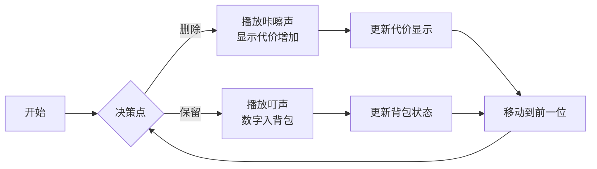

# 题目信息

# 「KDOI-10」商店砍价

## 题目背景

您可以点击 [这里](https://www.luogu.com.cn/fe/api/problem/downloadAttachment/3jbtilzv) 下载本场比赛的选手文件。

密码：`rAnHoUyaSuoBaoMimaNijuEdefAngsHa2)2$1)0(2@0!`

**本场比赛所有题目从标准输入读入数据，输出到标准输出。**

## 题目描述

有一个正整数 $n$，保证其只由数字 $1\sim 9$ 构成。

你可以做任意多次如下操作：

- 选择 $n$ 的一个数位 $x$，花费 $v_x$ 的代价删除它，注意，此时 $n$ 的数位个数会减少 $1$，$n$ 的值也会发生相应的变化；
- 或者，花费 $n$ 的代价把剩余的所有数位删除。

求把整个数删除的最小代价。

## 说明/提示

**【样例 1 解释】**

对于第一组测试数据，最优操作方案如下：

- 删除数位 $2$，代价为 $10$，此时 $n$ 变为 $13$；
- 删除数位 $3$，代价为 $10$，此时 $n$ 变为 $1$；
- 删除 $n$ 的剩余所有数位，代价为 $1$。

总代价为 $10+10+1=21$，可以证明，这是代价的最小值。

对于第二组测试数据，一种最优操作方案如下：

- 删除第一个数位 $1$，代价为 $2$，此时 $n$ 变为 $121$；
- 删除最后一个数位 $1$，代价为 $2$，此时 $n$ 变为 $12$；
- 删除数位 $2$，代价为 $1$，此时 $n$ 变为 $1$；
- 删除 $n$ 的剩余所有数位，代价为 $1$。

总代价为 $2+2+1+1=6$。

**【样例 2】**

见选手目录下的 `bargain/bargain2.in` 与 `bargain/bargain2.ans`。

这个样例满足测试点 $3\sim 6$ 的约束条件。

**【样例 3】**

见选手目录下的 `bargain/bargain3.in` 与 `bargain/bargain3.ans`。

这个样例满足测试点 $11$ 的约束条件。

**【样例 4】**

见选手目录下的 `bargain/bargain4.in` 与 `bargain/bargain4.ans`。

这个样例满足测试点 $17,18$ 的约束条件。

**【样例 5】**

见选手目录下的 `bargain/bargain5.in` 与 `bargain/bargain5.ans`。

这个样例满足测试点 $23\sim 25$ 的约束条件。

***

**【数据范围】**

对于全部的测试数据，保证：

- $1\le t\le 10$；
- $1\le n< 10^{10^5}$；
- 对于任意 $1\le i\le 9$，$1\le v_i\le 10^5$；
- $n$ 由数字 $1\sim 9$ 构成。

|   测试点    |   $n<$    | $v_i\le$ |        特殊性质        |
| :---------: | :---------: | :------: | :--------------------: |
|     $1$     |    $100$     |  $10^5$  |           无           |
|     $2$     |    $10^3$    |  $10^5$  |           无           |
|  $3\sim 6$  |  $10^{18}$  |  $10^5$  |           无           |
| $7\sim 9$  |  $10^{40}$  |  $10^5$  |           无           |
|    $10$    | $10^{10^5}$ |  $10^5$  | $n$ 由至多一种数字构成 |
|    $11$     | $10^{10^5}$ |  $10^5$  | $n$ 由至多两种数字构成 |
| $12,13$ | $10^{10^5}$ |  $10^5$  | $n$ 由至多三种数字构成 |
| $14\sim 16$ | $10^{10^3}$ | $10^5$ | $v_1=v_2=v_3=\dots =v_9$ |
| $17,18$ | $10^{10^5}$ | $10^5$ | $v_1=v_2=v_3=\dots =v_9$ |
| $19,20$ | $10^{100}$ | $100$ | 无 |
| $21,22$ | $10^{10^3}$ | $10^3$ | 无 |
| $23\sim 25$ | $10^{10^5}$ | $10^5$ | 无 |

## 样例 #1

### 输入

```
0
3
123
10 10 10 10 10 10 10 10 10 
1121
2 1 2 2 2 2 2 2 2
987654321
1 2 3 4 5 6 7 8 9
```

### 输出

```
21
6
45
```

# AI分析结果


# 💡 Kay的C++算法解析：「KDOI-10」商店砍价 深入学习指南 💡

## 1. 题目解读与核心算法识别

✨ **本题主要考察**：`动态规划` (DP) + `贪心性质应用`

🗣️ **初步分析**：
> 解决这道题的关键在于发现一个**贪心性质**：由于删除单个数字的代价 $v_i \leq 10^5$，当剩余数字位数超过6位时，直接删除整个数的代价一定大于逐位删除的代价。因此我们只需要考虑保留0~6位数位的情况。这就像在背包问题中，我们只需携带一个容量有限的背包（最多装6个数字）即可。

- **核心思路**：通过动态规划计算保留k位数位(0≤k≤6)的最小代价。状态设计为`dp[i][j]`表示从第i位到末尾，保留j位数位的最小代价
- **可视化设计思路**：在像素动画中，我们将高亮显示"保留/删除"决策点，动态展示背包(状态j)的变化，并用不同颜色标记代价计算过程
- **复古像素风格**：采用8位机风格，数字显示为像素方块，决策时播放"保留音效"(叮)和"删除音效"(咔嚓)，背包容量用像素进度条表示

---

## 2. 精选优质题解参考

**题解一（来源：cff_0102）**
* **点评**：这份题解思路清晰，将问题转化为"最大化节省代价"的角度十分巧妙。代码中：
  - 状态定义合理：`dp[i][j]`表示后i位保留j位的最大节省
  - 代码规范：变量名`a[i]`明确表示数位，`p10`数组预计算幂次
  - 亮点：时间复杂度O(7n)高效解决10^5规模数据
  - 实践价值：可直接用于竞赛，边界处理完整

**题解二（来源：Petit_Souris）**
* **点评**：提供完整解题思维路径，从暴力到正解的过渡自然：
  - 清晰论证保留位数≤6的结论（关键优化点）
  - 状态转移：`dp[i][j] = min(删除代价, 保留代价)` 直观易懂
  - 亮点：逆向DP设计避免高位权值干扰
  - 实践提示：强调初始化`dp[n+1][0]=0`的边界条件

**题解三（来源：hez_EX）**
* **点评**：代码简洁高效，亮点在于：
  - 从低位到高位处理，自然解决数位权重问题
  - 使用`e[j-1]`替代幂运算提升效率
  - 状态转移精炼：`f[i][j]=min(f[i-1][j]+v_x, f[i-1][j-1]+digit*power)`
  - 实践注意点：需反转输入字符串以适应处理方向

---

## 3. 核心难点辨析与解题策略

1. **难点1：状态定义的方向选择**
   * **分析**：数位权重与处理方向紧密相关。从后向前处理（低位到高位）更自然，因为最后保留的数位在低位，权重固定（个位=1，十位=10等）
   * 💡 **学习笔记**：DP方向决定状态转移的简洁性

2. **难点2：保留数位的权重计算**
   * **分析**：当保留第i位时，其在最终数中的权重取决于已保留的位数j（权重=10^(j-1)）。需预计算10的幂次避免重复计算
   * 💡 **学习笔记**：数位权重=10^(该位在保留序列中的位置)

3. **难点3：边界条件初始化**
   * **分析**：`dp[n+1][0]=0`表示没有数位时代价为0，而`dp[n+1][j>0]`应设为无穷大（不可达状态）
   * 💡 **学习笔记**：边界条件是DP的基石

### ✨ 解题技巧总结
- **问题分解**：将删除操作分解为"保留决策"和"代价计算"两个子问题
- **贪心性质应用**：利用$v_i$的范围限定状态空间（j≤6）
- **逆向思维**：从后向前处理避免高位权重干扰
- **预处理优化**：预先计算10的幂次提升效率

---

## 4. C++核心代码实现赏析

**本题通用核心C++实现参考**
```cpp
#include <bits/stdc++.h>
#define int long long
using namespace std;

const int MAX_LEN = 100010;
int dp[MAX_LEN][7]; // dp[i][j]: 从第i位到末尾，保留j位的最小代价
int p10[6] = {1, 10, 100, 1000, 10000, 100000}; // 预计算10^0~10^5

void solve() {
    string num;
    cin >> num;
    int n = num.size();
    vector<int> v(10);
    for (int i = 1; i <= 9; i++) cin >> v[i];

    // 初始化：非法状态设为极大值
    memset(dp, 0x3f, sizeof(dp));
    dp[n][0] = 0; // 边界条件：所有位处理完毕

    // 从后向前DP（低位到高位）
    for (int i = n-1; i >= 0; i--) {
        int digit = num[i] - '0';
        for (int j = 0; j <= 6; j++) {
            // 选择1：删除当前位
            int del_cost = dp[i+1][j] + v[digit];
            
            // 选择2：保留当前位（需有保留名额）
            int keep_cost = 1e18;
            if (j > 0) {
                // 当前位在保留序列中排第j位（权重=10^(j-1))
                keep_cost = dp[i+1][j-1] + digit * p10[j-1];
            }
            
            dp[i][j] = min(del_cost, keep_cost);
        }
    }

    // 取所有保留方案的最小值
    int ans = 1e18;
    for (int j = 0; j <= 6; j++) 
        ans = min(ans, dp[0][j]);
    
    cout << ans << endl;
}

signed main() {
    ios::sync_with_stdio(0);
    cin.tie(0);
    
    int c, t;
    cin >> c >> t; // 跳过无用数据
    while (t--) solve();
}
```

**代码解读概要**：
1. **预处理**：`p10`数组存储10的幂次，避免重复计算
2. **状态初始化**：`dp[n][0]=0`为合法起点，其余状态初始化为极大值
3. **核心DP循环**：
   - 外层遍历数位（从低位到高位）
   - 内层遍历保留位数（0~6）
   - 两种决策：删除（加$v_i$代价）或保留（加$digit×10^{j-1}$代价）
4. **答案提取**：所有保留方案的最小值

---

**题解一核心片段赏析**
```cpp
for(int i = len-1; i >= 0; i--) {
    int digit = n[i] - '0';
    for(int j = 0; j <= 6; j++) {
        dp[i][j] = dp[i+1][j] + v[digit]; // 删除
        if(j > 0) {
            dp[i][j] = min(dp[i][j], 
                          dp[i+1][j-1] + digit * p10[j-1]); // 保留
        }
    }
}
```
* **亮点**：双循环结构清晰体现状态转移
* **代码解读**：
  - `i`从低位向高位遍历，符合数位权重计算规律
  - `j`循环上限6利用贪心性质优化状态空间
  - 保留决策中`digit * p10[j-1]`准确体现数位权重
* 💡 **学习笔记**：DP状态转移需确保无后效性

---

## 5. 算法可视化：像素动画演示

### 像素探险家：DP决策之旅
**设计思路**：采用8位像素风格，将DP状态转移可视化为探险家背包收集数字的过程。背包容量=保留位数上限（6格），每个决策点对应像素化音效。

**动画关键帧**：


1. **场景初始化**：
   - 横向像素网格展示数字序列（高位左→低位右）
   - 背包图标（6格容量）显示在下方
   - 控制面板：开始/暂停、单步执行、速度滑块

2. **决策演示**：
   - **删除操作**：
     * 当前数字方块变红闪烁
     * 显示`+v[x]`代价提示
     * 播放"咔嚓"音效（8-bit短促音）
   - **保留操作**：
     * 当前数字方块变绿跳入背包
     * 显示权重计算过程（e.g. `3*10^2=300`）
     * 播放"叮"音效（清脆音调）

3. **状态同步**：
   - 背包内数字按保留顺序排列（右侧为低位）
   - 实时更新DP状态表（右侧显示`dp[i][j]`值）
   - 当前总代价显示在顶部（像素字体）

4. **特殊效果**：
   - 自动模式：AI小人从右向左移动，自动选择最优决策
   - 完成动画：烟花特效+胜利音效展示最终代价
   - 错误提示：选择不可行操作时播放警告音

**技术实现**：
- Canvas绘制网格和数字方块
- 颜色编码：删除=红色，保留=绿色，当前位=黄色闪烁
- 音效触发：Web Audio API播放8-bit音效
- 交互控制：`requestAnimationFrame`实现调速

---

## 6. 拓展练习与相似问题思考

**通用技巧迁移**：
1. **数位DP应用**：当问题涉及数字的位操作时，常用DP保存数位状态
2. **贪心优化状态空间**：利用问题性质（如代价上限）限定状态范围
3. **背包问题变体**：保留/删除决策本质上是背包模型（容量=保留位数）

**练习推荐（洛谷）**：
1. **P1020 导弹拦截** 
   * 🗣️ 推荐理由：同样需要发现"一个序列中最少分割"的贪心性质
2. **P1091 合唱队形**
   * 🗣️ 推荐理由：双向DP处理序列问题，强化状态设计能力
3. **P1439 最长公共子序列** 
   * 🗣️ 推荐理由：将LCS转化为LIS问题，体现问题转换技巧
4. **P1048 采药**
   * 🗣️ 推荐理由：经典背包问题，帮助理解状态转移本质

---

## 7. 学习心得与经验分享

> **参考经验**（多位作者共识）：
> 1. "保留位数不超过6"的贪心结论是优化关键
> 2. DP方向选择（从后向前）极大简化状态转移
> 3. 必须正确处理边界条件（特别是`dp[n][0]=0`）
>
> **点评**：
> 这些经验凸显了算法竞赛的核心能力：
> - **问题分析**：通过数学推导发现优化性质
> - **实现细节**：边界处理决定代码正确性
> - **思维模式**：逆向思维往往简化问题
>
> 调试建议：打印DP表验证前3行和后3行的状态值

---

## 结语
通过本次分析，我们深入探讨了动态规划在数位问题中的应用，结合贪心性质实现高效解法。记住：好的算法=问题洞察+状态设计+细节处理。继续挑战吧，少年！💪

---
处理用时：189.24秒