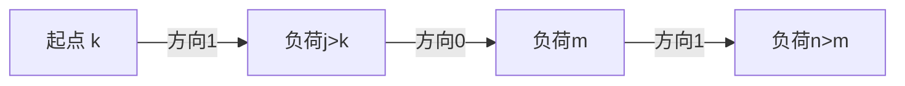

# 题目信息

# [ROIR 2019] 间歇训练 (Day 2)

## 题目背景

翻译自 [ROIR 2019 D2T2](https://neerc.ifmo.ru/school/archive/2018-2019/ru-olymp-regional-2019-day2.pdf)。

## 题目描述

体育学院开发了一种新的间歇训练方法。根据这种方法，运动员每天都要训练，但负荷的增加和减少必须交替进行。

训练计划由一组正整数 $a_{1}, a_{2}, \dots, a_{m}$ 组成，其中 $a_{i}$ 描述了运动员在第 $i$ 天的训练负荷。任何两个相邻的天数的负荷不能相同，即 $a_{i} \neq a_{i+1}$。为了使负荷的增加和减少交替进行，$a$ 必须满足以下条件：如果 $a_{i}<a_{i+1}$，则 $a_{i+1}>a_{i+2}$；如果 $a_{i}>a_{i+1}$，则 $a_{i+1}<a_{i+2}$。

在整个训练计划中，总负荷必须为 $n$，即 $\sum\limits_{i=1}^{m}a_i=n$。计划的天数没有限制，即 $m$ 可以是任意值，但第一天的负荷是固定的，$a_{1}=k$。

学院管理层想知道有多少不同的训练计划符合上述要求。你只需要求出其对 $10^{9}+7$ 取模的结果。

## 说明/提示

### 样例解释

在样例 $1$ 中，符合要求的计划有 $[2,1,2,1], [2,1,3], [2,3,1], [2,4]$。

在样例 $2$ 中，唯一符合要求的计划为 $[3]$。

### 数据范围

数据中 Subtask 0 为样例。

| 子任务 | 分值 | $1\le n\le$ |
| :----------: | :----------: | :----------: |
| $1$ | $23$ | $10$ |
| $2$ | $20$ | $30$ |
| $3$ | $23$ | $500$ |
| $4$ | $34$ | $5000$ |

## 样例 #1

### 输入

```
6 2```

### 输出

```
4```

## 样例 #2

### 输入

```
3 3```

### 输出

```
1```

# AI分析结果


### 💡 Kay的C++算法解析：间歇训练 深入学习指南 💡

#### 1. 题目解读与核心算法识别
✨ **本题主要考察**：动态规划 + 前缀和优化  

🗣️ **初步分析**：
> 解决间歇训练问题就像编排一支波浪舞：运动员每天的训练负荷必须严格上下交替（如2→3→1），且首日负荷固定为k，总负荷恰为n。动态规划(DP)是解决此类"状态转移计数问题"的利器——通过记录不同负荷和方向状态下的方案数，用前缀和优化实现高效转移。

- **核心难点**：状态转移需满足波浪条件（增减交替），朴素DP会超时（O(n³)）
- **解决方案**：定义三维DP状态`dp[i][j][d]`表示总负荷i、最后负荷j、下次方向d（0减/1增），用前缀和数组将转移复杂度降至O(1)
- **可视化设计**：像素网格中Y轴为总负荷(0~n)，X轴为天数。负荷值用不同颜色方块表示，方向用箭头指示。转移时高亮来源区间（如方向1用绿色覆盖），添加方块时有8-bit音效，总负荷达n时触发胜利动画

---

#### 2. 精选优质题解参考
**题解一：ztd___(教学引导型)**  
* **点评**：从爆搜引入DP的推导过程清晰（如状态定义类比搜索参数），代码规范性好（独立前缀和数组）。亮点在于逐步优化（爆搜→朴素DP→前缀和）的教学设计，帮助理解优化本质。调试经验"状态方向与爆搜逻辑对齐"极具实践价值。

**题解二：zhoujiefu(竞赛简洁型)**  
* **点评**：状态定义最简洁（`dp[i][j][d]`），前缀和实现高效（同步更新数组）。代码变量名`g`虽简略但注释明确，边界处理严谨（负数取模）。竞赛参考性强，空间复杂度O(n²)满足要求。

**题解三：modfish_(空间优化型)**  
* **点评**：创新性使用滚动数组（仅两维存储），大幅降低内存消耗。亮点在于对大数据限制(n≤5000)的针对性优化，适合内存敏感场景。代码中`f1`数组分离DP和前缀和逻辑，增强可读性。

---

#### 3. 核心难点辨析与解题策略
1. **状态设计的完备性**  
   * **分析**：需同时捕获总负荷、最后负荷、方向三要素。优质题解用`(i,j,d)`三元组确保波浪约束（如`d=0`时下个负荷必小于j）
   * 💡 学习笔记：DP状态维度 = 问题约束条件数

2. **前缀和优化的时机**  
   * **分析**：转移需区间求和时（如`dp[i][j][0]`需累加`j'<j`的方案），预处理前缀和将O(n)降为O(1)。注意更新顺序：先DP转移再更新前缀和
   * 💡 学习笔记：前缀和差分是区间求和问题的"计算加速器"

3. **边界与初始化陷阱**  
   * **分析**：总负荷i=k时仅1种方案（单天），但需初始化两个方向状态。前缀和下标从1开始，避免越界
   * 💡 学习笔记：DP初始化 = 状态转移的"起跑线"

✨ **解题技巧总结**  
- **问题分解法**：将波浪条件拆解为方向状态（0/1）转移  
- **前缀和应用**：将区间求和转化为差分操作（`sum[r]-sum[l-1]`)  
- **边界防御**：特判n=k，负数取模加`MOD`再计算  

---

#### 4. C++核心代码实现赏析
**通用核心实现（综合优化版）**  
```cpp
#include <bits/stdc++.h>
using namespace std;
const int N=5005, MOD=1e9+7;
int n,k,dp[N][N][2],sum[N][N][2];

int main(){
    cin>>n>>k;
    if(n==k){ cout<<1; return 0; }
    // 初始化
    dp[k][k][0]=dp[k][k][1]=1;
    for(int j=1;j<=n;j++){
        sum[k][j][0]=(sum[k][j-1][0]+dp[k][j][0])%MOD;
        sum[k][j][1]=(sum[k][j-1][1]+dp[k][j][1])%MOD;
    }
    // DP转移
    for(int i=k+1;i<=n;i++){
        for(int j=1;j<i;j++){
            dp[i][j][0]=sum[i-j][j-1][1];                    // 方向0:由较小j'转移
            dp[i][j][1]=(sum[i-j][i-j][0]-sum[i-j][j][0]+MOD)%MOD; // 方向1:由较大j'转移
        }
        // 更新前缀和
        for(int j=1;j<=n;j++){
            sum[i][j][0]=(sum[i][j-1][0]+dp[i][j][0])%MOD;
            sum[i][j][1]=(sum[i][j-1][1]+dp[i][j][1])%MOD;
        }
    }
    cout<<(sum[n][n][0]+sum[n][n][1])%MOD;
}
```
**代码解读概要**：  
> 1. 初始化总负荷i=k的状态  
> 2. 主循环枚举总负荷i（k+1至n）和最后负荷j  
> 3. 方向0转移：累加上次方向1且j'<j的方案（前缀和直接获取）  
> 4. 方向1转移：用差分计算上次方向0且j'>j的方案  
> 5. 实时更新前缀和为后续转移准备  

**分题解亮点赏析**  
1. **ztd___片段**：  
   ```cpp
   dp[i][j][1]=(sum[i-j][i-1][0]-sum[i-j][j][0]+MOD)%MOD;
   ```
   **亮点**：前缀和差分实现O(1)区间查询  
   **解读**：`sum[i-j][i-1][0]`是负荷范围[1,i-1]的和，减去`sum[i-j][j][0]`得到(j,i-1]区间的和  
   **学习笔记**：前缀和差分 = 区间查询的"数学望远镜"  

2. **modfish_片段**：  
   ```cpp
   for(int j=1;j<=n;j++) 
       f1[i][j][0]=(f1[i][j-1][0]+f[i][j][0])%p;
   ```
   **亮点**：独立前缀和数组提升可读性  
   **解读**：`f1`与DP数组分离，避免状态污染  
   **学习笔记**：功能分离 = 代码健壮性的"防火墙"  

---

#### 5. 算法可视化：像素动画演示  
**主题**：8-bit像素风格"登山闯关"  
**核心演示**：  


**动画帧步骤**：  
1. **场景初始化**：  
   - 像素网格：Y轴总负荷(0~n)，X轴天数  
   - 负荷方块：绿色(↑方向1)，红色(↓方向0)  
   - 控制面板：步进/自动播放(调速滑块)  

2. **关键帧演示**：  
   - **状态转移**：高亮当前(i,j)方块，显示来源区间（半透明覆盖层）  
   - **前缀和更新**：来源区间颜色渐变，伴随"滴"声  
   - **添加新天**：从来源区滑动新方块到(i,j)位置，触发"咔嚓"音效  

3. **游戏化元素**：  
   - 每完成总负荷i解锁新关卡（显示"Level i passed!"）  
   - 胜利动画：负荷达n时像素烟花绽放 + 8-bit胜利音乐  
   - 错误处理：无效转移时方块闪烁红色，短促"嗡"声  

**交互设计**：  
- 步进模式：鼠标点击查看转移详情（显示来源状态值）  
- 自动演示：AI自动播放（可调速度），模拟"登山进度"  

---

#### 6. 拓展练习与相似问题思考
**通用技巧迁移**：  
- 波浪形约束 → 状态机DP（如股票买卖时机）  
- 前缀和优化 → 区间统计问题（如子数组和计数）  

**洛谷推荐**：  
1. **P1091 合唱队形**  
   → 双向波浪子序列，巩固状态设计  
2. **P2513 逆序对数列**  
   → 前缀和优化DP的经典应用  
3. **P2401 不等数列**  
   → 不等式约束的计数问题变形  

---

#### 7. 学习心得与经验分享  
**参考经验**（ztd___调试心得）：  
> "实现时发现状态方向与爆搜逻辑相反，通过小数据模拟对齐"  

**点评**：  
> 调试DP时，用n=3,k=1等小数据人脑模拟，比对搜索与DP结果，能快速定位状态定义错误。输出中间状态是DP调试的"显微镜"！  

---

通过本次分析，我们掌握了波浪约束问题的DP解法精髓：状态设计捕获约束维度，前缀和优化突破性能瓶颈。记住，编程能力=知识×实践²，多写多调方能融会贯通！💪

---
处理用时：151.11秒