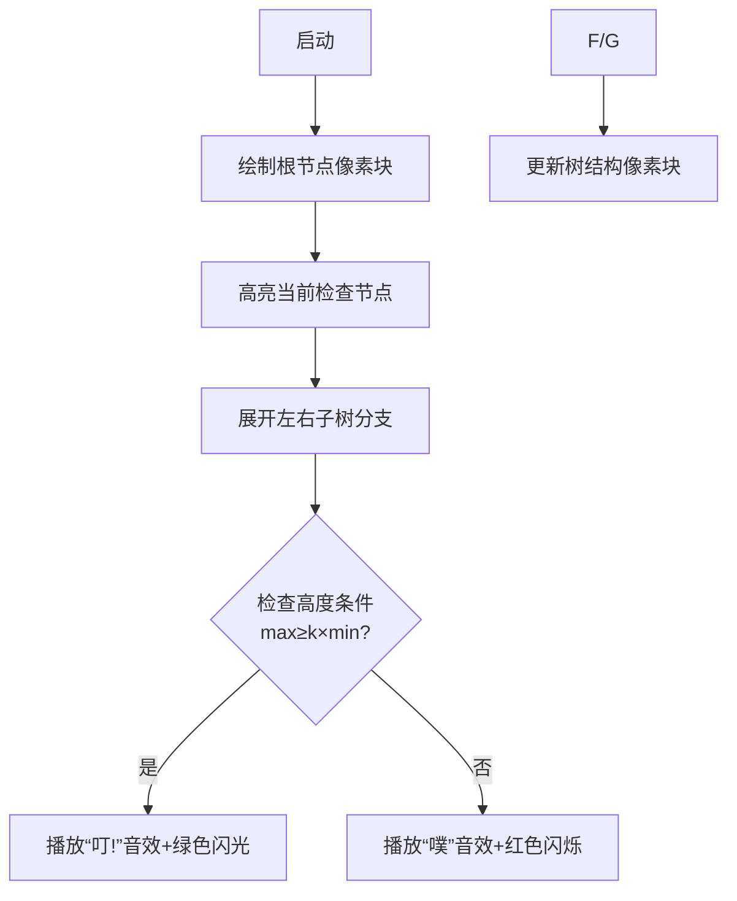

# 题目信息

# [蓝桥杯 2023 国 Java B] 非对称二叉树

## 题目描述

小明觉得不对称的东西有着独特的美感。

对于一棵含有 $n$ 个结点的二叉树，小明规定如果对于其中任意一个结点 $i$ 都满足条件：$\max \{h_{l_i}, h_{r_i}\} \geq k \times \min \{h_{l_i}, h_{r_i}\}$ 则此二叉树为一棵非对称二叉树。其中 $l_i, r_i$ 分别为 $i$ 的左儿子和右儿子，$h_x$ 表示以 $x$ 为根的子树的高度（如果结点 $x$ 不存在则视为高度等于 $0$）。

给定 $n, k$，计算有多少棵不同的非对称二叉树。

## 说明/提示

### 样例说明

所有 $12$ 种情况如下：


### 评测用例规模与约定

- 对于 $20\%$ 的数据，保证 $n \leq 12$。
- 对于 $100\%$ 的数据，保证 $n \leq 35$，$1 \leq k \leq n$。

## 样例 #1

### 输入

```
4 2```

### 输出

```
12```

# AI分析结果


### Kay的C++算法解析：非对称二叉树 深入学习指南

---

#### 1. 题目解读与核心算法识别
✨ **本题主要考察**：`树形动态规划`（Tree-shaped DP）  
🗣️ **初步分析**：  
> 解决非对称二叉树问题，如同搭建一座会自我调节的天平⚖️——我们需要确保每个节点的左右子树高度满足特定比例关系。树形DP的核心思想是将大树拆解成左右子树的小问题，通过状态转移组合答案。  
- **核心思路**：定义状态 `f[i][j]` 表示含 `i` 个节点且高度为 `j` 的合法二叉树数量。通过四重循环枚举左右子树节点数和高度，动态组合子树解。
- **关键难点**：需满足 `max(h_left, h_right) ≥ k × min(h_left, h_right)` 的约束条件，同时处理子树高度为0的边界情况。
- **可视化设计**：采用复古像素RPG风格，用不同颜色方块表示节点（绿色=根节点，蓝色=左子树，红色=右子树）。动画逐步展开树结构，高亮当前检查的节点，并在满足条件时触发8-bit音效"叮！"。

---

#### 2. 精选优质题解参考
**题解一 (来源：Cipher0128)**  
* **点评**：  
  思路直击核心——用 `f[i][j]` 状态定义精准匹配问题需求。代码中四重循环结构清晰（总节点数→左子树节点数→左子树高度→右子树高度），边界处理严谨（`cntr<0` 时跳过）。亮点在于用 `h = max(hl,hr)+1` 简洁计算高度，且时间复杂度 O(n⁴) 完全满足 n≤35 的约束。

**题解二 (来源：cwd2023)**  
* **点评**：  
  状态设计与题解一一致，但增加了更详细的注释说明。亮点在于明确指出了高度范围上限（`lh≤l, rh≤r`），避免无效枚举。小瑕疵是数组开得过大(1010)，实际 n≤35 只需 40x40。

---

#### 3. 核心难点辨析与解题策略
1. **状态设计抽象化**  
   * **分析**：需将"不对称条件"转化为可量化的DP状态。优质解法用 `f[i][j]` 同时承载节点数和高度信息，使子树组合成为可能。  
   💡 **学习笔记**：树形DP的状态必须包含子树规模+关键属性（高度/权重等）。

2. **约束条件集成**  
   * **分析**：转移时需实时检查 `max(hl,hr) ≥ k×min(hl,hr)`。代码通过`if`条件将约束自然融入转移方程，避免后处理。  
   💡 **学习笔记**：约束条件应作为状态转移的过滤网，而非独立步骤。

3. **边界处理技巧**  
   * **分析**：空子树高度定义为0（`f[0][0]=1`）是正确计数基础。同时需注意：  
     - 单子树存在时，另一子树高度为0  
     - 高度计算：`h = max(hl, hr) + 1`  
   💡 **学习笔记**：树形DP的边界决定算法正确性。

✨ **解题技巧总结**  
- **分治建模**：将二叉树分解为"根节点+左子树+右子树"三部分  
- **枚举剪枝**：利用 `h ≤ 节点数` 限制循环范围（见代码 `hl≤cntl`）  
- **状态复用**：预处理空子树状态(`f[0][0]=1`)简化转移逻辑  

---

#### 4. C++核心代码实现赏析
**通用核心实现参考**  
```cpp
#include <iostream>
using namespace std;
typedef long long ll;
const int N = 40; // n≤35

int main() {
    int n, k; cin >> n >> k;
    ll f[N][N] = {};
    f[0][0] = 1; // 空树初始化

    for (int i = 1; i <= n; i++)          // 总节点数
    for (int l = 0; l < i; l++) {         // 左子树节点数
        int r = i - l - 1;                // 右子树节点数
        for (int hl = 0; hl <= l; hl++)   // 左子树高度
        for (int hr = 0; hr <= r; hr++) { // 右子树高度
            if (max(hl, hr) < k * min(hl, hr)) continue;
            int h = max(hl, hr) + 1;      // 当前树高度
            f[i][h] += f[l][hl] * f[r][hr];
        }
    }

    ll ans = 0;
    for (int h = 0; h <= n; h++) ans += f[n][h];
    cout << ans;
}
```
**代码解读概要**：  
1. 初始化空树状态 `f[0][0]=1`  
2. 四层循环分别枚举：整棵树节点数→左子树节点数→左子树高度→右子树高度  
3. 通过 `max(hl,hr) ≥ k*min(hl,hr)` 过滤非法状态  
4. 合法状态转移：`f[i][h] += f[l][hl] * f[r][hr]`  
5. 最终对所有高度求和  

---

#### 5. 算法可视化：像素动画演示  
**主题**：`像素二叉树建造者`（8-bit风格）  
**核心演示流程**：  


**交互设计**：  
- **视觉**：  
  - 根节点：棕色像素块（16x16）  
  - 左/右子树：蓝/红色像素块，高度用垂直堆叠块数表示  
  - 条件检查时：触发像素粒子特效（✅/❌）  
- **音效**：  
  - 合规：FC游戏"金币收集"音效（8-bit短促"叮!"）  
  - 违规：经典"错误"音效（低沉"噗"声）  
- **控制面板**：  
  - 速度滑块：调节树构建速度  
  - 单步模式：按空格键逐步执行  
  - AI演示：自动展示完整建树过程  

---

#### 6. 拓展练习与相似问题  
**通用技巧迁移**：  
树形DP可用于解决：  
1. 平衡二叉树计数（高度差约束）  
2. 二叉树权重分配问题  
3. 树形结构方案统计（如满二叉树/完全二叉树）  

**洛谷推荐**：  
1. **P1040 加分二叉树**  
   🗣️ 练习树形DP+中序遍历特性，强化状态转移设计  
2. **P1365 树的计数**  
   🗣️ 巩固卡特兰数在二叉树计数的应用  
3. **P2585 二叉苹果树**  
   🗣️ 学习树形DP+背包问题的结合应用  

---

#### 7. 学习心得与经验分享  
本次题解未包含作者个人经验分享。Kay建议：  
> 调试树形DP时，可打印 `f[i][j]` 矩阵观察状态转移过程。特别注意 `j=0`（空树）和 `i=1`（单节点）的边界值！

---

通过本指南，相信大家已掌握树形DP的核心思想。记住：将大树拆解为小树，让状态转移成为组合子树解的桥梁！下次我们将探索更复杂的树形结构问题，继续加油！🚀

---
处理用时：88.65秒