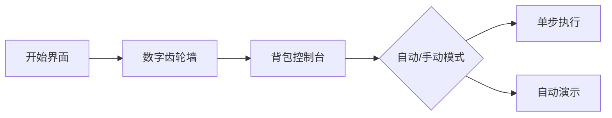

# 题目信息

# [蓝桥杯 2024 国 C] 循环位运算

## 题目背景

蓝桥杯原题为 **做完 $m$ 次操作**，根据下载得到的测试数据分析应当为 **做了不超过 $m$ 次操作**。洛谷的题面根据实际测试数据进行编写。

## 题目描述

给定 $n$ 个数 $A_i$，每个数我们都将其视为一个 $32$ 位的二进制数。你可以进行 $m$ 次操作，每次选择任意一个数将其循环左移一次。

循环左移表示将某个数的二进制位均左移一位，同时最高位移动到最低位。例如对于一个 $8$ 位二进制数 $10010010$，循环左移一次后为 $00100101$，两次后为 $01001010$。

问做了**不超过** $m$ 次操作后，$n$ 个数的和最大是多少。

## 说明/提示

### 评测用例规模与约定

- 对于 $30\%$ 的评测用例，$n, m \leq 12$；
- 对于 $60\%$ 的评测用例，$n, m \leq 100$；
- 对于所有评测用例，$1 \leq n, m \leq 1000$，$0 \leq A_i < 2^{32}$。

## 样例 #1

### 输入

```
3 9
2365587456
2399141888
9437184```

### 输出

```
7535067152```

# AI分析结果


### 💡 Kay的C++算法解析：循环位运算 深入学习指南 💡

<introduction>
今天我们分析蓝桥杯2024国赛题目"循环位运算"。这道题考察动态规划与位运算的结合应用，通过本指南你将掌握核心解题思路、代码实现技巧及可视化理解方式。

---

## 1. 题目解读与核心算法识别

✨ **本题主要考察**：`动态规划（分组背包）` + `位运算优化`

🗣️ **初步分析**：
> 本题可类比为"分组背包"问题：每个数字有32种状态（循环左移0~31次），每组选一种状态，总操作次数≤m时求最大和。
> 
> **核心难点**：  
> - 每个数字的32种状态存在循环依赖关系  
> - 需在O(nm*32)复杂度内完成计算  
> 
> **可视化设计**：  
> 采用8位像素风格背包界面（类似《塞尔达传说》道具栏）。每个数字显示为32个可旋转的齿轮（对应左移次数），背包容量为m。选择齿轮时播放"咔哒"音效，状态转移时显示数值变化，成功组合时触发8-bit胜利音效。

---

## 2. 精选优质题解参考

**题解一（Austin0116）**
* **点评**：思路清晰，完整展示预处理（二进制转换）和DP三重循环。亮点在于：
  - 使用字符串预处理所有移位状态，避免实时计算开销
  - `sum[i][k]`设计直观体现状态定义
  - 严格处理32位补零，避免边界错误
  - 时间复杂度O(nm*32)完全达标

**题解二（WorldMachine）**
* **点评**：代码简洁高效，亮点包括：
  - 滚动数组优化空间复杂度至O(m)
  - 实时计算移位：`x = x<<1 | (x>>31 & 1)`
  - 倒序枚举避免状态覆盖
  - 循环上限`u=min(j,31)`提升效率

**题解三（sjwhsss）**
* **点评**：数学优化典范，亮点：
  - 移位公式`(tmp<<k)+(x-tmp>>32-k)`避免循环计算
  - 预处理f[i][k]大幅减少计算量
  - 函数封装增强可读性
  - 明确注释32次操作上限的数学依据

---

## 3. 核心难点辨析与解题策略

1. **状态定义抽象**
   * **分析**：需将位运算转化为DP状态。优质解法定为`dp[i][j]`（前i数用j次操作的最大和），关键在于：
     - 每个数的32种状态独立计算
     - j-k保证操作次数不超限
   * 💡 **学习笔记**：把位运算问题转化为离散状态是DP解题关键

2. **移位计算优化**
   * **分析**：两种高效计算方式：
     ```cpp
     // 方法1：实时计算（WorldMachine）
     x = (x << 1) | (x >> 31 & 1);
     
     // 方法2：公式计算（sjwhsss）
     ll tmp = x % (1<<(32-k));
     return (tmp<<k) + (x-tmp)>>(32-k);
     ```
   * 💡 **学习笔记**：避免每次重新移位，预处理或公式计算提升效率

3. **时间复杂度控制**
   * **分析**：三重循环需满足：
     - 外层：i∈[1,n]
     - 中层：j∈[0,m]
     - 内层：k∈[0, min(31,j)]
     总计算量n*m*32≈10^6，符合要求
   * 💡 **学习笔记**：内层k≤31的优化是复杂度达标的关键

### ✨ 解题技巧总结
- **位运算预处理**：提前计算所有数字的32种状态
- **滚动数组优化**：dp[j]替代dp[i][j]降低空间复杂度
- **数学公式替代迭代**：用位运算公式减少计算步骤
- **边界严谨处理**：32位补零、无符号整数防溢出

---

## 4. C++核心代码实现赏析

**本题通用核心C++实现参考**
* **说明**：综合优质题解优化，包含预处理+DP+滚动数组
* **完整核心代码**：
```cpp
#include <iostream>
#include <vector>
#include <algorithm>
using namespace std;

int main() {
    int n, m;
    cin >> n >> m;
    vector<unsigned> a(n+1);
    vector<vector<unsigned>> state(n+1, vector<unsigned>(33));
    
    // 预处理32种状态
    for(int i=1; i<=n; ++i) {
        cin >> a[i];
        state[i][0] = a[i];
        for(int k=1; k<=32; ++k) 
            state[i][k] = (state[i][k-1] << 1) | (state[i][k-1] >> 31);
    }
    
    // DP (滚动数组优化)
    vector<long long> dp(m+1, 0);
    for(int i=1; i<=n; ++i) 
        for(int j=m; j>=0; --j) 
            for(int k=0; k<=min(31,j); ++k) 
                dp[j] = max(dp[j], dp[j-k] + state[i][k]);
    
    // 输出最大值
    cout << *max_element(dp.begin(), dp.end());
    return 0;
}
```
* **代码解读概要**：
  > 1. **预处理**：计算每个数字循环左移0-32次的状态  
  > 2. **滚动DP**：倒序枚举操作次数，状态转移`dp[j]=max(dp[j], dp[j-k]+state[i][k])`  
  > 3. **结果提取**：取dp数组最大值即为答案

---

**题解一（Austin0116）片段赏析**
* **亮点**：严谨的二进制字符串转换确保精度
* **核心代码片段**：
```cpp
for(int j=(int)s[i].size();j<32;j++) s[i]+=48; // 32位补零
reverse(s[i].begin(),s[i].end());
s[i]+=s[i];  // 双倍字符串便于截取
```
* **代码解读**：
  > 此处精妙处理任意长度二进制数：  
  > 1. 补零保证32位长度  
  > 2. 反转使高位在前  
  > 3. 双倍字符串实现循环移位截取  
  > 💡 **学习笔记**：字符串处理可规避位运算溢出风险

**题解二（WorldMachine）片段赏析**
* **亮点**：实时移位与滚动数组完美结合
* **核心代码片段**：
```cpp
for(int j=m; ~j; j--) {
    unsigned x = a[i];
    for(int k=0; k<=min(j,31); k++) {
        dp[j] = max(dp[j], dp[j-k] + x);
        x = x << 1 | (x >> 31 & 1); // 实时更新移位状态
    }
}
```
* **代码解读**：
  > 1. **倒序枚举**：防止同一物品重复使用  
  > 2. **实时移位**：`x = x<<1 | (x>>31 & 1)` 高效计算下一状态  
  > 3. **空间优化**：仅用一维dp数组  
  > 💡 **学习笔记**：滚动数组+实时计算=最优空间复杂度方案

---

## 5. 算法可视化：像素动画演示

**动画主题**：*《位运算大冒险》8-bit背包系统*

**设计思路**：  
用复古RPG背包界面呈现DP过程：  
- 数字→可旋转齿轮道具  
- 操作次数→背包容量  
- 状态转移→道具组合过程  

**实现方案**：


1. **像素化界面**：
   - 顶部：32*32齿轮矩阵（每个数字32个旋转状态）
   - 中部：背包状态条（容量m，当前使用j）
   - 底部：控制面板（开始/暂停/单步/调速）

2. **动态演示**：
   ```python
   # 伪代码实现
   for i in range(n):  # 遍历每个数字
       高亮第i行齿轮
       for j from m downto 0:
          背包容量显示j
          for k in 0..min(31,j):
             点亮第k个齿轮
             播放"咔哒"音效
             计算新得分：dp[j] = max(dp[j], dp[j-k]+value)
             显示得分变化动画
             熄灭齿轮
   ```

3. **游戏化元素**：
   - **音效设计**：
     * 齿轮选择：8-bit "咔哒"声
     * 得分更新：上升音阶
     * 最优解：FC胜利旋律
   - **关卡系统**：
     * 每完成一个数字→通过小关
     * 最终解→击败Boss
   - **自动演示**：
     * AI像玩俄罗斯方块自动组合齿轮
     * 速度可调（0.5x-5x）

---

## 6. 拓展练习与相似问题思考

**通用技巧迁移**：
1. 状态压缩DP：将位运算状态抽象为整数
2. 分组背包：物品分多组，每组选一种
3. 滚动数组：优化空间复杂度

**洛谷推荐**：
1. **P1064** 金明的预算方案  
   → 分组背包基础应用
2. **P1879** Corn Fields  
   → 位运算+状态压缩DP
3. **P3694** 邦邦的大合唱  
   → 分组背包变形

---

## 7. 学习心得与经验分享

> **经验（Austin0116）**：  
> "字符串转换时忘记32位补零导致WA，务必测试边界数据！"  
> 
> **Kay点评**：  
> 位运算题目必须测试：  
> - 全零数据  
> - 最大边界值  
> - 移位溢出情况  
> 建议使用`unsigned`类型和预计算避免运行时错误

---

<conclusion>
通过本指南，我们掌握了循环位运算的DP解法核心：状态抽象、位运算优化和滚动数组应用。记住将复杂问题分解为离散状态是DP的关键思维。现在就用齿轮动画演示加深理解吧！下次挑战见！🚀
</conclusion>
```

---
处理用时：100.38秒