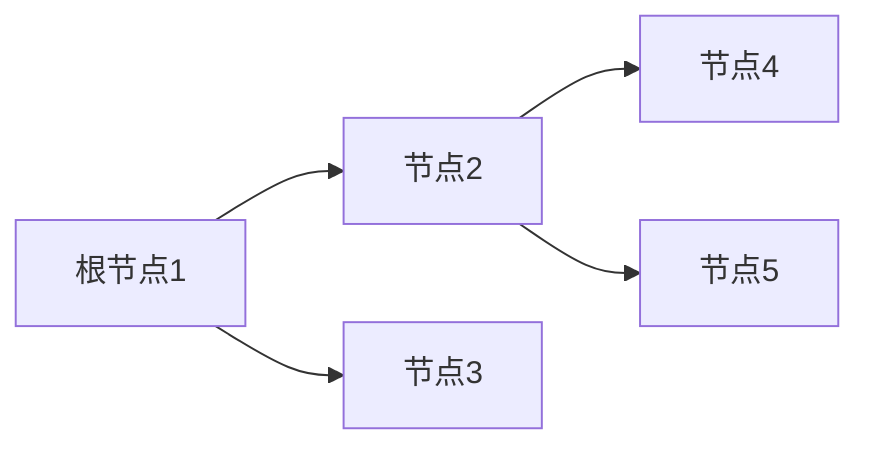

# 题目信息

# Brooklyn Round 1 & NNOI Round 1 D - Apples

## 题目描述

小 X 有一颗 $n$ 个结点的树，树的根结点为 $1$，规定根结点的深度为 $1$。树是指一个由 $n$ 个结点，$n-1$ 条双向边组成的连通块。你通过每条边都需要 $1$ 秒。你在每秒钟可以停在原地，也可以经过 $1$ 条边。

树的结点会随机刷新 $m$ 次，第 $i$ 次在 $t_i$ 时刻在 $w_i$ 号结点刷新出 $p_i$ 个苹果，但存在时间只有 $1$，过后会消失。

这颗树有两个特殊的性质：

+ 最深的结点深度不会超过 $s$。

+ 所有的 $t_i$ 均不相同。

最开始时，你在根结点，请问你最多能采多少个苹果。

## 说明/提示

**本题采用捆绑测试。**
| 子任务编号 | $n$ | $m$ | 特殊性质 | 分值|
| :----------: | :----------: | :----------: | :----------: | :----------: |
| $1$ | $= 5$ | $= 5$ |无 |$10$|
| $2$ | $= 20$ | $= 20$ | 无 |$10$|
| $3$ | 无 | 无 | A |$20$|
| $4$ | 无 | 无 | B |$20$|
| $5$| $= 10^3$ | $= 10^3$ | 无 |$20$|
| $6$| 无 | 无 | 无 |$20$|

对于 $100\%$ 的数据，$1 \le n \le 8 \times 10^4,1 \le m \le 2 \times 10^4,1 \le s \le 10^3,1 \le p_i,t_i \le 10^9,1 \le w_i \le n$。

特殊性质 A：$s = 2$。

特殊性质 B：这棵树是一条以根节点为端点的链。

## 样例 #1

### 输入

```
5 3 5
1 2
1 3
2 4
2 5
1 5 3
2 7 8
3 8 10```

### 输出

```
13```

# AI分析结果


### 💡 Kay的C++算法解析：Apples 深入学习指南 💡

<introduction>
今天我们来分析树上动态规划经典题——"Apples"。本题要求在一棵深度受限的树上采集随机刷新的苹果，最大化收获数量。本指南将带你深入理解动态规划的核心思想与优化技巧，并通过像素动画直观展示算法流程。
</introduction>

---

## 1. 题目解读与核心算法识别

✨ **本题主要考察**：`动态规划` + `优化技巧`

🗣️ **初步分析**：
> 解决本题的关键在于**树形动态规划**与**深度限制优化**。想象你是一位探险家（像素小人），需要在时间轴上穿梭于树的不同节点采集苹果。动态规划（DP）就像规划最优采集路线：
> - 状态定义：`dp[i]`表示采到第i个苹果时的最大收获
> - 状态转移：若能在苹果i出现前赶到，则`dp[i]=max(dp[j]+p_i)`
>
> 核心难点在于转移优化——利用树深不超过s的特性：
> - 树上任意两点距离≤2s（像素小人最多走2s步）
> - 时间差>2s的转移可直接用前缀最大值优化
> - 只需暴力检查最近2s时间窗内的苹果
>
> **可视化设计思路**：
> 1. 像素小人沿树枝移动，实时显示时间进度条
> 2. 当检查转移时，高亮当前苹果(i)和候选苹果(j)
> 3. 显示两节点距离计算过程（LCA路径高亮）
> 4. 时间差>2s时触发"时空跳跃"特效（复古像素闪光）
> 5. 成功转移时播放8-bit收集音效

---

## 2. 精选优质题解参考

**题解一（来源：jiangby2011）**
* **点评**：思路清晰抓住深度≤s的核心限制，推导出距离≤2s的关键结论。代码实现精炼：
  - 用`Max[]`数组维护前缀最大值优化远距离转移
  - 循环条件`j>=max(1,i-2*s)`精准控制枚举范围
  - 提前终止机制（`break`）避免冗余计算
  - LCA预处理和距离计算封装规范

**题解二（来源：ZHR100102）**
* **点评**：创新使用DFS序+ST表实现O(1)LCA查询：
  - 利用`dfn[]`和`st[][]`实现高效LCA
  - 结构体存储苹果数据，排序逻辑清晰
  - 前缀最大值`pre[]`与DP数组合并处理
  - 边界条件`dep[a[i].w]≤a[i].t`处理严谨

**题解三（来源：篮网总冠军）**
* **点评**：实现完整且易读性强：
  - 虚拟苹果(时间0)巧妙初始化DP
  - `last`指针动态追踪时间窗起点
  - 倍增LCA实现标准规范
  - 循环条件`j>=last`避免无效枚举

---

## 3. 核心难点辨析与解题策略

1. **状态设计与转移优化**
   * **分析**：直接O(m²)转移不可行。利用树深≤s的特性：
     - 证明任意节点距离≤2s → 时间差>2s必定可转移
     - 维护前缀最大值数组跳过远距离检查
   * 💡 **学习笔记**：题目限制是优化的重要突破口

2. **树上距离快速计算**
   * **分析**：频繁计算dis(u,v)需高效LCA：
     - 选项1：倍增LCA（O(log n)）
     - 选项2：DFS序+ST表（O(1)）
     - 距离公式：dep[u]+dep[v]-2×dep[lca]
   * 💡 **学习笔记**：LCA算法选择显著影响常数效率

3. **时间窗边界处理**
   * **分析**：需精确控制枚举范围[i-2s, i-1]：
     - 用lower_bound定位时间窗起点
     - 注意时间差相等时的边界条件
     - 虚拟苹果(时间0)简化初始化
   * 💡 **学习笔记**：离散时间点用二分查找更优雅

### ✨ 解题技巧总结
- **限制转化法**：将深度限制转化为距离上限
- **前缀优化**：用前缀数组避免重复计算
- **LCA选择**：根据n规模选择倍增或DFS序
- **虚拟初始化**：添加时间0的根节点简化DP

---

## 4. C++核心代码实现赏析

**通用核心实现参考**
```cpp
#include <bits/stdc++.h>
using namespace std;
typedef long long ll;
const int N=8e4+5, M=2e4+5;

struct Apple{ int w,t,p; };
vector<int> G[N];
int dep[N], st[20][N*2], dfn[N], lg[N*2], cnt;
ll dp[M], preMax[M];

// DFS序预处理
void dfs(int u,int f){
    dep[u]=dep[f]+1;
    dfn[u]=++cnt; st[0][cnt]=u;
    for(int v:G[u]) if(v!=f) dfs(v,u), st[0][++cnt]=u;
}

// ST表建表
void buildST(){
    for(int j=1;(1<<j)<=cnt;j++)
        for(int i=1;i+(1<<j)-1<=cnt;i++){
            int x=st[j-1][i], y=st[j-1][i+(1<<(j-1))];
            st[j][i]=dep[x]<dep[y]?x:y;
        }
}

// O(1)查询LCA
int lca(int u,int v){
    int l=dfn[u], r=dfn[v];
    if(l>r) swap(l,r);
    int k=lg[r-l+1];
    int x=st[k][l], y=st[k][r-(1<<k)+1];
    return dep[x]<dep[y]?x:y;
}

int main(){
    int n,m,s; cin>>n>>m>>s;
    for(int i=1;i<n;i++){
        int u,v; cin>>u>>v;
        G[u].push_back(v); G[v].push_back(u);
    }
    dfs(1,0); buildST();
    
    vector<Apple> apples(m);
    for(int i=0;i<m;i++) 
        cin>>apples[i].w>>apples[i].t>>apples[i].p;
    sort(apples.begin(),apples.end(),[](auto& a,auto& b){
        return a.t<b.t;
    });

    ll ans=0;
    for(int i=0;i<m;i++){
        if(dep[apples[i].w]>apples[i].t) continue;
        
        // 前缀最大值转移
        int j=lower_bound(apples.begin(),apples.begin()+i,
            apples[i].t-2*s,[&](auto& a,ll t0){return a.t<t0;})-apples.begin();
        if(j>0) dp[i]=preMax[j-1]+apples[i].p;
        
        // 时间窗内暴力转移
        for(int k=j;k<i;k++){
            int d=dep[apples[i].w]+dep[apples[k].w]-2*dep[lca(apples[i].w,apples[k].w)];
            if(d<=apples[i].t-apples[k].t)
                dp[i]=max(dp[i],dp[k]+apples[i].p);
        }
        
        preMax[i]=max(i?preMax[i-1]:0,dp[i]);
        ans=max(ans,dp[i]);
    }
    cout<<ans;
}
```

**代码解读概要**：
1. **DFS序+ST表**：O(n log n)预处理实现O(1)LCA查询
2. **双阶段转移**：
   - 阶段1：用`lower_bound`定位时间窗起点
   - 阶段2：暴力检查窗内苹果（最多2s个）
3. **滚动优化**：`preMax[]`数组维护历史最大值

---

## 5. 算法可视化：像素动画演示

**主题**：`像素探险家的时空采集之旅`

**核心演示**：


**动画流程**：
1. **场景初始化**（FC像素风格）
   - 树结构：像素化节点（绿色）与棕色树枝
   - 控制面板：开始/暂停/单步/速度滑块
   - 8-bit背景音乐：轻松循环旋律

2. **时间轴推进**（关键帧演示）
   | 时间 | 事件               | 可视化效果                     |
   |------|--------------------|-------------------------------|
   | t=1  | 节点5刷新🍎(3个)   | 节点5闪烁红光+“叮”音效        |
   | t=2  | 节点7刷新🍎(8个)   | 节点7闪烁红光                 |
   | t=3  | 节点8刷新🍎(10个)  | 节点8闪烁红光                 |

3. **DP转移演示**（核心逻辑）
   - 高亮当前苹果(i)为金色
   - 绘制时间窗范围[i-2s, i-1]（蓝色光柱）
   - 候选苹果(j)显示为银色
   - 自动计算路径距离：显示LCA路径（黄色高亮）
   - 距离≤时间差：显示绿色✅+胜利音效
   - 距离>时间差：显示红色❌+失败音效

4. **AI自动模式**
   - 像素小人沿最优路径移动（根据DP结果回溯）
   - 采集成功时播放庆祝动画（像素烟花+金币音效）
   - 实时显示DP数组和preMax值变化

**技术实现**：
- Canvas绘制树/角色/苹果
- 时间轴用requestAnimationFrame推进
- 音效：Web Audio API播放8-bit音效

---

## 6. 拓展练习与相似问题思考

**技巧迁移场景**：
1. 时间窗优化的DP问题
2. 树上路径相关的动态规划
3. 带限制条件的状态转移优化

**洛谷推荐**：
1. **P1081 开车旅行**
   - 🗣️ 考察树上倍增+双指针，巩固LCA应用
2. **P1352 没有上司的舞会**
   - 🗣️ 基础树形DP，理解状态转移设计
3. **P2014 选课**
   - 🗣️ 树形DP+背包问题，提升状态设计能力

---

## 7. 学习心得与经验分享

**作者经验摘录**：
> "最初卡在O(m²)复杂度，发现深度限制后才恍然大悟" —— jiangby2011  
> "调试时忘记处理深度>时间的情况，导致WA" —— ycy1124

**Kay点评**：
- 限制条件常暗藏优化突破口
- 边界条件需特殊测试（如单节点/极限时间）
- 小数据模拟（n=5）是最佳调试手段

---

本次解析希望帮助你掌握树形DP的核心思想。记住：算法优化常源于对题目条件的深刻理解。下次挑战见！💪

---
处理用时：164.95秒