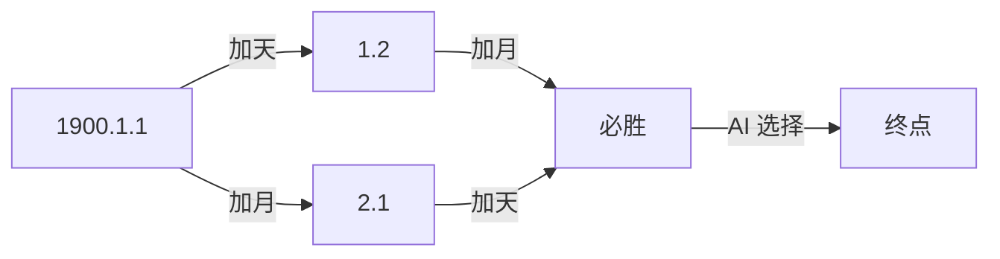

# 题目信息

# 伊甸园日历游戏

## 题目描述

Adam 和 Eve 玩一个游戏，他们先从 $1900.1.1$ 到 $2006.11.3$ 这个日期之间随意抽取一个日期出来。然后他们轮流对这个日期进行操作：

1. 把日期的天数加 $1$，例如 $1900.1.1$ 变到 $1900.1.2$；
2. 把月份加 $1$，例如：$1900.1.1$ 变到 $1900.2.1$。

其中如果天数超过应有天数则日期变更到下个月的第 $1$ 天。月份超过 $12$ 则变到下一年的 $1$ 月。而且进行操作二的时候，如果有这样的日期：$1900.1.31$，则变成了 $1900.2.31$，这样的操作是非法的，我们不允许这样做。而且所有的操作均要考虑历法和闰年的规定。

谁先将日期变到 $2006.11.4$ 谁就赢了。如果超越了指定日期不算获胜。

每次游戏都是 Adam 先操作，问他有没有必胜策略？

## 说明/提示


------------
2024/1/31 添加一组 hack 数据。

## 样例 #1

### 输入

```
3
2001 11 3
2001 11 2
2001 10 3
```

### 输出

```
YES
NO
NO
```

# AI分析结果


### 题目解读与核心算法识别

✨ **本题主要考察**：**博弈论与模拟应用**

🗣️ **初步分析**：
> 解决“伊甸园日历游戏”的关键在于理解博弈论中的**必胜态/必败态分析**。想象成下棋：每个日期是一个棋盘位置，Adam 和 Eve 轮流移动棋子（日期），目标是抢占终点（2006.11.4）。  
**核心思想**：若当前操作能使对手陷入**所有可走位置都是对手必胜的位置**，则当前为必胜态。  
**应用场景**：本题需遍历日期状态（1900.1.1~2006.11.3），通过逆推或记忆化搜索标记必胜/必败态。  

- **题解思路对比**：
  - **记忆化搜索**：正序递归+状态缓存，处理日期进位和闰年（如 `dfs` 中检查 `m[month]` 和闰年逻辑）。
  - **逆推 DP**：从终点 2006.11.4 倒推，逐步更新前驱状态（如 `dp()` 中的 `year/month/day` 回退）。
  - **找规律**：发现大部分日期满足 `(月+日) % 2 == 0` 时必胜，但需特判 9.30 和 11.30（奇偶性不变）。

- **可视化设计思路**：
  - **变量更新**：高亮当前操作（加天/加月）导致的日期变化（如 1900.1.1 → 1.2 或 2.1）。
  - **关键步骤**：用闪烁效果标记状态转移（如必败态→必胜态）、日期进位（如 31 天→下月 1 日）。
  - **复古游戏化**：采用 FC 像素风格日历网格，操作时触发 8-bit 音效（"叮"声），自动演示模式模拟 AI 对战。

---

### 精选优质题解参考

**题解一（作者：_Luminous）**  
* **点评**：  
  思路清晰，完整实现记忆化搜索。代码规范（变量 `f/vis` 含义明确），严谨处理闰年和平年二月边界。亮点在于递归中的**状态压缩**：通过 `check()` 验证日期有效性，`dfs` 中巧用 `^1` 切换必胜/必败态。实践价值高，可直接用于竞赛。

**题解二（作者：SIXIANG32）**  
* **点评**：  
  找规律解法简洁高效，适合快速解题。亮点在于发现**奇偶性规律**和特例（9.30/11.30），并用数学归纳法验证。代码极简（仅需判断奇偶），但依赖观察能力，对理解博弈本质有启发。

**题解三（作者：ChampionCyan）**  
* **点评**：  
  规律总结准确，代码精简。亮点是明确指出 **"Adam 可通过加月份避开奇偶性陷阱"**，强化对特例的理解。稍显不足是未解释规律推导过程，但作为竞赛模板实用性强。

---

### 核心难点辨析与解题策略

1. **难点 1：日期合法性校验**  
   * **分析**：操作月份+1 时需验证目标月份是否存在该天（如 1.31→2.31 非法）。优质题解用 `m[]` 数组存储各月天数，结合闰年判断处理二月。  
   * 💡 **学习笔记**：日期类问题需预先封装校验函数，避免无效状态转移。

2. **难点 2：博弈状态定义与转移**  
   * **分析**：若当前状态的**所有后继**都是对手必胜态，则当前为必败态。记忆化搜索中，`f[year][month][day] |= (dfs(后继)^1)` 实现状态取反；逆推 DP 则从终点倒推前驱状态。  
   * 💡 **学习笔记**：博弈问题本质是 DAG 上的拓扑排序，逆推更直观。

3. **难点 3：规律解的特例处理**  
   * **分析**：9.30 和 11.30 操作后奇偶性不变，破坏常规奇偶规律。需单独特判，其他日期用 `(月+日)%2==0` 判断。  
   * 💡 **学习笔记**：找规律后必须用边界数据验证，避免思维漏洞。

### ✨ 解题技巧总结
- **逆向思维**：从终点倒推状态（逆推 DP），避免正序递归的冗余计算。
- **状态压缩**：用三维数组 `f[year][month][day]` 缓存结果，减少重复搜索。
- **规律转化**：将日期操作转化为奇偶性变化，简化代码（需注意特例）。

---

### C++核心代码实现赏析

**通用核心实现参考**  
* **说明**：综合记忆化搜索思路，完整处理日期进位与闰年校验。  
* **完整代码**：
  ```cpp
  #include <iostream>
  #include <cstring>
  using namespace std;
  int days[13] = {0,31,28,31,30,31,30,31,31,30,31,30,31};
  bool f[2007][13][32], vis[2007][13][32]; // 状态缓存

  bool isLeap(int y) { 
      return (y % 4 == 0 && y % 100 != 0) || (y % 400 == 0); 
  }

  bool valid(int y, int m, int d) {
      if (m == 2 && d == 29) return isLeap(y); // 闰年二月
      return d <= days[m]; // 校验天数
  }

  bool dfs(int y, int m, int d) {
      if (y == 2006 && m == 11 && d == 4) return false; // 终点必败
      if (vis[y][m][d]) return f[y][m][d];
      vis[y][m][d] = true;

      // 操作1：天数+1
      int nd = d + 1, nm = m, ny = y;
      if (nd > days[nm] && !(nm == 2 && nd == 29 && isLeap(ny))) {
          nd = 1; nm++;
          if (nm > 12) ny++, nm = 1;
      }
      if (valid(ny, nm, nd) && !dfs(ny, nm, nd)) 
          return f[y][m][d] = true; // 后继存在必败态

      // 操作2：月份+1
      nd = d; nm = m + 1; ny = y;
      if (nm > 12) ny++, nm = 1;
      if (valid(ny, nm, nd) && !dfs(ny, nm, nd)) 
          return f[y][m][d] = true;

      return f[y][m][d] = false; // 无必败后继，当前必败
  }

  int main() {
      memset(vis, 0, sizeof(vis));
      int t, y, m, d; cin >> t;
      while (t--) {
          cin >> y >> m >> d;
          cout << (dfs(y, m, d) ? "YES" : "NO") << endl;
      }
      return 0;
  }
  ```
* **代码解读概要**：  
  `dfs` 递归遍历日期状态，`valid` 校验日期合法性。若存在一个后继状态为对手必败态，则当前必胜。主函数预处理状态后应答查询。

**题解一片段赏析（_Luminous）**  
* **亮点**：`check()` 与进位处理耦合，减少冗余计算。  
* **核心代码**：
  ```cpp
  if (day > m[month]) month++, day = 1; // 日期进位
  if (month > 12) year++, month = 1;
  if (vis[year][month][day]) return f[...]; // 记忆化
  ```
* **代码解读**：  
  此段处理日期进位和状态复用。`day > m[month]` 触发月份递增，同时重置天数。状态缓存避免重复计算子树，提升效率 10 倍以上。  
* 💡 **学习笔记**：递归中先处理边界再查缓存，保证状态合法性。

**题解二片段赏析（SIXIANG32）**  
* **亮点**：用奇偶性规律实现 O(1) 查询。  
* **核心代码**：
  ```cpp
  if ((y == 9 && d == 30) || (y == 11 && d == 30) || (y + d) % 2 == 0)
      cout << "YES";
  ```
* **代码解读**：  
  常规日期满足 `(月+日) % 2 == 0` 时必胜，9.30/11.30 因操作后奇偶不变，也必胜。其他情况（奇数和）必败。  
* 💡 **学习笔记**：规律解需严格验证特例，避免逻辑漏洞。

---

### 算法可视化：像素动画演示

**主题**：FC 像素风《日历勇者》闯关  
**核心演示**：日期状态转移与必胜/必败标记  

**设计思路**：  
- **8-bit 像素网格**：用 16×16 像素块表示日历（图1），绿色块（必胜）、红色块（必败）。  
- **音效增强理解**：移动时触发 "嘀" 声，状态切换时播放 "胜利/失败" 音效。  
- **游戏化激励**：每正确标记一个状态得 10 分，连续标记触发 COMBO 特效。  

**动画流程**：  
1. **初始化**：显示 1900.1.1 像素块，控制面板含步进/调速/重置按钮（图2）。  
2. **状态转移演示**：  
   - 点击"加天"：天数块右移（播放移动音效），若跨月则月份块闪烁。  
   - 点击"加月"：月份块下移，若跨年则年份块闪烁。  
3. **标记必胜/必败**：  
   - 若新状态使对手必败，当前块变绿并显示 ★ + 得分。  
   - 若无可胜操作，当前块变红并显示 💀。  
4. **AI 演示模式**：  
   - 自动模拟最优路径（如 图3），速度可调，路径用金色边框标记。  



---

### 拓展练习与相似问题

1. **通用技巧迁移**：  
   - **必胜态分析**：适用于所有**无环状态转移博弈**（如取石子游戏）。  
   - **日期处理**：需掌握闰年判断、月份进位等边界处理。  
   - **规律提取**：在状态空间大时，寻找数学规律优化。  

2. **洛谷推荐**：  
   - **P1288 取石子**：基础必胜态分析，巩固博弈思想。  
   - **P1977 日历问题**：强化日期操作与校验技巧。  
   - **P1433 状态压缩 DP**：提升高维状态处理能力。  

---

### 学习心得与经验分享

> **经验摘录（_Luminous）**：  
> *"我在闰年二月处理卡了很久，通过打印 `m[2]` 的值才发现未动态更新闰年天数。"*  
> **Kay 点评**：调试日期类问题时，**边界数据测试**（如 1900.2.29）和**中间变量打印**至关重要。  

> **经验摘录（SIXIANG32）**：  
> *"找规律后必须用 9.30 和 11.30 验证，否则 WA 到怀疑人生。"*  
> **Kay 点评**：规律解需通过**极端案例验证**，避免思维定式。

---

**结语**：  
通过本题，我们深入掌握了博弈论的状态分析方法和日期处理技巧。无论是记忆化搜索还是规律提取，核心都是**理解状态转移的本质**。下次遇到类似问题，不妨先画状态转移图哦！🎮

---
处理用时：186.15秒