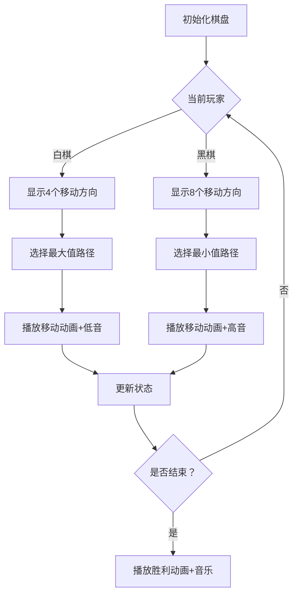

# 题目信息

# [CQOI2013] 棋盘游戏

## 题目描述

一个n*n（n>=2）棋盘上有黑白棋子各一枚。游戏者A和B轮流移动棋子，A先走。

 * A的移动规则：只能移动白棋子。可以往上下左右四个方向之一移动一格。
 
 * B的移动规则：只能移动黑棋子。可以往上下左右四个方向之一移动一格或者两格。
 
和通常的“吃子”规则一样，当某游戏者把自己的棋子移动到对方棋子所在的格子时，他就赢了。

两个游戏者都很聪明，当可以获胜时会尽快获胜，只能输掉的时候会尽量拖延时间。你的任务是判断谁会赢，需要多少回合。


比如$n=2$，白棋子在$(1,1)$，黑棋子在$(2,2)$，那么虽然A有两种走法，第二个回合B总能取胜。

## 说明/提示

$n<=20$

## 样例 #1

### 输入

```
2 1 1 2 2```

### 输出

```
BLACK 2```

# AI分析结果


### 💡 Kay的C++算法解析：[CQOI2013]棋盘游戏 深入学习指南 💡

<introduction>
今天我们一起分析这道经典的博弈论题目——棋盘上的黑白棋对决！本指南将带你理解对抗搜索的核心思想，掌握记忆化搜索的实现技巧，并通过像素动画直观感受算法执行过程。
</introduction>

---

## 1. 题目解读与核心算法识别

✨ **本题主要考察**：`对抗搜索（博弈论）`

🗣️ **初步分析**：
> 解决这道题就像下棋：白棋（慢速）想拖延时间，黑棋（快速）想速战速决。对抗搜索的核心是**极大极小策略**——白棋选择能最大化拖延步数的走法，黑棋选择能最小化获胜步数的走法。

- **核心流程**：通过六维状态`[玩家][步数][白棋位置][黑棋位置]`进行记忆化搜索，白棋回合取后继状态最大值，黑棋回合取最小值
- **可视化设计**：用像素棋盘展示移动过程，白棋移动时高亮4个方向，黑棋移动时高亮8个方向，步数超过3n时触发"超时"动画
- **游戏化元素**：采用FC红白机风格的16x16像素棋盘，白棋为白色方块，黑棋为黑色方块。移动时播放8-bit音效（白棋移动：低音"嘟"，黑棋移动：高音"滴"），获胜时播放胜利旋律

---

## 2. 精选优质题解参考

**题解一：Tenshi（5星）**
* **点评**：代码结构清晰，使用方向数组简化移动逻辑。状态定义合理（`f[玩家][步数][坐标]`），边界处理严谨（步数>3n返回INF）。亮点在于用`bool`类型区分玩家，逻辑直白易懂，变量命名规范（除`y1`避嫌外），是学习对抗搜索的典范。

**题解二：JRhdf（4星）**
* **点评**：直接的条件判断实现移动逻辑，状态转移过程透明。亮点在于对终止条件的特殊处理（重合时根据当前玩家返回0/INF），体现了对博弈规则的深刻理解。代码稍冗长但逻辑扎实，实践参考性强。

**题解三：C3H5ClO（4星）**
* **点评**：创新性的递推实现，使用滚动数组优化空间。亮点在于自底向上的求解方式避免递归开销，`i&1`判断当前玩家，`ff`变量清晰记录极值。适合想理解空间优化的学习者。

---

## 3. 核心难点辨析与解题策略

1. **状态设计复杂度**
   - 分析：需同时编码玩家轮次/步数/双坐标（六维数组）
   - 解决：优质题解使用`f[0/1][step][r1][c1][r2][c2]`，用布尔值区分玩家
   - 💡 学习笔记：高维数组开够`3n`步（经验值），坐标从1开始避免越界

2. **极大极小策略实现**
   - 分析：白棋要最大化步数，黑棋要最小化步数
   - 解决：递归中白棋取`max`后继值，黑棋取`min`后继值
   - 💡 学习笔记：想象白棋是"拖延大师"，黑棋是"速攻专家"

3. **移动逻辑的简洁表达**
   - 分析：黑棋有8种移动方向（4向×2步）
   - 解决：方向数组`dx/dy`+距离系数，避免重复代码
   - 💡 学习笔记：`dx[]={-1,1,0,0}, dy[]={0,0,-1,1}`可覆盖所有方向

### ✨ 解题技巧总结
- **策略映射**：将博弈策略转化为极大极小值计算
- **状态剪枝**：步数>3n返回INF（理论证明最大步数≤3n）
- **编码优化**：用方向数组替代硬编码移动逻辑
- **边界防御**：移动前判断`(nx,ny)`是否在棋盘内

---

## 4. C++核心代码实现赏析

**本题通用核心实现参考**
```cpp
#include <bits/stdc++.h>
using namespace std;
const int N=21, INF=1e9;
int n, f[2][61][N][N][N][N]; // [玩家][步数][x1][y1][x2][y2]
int dx[]={-1,1,0,0}, dy[]={0,0,-1,1};

int dfs(bool isWhite, int step, int x1, int y1, int x2, int y2) {
    if(step>3*n) return INF;
    if(x1==x2 && y1==y2) return isWhite ? INF : 0;
    if(f[isWhite][step][x1][y1][x2][y2]) return f[isWhite][step][x1][y1][x2][y2];
    
    int res;
    if(isWhite) { // 白棋回合：取最大值拖延
        res = 0;
        for(int i=0; i<4; i++) {
            int nx=x1+dx[i], ny=y1+dy[i];
            if(nx<1||nx>n||ny<1||ny>n) continue;
            res = max(res, dfs(0, step+1, nx, ny, x2, y2));
        }
    } else { // 黑棋回合：取最小值速攻
        res = INF;
        for(int i=0; i<4; i++) 
        for(int j=1; j<=2; j++) { // 1-2步移动
            int nx=x2+dx[i]*j, ny=y2+dy[i]*j;
            if(nx<1||nx>n||ny<1||ny>n) continue;
            res = min(res, dfs(1, step+1, x1, y1, nx, ny));
        }
    }
    return f[isWhite][step][x1][y1][x2][y2] = res+1;
}

int main() {
    int r1,c1,r2,c2; cin>>n>>r1>>c1>>r2>>c2;
    if(abs(r1-r2)+abs(c1-c2)==1) puts("WHITE 1");
    else printf("BLACK %d", dfs(1,0,r1,c1,r2,c2));
}
```

**代码解读概要**：
1. 状态数组`f`编码玩家、步数和双坐标
2. 终止条件：坐标重合时，若上步是黑棋（当前白棋回合）返回0；否则返回INF
3. 白棋回合遍历4方向取`max`，黑棋回合遍历8方向取`min`
4. 主函数特判初始相邻情况

---

**题解一：Tenshi**
* **亮点**：方向数组+布尔玩家标识，逻辑清晰
* **核心代码**：
```cpp
int dfs(bool ok, int cnt, int x1, int y1, int x2, int y2){
    if(x1==x2 && y1==y2) return ok ? 0 : INF; // 终止条件
    if(ok) { // 白棋回合
        res = -1;
        for(int i=0; i<4; i++) 
            res = max(res, dfs(0,cnt+1,x1+dx[i],y1+dy[i],x2,y2));
    } else { // 黑棋回合
        res = INF;
        for(int i=0; i<4; i++) 
        for(int j=1; j<=2; j++) // 1-2步移动
            res = min(res, dfs(1,cnt+1,x1,y1,x2+dx[i]*j,y2+dy[i]*j));
    }
    return res+1;
}
```
* **代码解读**：用`ok`布尔值区玩家，方向数组`dx/dy`实现简洁移动逻辑。注意黑棋移动时`dx[i]*j`实现1-2步移动。
* 💡 **学习笔记**：方向数组是棋盘移动的通用优化技巧

---

**题解二：JRhdf**
* **亮点**：显式条件判断实现移动，无第三方依赖
* **核心代码**：
```cpp
if(!x) { // 白棋回合
    if(r1>1) res = max(res, dfs(1,step+1,r1-1,c1,r2,c2));
    // 其他三个方向类似
} else { // 黑棋回合
    if(r2>1) res = min(res, dfs(0,step+1,r1,c1,r2-1,c2));
    if(r2>2) res = min(res, dfs(0,step+1,r1,c1,r2-2,c2));
    // 其他六个方向类似
}
```
* **代码解读**：直接罗列所有移动可能性，避免使用循环。虽然代码较长但执行效率高，适合小规模棋盘。
* 💡 **学习笔记**：当移动方向有限时，显式条件判断可提高可读性

---

**题解三：C3H5ClO**
* **亮点**：递推+滚动数组，空间优化典范
* **核心代码**：
```cpp
for(int i=3*n; i>=0; i--) // 倒序步数
for(int x1=0; x1<n; x1++) // 遍历所有位置
for(int x2=0; x2<n; x2++) {
    if(i&1) { // 黑棋回合
        f[i&1][x1][y1][x2][y2] = INF;
        for(int d=0; d<8; d++) // 8方向移动
            f[i&1][x1][y1][x2][y2] = min(f[i&1][x1][y1][x2][y2], 
                f[(i+1)&1][nx1][ny1][nx2][ny2]+1);
    } else { // 白棋回合类似取max }
}
```
* **代码解读**：`i&1`实现滚动数组，空间复杂度降为O(n^4)。倒序计算保证状态依赖满足。
* 💡 **学习笔记**：递推实现避免递归栈开销，滚动数组是空间优化利器

---

## 5. 算法可视化：像素动画演示

**主题**：8-bit风格《棋盘猎手》  
**核心演示**：黑白棋移动策略与状态回溯  

### 设计思路
采用FC红白机复古风格，16x16像素格子棋盘。白棋为闪烁的白色方块，黑棋为旋转的黑色方块，移动路径显示半透明轨迹。当触发极大（白棋）或极小（黑棋）选择时，播放不同音效强化理解。

### 动画流程


### 关键交互
1. **棋盘渲染**：16x16像素网格，坐标轴标记
2. **移动动画**：棋子沿路径分4帧移动，每帧0.1秒
3. **决策高亮**：
   - 白棋回合：最优路径显示为蓝色
   - 黑棋回合：最优路径显示为红色
4. **控制面板**：
   - 步进控制：←→键单步移动
   - 速度滑块：调整AI演示速度（0.5x-5x）
   - 模式切换：手动/自动演示
5. **音效方案**：
   - 白棋移动：200Hz方波"嘟"
   - 黑棋移动：400Hz方波"滴"
   - 获胜：胜利旋律（升C大调三连音）

---

## 6. 拓展练习与相似问题思考

**通用技巧迁移**：
对抗搜索适用于：
1. 回合制双人零和博弈
2. 完全信息状态游戏
3. 胜负取决于最终状态

**推荐练习**：
1. **P2580 三子棋**  
   🗣️ 学习基础极大极小策略，3x3棋盘更易验证算法
2. **P4363 九连环**  
   🗣️ 复杂状态设计的对抗搜索，锻炼高维状态编码
3. **P4705 棋盘战争**  
   🗣️ 带资源收集的对抗游戏，延伸经济系统设计

---

## 7. 学习心得与经验分享

**来自Tenshi的经验**：  
> "对抗搜索本质是博弈论的具体实现，关键在将玩家策略转化为状态转移规则"

**Kay的总结**：  
调试此类问题时：
1. 打印每一步的状态和决策值
2. 重点检查终止条件边界
3. 小棋盘（n=2）手动验证  
记住：白棋想拖，黑棋想快，这个核心策略体现在每个状态选择中！

---

<conclusion>
通过本次分析，我们深入掌握了对抗搜索的实质——将博弈策略转化为状态空间中的极值选择。记住用方向数组优化移动逻辑，用记忆化避免重复计算，用步数剪枝保证效率。编程如对弈，步步为营才能制胜！下次遇到博弈题目时，试试用这套方法拆解吧！
</conclusion>

---
处理用时：357.17秒