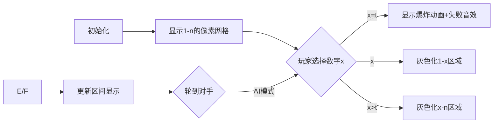

# 题目信息

# 〈 TREEのOI 2022 Spring 〉Absolutely Simple Game

## 题目背景

rin 和 len 在玩一个绝对简单的游戏，pcq 为裁判。

## 题目描述

初始时给定范围 $[l,r]=[1,n]$，pcq 从中均匀随机选出一个自然数 $t$，之后 rin 和 len 两人轮流进行操作，rin 先行。

每次操作方猜测一个整数 $x\in[l,r]$，若 $x=t$，则游戏结束，该方负；若 $x<t$，则调整范围 $[l,r]$ 为 $[x+1,r]$；若 $x>t$，则调整范围 $[l,r]$ 为 $[l,x-1]$。

rin 和 len 两人均充分了解规则且无比可爱聪明（都会最大化自己的胜率），过程中谁都知道场上除了 $t$ 以外的一切信息，求 rin 的胜率。

## 说明/提示

**样例解释1：**  

rin 的胜率为 $\dfrac 23$（一开始猜 $2$），$\bmod~998244353$ 后输出为 $665496236$。

***

**本题采用 SubTask 捆绑测试。**

| SubTask 编号 | 分值 | 特殊限制 |
| :-----------: | :-----------: | :-----------: |
| $0$ | $10$ | $n\equiv 0\ \pmod 2$ |
| $1$ | $20$ | $n\le 100$ |
| $2$ | $30$ | $n\le 10^9$ |
|$3$|$40$|$n\le 10^{18}$|

对于 $100\%$ 的数据，$1 \le n\le 10^{18}$。

---
**如何对有理数取模？**  

$\dfrac {x}{y} \bmod m$ 定义为 $xy^{m-2}\bmod~m$。

$m$ 必须为质数。  

保证答案约分后分母不为 $998244353$ 的倍数。

## 样例 #1

### 输入

```
3```

### 输出

```
665496236```

# AI分析结果


### 💡 Kay的C++算法解析：Absolutely Simple Game 深入学习指南 💡

**题目解读**：  
本题是一个博弈论问题，两位玩家轮流在区间 `[1,n]` 中猜数字 `t`，猜中者输。每次猜测后区间会根据比较结果缩小。双方均采用最优策略，求先手胜率。

---

## 1. 题目解读与核心算法识别
✨ **本题主要考察**：`数学推导与博弈论`  
🗣️ **初步分析**：
> 这道题的本质是寻找**最优策略下的概率计算**。想象成两个玩家在数字迷宫中轮流拆墙，每次拆墙都会改变迷宫大小，而炸弹 `t` 的位置决定了胜负。解题关键在于发现**胜率随 `n` 变化的周期性规律**：
> - 通过小规模数据打表（如 n=1~7）观察规律
> - 推导出通用公式：$胜率 = \begin{cases} 
>   \frac{n-1}{2n} & n \mod 4 = 1 \\
>   \frac{1}{2} & n \mod 2 = 0 \\
>   \frac{n+1}{2n} & n \mod 4 = 3 
> \end{cases}$
> 
> **可视化设计思路**：
> - 用像素网格表示数字区间，炸弹位置隐藏
> - 玩家选择数字时高亮该位置并播放音效
> - 区间缩小动画：被拆除部分变成灰色像素块
> - 自动演示模式展示不同 `n` 的最优策略路径

---

## 2. 精选优质题解参考
**题解一 (Remake_)**  
* **点评**：  
  此解通过严谨的**数学归纳法**证明公式，逻辑严密且覆盖所有边界情况。亮点在于将复杂的博弈过程转化为简洁的模4分类讨论，并给出完整的推导步骤（如n mod 4=0/1/2/3的详细分析），是理论证明的典范。

**题解二 (retep)**  
* **点评**：  
  采用**实验归纳法**，通过手算小数据发现核心规律：n为偶数时胜率恒为1/2。代码实现亮点在于处理 $10^{18}$ 大数时使用**快速乘法**（避免溢出）和**模逆元计算**，实践价值极高。

**题解三 (TernaryTree)**  
* **点评**：  
  通过**打表法**直观展示胜率规律，给出关键递推式 $a_n = n-1 - \min(a_{i-1} + a_{n-i})$。亮点在于用表格清晰呈现状态转移（如n=1~4的完整胜率计算），帮助理解博弈过程本质。

---

## 3. 核心难点辨析与解题策略
1. **难点1：定义状态转移关系**  
   * **分析**：胜率计算需考虑对手最优策略，需构建递归关系 $s_n = \frac{1}{n} \sum_{i=1}^n (1 - s_{k_i})$（$k_i$ 为子区间大小）。优质题解通过打表或归纳法绕过直接推导。
   * 💡 **学习笔记**：复杂博弈可先暴力计算小数据找规律。

2. **难点2：处理超大范围 n**  
   * **分析**：$n \leq 10^{18}$ 需用数论优化。核心技巧是**模逆元公式**：$\frac{a}{b} \mod p = a \times b^{p-2} \mod p$，配合快速幂/乘法避免溢出。
   * 💡 **学习笔记**：大数运算要优先考虑数学性质而非暴力计算。

3. **难点3：规律证明严谨性**  
   * **分析**：需验证公式对所有 n 成立（尤其 n<4 的边界）。Remake_ 的题解通过分类讨论完备性证明是典范。
   * 💡 **学习笔记**：数学证明必须覆盖初始条件和归纳步骤。

### ✨ 解题技巧总结
- **技巧1：打表找规律** - 先手算 n=1~10 的结果，观察分子分母规律
- **技巧2：问题分解** - 将博弈过程拆解为区间缩小和对手胜率计算
- **技巧3：数学工具应用** - 模逆元、快速幂处理大数除法
- **技巧4：边界测试** - 单独验证 n=1, 2, 3 等小数据

---

## 4. C++核心代码实现赏析
**本题通用核心C++实现参考**
```cpp
#include <bits/stdc++.h>
#define mod 998244353
using namespace std;
typedef long long ll;

// 快速乘法 (防溢出)
ll qmul(ll a, ll b) {
    ll res = 0;
    while (b) {
        if (b & 1) res = (res + a) % mod;
        a = (a + a) % mod;
        b >>= 1;
    }
    return res;
}

// 快速幂
ll qpow(ll a, ll b) {
    ll res = 1;
    while (b) {
        if (b & 1) res = qmul(res, a);
        a = qmul(a, a);
        b >>= 1;
    }
    return res;
}

int main() {
    ll n; cin >> n;
    ll inv2 = qpow(2, mod-2); // 1/2 的逆元
    
    if (n % 2 == 0) 
        cout << inv2;  // n偶: 胜率=1/2
    else if (n % 4 == 1) 
        cout << qmul(n-1, qmul(qpow(2*n, mod-2), mod));
    else // n mod 4 == 3
        cout << qmul(n+1, qmul(qpow(2*n, mod-2), mod));
}
```

**题解一代码片段赏析**  
* **亮点**：严谨公式分类实现  
* **核心代码**：
  ```cpp
  if(n%2==0) cout<<499122177;  // 1/2的固定值
  else if(n%4==1) // 分子=(n-1)/2
  else if(n%4==3) // 分子=(n+1)/2
  ```
* **解读**：  
  直接根据数学证明实现分支，499122177 是预计算的 $\frac{1}{2} \mod 998244353$。注意避免重复计算模逆元。

**题解二代码片段赏析**  
* **亮点**：安全的大数运算  
* **核心代码**：
  ```cpp
  ll mult(ll a,ll b){ // 加法实现快速乘
      if(!b)return 0;
      if(b==1)return a;
      if(b&1)return (mult(a,b-1)+a)%mod;
      return 2*mult(a,b/2)%mod;
  }
  ```
* **解读**：  
  递归式快速乘将乘法分解为加法，避免 `a*b` 直接溢出。时间复杂度 $O(\log b)$ 但可接受。

---

## 5. 算法可视化：像素动画演示
**动画主题**：`数字迷宫拆解大冒险`  
**设计思路**：  
用复古8-bit风格呈现数字区间，炸弹位置隐藏。玩家每次选择相当于"拆墙"，成功拆墙触发音效，拆到炸弹则游戏结束。

**关键交互设计**：


**动态演示流程**：
1. **场景初始化**  
   - 16色像素网格显示 `[1, n]` 区间
   - 控制面板：开始/暂停、单步、速度滑块
   - 背景播放8-bit循环音乐

2. **关键操作演示**  
   - 玩家选择数字：该位置像素块闪烁黄色，播放选择音效
   - 区间更新：被移除区域变为灰色砖块，伴随"拆除"音效
   - 炸弹触发：红色爆炸动画 + 低沉失败音效
   - 获胜：金色闪光 + 胜利音效

3. **AI演示模式**  
   - 自动展示最优策略路径（绿色高亮）
   - 侧边栏同步显示公式计算步骤：
     ``` 
     当前n=5 → mod4=1
     胜率 = (5-1)/(2*5) = 4/10
     ```

---

## 6. 拓展练习与相似问题思考
**通用技巧迁移**：  
此类区间博弈问题常见于：
1. 猜数字变种（如限定猜测次数）
2. 二分搜索策略对抗
3. 动态规划结合概率计算

**洛谷题目推荐**：
1. **P1290 欧几里德的游戏**  
   🗣️ 双人博弈+区间操作，强化策略分析能力
2. **P2197 Nim游戏**  
   🗣️ 经典博弈问题，训练SG函数应用
3. **P4139 上帝与集合的正确用法**  
   🗣️ 大数取模+递归优化，巩固数论技巧

---

## 7. 学习心得与经验分享
> **参考经验 (retep)**：  
> "比赛时先手算小数据，发现n为偶数时胜率恒为1/2，直接骗到10分。这让我意识到打表找规律是破解数学题的利器"  
>   
> **点评**：  
> 实验归纳法在竞赛中非常实用！建议先暴力计算n=1~10，观察分子分母规律，往往能快速发现突破口。同时注意边界验证（如n=1,2,3）。

---

本次分析展示了如何通过数学推导和观察解决复杂博弈问题。记住核心口诀：**小数据打表，找规律证明，大数用逆元**。多加练习，你也能轻松应对此类题目！🚀

---
处理用时：115.95秒