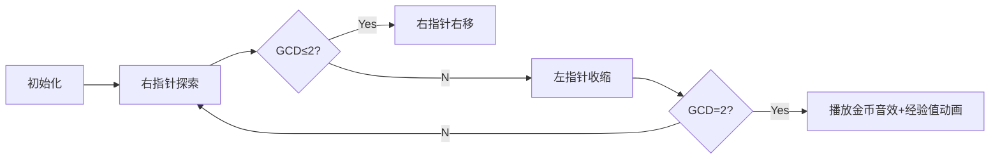

# 题目信息

# 「XSOI-R1」跳跃游戏

## 题目背景

本来可怜的 $\texttt{MhxMa}$ 想出这道题，但是已经被 $\texttt{Ferm\_Tawn}$ 抢了，此时 $\texttt{MhxMa}$ 坐在电脑面前，看着马上要造好的数据，想象着自己的题难倒一大片选手的梦想破灭了。

## 题目描述

这是一个跳跃游戏。在游戏中你可以跳到任意位置，其中有 $n$ 个点：$1 , 2 , 3, \cdots , n$，跳到那里会有奖励分数 $a_1 , a_2 , \cdots , a_n$。

显然，这个游戏很简单，$\texttt{MhxMa}$ 没过多久就获得了所有分数，于是改进了代码，添加了经验值这个参数。

对于有奖励分数的 $n$ 个点，若从点 $x$ 跳到点 $y$，会获得经验值 $\operatorname{score}_{x , y}(1\le x\le y\le n)$：

$$\operatorname{score}_{x,y}=\begin{cases}\operatorname{len}  & \operatorname{gcd}(a_x , a_{x+1} , \dots , a_y)=2 , \operatorname{len \ mod} 2 = 0  \\ \operatorname{len} &\gcd(a_x , a_{x + 1} , \dots , a_y)=3 , \operatorname{len \ mod} 2 = 1\\ 0 & \operatorname{others} \end{cases}$$

其中，$\operatorname {len}$ 表示区间的长度，即 $y-x+1$。

**对于每一对位置 $(x,y)$，多次跳跃只会获得一次经验值。**

为了向 $\texttt{MhxMa}$ 展现你的编程实力，你决定写一个代码算出这个游戏能刷到的最大经验值。

## 说明/提示

**请使用较快的读入方式。**

### 样例解释 #1

$\operatorname{score_{2 , 2}}= 1$。

$\operatorname{score_{2 , 4}}= 3$。

$\operatorname{score_{3 , 5}}= 3$。

$\operatorname{score_{4 , 4}}= 1$。

$1+3+3+1=8$。

### 样例解释 #2

$\operatorname{score_{1 , 2}}= 2$。

$\operatorname{score_{1 , 4}}= 4$。

$\operatorname{score_{2 , 3}}= 2$。

$\operatorname{score_{2 , 5}}= 4$。

$\operatorname{score_{3 , 4}}= 2$。

$\operatorname{score_{4 , 5}}= 2$。

$2+ 4 + 2 + 4 + 2 + 2 = 16$。

------------
### 数据规模与约定

**本题采用捆绑测试**。

- Subtask 0（20 pts）：$n \le 10^2$。 

- Subtask 1（10 pts）：$n \le 2 \times 10^3$。

- Subtask 2（20 pts）：$n \le 10^4$。

- Subtask 3（50 pts）：$n \le 6 \times 10^5 $。


对于所有测试数据，$1 \le n \le 6 \times 10^5$，$1 \le a_i \le 10^7$。

## 样例 #1

### 输入

```
5
2 3 6 3 9```

### 输出

```
8```

## 样例 #2

### 输入

```
5
2 2 2 2 2```

### 输出

```
16```

## 样例 #3

### 输入

```
9
6 2 3 6 4 6 8 2 5```

### 输出

```
19```

# AI分析结果


### 💡 Kay的C++算法解析：「XSOI-R1」跳跃游戏 深入学习指南 💡

**引言**  
今天我们来分析「跳跃游戏」这道C++编程题。本指南将帮助你理解区间GCD计算、双指针优化等核心算法，并通过像素动画直观展示算法执行过程。掌握这些技巧能大幅提升你处理区间类问题的能力！

---

### 1. 题目解读与核心算法识别  
✨ **本题主要考察**：`区间查询与枚举优化`（ST表 + 双指针/二分）  

🗣️ **初步分析**：  
> 本题如同在像素迷宫中寻找宝藏路径：  
> - **ST表**是快速计算区间GCD的"探照灯"（预处理O(nlogn)，查询O(1)）  
> - **双指针**像两位探险家协作扫描，利用GCD单调性高效定位有效区间  
> - **核心难点**：需同时满足GCD=2/3和区间长度奇偶性条件  
>  
> **可视化设计思路**：  
> - 用8-bit像素方块表示数组元素，双指针作为探险家角色移动  
> - 满足条件时触发"金币音效"并高亮区间，经验值累加动画  
> - 自动演示模式模拟AI闯关过程，每处理完左端点即完成一小关  

---

### 2. 精选优质题解参考  
**题解一：Ferm_Tawn（二分法）**  
* **点评**：  
  思路清晰展现二分查找合法区间的两阶段（先找上界再找下界），代码中`best`/`best2`变量名直观体现边界概念。亮点在于用等差数列求和公式高效计算贡献值，避免暴力枚举。但二分细节易出错（如区间奇偶处理），需仔细验证。

**题解二：Fated_Shadow（双指针法）**  
* **点评**：  
  创新性使用双指针维护GCD=2/3的滑动窗口，代码中`l`/`r`指针如同协作的探险队员。亮点在于$O(n)$时间复杂度优于二分法，且`f2()`/`f3()`函数封装等差数列计算，增强可读性。快读实现提升IO效率，适合竞赛场景。

**题解三：Inracle（二分+优化）**  
* **点评**：  
  在二分基础上添加范围优化（用前次结果缩小当前二分区间），代码中`r3=l2-1`体现优化思想。亮点在于算术变换处理奇偶区间（`l2&1`等判断），但实现复杂度略高于双指针法。

---

### 3. 核心难点辨析与解题策略  
1. **难点1：快速区间GCD查询**  
   * **分析**：ST表是核心工具，预处理时需注意：  
     ```cpp
     for(int j=1; j<=lg[n]; j++)  // 正确倍增维度
     for(int i=1; i+(1<<j)-1<=n; i++)
        st[i][j] = gcd(st[i][j-1], st[i+(1<<(j-1))][j-1]);
     ```
   * 💡 **学习笔记**：ST表适用所有可重复贡献问题（如RMQ）

2. **难点2：高效定位合法区间**  
   * **分析**：双指针法优于二分——右指针`r`探索边界，左指针`l`紧跟确保GCD单调性：
     ```cpp
     while(r < i && query(r+1, i) <= 2) r++;  // 右指针拓展
     while(l <= r && query(l, i) < 2) l++;    // 左指针收缩
     ```
   * 💡 **学习笔记**：固定右端点时，区间GCD值随左端点右移而单调不减

3. **难点3：奇偶区间贡献计算**  
   * **分析**：避免暴力累加！推导等差数列公式：  
     - 偶数区间：和 = (首项+末项)×项数/2  
     - 代码实现：`f2(x) = (x/2)*(x/2+1)`（题解二）

### ✨ 解题技巧总结
- **技巧1：ST表模板化**：预先写好ST表类（含Init/Query）
- **技巧2：双指针状态维护**：指针移动时实时更新GCD
- **技巧3：边界艺术**：`l≤r`循环条件优于`l<r`避免死循环
- **技巧4：算术优化**：位运算判断奇偶（`len&1`比`len%2`快）

---

### 4. C++核心代码实现赏析  
**通用核心实现（双指针法）**  
```cpp
#include<bits/stdc++.h>
using namespace std;
const int N=6e5+10;

int st[N][20], lg[N], a[N];

int query(int l, int r) {  // ST表查询
    int k = lg[r-l+1];
    return __gcd(st[l][k], st[r-(1<<k)+1][k]);
}

int main() {
    // ST表预处理（略）
    long long ans = 0;
    for(int i=1, l=1, r=1; i<=n; i++) {  // 双指针扫描
        while(r<i && query(r+1, i)<=2) r++;
        while(l<=r && query(l,i)<2) l++;
        if(query(r,i)==2) 
            ans += f2(i-l+1) - f2(i-r);  // 等差数列求和
    }
    cout << ans;
}
```
**代码解读概要**：  
> 1. ST表预处理实现快速GCD查询  
> 2. 双指针`l`/`r`维护当前右端点`i`的合法左边界  
> 3. `f2()`函数通过公式直接计算区间贡献值  

**题解二片段赏析（双指针）**  
```cpp
while(r < i && query(r+1, i) <= 2) r++;  // 拓展右边界
while(l <= r && query(l, i) < 2) l++;    // 收缩左边界
if(query(r,i)==2) 
    ans += f2(i-l+1) - f2(i-r);          // 公式计算
```
**代码解读**：  
> 右指针`r`探索最大边界（GCD≤2），左指针`l`定位精确边界（GCD≥2）。当`l`至`r`区间GCD恰好为2时，用`f2()`函数计算该窗口内所有偶长度区间贡献值，避免逐项累加。  
💡 **学习笔记**：双指针将$O(n^2)$优化至$O(n)$的关键在于单调性维护！

---

### 5. 算法可视化：像素动画演示  
**主题**：  
「像素探险家：GCD迷宫寻宝」复古8-bit风格  

**核心演示流程**：  


**交互设计细节**：  
1. **像素元素**：  
   - 数组值：不同颜色方块（红=奇数，蓝=偶数）  
   - 指针：像素小人（左指针戴蓝帽，右指针戴红帽）  
2. **动画特效**：  
   - 指针移动：脚印动画+脚步声效  
   - 找到合法区间：区间高亮闪烁，播放"叮！"音效  
   - 经验值累加：顶部经验条增长，显示`+X`数字动画  
3. **控制面板**：  
   - 速度滑块：调节AI演示速度（兔/龟图标）  
   - 模式切换：单步执行 vs 自动闯关  
4. **关卡设计**：  
   - 每完成一个左端点扫描即通关，显示＂关卡+1＂和庆祝像素烟花  

---

### 6. 拓展练习与相似问题  
**通用技巧迁移**：  
1. 区间最值问题（ST表应用）  
2. 满足单调性的区间计数（双指针）  
3. 带条件约束的区间和优化（数学公式替换暴力）  

**洛谷推荐**：  
1. **P3865 【模板】ST表**  
   🗣️ 巩固ST表实现，掌握区间查询核心模板  
2. **P1712 [NOI2016] 区间**  
   🗣️ 双指针经典应用，强化滑动窗口思维  
3. **P1890 gcd区间**  
   🗣️ 区间GCD变式训练，拓展解题视野  

---

### 7. 学习心得与经验分享  
> **来自Ferm_Tawn的调试经验**：  
> “二分查找时，发现GCD为3的倍数不等于GCD恰好为3，导致结果错误。通过添加`query()==3`精确判断解决。”  
>  
> **Kay点评**：  
> 这提醒我们：算法条件边界必须精确验证！建议用小数据手工模拟（如[6,6,3]），避免‘差不多’思维。

---

**结语**  
通过本次分析，相信大家已掌握ST表与双指针的协作艺术。记住：区间问题核心在于利用单调性减少枚举！多练习拓展题目，下次遇到类似问题你定能快速攻破。继续加油，编程探险家们！💪

---
处理用时：122.36秒