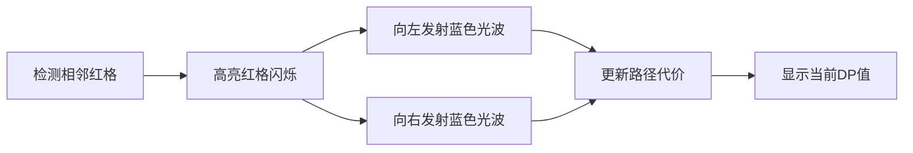

# 题目信息

# [AHOI2009] 跳棋

## 题目描述

在一个 $1$ 行 $N$ 列（$N$ 是奇数）的棋盘上，有 $K$ 个格子是红色的。这种情况下，你有一个跳棋在最左端的格子上。你的目标是将它移动到最右边的格子，在开始移动之间，你可以在棋盘的任意空位上放棋子。在游戏开始后 你只可以随时在一个红色格子上放棋子。棋子的移动规则是：每次只可以选择一个棋子，跳过与之相邻的棋子走到后面的空格上，被它跳过的棋子被吃掉，即从棋盘上移走，如相邻棋子的另一侧有棋子，则不能跳。


请回答以下两个问题：

1. 移动开始前至少要放多少棋子才能完成任务。
2. 如果要使开始前放的棋子数要求尽量少，那么在移动过程中最少需要放多少个棋子才能完成任务。


关于规则的补充说明：

1. 只能往空位上放棋子，不管是移动开始前还是移动过程中。
2. 移动前棋盘最左端的那个原始棋子绝对不能被吃掉。

## 说明/提示

在游戏开始前，可以在第二个格子上放上一个棋子，游戏开始后可用最左边的棋子吃掉它，从而移动到第三格。然后由于第四格是个红色的格子，在游戏中可以在那放一个棋子，然后用已经移动第三格的棋子把它吃掉，从而达到终点。

$100\%$ 的数据中，$1\le N\le  1000$，输出中的数字不超过 $10^ {15}$。

$30\%$ 的数据中，$N\le 20$。


Source: [Ahoi2009] checker

## 样例 #1

### 输入

```
5
0 0 0 1 0

```

### 输出

```
1
1```

# AI分析结果


### 💡 Kay的C++算法解析：跳棋 深入学习指南 💡

**引言**  
今天我们一起分析「跳棋」这道C++编程题。本指南将梳理题目思路、核心算法和解题技巧，通过像素动画帮助大家直观理解算法过程。

---

## 1. 题目解读与核心算法识别

✨ **本题主要考察**：`动态规划` + `问题分解`  

🗣️ **初步分析**  
> 跳棋问题可比喻为“搭桥过河”：在红色格子上放棋子如同临时搭桥，目标是用最少桥梁让棋子跳到终点。核心技巧是分情况处理：
> - **无相邻红格**：直接统计偶数位置需预放的棋子（白格）和游戏中放的棋子（红格）
> - **有相邻红格**：用动态规划计算最小代价，类似斐波那契数列的搭桥方式
> 
> **可视化设计**：  
> 将用8位像素风格展示棋盘（红格=岩浆，白格=草地）。当检测相邻红格时触发“桥梁扩展”动画——高亮红格闪烁，向左/右延伸蓝色光波更新路径代价，伴随“叮”音效。支持单步调试和自动演示模式，过关时播放胜利音效。

---

## 2. 精选优质题解参考

**题解一（作者：long_int）**  
* **点评**：思路最完整清晰！分情况讨论的框架极具教学价值：  
  - 用`flag`标记相邻红格，逻辑直白（`if(q[i]&&q[i-1])`）  
  - DP初始化巧妙：红格代价=1，白格=∞  
  - 状态转移时双向扩展（左跳/右跳）覆盖全棋盘  
  - 实践性强：处理起点红格无效化(`q[1]=0`)，用`LLONG_MAX`防溢出  
  > 💡 **亮点**：边界处理严谨，完整推导DP转移方程  

**题解二（作者：Sooke）**  
* **点评**：代码简洁高效，突出算法本质：  
  - 用`std::min`替代手写函数，增强可读性  
  - 状态转移集中处理相邻红格，逻辑紧凑  
  - 答案累加时直接过滤无效值(`f[i]<inf`)  
  > 💡 **亮点**：工业级代码规范，适合竞赛参考  

**题解三（作者：AzusaShirasu）**  
* **点评**：图文并茂的教学典范！  
  - 用棋盘图示类比跳棋过程（如`1→3→5`路径）  
  - 详解“为何相邻红格可省去预放棋子”  
  - 状态方程`f[i]=min(f[i-1]+f[i-2],f[i+1]+f[i+2])`推导直观  
  > 💡 **亮点**：可视化思维助力理解抽象DP  

---

## 3. 核心难点辨析与解题策略

1. **难点1：状态定义抽象**  
   * **分析**：`dp[i]`表示在位置`i`获得棋子的最小代价。关键要理解：  
     - 红格初始代价=1（可直接放置）  
     - 白格代价=∞（需从红格扩展）  
   * 💡 **学习笔记**：好的状态定义是DP解题的基石

2. **难点2：转移方程推导**  
   * **分析**：从相邻红格触发双向扩展：  
     - **向左跳**：`dp[j]=min(dp[j], dp[j+1]+dp[j+2])`  
     - **向右跳**：`dp[j]=min(dp[j], dp[j-1]+dp[j-2])`  
   * 💡 **学习笔记**：转移方程体现“用已知位置搭桥”的递推思想

3. **难点3：分情况处理**  
   * **分析**：无相邻红格时直接计数；有相邻红格时DP扩展。需注意：  
     - 起点红格无效化(`q[1]=0`)  
     - 偶数位置才计入答案  
   * 💡 **学习笔记**：复杂问题分解是降低难度的钥匙

### ✨ 解题技巧总结
- **分治法**：拆解为“有无相邻红格”两种独立场景
- **逆向思维**：从相邻红格反向扩展路径，避免盲目搜索
- **边界防御**：起点特殊处理，`LLONG_MAX`防溢出
- **状态压缩**：用一维DP覆盖棋盘所有位置

---

## 4. C++核心代码实现赏析

**通用核心实现参考**  
```cpp
#include <iostream>
#include <vector>
#include <climits>
using namespace std;

int main() {
    long long n, white = 0, red = 0;
    cin >> n;
    vector<long> q(n+1), dp(n+1, LONG_MAX);
    bool hasAdjRed = false;

    for (int i=1; i<=n; i++) {
        cin >> q[i];
        if(i==1) q[i]=0;  // 起点红格无效化
        else if(i%2==0) q[i] ? red++ : white++;
        if(i>1 && q[i] && q[i-1]) hasAdjRed = true;
    }

    if(!hasAdjRed) {  // 情况1：无相邻红格
        cout << white << '\n' << red;
        return 0;
    }

    for(int i=1; i<=n; i++)  // 初始化DP
        if(q[i]) dp[i] = 1;

    for(int i=2; i<=n; i++) {  // 情况2：DP扩展
        if(q[i] && q[i-1]) {
            for(int j=i-2; j>=1; j--)  // 向左跳
                if(dp[j+1]!=LONG_MAX && dp[j+2]!=LONG_MAX)
                    dp[j] = min(dp[j], dp[j+1]+dp[j+2]);
            for(int j=i+1; j<=n; j++)  // 向右跳
                if(dp[j-1]!=LONG_MAX && dp[j-2]!=LONG_MAX)
                    dp[j] = min(dp[j], dp[j-1]+dp[j-2]);
        }
    }

    long long ans = 0;
    for(int i=2; i<=n; i+=2)  // 累加偶数位置
        if(dp[i] != LONG_MAX) ans += dp[i];
    
    cout << "0\n" << ans;  // 第一问为0
}
```

**代码解读概要**  
> 1. 读入时处理起点红格无效化  
> 2. 分情况处理：无相邻红格直接计数；有则初始化DP  
> 3. 遇到相邻红格时触发双向状态转移  
> 4. 累加偶数位置有效DP值作为答案  

---

## 5. 算法可视化：像素动画演示

  
* **主题**：8位像素风《跳棋大冒险》  
* **核心演示**：DP状态转移的双向扩展过程  

### 动画设计


1. **像素化棋盘**：
   - 红格=岩浆块（红色像素）｜白格=草地（绿色像素）
   - 棋子=像素小人｜路径=发光蓝线

2. **交互控制**：
   - 单步执行：按→键逐步演示扩展
   - 自动模式：调速滑块控制速度
   - 音效设计：
     * 红格触发：8-bit“滴”声
     * 路径更新：电子合成音效
     * 过关：经典马里奥胜利曲

3. **动态演示**：
   - 初始棋盘显示红白格分布
   - 检测相邻红格时触发爆炸特效
   - 向左/右扩展时显示光波动画
   - 每个位置更新时显示`dp[i]`数值
   - 最终答案用金色像素字体弹出

---

## 6. 拓展练习与相似问题思考

1. **通用技巧迁移**：
   - 相邻触发扩展：用于连通块问题
   - 代价累加DP：解决最优路径问题
   - 分情况处理：应对多状态决策

2. **洛谷推荐**：
   - [P1095 逃离幻境](https://www.luogu.com.cn/problem/P1095)  
     > 💡 巩固状态压缩DP
   - [P1052 过河](https://www.luogu.com.cn/problem/P1052)  
     > 💡 练习路径压缩+DP优化
   - [P1004 方格取数](https://www.luogu.com.cn/problem/P1004)  
     > 💡 学习双线程DP决策

---

## 7. 学习心得与经验分享
> **经验摘录**（来自 long_int）：  
> “初始化时白格设为`1e18`而非`1e9`，因`n=1000`时最大代价≈斐波那契(500)远超1e9”  
>   
> **Kay点评**：  
> 数值边界是竞赛常见陷阱！建议：  
> 1. 分析最坏情况复杂度  
> 2. 用`LLONG_MAX`代替魔数  
> 3. 测试极限数据（如全红格）

---

**结语**  
通过分治策略和动态规划，跳棋问题展示了如何将复杂规则转化为清晰算法。记住：好解法=准确状态定义+严谨转移推导+周全边界处理。下次挑战见！🚀

---
处理用时：179.64秒