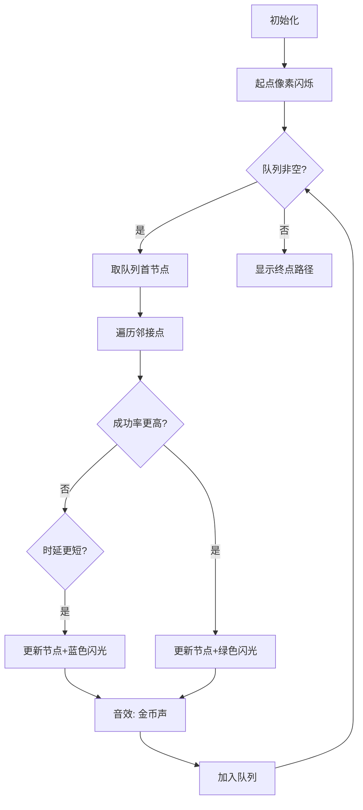

# 题目信息

# [HNOI2002] 高质量的数据传输

## 题目描述

$%原题面是：$

目前的网络为了支持各种 QoS 需求，在进行路由选择时所考虑的路由参数主要有网络路径中的参数如时延、网络带宽、时延抖动及丢失率等参数，在某种高质量的数据传输工程中仅考虑网络的时延和丢失率两个参数。

网络可以用一个简单无向图 $G = (V, E)$ 来表示，$V$ 是网络中结点的集合，$E$ 是两个结点之间的链路，即边。依据工程的要求，每条边上有两个参数：时延和丢失率。

* 边上的时延 $t$ 是数据从该边的一个端点传输到另一个端点所需要的时间，取为整数，单位是毫秒，$0 \le t \le 100$。
* 一条边的丢失率 $p$ 是数据从该边的一个端点传输到另一个端点后丢失数据的百分比，$0 \le p \le 0.1$。

所谓网络 $G$ 上的路由选择是：给定 $G$ 中的两个结点 $u$ 和 $v$，找出这两个结点之间的一条路径。

---

对于网络 $G$ 的一条路径 $P = v_1, v_2, v_3, \dots, v_n$，假设该路径上各边的时延和丢失率分别是：

$$
t_1, t_2, t_3, \dots, t_{n-1}, \quad p_1, p_2, p_3, \dots, p_{n-1}
$$

则数据从 $v_1$ 传输到 $v_n$ 的时延是：

$$
\sum_{i=1}^{n-1} t_i
$$

丢失率是：

$$
1 - \prod_{i=1}^{n-1} (1 - p_i)
$$

---

本题的高质量数据传输要求：如果数据要从一个结点 $u$ 传输到另一个结点 $v$，则所传输路径的丢失率是从 $u$ 到 $v$ 的所有路径中最小的，而且在该前提下时延最小。

请为网络图给定的两个结点，找出满足高质量数据传输要求的路径。

## 样例 #1

### 输入

```
3 1 3                       
0 1 5
1 0 2
5 2 0
0 0.1 0.05
0.1 0 0.05
0.05 0.05 0```

### 输出

```
5 0.0500```

# AI分析结果


### 💡 Kay的C++算法解析：[HNOI2002]高质量的数据传输入门指南 💡
> 本指南将带大家深入理解双关键字最短路问题，掌握SPFA算法的精妙实现，并通过像素动画直观感受算法流程！

---

## 1. 题目解读与核心算法识别
✨ **本题主要考察**：`图论 - 双关键字最短路优化`

🗣️ **初步分析**：
> 本题可类比为"像素游戏中的最优路径选择"：想象你在复古游戏中操控角色，需同时避开高丢包率（陷阱）和长延时（耗时操作）。核心是将最小化丢包率转化为**最大化传输成功率（1-丢包率）**，形成乘积最长路问题。时延作为次要关键字需在成功率相同时最小化。

- **核心难点**：双关键字优先级处理（成功率>时延）、浮点数精度控制、图存储优化
- **算法流程**：SPFA动态更新节点状态，优先比较成功率（乘积），次优比较时延（累加）
- **可视化设计**：用8-bit像素网格表示网络节点，角色沿边移动时显示成功率/时延数值变化。关键操作（入队/更新）配NES风格音效，成功路径点亮为金色。

---

## 2. 精选优质题解参考
**题解一（licn）**
* **亮点**：  
  1. 链式前向星存储提升效率  
  2. 用`ans1[]`记录成功率避免精度损失  
  3. 明确处理丢包率为0的边界情况  
  4. 队列优化避免重复入队

**题解二（KagurazakaLorna）**
* **亮点**：  
  1. 邻接矩阵实现简洁直观  
  2. `set`辅助快速查询节点状态  
  3. 双条件分支清晰体现关键字优先级  
  4. 标准化输入输出加速

**题解三（chichichichi）**
* **亮点**：  
  1. 数学视角转换（丢包率→成功率）  
  2. 严格处理浮点数精度（EPS=1e-6）  
  3. 详细推导乘积最长路理论  
  4. 模块化代码结构增强可读性

---

## 3. 核心难点辨析与解题策略
1. **关键字优先级处理**  
   *分析*：必须确保成功率优先于时延。优质解法在SPFA松弛时先比较成功率乘积，仅在成功率相等时更新时延  
   💡 **学习笔记**：双关键字问题需严格定义比较逻辑层次

2. **浮点数精度控制**  
   *分析*：成功率连续相乘导致精度下降。通用方案：  
   - 使用`double/long double`存储  
   - 比较时用`fabs(a-b)<EPS`替代`==`  
   - 避免不必要的浮点运算  
   💡 **学习笔记**：浮点比较必须设置误差容忍度

3. **图存储优化选择**  
   *分析*：邻接矩阵（n≤200时）VS链式前向星：  
   | 方式 | 适用场景 | 优点 |  
   |---|---|---|  
   | 邻接矩阵 | 稠密图/小图 | 访问快/实现简 |  
   | 链式前向星 | 稀疏图/大图 | 省内存/遍历快 |  
   💡 **学习笔记**：根据图密度选择存储结构提升效率

### ✨ 解题技巧总结
- **数学转换技巧**：将最小化丢包率→最大化成功率（1-丢包率）
- **状态设计范式**：`success_rate[u]`与`delay[u]`同步维护
- **边界防御编程**：显式处理-1（无边）和0（零丢包）特例
- **SPFA优化实践**：用`in_queue[]`标记减少冗余入队

---

## 4. C++核心代码实现赏析
**通用核心实现参考**
```cpp
#include <bits/stdc++.h>
using namespace std;
const int N = 210;
const double EPS = 1e-6;

int n, start, end;
int delay[N][N];
double loss[N][N], success[N];
int total_delay[N];
bool in_queue[N];

void spfa() {
    queue<int> q;
    fill(success, success+N, -1.0);
    fill(total_delay, total_delay+N, INT_MAX);
    
    success[start] = 1.0;
    total_delay[start] = 0;
    q.push(start);
    in_queue[start] = true;

    while (!q.empty()) {
        int u = q.front(); q.pop();
        in_queue[u] = false;
        
        for (int v = 1; v <= n; ++v) {
            if (u == v || delay[u][v] == -1) continue;
            
            double new_success = success[u] * (1 - loss[u][v]);
            int new_delay = total_delay[u] + delay[u][v];
            
            // 第一关键字优先比较
            if (new_success - success[v] > EPS) {
                success[v] = new_success;
                total_delay[v] = new_delay;
                if (!in_queue[v]) {
                    q.push(v);
                    in_queue[v] = true;
                }
            }
            // 第二关键字比较
            else if (fabs(new_success - success[v]) < EPS && 
                     new_delay < total_delay[v]) {
                total_delay[v] = new_delay;
                if (!in_queue[v]) {
                    q.push(v);
                    in_queue[v] = true;
                }
            }
        }
    }
}
```

---

## 5. 算法可视化：像素动画演示
**设计核心**：  
以《塞尔达传说》复古风格呈现SPFA探索过程，角色在8-bit网格地图中寻找最优路径

**关键交互设计**：


**实现细节**：
1. **节点可视化**：
   - 红色像素块：当前处理节点
   - 绿色边框：成功入队节点
   - 金色路径：最终最优路径

2. **动态数据展示**：
   ```python
   # 伪代码：节点状态更新动画
   def update_node_animation(node):
       play_sound("blip.wav")  # 8-bit音效
       set_pixel_color(node, GOLD if update_success else GREEN)
       display_text(f"成功率: {success[node]:.4f}\n时延: {delay[node]}")
   ```

3. **控制面板**：
   - 速度滑块：调节SPFA执行速度
   - 单步模式：空格键控制每一步
   - 路径对比：同时显示多种算法路径

---

## 6. 拓展练习与相似问题
**通用技巧迁移**：
1. 代价-收益双优化（如：P1462 通往奥格瑞玛的道路）
2. 概率图最优路径（如：P1576 最小花费）
3. 多约束路径规划（如：P2149 安全出行）

**洛谷推荐**：
1. **P1576** 最小花费  
   → 同类成功率最大化问题
2. **P1462** 通往奥格瑞玛的道路  
   → 双关键字（血量/费用）决策
3. **P2149** 安全出行  
   → 多约束条件的最短路

---

## 7. 学习心得与经验分享
> **licn的调试经验**：  
> *"切记：丢包率可能是0，存图时注意不要特判为0时不存"*  
>   
> **Kay点评**：这是典型的边界陷阱！编程中要特别注意：  
> - 0是有效数值 ≠ 无连接（-1）  
> - 浮点数0需用`loss> -EPS`判断而非`loss==0`  
> 建议使用`const double ZERO_EPS = 1e-8`统一处理

---

> 掌握双关键字最短路的核心在于**优先级分层处理**和**数学转换思维**。通过本指南的像素动画演示，相信大家能直观理解SPFA的动态更新过程。记住：在算法世界中，清晰的优先级定义如同游戏中的任务指引，能带领你高效通关！🎮

---
处理用时：124.62秒