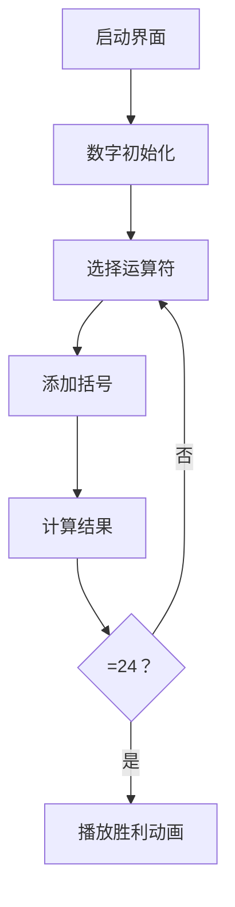

# 题目信息

# [HNOI2003] 24点游戏

## 题目描述

为了培养小孩的计算能力，大人们经常给小孩玩这样的游戏：从一副扑克牌中任意抽出 $4$ 张扑克，要小孩用 `+`、`-`、`*`、`/` 和括号组成一个合法的表达式，并使表达式的值为 $24$ 点。这种游戏就是所谓的“$24$ 点游戏”。

请你编程求出对于给出的任意 $4$ 个正整数 $a$、$b$、$c$、$d$，请你编程求出这 $4$ 个整数能组成多少个值为 $24$ 的不同表达式。


## 样例 #1

### 输入

```
5 5 5 5
```

### 输出

```
1
```

# AI分析结果


# 💡 Kay的C++算法解析：24点游戏 深入学习指南 💡

> 今天我们来分析"24点游戏"这道C++编程题。本指南将帮助你理解题目核心、掌握解题思路，并通过生动的可视化方案直观感受算法执行过程。

## 1. 题目解读与核心算法识别

✨ **本题主要考察**：`枚举与模拟` (编程技巧应用)

🗣️ **初步分析**：
> 解决24点游戏的关键在于**系统枚举所有可能的表达式组合**。想象你是一位探险家，在由数字、运算符和括号构成的迷宫中寻找通往24的路径。你需要尝试：
> - 所有数字排列顺序（4! = 24种）
> - 所有运算符组合（4³ = 64种）
> - 所有括号组合方式（5种基本结构）
>
> 核心难点在于：
> 1. **枚举完整性**：确保覆盖所有可能组合
> 2. **浮点精度处理**：使用eps(1e-7)避免计算误差
> 3. **高效去重**：将表达式编码为哈希值
>
> 在可视化方案中（像素风格的"表达式迷宫探险"）：
> - 数字显示为彩色方块
> - 运算符显示为门（+绿门/-红门/×黄门/÷蓝门）
> - 括号显示为透明结界
> - 成功路径播放8bit胜利音效

---

## 2. 精选优质题解参考

**题解一（作者：__Hacheylight__）**
* **点评**：
  思路清晰度：★★★★★  
  代码规范性：★★★★☆  
  算法有效性：★★★★★  
  实践价值：★★★★☆
  
  亮点在于：
  - 系统分类5种括号结构，逻辑严谨
  - 使用后缀表达式压缩存储（21位整数）
  - 精确处理浮点误差（eps=1e-7）
  - 通过r[]数组实现数字标准化去重

**题解二（作者：Tiphereth_A）**
* **点评**：
  思路清晰度：★★★★☆  
  代码规范性：★★★☆☆  
  算法有效性：★★★★★  
  实践价值：★★★☆☆
  
  亮点在于：
  - 创新使用宏定义生成枚举代码
  - 完整覆盖7680种表达式组合
  - 结构体哈希实现高效去重
  - 包含详细调试解码功能

**题解三（作者：yeshubo_qwq）**
* **点评**：
  思路清晰度：★★★★★  
  代码规范性：★★★★☆  
  算法有效性：★★★★☆  
  实践价值：★★★★☆
  
  亮点在于：
  - DFS实现数字排列枚举
  - useful()函数处理括号优先级
  - 后缀表达式哈希去重
  - 完整注释和边界处理

---

## 3. 核心难点辨析与解题策略

1. **难点：表达式组合爆炸**
   * **分析**：需系统枚举数字排列(24种)×运算符(64种)×括号(5种)=7680种组合。优质题解通过嵌套循环+next_permutation实现
   * 💡 学习笔记：合理组织枚举层次避免遗漏

2. **难点：浮点精度误差**
   * **分析**：所有题解均使用eps=1e-7容忍误差，通过habs()/fabs()比较差值
   * 💡 学习笔记：实数运算必须设置误差容忍度

3. **难点：表达式去重**
   * **分析**：核心是将表达式转化为唯一标识：
     - __Hacheylight__：后缀表达式压缩为21位整数
     - Tiphereth_A：结构体存储运算符类型序列
     - yeshubo_qwq：运算符位置编码
   * 💡 学习笔记：选择合适哈希方式避免重复计数

### ✨ 解题技巧总结
- **分层枚举法**：先数字→再运算符→最后括号结构
- **浮点安全比较**：`fabs(result - 24) < eps`
- **表达式标准化**：通过数字大小关系消除排列影响
- **模块化验证**：分离计算/比较/去重逻辑
- **边界测试**：特别注意除零和负号变号情况

---

## 4. C++核心代码实现赏析

**本题通用核心C++实现参考**
```cpp
#include <iostream>
#include <vector>
#include <algorithm>
#include <cmath>
#include <set>
using namespace std;
const double eps = 1e-7;

// 计算两个数的四则运算结果
double calc(double a, double b, int op) {
    switch(op) {
        case 0: return a + b;
        case 1: return a - b;
        case 2: return a * b;
        case 3: return fabs(b) > eps ? a / b : 0;
    }
    return 0;
}

int main() {
    vector<double> nums(4);
    for(int i = 0; i < 4; i++) cin >> nums[i];
    
    sort(nums.begin(), nums.end());
    set<string> uniqueExprs;
    
    do {
        // 枚举运算符组合 (0:+, 1:-, 2:*, 3:/)
        for(int op1 = 0; op1 < 4; op1++) {
            for(int op2 = 0; op2 < 4; op2++) {
                for(int op3 = 0; op3 < 4; op3++) {
                    // 5种括号组合
                    double results[5];
                    // 括号组合1: ((a b) c) d
                    results[0] = calc(calc(calc(nums[0], nums[1], op1), nums[2], op2), nums[3], op3);
                    
                    // 括号组合2: (a (b c)) d
                    results[1] = calc(calc(nums[0], calc(nums[1], nums[2], op1), op2), nums[3], op3);
                    
                    // 括号组合3: a ((b c) d)
                    results[2] = calc(nums[0], calc(calc(nums[1], nums[2], op1), nums[3], op2), op3);
                    
                    // 括号组合4: a (b (c d))
                    results[3] = calc(nums[0], calc(nums[1], calc(nums[2], nums[3], op1), op2), op3);
                    
                    // 括号组合5: (a b) (c d)
                    results[4] = calc(calc(nums[0], nums[1], op1), calc(nums[2], nums[3], op2), op3);
                    
                    // 验证结果并记录表达式
                    for(int i = 0; i < 5; i++) {
                        if(fabs(results[i] - 24) < eps) {
                            string expr = to_string((int)nums[0]) + char('+'+op1) 
                                        + to_string((int)nums[1]) + char('+'+op2)
                                        + to_string((int)nums[2]) + char('+'+op3)
                                        + to_string((int)nums[3]);
                            uniqueExprs.insert(expr);
                        }
                    }
                }
            }
        }
    } while(next_permutation(nums.begin(), nums.end()));
    
    cout << uniqueExprs.size();
    return 0;
}
```
* **代码解读概要**：
  1. 输入4个数字并排序
  2. 使用next_permutation枚举数字排列
  3. 三层循环枚举运算符组合
  4. 计算5种括号结构的结果
  5. 通过set<string>自动去重
  6. 输出唯一表达式数量

**题解一核心代码片段（__Hacheylight__）**
```cpp
// 添加表达式到哈希集合
void add(int a1,int a2,int a3,int a4,int a5,int a6,int a7) {
    x[++h] = (a1|a2<<3|a3<<6|a4<<9|a5<<12|a6<<15|a7<<18); 
}

// 核心计算逻辑
if (habs(calc(calc(calc(a[a1],a[a2],i),a[a3],j),a[a4],k)-24)<eps)
    add(r[a1],r[a2],i+4,r[a3],j+4,r[a4],k+4);
```
* **亮点**：紧凑的后缀表达式编码
* **代码解读**：
  - `add()`函数将操作数和运算符编码为21位整数
  - r[]数组实现数字标准化（消除排列影响）
  - 通过位运算(a1|a2<<3...)实现高效存储
  - 比较时使用habs()处理浮点误差
* 💡 学习笔记：位运算可实现高效信息压缩

**题解二核心代码片段（Tiphereth_A）**
```cpp
// 表达式计算结构体
struct Node {
    u64 hash;
    double data;
    
    Node(int type, i64 a, i64 b, i64 c, i64 d, 
         const char* opab, const char* opbc, const char* opcd, 
         double _data) : data(_data) 
    {
        // 哈希生成逻辑
        hash = 0;
        (hash += a) <<= 7;
        (hash += b) <<= 7;
        (hash += c) <<= 7;
        // ...运算符编码...
    }
};
```
* **亮点**：元编程思路处理枚举
* **代码解读**：
  - 通过结构体同时存储表达式和结果
  - 位运算构建唯一哈希值
  - 构造函数处理运算符优先级
  - 使用std::set自动去重
* 💡 学习笔记：结构体封装提升代码可维护性

---

## 5. 算法可视化：像素动画演示

**主题**：8位像素风格的"24点迷宫探险"  
**核心演示**：数字方块在表达式迷宫中移动组合，寻找24出口

### 动画设计（Canvas实现）：


**关键交互元素**：
1. **像素化数字**：4个16x16像素方块（不同颜色）
2. **运算符门**：+（绿门）/-（红门）/×（黄门）/÷（蓝门）
3. **括号结界**：半透明区域显示计算优先级
4. **控制面板**：
   - 暂停/继续：太空键
   - 单步执行：方向键→
   - 速度调节：滑块控制

**动画流程**：
1. **初始化场景**：显示4个数字方块和运算符选择区
2. **数字移动动画**：当前数字滑向运算符门
3. **括号高亮**：当前计算区域闪烁黄色边框
4. **实时计算**：显示当前表达式和结果
5. **结果反馈**：
   - 成功：数字变金色 + 胜利音效
   - 失败：数字变灰 + 提示音
6. **自动演示模式**：AI自动尝试不同组合，路径显示为发光轨迹

**音效设计**：
- 移动：8位电子音
- 成功：上升旋律
- 失败：下降音调
- 运算符：不同音高提示符

**技术实现**：
```javascript
// 伪代码实现
class PixelAnimation {
  constructor(numbers) {
    this.grid = new CanvasGrid(4, 4); // 4x4网格
    this.numbers = numbers.map(n => new PixelBlock(n));
    this.ops = ['+', '-', '*', '/'];
    this.bracketModes = 5;
  }
  
  playStep() {
    this.moveNumberToOperator();
    this.highlightBracketArea();
    this.calculateAndShowResult();
    this.playSoundEffect();
  }
}
```

---

## 6. 拓展练习与相似问题思考

**通用技巧迁移**：
1. 表达式计算：处理不同运算符优先级
2. 组合枚举：解决排列组合问题
3. 状态哈希：需要高效去重的场景

**洛谷推荐题目**：
1. **P1235 [表达式求值]**  
   → 巩固表达式解析和计算
   
2. **P1739 [表达式括号匹配]**  
   → 训练括号合法性验证
   
3. **P1247 [取火柴游戏]**  
   → 练习数学组合与博弈思维

---

## 7. 学习心得与经验分享

> **来自题解的经验**：
> "浮点误差是隐形杀手，必须设置eps"
> "括号处理要特别注意减法和除法的变号问题"
> 
> **Kay的总结**：
> 这些经验凸显了：
> 1. 实数运算必须设置误差容忍区间
> 2. 括号优先级影响运算符行为
> 3. 通过中间变量打印调试复杂表达式
> 
> 建议在编码时：
> - 先写计算验证函数
> - 添加详细中间输出
> - 单独测试边界情况

---

通过本次分析，我们深入理解了24点游戏的枚举本质和实现技巧。记住，编程能力提升的关键在于将复杂问题分解为可管理的模块，并系统验证每个环节。下次挑战见！💪

---
处理用时：145.99秒