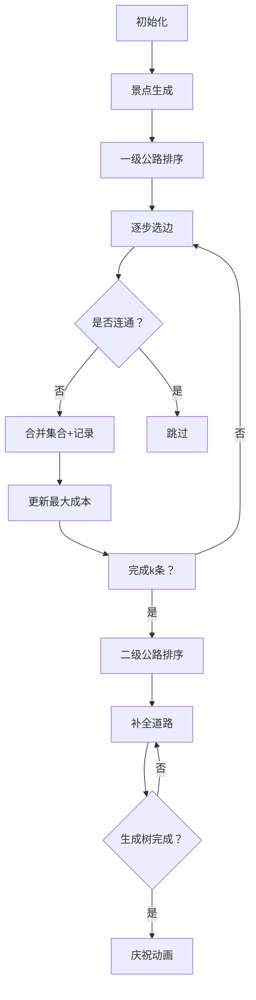

# 题目信息

# [HNOI2006] 公路修建问题

## 题目描述

OI island 是一个非常漂亮的岛屿，自开发以来，到这儿来旅游的人很多。然而，由于该岛屿刚刚开发不久，所以那里的交通情况还是很糟糕。所以，OIER Association组织成立了，旨在建立 OI island 的交通系统。

OI island 有 $n$ 个旅游景点，不妨将它们从 $1$ 到 $n$ 标号。现在，OIER Association 需要修公路将这些景点连接起来。一条公路连接两个景点。公路有两种类型，不妨称它们为一级公路和二级公路。一级公路上的车速快，但是修路的花费要大一些。

OIER Association 打算修 $n-1$ 条公路将这些景点连接起来（使得任意两个景点之间都会有一条路径）。为了保证公路系统的效率, OIER Association 希望在这 $n-1$ 条公路之中,至少有 $k(0\le k\le n-1)$ 条一级公路。OIER Association 也不希望为一条公路花费太多的钱。所以，他们希望在满足上述条件的情况下，花费最多的一条公路的花费尽可能的少。而你的任务就是，在给定一些可能修建的公路的情况下，选择 $n-1$ 条公路，满足上面的条件。

## 样例 #1

### 输入

```
4 2 5 
1 2 6 5
1 3 3 1
2 3 9 4
2 4 6 1```

### 输出

```
6 
1 1 
2 1 
4 1```

# AI分析结果


# 💡 Kay的C++算法解析：公路修建问题 深入学习指南 💡

## 1. 题目解读与核心算法识别

✨ **本题主要考察**：`图论` (最小生成树变种) + `贪心` + `二分答案`

🗣️ **初步分析**：
> 解决公路修建问题就像在建设城市道路网络时控制最高成本。核心思路是**用最小生成树连接所有景点**，同时满足至少k条一级公路的要求。这就像先修建必要的高速公路（一级公路），再用普通公路（二级公路）补全网络，同时控制最贵道路的成本。

- **主要解法**：主流解法是两次Kruskal贪心（先选k条一级公路，再补全二级公路）或二分答案验证。两种方法都基于贪心思想：优先选择成本低的道路。
- **核心难点**：确保一级公路数量达标的同时，控制最大边权最小化。关键在于分阶段处理边权，并合理使用并查集管理连通性。
- **可视化设计**：在像素动画中，景点显示为彩色方块（不同颜色代表不同集合），边按成本排序后逐个评估。选中边时高亮显示，合并集合时播放音效，一级公路用红色，二级用蓝色。最大成本实时显示在屏幕顶部。
- **复古游戏化**：采用8-bit像素风格，控制面板支持单步/自动模式。关键操作配复古音效（选择边时"叮"声，合并集合时"咔嚓"声），完成时播放胜利音乐。算法执行过程像游戏闯关，每连接一个区域就解锁新关卡。

---

## 2. 精选优质题解参考

**题解一：旅人杜 (30赞)**
* **点评**：思路清晰直白，将问题分解为两个明确的Kruskal阶段。代码规范（如`book`数组避免重复选边），变量名`minn`准确记录最大花费。算法效率高（O(mlogm)），边界处理严谨。亮点在于指出测试数据可能存在的局限，并启发思考更优的贪心策略。

**题解二：pengyule (13赞)**
* **点评**：同时提供Kruskal和二分答案两种解法，对比分析透彻。代码结构工整（使用`vector`存储结果），实践价值高。亮点在于复杂度分析和多解法比较，帮助学习者理解不同场景下的最优选择。

**题解三：一扶苏一 (9赞)**
* **点评**：理论分析深入，从最小生成树性质推导算法正确性。代码中并查集实现规范，注释详细。亮点在于提出优化二分答案的方法（消除log因子），并强调"短边优先"的核心思想。

---

## 3. 核心难点辨析与解题策略

1. **确保k条一级公路**  
   *分析*：先对一级公路成本排序，用并查集选取前k条不构成环的边。优质题解普遍在合并后立即记录边类型和最大成本。
   *💡 学习笔记*：分阶段处理约束条件——先满足数量要求再优化成本。

2. **控制最大花费最小化**  
   *分析*：通过两次排序（先c1后c2）保证每次选择当前最小成本边。二分答案解法中通过`check(mid)`函数验证成本上限可行性。
   *💡 学习笔记*：贪心策略中"短边优先"是控制最大成本的核心。

3. **处理双权值边的选择**  
   *分析*：同一条边有c1/c2两个权值。在Kruskal解法中分别按需排序；二分答案中将权值统一在mid限制下判断。
   *💡 学习笔记*：将复杂约束分解为独立子问题（先处理一级公路，再处理二级）。

### ✨ 解题技巧总结
- **分层贪心**：对多约束问题分阶段处理（如先满足k条边要求）
- **并查集优化**：路径压缩提升连通判断效率
- **边界处理**：注意m-1条边的输入特性和集合合并终止条件
- **二分答案转化**：将"最大花费最小化"转化为判定问题

---

## 4. C++核心代码实现赏析

**本题通用核心C++实现参考**
```cpp
#include <iostream>
#include <algorithm>
#include <vector>
using namespace std;

struct Edge { int u, v, c1, c2, id; };

int main() {
    int n, k, m, maxCost = 0;
    cin >> n >> k >> m;
    vector<Edge> edges(m-1);
    vector<int> parent(n+1);
    vector<pair<int, int>> result;
    
    // 输入处理
    for(int i=0; i<m-1; i++) {
        cin >> edges[i].u >> edges[i].v >> edges[i].c1 >> edges[i].c2;
        edges[i].id = i+1;
        parent[i] = i;
    }
    
    // 第一次排序：按一级公路成本
    sort(edges.begin(), edges.end(), [](auto& a, auto& b){ 
        return a.c1 < b.c1; 
    });
    
    // 选k条一级公路
    for(int i=0, cnt=0; cnt<k && i<edges.size(); i++) {
        int ru = parent[edges[i].u], rv = parent[edges[i].v];
        if(ru != rv) {
            parent[rv] = ru;
            result.push_back({edges[i].id, 1});
            maxCost = max(maxCost, edges[i].c1);
            cnt++;
        }
    }
    
    // 第二次排序：按二级公路成本
    sort(edges.begin(), edges.end(), [](auto& a, auto& b){ 
        return a.c2 < b.c2; 
    });
    
    // 补全生成树
    for(auto& e : edges) {
        if(result.size() == n-1) break;
        int ru = parent[e.u], rv = parent[e.v];
        if(ru != rv) {
            parent[rv] = ru;
            result.push_back({e.id, e.c1 <= e.c2 ? 1 : 2});
            maxCost = max(maxCost, e.c1 <= e.c2 ? e.c1 : e.c2);
        }
    }
    
    // 输出结果
    cout << maxCost << endl;
    sort(result.begin(), result.end());
    for(auto& r : result) 
        cout << r.first << " " << r.second << endl;
}
```

**代码解读概要**：
1. 结构体`Edge`封装边的双权值和原始编号
2. 第一阶段按c1排序选k条边，用并查集避免成环
3. 第二阶段按c2排序补全生成树
4. 实时更新maxCost并记录选边方案
5. 最后按边编号排序输出

---

## 5. 算法可视化：像素动画演示

**主题**：像素城市道路规划师  
**核心演示**：Kruskal算法分阶段执行过程，重点展示并查集合并和最大成本更新  

### 设计实现方案：


**关键交互**：
1. **像素场景**：  
   - 景点显示为不同颜色方块（初始各为独立集合）
   - 边用线段连接，灰色表示未处理，红色/蓝色表示选中
   
2. **动画控制**：  
   - 速度滑块调节自动播放速度（0.5x-5x）
   - 单步执行按钮：高亮当前检查的边
   - 集合合并特效：源集合方块渐变为目标集合颜色

3. **音效系统**：  
   - 选边成功：8-bit "叮"声（不同音调区分一/二级）
   - 集合合并：合成器滑音效果
   - 完成时：经典FC胜利音乐

4. **数据面板**：  
   - 顶部实时显示：已选边数/最大成本
   - 底部日志：当前操作说明（如"正在检查边#17"）

**技术实现**：  
用Canvas绘制景点和边，集合合并时遍历像素点进行颜色插值。音效用Web Audio API生成方波，通过ADSR包络控制音效时长。

---

## 6. 拓展练习与相似问题思考

**通用技巧迁移**：  
最小生成树变种问题的核心是**权值处理**和**阶段分解**，适用于：
1. 多类型边约束（如本题的一/二级公路）
2. 分层网络设计（优先使用特定类型连接）
3. 动态权值调整（如随时间变化的维护成本）

**洛谷推荐**：  
1. **P1111 修复公路**  
   → 巩固基础Kruskal应用，学习时间维度优化
   
2. **P1396 营救**  
   → 练习二分答案+并查集验证，理解"最大值最小化"模型
   
3. **P2323 [HNOI2006]公路修建问题**  
   → 本题的扩展版本，强化分层处理能力

---

## 7. 学习心得与经验分享

**旅人杜的调试经验**：  
> "我在处理边选择顺序时，最初忽略了已选边的去重，导致后续阶段重复选边。通过打印parent数组状态才定位问题。"

**Kay的总结**：  
并查集实现时要注意**实时更新父节点引用**，推荐在每次`find`后直接更新parent数组。对于双排序问题，使用`book`数组标记已选边可避免重复处理。

---

**结语**：  
通过本题我们掌握了带约束的最小生成树解法核心——分阶段贪心与并查集的精妙配合。记住：将复杂约束分解为独立子问题，用排序转化优先级，这就是算法设计的艺术！下次见！🚀

---
处理用时：221.25秒