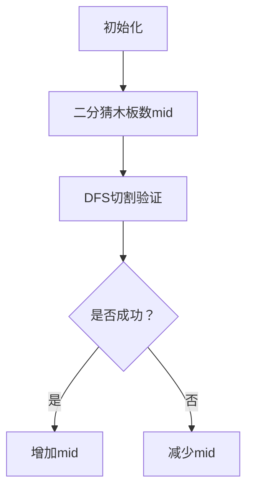

# 题目信息

# [SCOI2005] 栅栏

## 题目描述


农夫约翰打算建立一个栅栏将他的牧场给围起来，因此他需要一些特定规格的木材。于是农夫约翰到木材店购买木材。可是木材店老板说他这里只剩下少部分大规格的木板了。不过约翰可以购买这些木板，然后切割成他所需要的规格。而且约翰有一把神奇的锯子，用它来锯木板，不会产生任何损失，也就是说长度为 $10$ 的木板可以切成长度为 $8$ 和 $2$ 的两个木板。

你的任务：给你约翰所需要的木板的规格，还有木材店老板能够给出的木材的规格，求约翰最多能够得到多少他所需要的木板。

## 样例 #1

### 输入

```
4
30
40
50
25
10
15
16
17
18
19
20
21
25
24
30
```

### 输出

```
7```

## 样例 #2

### 输入

```
3
20
10
10
9
3
3
3
5
5
7
8
8
9
```

### 输出

```
7```

# AI分析结果


# 💡 Kay的C++算法解析：[SCOI2005]栅栏 深入学习指南 💡

## 1. 题目解读与核心算法识别

✨ **本题主要考察**：`二分答案 + DFS剪枝` (编程技巧应用)

🗣️ **初步分析**：
> 解决这道题的关键在于**二分答案+DFS验证框架**，就像在游戏中逐步缩小宝藏范围一样——先猜最多能得多少木板(mid)，再用深度搜索验证这个猜想是否可行。DFS验证时配合**贪心策略**（优先满足小木板）和**剪枝技巧**来避免超时。
>
> - **核心思路**：二分可能的木板数量，DFS验证该数量是否可行。剪枝是关键：1) 浪费统计剪枝（剩余木材不足时停止）2) 去重剪枝（相同长度木板跳过重复搜索）3) 前缀和优化（快速计算剩余需求）
> - **可视化设计**：动画将展示木材切割过程，高亮当前切割的木板和木材，用颜色区分已满足/未满足需求。当触发剪枝时，屏幕闪烁红色并播放警示音效，增强对算法效率的理解。

---

## 2. 精选优质题解参考

**题解一（作者：Mine_King）**
* **点评**：思路清晰直白，完整展示了二分+DFS框架。代码中`w`变量记录浪费木材的剪枝策略非常精妙，变量`sum[]`使用前缀和加速剩余需求计算。去重剪枝（`b[x-1]==b[x]`时从当前木材继续搜索）大幅提升效率。代码规范，边界处理严谨（`while(sum[m]>tot) m--`），可直接用于竞赛。

**题解二（作者：D_14134）**
* **点评**：在剪枝实现上有独特见解，特别强调从大木板开始满足的搜索顺序（虽然注释有笔误）。代码中`ta[]`临时数组和`t`浪费统计的命名清晰，去重剪枝与题解一异曲同工。亮点在于完整列出了多个优化点并解释其理论依据，对学习者很有启发性。

**题解三（作者：nowayout）**
* **点评**：代码注释详尽堪比教学文档，每步操作都有明确解释。`waste`剪枝与`last`参数的去重处理与优质题解一致，但可读性更佳。特别值得学习的是在DFS前复制木材数组的做法，避免了全局状态管理的混乱。

---

## 3. 核心难点辨析与解题策略

1.  **状态设计与搜索顺序**
    * **分析**：DFS需要同时追踪当前木板需求(降序)和木材状态。优质题解统一采用`dfs(剩余木板数, 起始木材索引)`的参数设计，并优先满足大木板（排序后倒序搜索），这样能更快触发剪枝条件。
    * 💡 **学习笔记**：倒序搜索大需求→小需求是贪心思想的精髓，类似"先解决最难问题"的生活智慧。

2.  **剪枝策略设计**
    * **分析**：三大剪枝缺一不可：1) **浪费统计**：当木材碎片总和超过`总木材-总需求`时停止；2) **去重处理**：相同长度木板直接从当前木材继续搜索；3) **前缀和预计算**：快速判断剩余需求是否超过可用木材。
    * 💡 **学习笔记**：剪枝本质是"及时止损"，在编程中表现为遇到不可能路径立即返回。

3.  **二分边界优化**
    * **分析**：通过`while(sum[m]>tot) m--`提前缩小二分上界，避免无谓搜索。这是基于"总木材不足时大需求必然失败"的直观认知。
    * 💡 **学习笔记**：预处理是优化的重要一环，如同做题前先划掉明显错误选项。

### ✨ 解题技巧总结
- **技巧1：二分答案框架**：当问题呈现单调性时（如"最多/至少"），先确定二分范围再验证
- **技巧2：状态可回溯**：DFS中修改临时状态（如`a[i]-=b[x]`）后必须恢复，类似"借东西要归还"
- **技巧3：剪枝三要素**：可行性剪枝（能否继续）、最优性剪枝（是否更好）、去重剪枝（是否重复）

---

## 4. C++核心代码实现赏析

**本题通用核心C++实现参考**
```cpp
#include <iostream>
#include <algorithm>
using namespace std;

int n, m, a[55], b[1005], sum[1005], tot, waste, mid;

bool dfs(int x, int st) {
    if (tot - waste < sum[mid]) return false; // 剪枝1：剩余木材不足
    if (x == 0) return true;                 // 所有木板满足
    
    for (int i = st; i <= n; i++) {          // 从st开始尝试木材
        if (a[i] >= b[x]) {
            a[i] -= b[x];                   // 切割木材
            if (a[i] < b[1]) waste += a[i]; // 记录不可用边角料
            
            // 剪枝2：相同长度木板从当前木材继续搜索
            bool success = (b[x] == b[x-1]) ? 
                dfs(x-1, i) : dfs(x-1, 1);
            
            if (a[i] < b[1]) waste -= a[i]; // 回溯
            a[i] += b[x];                   // 恢复木材
            
            if (success) return true;
        }
    }
    return false;
}

int main() {
    cin >> n;
    for (int i = 1; i <= n; i++) {
        cin >> a[i];
        tot += a[i];            // 木材总量
    }
    cin >> m;
    for (int i = 1; i <= m; i++) 
        cin >> b[i];
    
    sort(b + 1, b + m + 1);     // 升序排序木板
    for (int i = 1; i <= m; i++)
        sum[i] = sum[i-1] + b[i]; // 前缀和
    
    while (sum[m] > tot) m--;    // 优化二分上界
    
    int l = 0, r = m, ans = 0;
    while (l <= r) {
        waste = 0;
        mid = (l + r) >> 1;
        int backup[55]; 
        copy(a+1, a+n+1, backup+1); // 备份木材
        
        if (dfs(mid, 1)) {         // 验证mid是否可行
            ans = mid;
            l = mid + 1;
        } else {
            r = mid - 1;
        }
        copy(backup+1, backup+n+1, a+1); // 恢复木材
    }
    cout << ans << endl;
    return 0;
}
```

**代码解读概要**：
1. **二分框架**：通过`while(l<=r)`二分搜索最大木板数
2. **DFS验证**：`dfs(x,st)`尝试满足前x块木板，从第st块木材开始
3. **剪枝实现**：`waste`统计不可用边角料，`sum[mid]`快速计算总需求
4. **状态管理**：通过备份数组避免污染原始数据

---

## 5. 算法可视化：像素动画演示

**主题**：木材切割工坊（8-bit像素风格）

**核心演示**：


**动画流程**：
1. **场景构建**：
   - 左侧：木材堆（不同长度用不同颜色像素块表示）
   - 右侧：木板需求队列（升序排列的像素条）
   - 底部：控制面板（开始/暂停/单步/速度条）

2. **切割过程**：
   - **高亮当前木板**：红色闪烁边框（如b[x]）
   - **木材切割动画**：选中的木材分裂为两段，伴随"咔嚓"音效
   - **碎片标记**：小于最小需求的边角料变灰色，waste计数器上升

3. **剪枝特效**：
   - **浪费剪枝**：当`tot-waste < sum[mid]`时，屏幕红闪+警报音
   - **去重剪枝**：相同长度木板跳过搜索时，显示绿色箭头指向当前木材

4. **游戏化元素**：
   - 每成功切割一块，得分+10，进度条增长
   - 触发剪枝时扣分，连续正确奖励连击分
   - 背景播放8-bit风格BGM，关键操作配电子音效

---

## 6. 拓展练习与相似问题思考

**通用技巧迁移**：
1. **二分答案框架**：适用于所有"最大值最小化/最小值最大化"问题
2. **DFS剪枝**：在状态空间大的问题中（如数独、八皇后）常用
3. **贪心+排序预处理**：当问题有"优先处理小/大元素"特性时

**洛谷练习推荐**：
1. [P2440 木材加工](https://www.luogu.com.cn/problem/P2440)  
   → 巩固二分答案基础
2. [P1281 书的复制](https://www.luogu.com.cn/problem/P1281)  
   → 练习二分+贪心验证
3. [P2218 [HAOI2007]覆盖问题](https://www.luogu.com.cn/problem/P2218)  
   → 进阶二分+DFS几何应用

---

## 7. 学习心得与经验分享

> **来自 Mine_King 的调试经验**：  
> "在DFS中打印waste值，发现剪枝未及时触发导致超时，提醒我剪枝条件要前置处理"

> **Kay的总结**：  
> 调试DFS时，关键变量的实时监控（如waste）能快速定位逻辑漏洞。建议学习者在本地用小数据模拟执行过程，这是理解递归和剪枝的最佳方式。记住：好的算法=正确性+效率，而剪枝就是平衡二者的艺术。

---

本次解析就到这里，多写多练是掌握算法的唯一捷径！下次见！🚀

---
处理用时：202.11秒