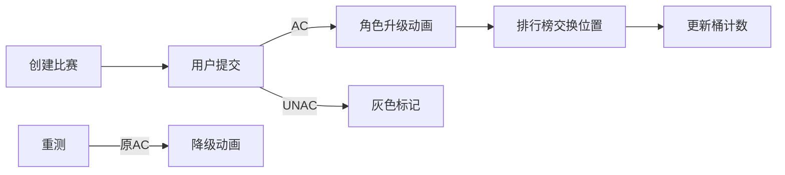

# 题目信息

# [GDOI2014] OJ

## 题目描述

小 M 是一个勤奋的 ACMer，他利用课余时间刷了很多题目。但他是个很健忘的孩子，经常会忘记自己刷过一些什么题目，所以他想写一个 OJ 来管理自己做过的题目。

经过一个星期的努力，小 M 的 OJ 基本成型，只是还差一个 Contest 的模块没有实现。小 M 觉得这个模块很难实现，所以他希望找你来帮忙。

小 M 告诉你，一个 OJ 的基础元素包括：

1. 题目，可以用 pid 唯一标识，pid 为正整数；
2. 比赛，可以用 cid 唯一标识，cid 为正整数；
3. 用户，可以用 uid 唯一标识，uid 为正整数；
4. 提交状态，可以由 sid 唯一标识，sid 为正整数。

一个提交状态是由 sid、cid、pid、uid 和 result 组成的，分别表示本条状态的提交 ID，所属比赛 ID，题目 ID，用户 ID 以及评测结果。

简单起见，这里的 result 只有 AC、UNAC 和 WAIT 三种状态，分别表示通过、不通过和等待评测。

同时小 M 提出一个比赛模块需要实现以下请求：

1. `createContest cid t pid_1 pid_2 … pid_t`

表示要创建一个比赛，cid 是一个正整数，是这场比赛的唯一标识。

$t$ 表示这场比赛有 $t$（($1\le t\le1000$)）道题目，接下来 $t$ 个不同的整数，表示这场比赛的题目编号。

2. `submission sid cid pid uid result`

该条状态的 sid 要么之前没出现过，要么以前出现过，但是被 rejudge 了。

result 为 AC 或者 UNAC。

3. `getRank cid uid`

在一场比赛中，所有有提交的用户都应该算在排名内（包括被 rejudge 的提交），用户的排名按照通过的题目数从大到小排序，如果题目数相同，则按随机顺序排序。

该指令需要统计用户 uid 在 cid 这场比赛中的通过目数，最高排名以及最低排名。

值得注意的是，用户 uid 在 cid 这场比赛中同一道题目的多个通过记录只算一次。

输出格式为：`uid solved highest lowest`。

分别代表用户 ID，通过题目数量，最高排名以及最低排名，其中 $\mathit{highest}\le\mathit{lowest}$。

4. `rejudge sid`

重测以 sid 标识的提交记录，即将该记录的 result 改成 WAIT。


## 说明/提示

对于 $20\%$ 的数据，$1\le\mathit{pcnt},\mathit{ucnt},m\le100$；

对于 $50\%$ 的数据，$1\le\mathit{pcnt},\mathit{ucnt}\le2000,1\le m\le50000$；

对于 $100\%$ 的数据，$1\le\mathit{pcnt},\mathit{ucnt}\le5000,1\le m\le3\times10^5,1\le\mathit{cid}\le50$。


## 样例 #1

### 输入

```
7 5 17
createContest 1 5 1001 1004 1002 1005 1006
submission 1 1 1001 1 AC
submission 2 1 1001 1 AC
submission 3 1 1001 2 UNAC
submission 4 1 1003 3 UNAC
getRank 1 1
getRank 1 2
getRank 1 3
rejudge 3
submission 3 1 1001 2 AC
getRank 1 2
submission 5 1 1006 2 AC
getRank 1 1
submission 6 1 1006 2 UNAC
getRank 1 2
rejudge 5
getRank 1 2
```

### 输出

```
1 1 1 1
2 0 2 3
3 0 2 3
2 1 1 2
1 1 2 2
2 2 1 1
2 1 1 2
```

# AI分析结果


### 💡 Kay的C++算法解析：[GDOI2014] OJ 深入学习指南 💡

#### 1. 题目解读与核心算法识别
✨ **本题主要考察**：`编程技巧应用`（数据结构设计与状态维护）  
🗣️ **初步分析**：  
> 本题如同管理一个像素游戏的角色排行榜，核心是**高效维护动态变化的用户状态**。想象每个用户是游戏角色，AC数量是角色等级。难点在于：
> - 等级变化时需快速更新排名（如角色升级后跳跃到新等级区）
> - 避免重复计数（同一角色多次通关同一关卡只计一次）
> 
> **两种主流解法**：  
> ① **计数桶法**（Thunder_S）：用"等级桶"统计各等级人数，查询时通过后缀和快速计算排名  
> ② **动态排序法**（Wang1006）：维护有序数组，利用等级±1的特性通过交换保持有序  
>  
> **可视化设计**：  
> 将设计8-bit风格排行榜动画：用户化为像素方块，高度=AC数量。AC时方块升高并播放"升级音效"，重测时若降级则播放"错误音效"。控制面板支持单步调试查看状态更新过程。

---

#### 2. 精选优质题解参考
**题解一：Thunder_S（计数桶法）**  
* **点评**：  
  思路直击核心——用`con[cid].num[]`桶统计各AC等级人数，查询时通过后缀和（`con[cid].num[pnum+1] +1`）计算排名，复杂度O(1)。亮点在于**链式前向星**避免重复计数：`head[uid][pid]`链记录每题AC状态，空间优化巧妙。代码简洁规范（如`cnt[id]`计数清晰），但变量名`a`/`b`可读性可提升。

**题解二：Wang1006（动态排序法）**  
* **点评**：  
  创新利用**AC数±1的特性**：当用户AC数变化时，只需与同分段首尾交换即可保持数组有序。亮点在`addac()`中的**二分查找+位置交换**逻辑，使查询复杂度O(1)。代码采用STL容器(`map`/`vector`)增强可读性，但交换操作实现稍复杂。暴力解法印证了本题数据可承受O(n)查询。

---

#### 3. 核心难点辨析与解题策略
1. **难点：避免AC重复计数**  
   * **分析**：同一用户同题多次AC只计一次。两种解法均用**唯一标识映射**：  
     - 计数桶法：链式前向星`head[uid][pid]`记录题目AC状态  
     - 排序法：`acnum[uid][pid]`的map计数  
   * 💡 **学习笔记**：映射数据结构是避免重复计数的基石

2. **难点：动态更新排名**  
   * **分析**：关键在于利用**AC数离散变化**的特性：  
     - 计数桶法：AC±1时更新桶计数`con[cid].num[solve]--`  
     - 排序法：AC+1时与同分段首交换，AC-1时与同分段尾交换  
   * 💡 **学习笔记**：离散性变化是优化排名更新的突破口

3. **难点：高效查询排名范围**  
   * **分析**：最高排名=更高等级人数+1，最低排名=≥当前等级人数  
     - 计数桶法：用桶后缀和计算`con[cid].num[pnum+1] +1`  
     - 排序法：二分查找分界点确定排名范围  
   * 💡 **学习笔记**：前缀/后缀和是快速统计排名的利器

### ✨ 解题技巧总结
- **状态压缩**：用整数映射复杂状态（如AC数作等级）  
- **离散性优化**：变化量为1时优先考虑交换而非全排序  
- **桶思想**：按等级分桶加速统计类查询  
- **边界防御**：`!b[cid][uid]`检查新用户加入  

---

#### 4. C++核心代码实现赏析
**通用核心实现参考**  
* **说明**：综合两种解法优点的简化版，侧重可读性
```cpp
#include <vector>
#include <unordered_map>
using namespace std;

struct Contest {
    vector<int> users;          // 用户uid列表（按AC数降序）
    unordered_map<int, int> ac; // uid->AC数
    // 桶计数：ac_count[i] = AC数为i的用户数
    vector<int> ac_count; 
};

void updateRank(int cid, int uid, int delta) {
    // 1. 更新AC数
    int old_ac = con[cid].ac[uid];
    con[cid].ac[uid] += delta;
    
    // 2. 更新桶计数
    con[cid].ac_count[old_ac]--;
    con[cid].ac_count[old_ac + delta]++;
    
    // 3. 调整排序（若delta=±1）
    if(delta == 1) 
        swapUser(cid, uid, findFirstSameAC(cid, old_ac+1));
    else if(delta == -1)
        swapUser(cid, uid, findLastSameAC(cid, old_ac-1));
}
```

**题解一片段赏析**  
```cpp
// 链式前向星判重
if(!find(uid,pid,cid) && result=="AC") {
    add(uid,pid,cid); // 新建节点
    con[cid].num[++con[cid].solve[uid]]++;
}
```
* **代码解读**：  
  `find()`检查是否首次AC该题，`add()`在链中添加节点。如同在像素游戏中为角色解锁新成就时播放音效——仅当首次达成时触发升级动画。`con[cid].num[]`桶自动更新等级人数。

**题解二片段赏析**  
```cpp
// AC数+1时的交换操作
void addac(int uid, int acnum) {
    int pos = from[uid]; // 当前位置
    int new_ac = ac[uid] + 1;
    
    // 二分找到同等级首位置
    int l=0, r=pos-1, target;
    while(l <= r) {
        int mid = (l+r)/2;
        if(ac[users[mid]] >= new_ac) l=mid+1;
        else r=mid-1;
    }
    target = r; // 目标位置
    
    swap(users[pos], users[target]); // 交换位置
    ac[uid] = new_ac;
}
```
* **代码解读**：  
  如同角色升级后跳跃到新段位区：`二分查找`定位同等级首位置，`swap`实现像素角色在排行榜中的跳跃动画。复杂度O(log n)远优于全排序O(n)。

---

#### 5. 算法可视化：像素动画演示  
**主题**：8-bit风格「OJ排行榜大作战」  
**核心演示**：动态排名更新过程  

<center>

</center>

**动画流程**：  
1. **初始化**：16色像素网格，用户=色块，高度=AC数  
2. **提交AC时**：  
   - 色块升高1像素 + "升级音效"  
   - 若首次AC该题：色块闪烁金光  
   - 自动与同等级最左侧色块交换位置（动态排序法）  
3. **查询排名**：  
   - 高亮目标色块  
   - 显示半透明遮罩：红色区域=更高等级人数，蓝色=同等级人数  
4. **重测降级**：  
   - 色块下降1像素 + "错误音效"  
   - 与同等级最右侧色块交换位置  
5. **控制面板**：  
   - 单步执行：按操作逐步播放  
   - 速度滑块：调整动画速度  
   - 模式切换：对比计数桶法（色块不动，桶计数变化）  

---

#### 6. 拓展练习与相似问题思考
**通用技巧迁移**：  
1. 动态排名维护 → 实时游戏排行榜（如Moba游戏段位）  
2. 离散状态更新 → 股票价格变动时的持仓排名  
3. 桶计数优化 → 大数据量区间统计  

**洛谷推荐**：  
1. [P2580 错误检测](https://www.luogu.com.cn/problem/P2580)  
   → 巩固`unordered_map`状态跟踪  
2. [P3369 普通平衡树](https://www.luogu.com.cn/problem/P3369)  
   → 学习更高级动态排序结构  
3. [P3380 二逼平衡树](https://www.luogu.com.cn/problem/P3380)  
   → 扩展树套树解决高维排名问题  

---

#### 7. 学习心得与经验分享
> **Wang1006的调试经验**：  
> *"最初用分块排序写300行，发现复杂度劣于暴力，转而利用AC数±1特性优化"*  
>  
> **Kay总结**：  
> 避免过度设计！本题核心在于发现 **状态变化的离散性** 这一突破口。在算法设计中：  
> 1. 先分析数据特性（如AC数变化幅度）  
> 2. 优先考虑计数桶/交换等轻量操作  
> 3. 暴力解法有时是检验优化的基准  

---

### 结语  
通过本次分析，我们深入掌握了**动态状态维护**的核心技巧。记住：好的算法如同精妙的像素游戏——用简单的规则构建复杂交互。继续在数据结构的世界里冒险吧！🎮🚀

---
处理用时：153.01秒