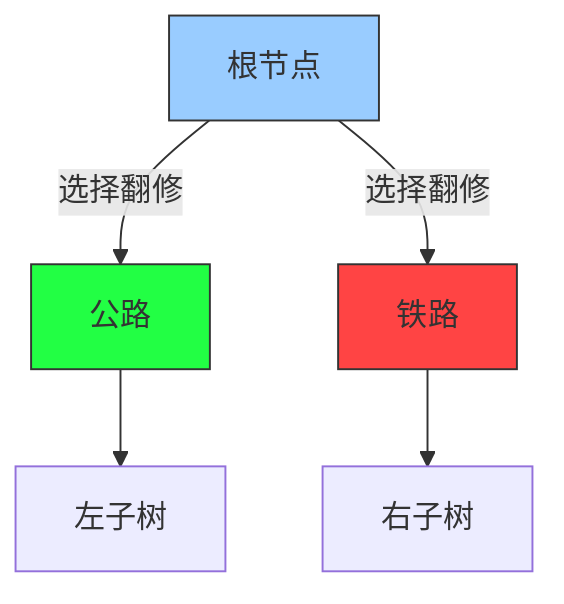

# 题目信息

# [HNOI/AHOI2018] 道路

## 题目描述

W 国的交通呈一棵树的形状。W 国一共有 $n-1$ 个城市和 $n$ 个乡村，其中城市从 $1$ 到 $n-1$ 编号，乡村从 $1$ 到 $n$ 编号，且 $1$ 号城市是首都。道路都是单向的，本题中我们只考虑从乡村通往首都的道路网络。

对于每一个城市，恰有一条公路和一条铁路通向这座城市。对于城市 $i$， 通向该城市的道路（公路或铁路）的起点，要么是一个乡村，要么是一个编号比 $i$ 大的城市。没有道路通向任何乡村。除了首都以外，从任何城市或乡村出发只有一条道路；首都没有往外的道路。从任何乡村出发，沿着唯一往外的道路走，总可以到达首都。

W 国的国王小 W 获得了一笔资金，他决定用这笔资金来改善交通。由于资金有限，小 W 只能翻修 $n-1$ 条道路。小 W 决定对每个城市翻修恰好一条通向它的道路，即从公路和铁路中选择一条并进行翻修。小 W 希望从乡村通向城市可以尽可能地便利，于是根据人口调查的数据，小 W 对每个乡村制定了三个参数，编号为 $i$ 的乡村的三个参数是 $a_i$，$b_i$ 和 $c_i$。假设从编号为 $i$ 的乡村走到首都一共需要经过 $x$ 条未翻修的公路与 $y$ 条未翻修的铁路，那么该乡村的不便利值为：

$$c_i \cdot (a_i + x) \cdot (b_i + y)$$

在给定的翻修方案下，每个乡村的不便利值相加的和为该翻修方案的不便利值。 翻修 $n-1$ 条道路有很多方案，其中不便利值最小的方案称为最优翻修方案，小 W 自然希望找到最优翻修方案，请你帮助他求出这个最优翻修方案的不便利值。

## 说明/提示

【样例解释 1】 


如图所示，我们分别用蓝色、黄色节点表示城市、乡村；用绿色、红色箭头分别表示 公路、铁路；用加粗箭头表示翻修的道路。 

一种不便利值等于 $54$ 的方法是：翻修通往城市 $2$ 和城市 $5$ 的铁路，以及通往其他城市的 公路。用 $\rightarrow$ 和 $\Rightarrow$ 表示公路和铁路，用 $∗\rightarrow$ 和 $∗\Rightarrow$ 表示翻修的公路和铁路，那么： 

编号为 $1$ 的乡村到达首都的路线为：$-1 ∗\rightarrow 3 \Rightarrow 1$，经过 $0$ 条未翻修公路和 $1$ 条未翻修铁路，代价为 $3 \times (1 + 0) \times (2 + 1) = 9$；  

编号为 $2$ 的乡村到达首都的路线为：$-2 \Rightarrow 3 \Rightarrow 1$，经过 $0$ 条未翻修公路和 $2$ 条未翻修铁路，代价为 $2 \times (1 + 0) \times (3 + 2) = 10$；  
编号为 $3$ 的乡村到达首都的路线为：$-3 ∗\rightarrow 4 \rightarrow 2 ∗\rightarrow 1$，经过 $1$ 条未翻修公路和 $0$ 条未翻修铁路，代价为 $3 \times (2 + 1) \times (1 + 0) = 9$；  

编号为 $4$ 的乡村到达首都的路线为：$-4 \Rightarrow 4 \rightarrow 2 ∗\rightarrow 1$，经过 $1$ 条未翻修公路和 $1$ 条未翻修铁路，代价为 $1 \times (2 + 1) \times (3 + 1) = 12$；

编号为 $5$ 的乡村到达首都的路线为：$-5 \rightarrow 5 ∗\Rightarrow 2 ∗\rightarrow 1$，经过 $1$ 条未翻修公路和 $0$ 条未翻修铁路，代价为 $2 \times (3 + 1) \times (1 + 0) = 8$；  

编号为 $6$ 的乡村到达首都的路线为：$-6 ∗\Rightarrow 5 ∗\Rightarrow 2 ∗\rightarrow 1$，经过 $0$ 条未翻修公路和 $0$ 条未翻修铁路，代价为 $1 \times (3 + 0) \times (2 + 0) = 6$；  

总的不便利值为 $9 + 10 + 9 + 12 + 8 + 6 = 54$。可以证明这是本数据的最优解。 

【样例解释 2】 

在这个样例中，显然应该翻修所有公路。


【数据范围】 
一共 $20$ 组数据，编号为 $1 \sim 20$。 
对于编号 $\le 4$ 的数据，$n \le 20$；  
对于编号为 $5 \sim 8$ 的数据，$a_i,b_i,c_i \le 5$，$n \le 50$；  
对于编号为 $9 \sim 12$ 的数据，$n \le 2000$；  
对于所有的数据，$n \le 20000$，$1 \le a_i,b_i \le 60$，$1 \le c_i \le 10^9$，$s_i,t_i$ 是 $[-n,-1] \cup (i,n - 1]$ 内的整数，任意乡村可以通过不超过 $40$ 条道路到达首都。

## 样例 #1

### 输入

```
6 
2 3 
4 5 
-1 -2 
-3 -4 
-5 -6 
1 2 3 
1 3 2 
2 1 3 
2 3 1 
3 1 2 
3 2 1```

### 输出

```
54```

## 样例 #2

### 输入

```
9 
2 -2 
3 -3 
4 -4 
5 -5 
6 -6 
7 -7 
8 -8 
-1 -9 
1 60 1 
1 60 1 
1 60 1 
1 60 1 
1 60 1 
1 60 1 
1 60 1 
1 60 1 
1 60 1```

### 输出

```
548```

## 样例 #3

### 输入

```
12 
2 4 
5 3 
-7 10 
11 9 
-1 6 
8 7 
-6 -10 
-9 -4
-12 -5 
-2 -3 
-8 -11 
53 26 491 
24 58 190 
17 37 356 
15 51 997 
30 19 398 
3 45 27 
52 55 838 
16 18 931 
58 24 212 
43 25 198 
54 15 172 
34 5 524```

### 输出

```
5744902
 
```

# AI分析结果


### Kay的C++算法解析：[HNOI/AHOI2018]道路 深入学习指南

#### 1. 题目解读与核心算法识别
✨ **本题主要考察**：树形动态规划（Tree DP）与状态空间优化

🗣️ **初步分析**：
> 本题要求最小化所有乡村的"不便利值"之和，关键在于理解树形结构上的决策过程。想象我们在一棵二叉树上进行"翻修大作战"：每个城市节点都是指挥官，需要选择翻修公路（左路）或铁路（右路），而每个乡村的代价取决于它到根节点路径上未翻修的公路/铁路数量。

- **核心思路**：采用自底向上的DP，状态设计为`f[u][i][j]`表示从根到节点u有`i`条未修公路、`j`条未修铁路时的最小代价。乡村节点直接计算代价，城市节点通过比较两种翻修方案（修左/修右）进行状态转移
- **算法流程**：
  1. 叶子节点（乡村）：`f[u][i][j] = c[u]*(a[u]+i)*(b[u]+j)`
  2. 非叶子节点（城市）：`f[u][i][j] = min( f[左子][i][j] + f[右子][i][j+1], f[左子][i+1][j] + f[右子][i][j] )`
- **可视化设计**：采用像素风树形结构（类似《王国之心》地图），关键元素：
  - 节点：城市=蓝色像素块，乡村=黄色像素块
  - 路径：公路=绿色箭头，铁路=红色箭头
  - 动态效果：决策时高亮当前节点，显示`(i,j)`计数器，翻修选择时播放8-bit音效（选择公路："滴"，铁路："嘟"）
  - 游戏化：每完成一个子树视为"关卡通关"，显示当前最优解

#### 2. 精选优质题解参考
**题解一：Kelin（赞74）**
* **亮点**：独创DFN映射空间优化（类似内存池复用），将三维状态压缩至二维。代码中`S[Top--]`复用废弃索引，避免MLE；转移方程推导清晰，边界处理严谨（`u>=n`判断乡村）；实践价值高，可直接用于竞赛

**题解二：teafrogsf（赞33）**
* **亮点**：DFN分配策略巧妙（左儿子dfn+1，右儿子dfn+2），空间复杂度优化至O(depth²)；代码可读性强（`now+1`/`now+2`递归）；复杂度分析到位，实测速度Rank3

**题解三：龙神哈迪斯（赞27）**
* **亮点**：记忆化搜索实现简洁，状态转移解释透彻；变量命名规范（`lson`/`rson`），特别适合初学者理解树形DP本质

---

#### 3. 核心难点辨析与解题策略
1. **状态设计维度爆炸**
   - **分析**：直接`dp[20000][40][40]`导致400MB空间，需优化
   - **解决方案**：DFN映射（Kelin）或链式索引（teafrogsf），将节点映射到深度相关的小区间
   - 💡 **学习笔记**：树形DP中，兄弟子树状态独立时可复用存储空间

2. **转移方程理解障碍**
   - **分析**：城市节点决策时，修公路导致右子铁路未修+1，修铁路导致左子公路未修+1
   - **解决方案**：用"责任传递"比喻——父亲的选择会增加某个孩子的负担
   - 💡 **学习笔记**：`min(左路责任+右路负担, 左路负担+右路责任)`

3. **乡村初始化计算**
   - **分析**：`c*(a+i)*(b+j)`可能溢出
   - **解决方案**：统一用`long long`且先乘系数c
   - 💡 **学习笔记**：树深≤40时，i,j≤40但c≤10⁹，必须`1LL*c*u`防止溢出

✨ **解题技巧总结**
- **空间压缩**：对深度小的树采用DFN映射（节点数>20000时节省90%空间）
- **循环优化**：i,j从0到当前深度（非固定0~40），减少无效计算
- **记忆化搜索**：优于迭代DP，避免拓扑排序
- **调试技巧**：打印深度≤3的子树状态，验证转移方程

---

#### 4. C++核心代码实现赏析
**通用核心实现（综合优化版）**：
```cpp
#include <bits/stdc++.h>
using namespace std;
typedef long long LL;
const int N = 40010, D = 42;
LL f[D][D]; // 第一维dfn映射
int son[N][2], a[N], b[N], c[N], dfn[N], idx;

void dfs(int u, int dep, int cnt) {
    int cur = dfn[u] = idx++;
    if (u >= n) { // 乡村叶子节点
        for (int i = 0; i <= dep; ++i)
            for (int j = 0; j <= dep; ++j)
                f[cur][i][j] = 1LL * c[u] * (a[u] + i) * (b[u] + j);
        return;
    }
    // 递归子节点
    dfs(son[u][0], dep + 1, idx);
    dfs(son[u][1], dep + 1, idx);
    int l = dfn[son[u][0]], r = dfn[son[u][1]];
    for (int i = 0; i <= dep; ++i)
        for (int j = 0; j <= dep; ++j)
            f[cur][i][j] = min(
                f[l][i][j] + f[r][i][j + 1], // 修左路
                f[l][i + 1][j] + f[r][i][j]  // 修右路
            );
}

int main() {
    cin >> n;
    // 初始化son,a,b,c（略）
    dfs(1, 0, 0);
    cout << f[dfn[1]][0][0];
}
```
**代码解读**：
1. **DFN映射**：`idx`动态分配节点存储位置，避免大数组
2. **深度约束**：`dep`当前深度，循环仅需0~dep
3. **乡村处理**：直接计算三维乘积，注意1LL防溢出
4. **城市转移**：取两种翻修方案最小值

---

### 5. 算法可视化：像素动画演示
**主题**："道路翻修大作战"（复古FC风格）

**核心演示流程**：


**动态效果**：
1. **节点展开**：城市节点显示为齿轮图标，点击后弹出选择框（公路扳手/铁路锤子）
2. **路径标记**：
   - 未修公路：绿色虚线（计数`i`）
   - 未修铁路：红色虚线（计数`j`）
3. **决策影响**：
   - 选修公路：右子树铁路计数`+1`，播放"叮"音效
   - 选修铁路：左子树公路计数`+1`，播放"咚"音效
4. **叶子计算**：乡村显示代价公式`c*(a+i)*(b+j)`，数值飘动

**控制面板**：
- 步进模式：`←→`键单步执行
- 自动演示：速度滑块（1x~5x）
- 高亮开关：显示/隐藏计数路径

**音效设计**：
- 背景音乐：FC风格循环BGM
- 关键操作：选择音（电子滴答），正确决策（上升音阶）
- 错误反馈：刺耳蜂鸣

---

### 6. 拓展练习与相似问题
1. **相似思维迁移**：
   - 二叉决策树：P4516 [JSOI2018] 潜入游戏（监控放置）
   - 路径贡献计算：P3177 [HAOI2015] 树上染色（边权贡献）
   - 状态空间优化：P3354 [IOI2020] 连接擎天树（压缩维度）

2. **洛谷推荐**：
   - P2585 [ZJOI2006]三色二叉树 🗣️ *巩固二叉树DP基础*
   - P3177 [HAOI2015]树上染色 🗣️ *背包+树形DP，难度进阶*
   - P4516 [JSOI2018]潜入游戏 🗣️ *监控覆盖问题，强化状态设计*

---

### 7. 学习心得与经验分享
> **Kelin的经验**："避免重复计算的关键是识别状态独立性——兄弟子树如同平行宇宙，计算完即可丢弃"
>  
> **调试技巧**：对深度≤3的子树打印`f[i][j]`矩阵，验证转移正确性
>  
> **易错点**：
> 1. 乡村编号转换：负数需`-x+n-1`
> 2. 乘积溢出：必须`1LL*c*u`
> 3. 空间优化：DFN映射时注意索引回收

---

通过这道题，我们不仅学会了树形DP的状态设计与空间优化，更掌握了"责任传递"的决策思想。记住：好的状态设计能让复杂问题迎刃而解！下次挑战见！🚀

---
处理用时：154.86秒