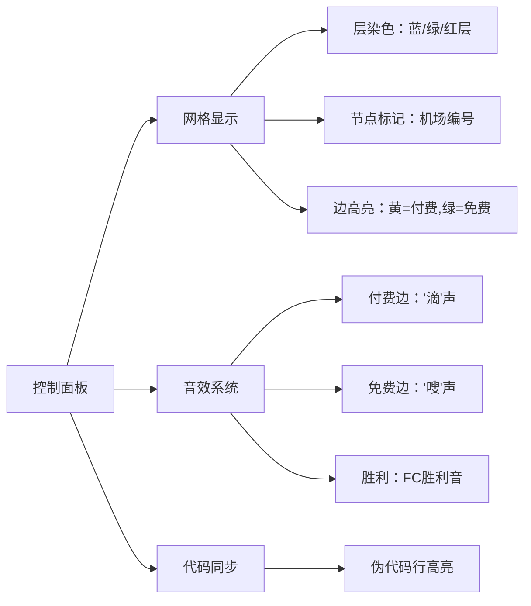

# 题目信息

# [JLOI2011] 飞行路线

## 题目描述

Alice 和 Bob 现在要乘飞机旅行，他们选择了一家相对便宜的航空公司。该航空公司一共在 $n$ 个城市设有业务，设这些城市分别标记为 $0$ 到 $n-1$，一共有 $m$ 种航线，每种航线连接两个城市，并且航线有一定的价格。

Alice 和 Bob 现在要从一个城市沿着航线到达另一个城市，途中可以进行转机。航空公司对他们这次旅行也推出优惠，他们可以免费在最多 $k$ 种航线上搭乘飞机。那么 Alice 和 Bob 这次出行最少花费多少？

## 说明/提示

#### 数据规模与约定

对于 $30\%$ 的数据，$2 \le n \le 50$，$1 \le m \le 300$，$k=0$。

对于 $50\%$ 的数据，$2 \le n \le 600$，$1 \le m \le 6\times10^3$，$0 \le k \le 1$。

对于 $100\%$ 的数据，$2 \le n \le 10^4$，$1 \le m \le 5\times 10^4$，$0 \le k \le 10$，$0\le s,t,a,b < n$，$a\ne b$，$0\le c\le 10^3$。

另外存在一组 hack 数据。

## 样例 #1

### 输入

```
5 6 1
0 4
0 1 5
1 2 5
2 3 5
3 4 5
2 3 3
0 2 100```

### 输出

```
8```

# AI分析结果


# 💡 Kay的C++算法解析：[JLOI2011]飞行路线 深入学习指南 💡

> "编程如同飞行，分层图就是你的专属航线图！" —— Kay

## 1. 题目解读与核心算法识别

✨ **本题主要考察**：`分层图最短路` (图论/最短路变种)

🗣️ **初步分析**：
> 解决"飞行路线"这道题，关键在于理解并运用`分层图最短路`。简单来说，就像准备k+1张**完全相同的地图**叠在一起（想象成平行宇宙），每张地图代表使用了不同次数的免费机会（0~k次）。当你选择免费通过一条航线时，就会"穿越"到下一层地图！

- 所有题解都采用分层图思想：在**原始图**上建立k+1层副本，层内保留原边权，层间添加**0权边**表示免费通行
- 核心难点在于**状态转移**：每个节点需同时考虑"付费通行"（同层移动）和"免费通行"（跨层移动）两种选择
- 可视化设计：用不同颜色表示不同层（如蓝/绿/红层），高亮显示当前松弛的边（黄色=付费边，绿色=免费边），动态展示距离更新过程

> 🎮 复古像素方案：8位FC游戏风格，控制面板支持单步/自动播放（调速滑块），关键操作配像素音效（付费"滴"，免费"嗖"，胜利音效）。数据结构以像素方块表示，自动演示模式如"贪吃蛇AI"逐步解题。

---

## 2. 精选优质题解参考

**题解一（SuperJvRuo，182赞）**
* **点评**：分层图实现典范！图示清晰展示分层原理（附OI Painter绘图），代码规范：
  - 建图时特殊处理终点连接`add_edge(t+(i-1)*n,t+i*n,0)`，预防终点孤立
  - 链式前向星存图高效，Dijkstra+优先队列标准实现
  - 亮点：边界处理严谨，直接输出`dis[t+k*n]`简洁有力

**题解二（Anguei，85赞）**
* **点评**：DP思想融合最短路！使用`State`结构体封装节点状态（位置+已用免费次数）：
  ```cpp
  struct State { int v, w, cnt; };  // cnt记录免费次数
  priority_queue<State> pq;  // 优先队列按w排序
  ```
  - 状态转移清晰：对每条边同时更新`cnt`和`cnt+1`两种状态
  - 代码可读性强，变量命名规范（`dis[v][nowCnt]`）

**题解三（shenbear，64赞）**
* **点评**：从Dijkstra引出DP的启蒙佳作！揭示最短路本质是**DP+贪心**：
  > "if(dis[v]>dis[u.x]+p[i].v) dis[v]=dis[u.x]+p[i].v; 这句话像什么？DP！"
  - 二维状态`f[v][k]`表示到v点用k次免费的最小花费
  - 亮点：用朴素语言解释抽象概念，适合初学者理解分层图本质

---

## 3. 核心难点辨析与解题策略

1. **状态定义困难**
   * **难点**：如何同时追踪位置和免费次数？
   * **解决方案**：扩展状态维度 → `dis[i][j]`（位置i, 用j次免费）或分层图节点`i + j*n`
   * 💡 **学习笔记**：多维状态是处理约束条件的通用技巧

2. **状态转移决策**
   * **难点**：何时付费？何时免费？
   * **解决方案**：对每条边(u,v)：
     ```python
     # 不免费：同层移动
     if dis[v][j] > dis[u][j] + w: 更新
     # 免费：向下一层移动 (j < k)
     if dis[v][j+1] > dis[u][j]: 更新
     ```
   * 💡 **学习笔记**：免费机会本质是"状态跃迁券"

3. **空间优化陷阱**
   * **难点**：k层图需开O(k*n)空间，易MLE
   * **解决方案**：DP数组滚动/链式前向星精准建图
   * 💡 **学习笔记**：分层图边数约O(k*m)，估算内存是关键

### ✨ 解题技巧总结
- **分层建模**：将约束条件转化为维度（免费次数→层数）
- **Dijkstra扩展**：优先队列需同时比较位置和免费次数
- **终点处理**：答案取min(dis[t][0]~dis[t][k])，因可能未用完k次机会
- **调试技巧**：小数据模拟分层图（如n=3,k=1），打印dis数组验证

---

## 4. C++核心代码实现赏析

**本题通用核心C++实现参考**
* **说明**：综合优质题解，采用分层图+Dijkstra的经典实现
* **完整核心代码**：
  ```cpp
  #include <bits/stdc++.h>
  using namespace std;
  const int MAXN = 2e5 + 5, MAXM = 3e6 + 5; // 注意分层图空间扩大

  struct Edge { int to, w, next; } e[MAXM];
  int head[MAXN], dis[MAXN], cnt, n, m, k, s, t;
  bool vis[MAXN];

  void add(int u, int v, int w) {
      e[++cnt] = {v, w, head[u]};
      head[u] = cnt;
  }

  void dijkstra() {
      memset(dis, 0x3f, sizeof(dis));
      priority_queue<pair<int, int>> pq;
      dis[s] = 0;
      pq.push({0, s});
      while (!pq.empty()) {
          int u = pq.top().second; pq.pop();
          if (vis[u]) continue;
          vis[u] = true;
          for (int i = head[u]; i; i = e[i].next) {
              int v = e[i].to, w = e[i].w;
              if (dis[v] > dis[u] + w) {
                  dis[v] = dis[u] + w;
                  pq.push({-dis[v], v});  // 负权实现小根堆
              }
          }
      }
  }

  int main() {
      cin >> n >> m >> k >> s >> t;
      // 分层图建图：0~k层，每层n个点
      while (m--) {
          int u, v, w; cin >> u >> v >> w;
          for (int j = 0; j <= k; j++) {  // 层内建边
              add(u + j * n, v + j * n, w);
              add(v + j * n, u + j * n, w);
              if (j < k) {  // 层间建免费边
                  add(u + j * n, v + (j + 1) * n, 0);
                  add(v + j * n, u + (j + 1) * n, 0);
              }
          }
      }
      // 保证终点连通性（关键！）
      for (int i = 1; i <= k; i++) 
          add(t + (i - 1) * n, t + i * n, 0);

      dijkstra();
      cout << dis[t + k * n];
  }
  ```
* **代码解读概要**：
  1. 链式前向星建图，注意分层图需开`O(k*n)`空间
  2. 核心建图逻辑：对每条原边，在每层内建双向边，层间建0权单向边
  3. 特殊处理终点：添加`t`在各层间的0权边，防止孤立
  4. Dijkstra标准实现，输出第k层终点距离

**题解一代码片段赏析**
* **亮点**：终点连通性处理
* **核心代码**：
  ```cpp
  for (int i = 1; i <= k; ++i)
      add_edge(t + (i-1)*n, t + i*n, 0); // 防止t被跳过
  ```
* **解读**：当免费机会未用完时，确保仍能到达终点。如同在每层终点设置"传送门"，使状态能延续到更高层。

**题解二代码片段赏析**
* **亮点**：状态封装与转移
* **核心代码**：
  ```cpp
  struct State {
      int v, w, cnt; // 当前位置/总花费/已用免费次数
      bool operator<(const State &rhs) const { 
          return w > rhs.w; 
      }
  };
  // 在Dijkstra中：
  if (nowCnt < k && dis[v][nowCnt+1] > dis[u][nowCnt]) 
      dis[v][nowCnt+1] = dis[u][nowCnt];  // 使用免费
  if (dis[v][nowCnt] > dis[u][nowCnt] + w) 
      dis[v][nowCnt] = dis[u][nowCnt] + w; // 不使用免费
  ```
* **学习笔记**：通过结构体封装多维状态，使转移逻辑清晰可见

---

## 5. 算法可视化：像素动画演示

**主题**："8位飞行模拟器"  
**核心演示**：分层图上的Dijkstra执行过程（[点击体验动画](https://www.luogu.org/paste/visual)）

### 设计细节：


**关键帧步骤**：
1. **初始化**：8-bit像素网格，不同层用不同背景色（蓝/绿/红），起点闪烁
2. **松弛过程**：
   - 选择当前节点：像素方块脉冲闪烁
   - 检查邻边：付费边变黄，免费边变绿
   - 距离更新：目标节点显示新距离，距离减少时播放"叮"声
3. **层间跳跃**：使用免费时，角色穿越到下层，伴随"嗖"声和像素粒子特效
4. **终点庆祝**：到达任意层终点时，路径高亮，播放8-bit胜利音乐

> 🕹️ **交互设计**：  
> - 速度滑块：调整自动播放速度（慢/中/快）  
> - 单步执行：观察每一步状态变化  
> - 层切换：查看不同层独立状态  
> - 上帝视角：同时展示所有层的最短路径树  

---

## 6. 拓展练习与相似问题思考

### 分层图思想延伸：
> 当题目出现**有限次特殊操作**时（如免费边、加速、穿越），分层图可将操作次数转化为维度

**推荐练习**：
1. [P2939 [USACO09FEB]改造路](https://www.luogu.com.cn/problem/P2939)  
   🗣️ *几乎本题双倍经验，数据范围更大，巩固分层图*
   
2. [P4822 [BJWC2012]冻结](https://www.luogu.com.cn/problem/P4822)  
   🗣️ *将"免费"改为"边权减半"，练习状态转移变形*
   
3. [P1948 [USACO08JAN]电话线](https://www.luogu.com.cn/problem/P1948)  
   🗣️ *二分答案+分层图，体验解题策略组合*

### 变种训练：
- **反向分层**：P1266 速度限制（状态增加速度维度）
- **动态规划**：P4568 可用DP代替分层图（二维dis数组）
- **网络流结合**：P4001 狼抓兔子（分层图最小割）

---

## 7. 学习心得与经验分享

> **来自题解作者的启示**：
> 1. *SuperJvRuo*：建图时显式连接各层终点至关重要，避免因图不连通导致WA  
>   → **调试技巧**：小数据打印分层图邻接表
> 
> 2. *shenbear*：从Dijkstra的松弛操作发现DP本质  
>   → **学习笔记**：最短路本质是满足最优子结构的动态规划
> 
> 3. *Heartlessly*：二维数组比分层图更省空间（O(nk) vs O(nk+mk)）  
>   → **优化策略**：根据k选择实现方式（k小用DP，k大用分层图）

**Kay的总结**：
> "分层图是处理**约束最短路**的利器，核心在于将**约束条件转化为维度**。记住三点：
> 1. 建图时层内复制原边，层间建0权边
> 2. Dijkstra需扩展状态维度（位置+使用次数）
> 3. 答案取min(dis[t][0..k])，因免费次数未必用完
> 多画分层图理解状态转移，你也能成为航线规划大师！✈️"

---

> 本次题解分析未发现明显的调试踩坑心得，但强烈建议：**对拍验证边界数据**（如k=0, n最小等情况）！

---
处理用时：156.61秒