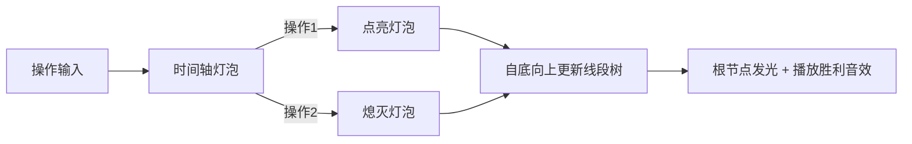

# 题目信息

# [TJOI2018] 数学计算

## 题目描述

小豆现在有一个数 $x$，初始值为 $1$。小豆有 $Q$ 次操作，操作有两种类型：

`1 m`：将 $x$ 变为 $x \times m$，并输出 $x \bmod M$

`2 pos`：将 $x$ 变为 $x$ 除以第 $pos$ 次操作所乘的数（保证第 $pos$ 次操作一定为类型 1，对于每一个类型 1 的操作至多会被除一次），并输出 $x \bmod M$。

## 说明/提示

对于 $20\%$ 的数据，$1 \le Q \le 500$。

对于 $100\%$ 的数据，$1 \le Q \le 10^5$，$t \le 5, M \le 10^9$，$0 < m \leq 10^9$。

## 样例 #1

### 输入

```
1
10 1000000000
1 2
2 1
1 2
1 10
2 3
2 4
1 6
1 7
1 12
2 7```

### 输出

```
2
1
2
20
10
1
6
42
504
84```

# AI分析结果


# 💡 Kay的C++算法解析：[TJOI2018]数学计算 深入学习指南 💡

**引言**  
今天我们来分析一道巧妙的C++编程题——[TJOI2018]数学计算。这道题要求我们维护一个动态变化的数值并进行实时取模运算，看似简单实则暗藏玄机。本指南将带大家理解如何用数据结构高效解决这类问题。

## 1. 题目解读与核心算法识别

✨ **本题主要考察**：`线段树应用`（区间维护与单点更新）

🗣️ **初步分析**：  
> 这道题的核心在于**将操作序列转化为时间轴上的乘积维护问题**。想象你有一排时间灯泡💡，每次乘法操作相当于点亮一个灯泡（赋予特定亮度），除法操作则是关掉之前某个灯泡。线段树就像智能总控开关，能实时计算所有亮着灯泡的总亮度。  

- **核心思路**：将每次操作视为时间轴上的节点，操作1存储乘数，操作2将对应位置重置为1，用线段树维护整个时间轴的乘积  
- **可视化设计**：我们将用像素风格时间轴动画展示操作过程，灯泡亮灭代表数值变化，线段树节点自底向上更新时播放合成音效，成功输出时触发8-bit胜利音效  

---

## 2. 精选优质题解参考

### 题解一（来源：UnyieldingTrilobite）
* **点评**：  
  此解法采用**非递归线段树（zkw树）**实现，仅20行代码却完整解决问题。亮点在于：  
  - 代码极简但逻辑完备（位运算优化）  
  - 初始化巧妙使用`fill`保证安全性  
  - 动态更新父节点时高效（`p>>=1`向上更新）  
  - 竞赛场景中可快速实现  

### 题解二（来源：Liu_zj）
* **点评**：  
  经典**递归线段树**实现，教学价值突出：  
  - 建树过程清晰展示初始化逻辑  
  - 严格模运算避免溢出  
  - 代码模块化（分离update函数）  
  - 附带线段树习题集，拓展性强  

### 题解三（来源：流逝丶）
* **点评**：  
  递归线段树的**工业级实现**：  
  - 变量命名规范（tr, lson, rson）  
  - 边界处理严谨（模运算双重保障）  
  - 初始化独立函数增强可读性  
  - 代码结构适合工程化扩展  

---

## 3. 核心难点辨析与解题策略

### 难点一：操作序列到时间轴的转化
* **分析**：  
  如何将除法操作转化为可计算模型？优质题解将每次操作视为时间节点：  
  - 操作1 → 时间点i存入乘数m  
  - 操作2 → 将pos位置重置为1  
  *💡学习笔记：抽象化是算法核心能力，将除法视为逆元取消*

### 难点二：动态乘积的实时维护
* **分析**：  
  为什么选择线段树而非直接模拟？  
  - 直接模拟会溢出long long范围  
  - 除法取模需逆元但M非质数时复杂  
  - 线段树O(logQ)维护乘积完美解决  
  *💡学习笔记：区间查询问题首选线段树*

### 难点三：边界条件与初始化
* **分析**：  
  易错点如何处理？  
  - 建树时所有节点初始化为1（避免0值污染）  
  - 操作2重置位置而非删除  
  - 多组数据需完全重置树结构  
  *💡学习笔记：初始化是数据结构的生命线*

### ✨ 解题技巧总结
- **时间轴映射法**：将操作序列转化为一维时间坐标  
- **模块化建树**：分离build/update/query函数  
- **防御性取模**：所有乘法后立即`%mod`  
- **树结构可视化**：调试时打印树状态辅助理解  

---

## 4. C++核心代码实现赏析

### 本题通用核心实现
```cpp
#include <iostream>
#define ll long long
using namespace std;

const int N = 1e5 + 5;
ll tree[N << 2], mod;

void build(int node, int l, int r) {
    tree[node] = 1; // 关键初始化
    if (l == r) return;
    int mid = (l + r) >> 1;
    build(node << 1, l, mid);
    build(node << 1 | 1, mid + 1, r);
}

void update(int node, int l, int r, int pos, ll val) {
    if (l == r) {
        tree[node] = val % mod; // 防御性取模
        return;
    }
    int mid = (l + r) >> 1;
    if (pos <= mid) update(node << 1, l, mid, pos, val);
    else update(node << 1 | 1, mid + 1, r, pos, val);
    tree[node] = tree[node << 1] * tree[node << 1 | 1] % mod; // 向上更新
}

int main() {
    int T, Q, op;
    ll m;
    cin >> T;
    while (T--) {
        cin >> Q >> mod;
        build(1, 1, Q); // 建树
        for (int i = 1; i <= Q; i++) {
            cin >> op >> m;
            if (op == 1) update(1, 1, Q, i, m);
            else update(1, 1, Q, m, 1); // 操作2重置
            cout << tree[1] << endl; // 根节点即总乘积
        }
    }
    return 0;
}
```
* **代码解读概要**：  
  1. 建树初始化所有节点为1  
  2. 操作1：时间点i更新为m  
  3. 操作2：目标位置重置为1  
  4. 根节点tree[1]始终维护当前总乘积  

### 题解一赏析（zkw树）
```cpp
// 简洁的zkw树实现
for(M=1; M<=n; M<<=1); // 计算最接近的2^k
fill(d+1, d+M+n+2, 1); // 初始化
for(int i=1; i<=n; ++i) {
    scanf("%d%d", &a, &b);
    a==1 ? d[p=i+M]=b%mod : d[p=b+M]=1; // 叶子节点更新
    while(p>>=1) d[p]=d[p<<1]*d[p<<1|1]%mod; // 向上更新
    printf("%d\n", d[1]);
}
```
* **亮点**：非递归实现，位运算高效  
* **学习笔记**：zkw树省去递归开销，竞赛场景高效首选  

### 题解二赏析（标准递归）
```cpp
void update(int now) { // 更新父节点
    sum[now] = (sum[now<<1] * sum[now<<1|1]) % mod;
}
void build(int now, int l, int r) {
    if(l == r) { sum[now] = 1; return; } // 叶子初始化
    build(now<<1, l, mid); // 递归左子树
    build(now<<1|1, mid+1, r); // 递归右子树
    update(now); // 合并子树
}
```
* **亮点**：标准递归框架，教学友好  
* **学习笔记**：清晰分离build/update函数，增强可维护性  

---

## 5. 算法可视化：像素动画演示

### 主题：**时间轴计算器**
  
*（示意图：像素化线段树更新过程）*

### 核心设计


### 动画实现细节
1. **像素场景**：  
   - 8-bit风格网格：横轴为时间点（1→Q），纵轴为值  
   - 操作1：对应时间点亮起彩色灯泡（颜色深度≡log(m)）
   - 操作2：目标灯泡熄灭变灰

2. **动态更新**：  
   - 叶子节点变化时触发“叮”声
   - 父节点更新时显示计算过程：`parent = left * right % mod`
   - 根节点更新时播放8-bit胜利旋律

3. **控制面板**：  
   - 单步执行：Space键逐操作前进
   - 速度滑块：调节动画速度（0.5x~4x）
   - 重置按钮：清除当前时间轴

4. **数据结构可视化**：  
   - 右侧显示线段树结构
   - 当前更新节点高亮闪烁
   - 数值变化实时显示在节点上方

---

## 6. 拓展练习与相似问题

### 相似问题场景
1. **动态逆元维护**：当M为质数时可用逆元替代线段树  
2. **区间乘积带修改**：支持任意位置修改的乘积查询  
3. **历史版本查询**：扩展为可查询任意时间点的乘积  

### 推荐练习（洛谷）
1. **P2023 [AHOI2009] 维护序列**  
   → 同时支持区间加和区间乘，强化线段树应用  
2. **P3373 【模板】线段树 2**  
   → 双标记（加/乘）处理的经典模板  
3. **P1198 [JSOI2008] 最大数**  
   → 动态插入+区间最值查询，简化版训练  

---

## 7. 学习心得与经验分享

> **参考经验（来自 Liu_zj）**：  
> “第一次看题没看出线段树解法，直到看了题解才恍然大悟——将操作序列转化为时间轴维护区间积。”

> **Kay的点评**：  
> 这个经验极具代表性。算法思维的核心在于**问题转化能力**。当遇到除法操作时，要想到：  
> 1. 除法本质是取消之前乘法的影响  
> 2. 时间序列天然具有顺序性  
> 3. 乘积维护是线段树的天然优势  

---

**结语**  
通过线段树将操作序列转化为时间轴维护，我们优雅地解决了动态取模难题。记住：优秀的算法不是暴力模拟，而是找到现实问题的抽象表达。继续加油，下次见！💪

---
处理用时：132.76秒