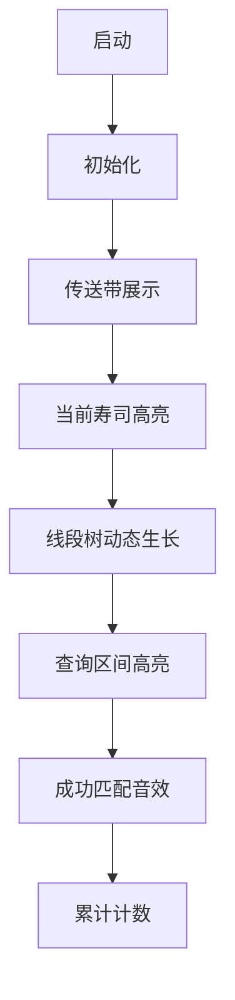

# 题目信息

# [BJOI2016] 回转寿司

## 题目描述

酷爱日料的小Z经常光顾学校东门外的回转寿司店。在这里，一盘盘寿司通过传送带依次呈现在小Z眼前。  

不同的寿司带给小Z的味觉感受是不一样的，我们定义小Z对每盘寿司都有一个满意度。  

例如小Z酷爱三文鱼，他对一盘三文鱼寿司的满意度为 $10$；小Z觉得金枪鱼没有什么味道，他对一盘金枪鱼寿司的满意度只有 $5$；小Z最近看了电影《美人鱼》，被里面的八爪鱼恶心到了，所以他对一盘八爪鱼刺身的满意度是 $-100$。   

特别地，小Z是个著名的吃货，他吃回转寿司有一个习惯，我们称之为“狂吃不止”。具体地讲，当他吃掉传送带上的一盘寿司后，他会毫不犹豫地吃掉它后面的寿司，直到他不想再吃寿司了为止。  

今天，小Z再次来到了这家回转寿司店，$N$ 盘寿司将依次经过他的面前。其中，小Z对第 $i$ 盘寿司的满意度为$a_i$。  

小Z可以选择从哪盘寿司开始吃，也可以选择吃到哪盘寿司为止。他想知道共有多少种不同的选择，使得他的满意度之和不低于 $L$，且不高于 $R$。

注意，虽然这是回转寿司，但是我们不认为这是一个环上的问题，而是一条线上的问题。即，小Z能吃到的是输入序列的一个连续子序列；最后一盘转走之后，第一盘并不会再出现一次。

## 说明/提示

【数据范围】  

$1\le N \le 10^5$  
$|a_i| \le 10^5$   
$0\le L,R \le 10^9$

## 样例 #1

### 输入

```
5 5 9
1 2 3 4 5```

### 输出

```
6```

# AI分析结果


# 💡 Kay的C++算法解析：回转寿司 深入学习指南 💡

> "算法就像品尝回转寿司——需要精准选择，才能品尝到最美味的组合！" —— Kay

## 1. 题目解读与核心算法识别

✨ **本题主要考察**：`前缀和 + 数据结构查询优化`

🗣️ **初步分析**：
> 解决"回转寿司"这道题，关键在于将连续子序列和问题转化为**前缀和的区间查询问题**。想象传送带上的寿司是数据流，而我们要统计所有美味度在[L,R]区间的组合，就像挑选满足口味范围的寿司组合。

在本题中，我们：
1. 计算前缀和数组 `S[]`（S[i] = 前i盘寿司的美味度和）
2. 将问题转化为：求满足 `L ≤ S[j] - S[i] ≤ R` (0≤i<j≤n) 的(i,j)对数量
3. 等价于对每个j，查询有多少i满足 `S[j]-R ≤ S[i] ≤ S[j]-L`

**可视化设计思路**：
- 像素动画将展示传送带（序列）和动态生长的线段树
- 高亮当前处理的寿司（右端点j）和查询区间[S[j]-R, S[j]-L]
- 线段树节点插入时播放"叮"音效，成功查询时播放"叮咚"胜利音

---

## 2. 精选优质题解参考

**题解一：神眷の樱花（线段树）**
* **点评**：思路清晰直白，通过前缀和转化将问题完美映射到区间查询。代码采用动态开点线段树避免离散化，结构工整（`insert`/`query`分离）。亮点在于处理大值域时仍保持O(nlogn)复杂度，边界处理严谨（预先插入S₀=0）。可直接用于竞赛场景。

**题解二：Heartlessly（动态开点线段树）**
* **点评**：代码规范性强（封装`update`/`query`），解释透彻。亮点在于使用const限定全局值域范围(-MAXN~MAXN)，避免动态计算。学习价值高，尤其适合理解动态开点原理，变量命名清晰（`res`/`cnt`），空间优化意识强。

**题解三：GKxx（树状数组+离散化）**
* **点评**：实践价值突出，采用离散化+树状数组降低空间消耗。亮点在于将Sᵢ, Sᵢ-L, Sᵢ-R统一离散化处理，代码简洁高效（仅60行）。特别适合值域大但n较小的场景，树状数组实现比线段树更轻量。

---

## 3. 核心难点辨析与解题策略

1. **难点：如何高效处理区间和约束**
   * 分析：暴力枚举O(n²)超时，需将子序列和转化为前缀和差值
   * 解法：设S[i] = Σa₁~aᵢ，则问题转化为二维偏序问题
   * 💡 学习笔记：前缀和是子序列问题的黄金转化器

2. **难点：动态维护与查询数据结构**
   * 分析：需支持动态插入前缀和+区间计数
   * 解法：根据值域选择：
     - 值域小 → 树状数组+离散化（GKxx解法）
     - 值域大 → 动态开点线段树（Heartlessly解法）
   * 💡 学习笔记：树状数组是空间优化的首选，线段树更通用

3. **难点：边界条件处理**
   * 分析：易漏S₀=0的初始化，导致漏算[1,j]子序列
   * 解法：所有解法均显式插入S₀（`insert(0)`）
   * 💡 学习笔记：前缀和问题中，空序列(和=0)是隐形守卫

### ✨ 解题技巧总结
- **前缀和转化**：遇到子序列和问题，立即想前缀和差分
- **数据结构选择**：
  | 场景 | 推荐数据结构 | 时间复杂度 |
  |------|-------------|-----------|
  | 值域小 | 树状数组+离散化 | O(nlogn) |
  | 值域大 | 动态开点线段树 | O(nlogn) |
  | 需要排序 | CDQ分治 | O(nlog²n) |
- **边界防御**：始终考虑空序列、单元素序列等边界情况

---

## 4. C++核心代码实现赏析

**本题通用核心实现（综合优化版）**：
```cpp
#include <iostream>
#include <algorithm>
#define ll long long
using namespace std;

const int N = 1e5+5;
const ll MAXV = 1e10;
ll S[N], L, R, ans;
int n, root, cnt;

struct Node { int lc, rc, sum; } T[N*40];

void update(int &x, ll pos, ll l=-MAXV, ll r=MAXV) {
    if(!x) x = ++cnt;
    if(l == r) { T[x].sum++; return; }
    ll mid = (l+r) >> 1;
    pos <= mid ? update(T[x].lc, pos, l, mid) 
               : update(T[x].rc, pos, mid+1, r);
    T[x].sum = T[T[x].lc].sum + T[T[x].rc].sum;
}

int query(int x, ll ql, ll qr, ll l=-MAXV, ll r=MAXV) {
    if(!x || qr < l || ql > r) return 0;
    if(ql <= l && r <= qr) return T[x].sum;
    ll mid = (l+r) >> 1;
    return query(T[x].lc, ql, qr, l, mid) + 
           query(T[x].rc, ql, qr, mid+1, r);
}

int main() {
    cin >> n >> L >> R;
    update(root, 0); // 关键：插入S₀=0
    for(int i=1; i<=n; i++) {
        cin >> S[i]; S[i] += S[i-1];
        ans += query(root, S[i]-R, S[i]-L);
        update(root, S[i]);
    }
    cout << ans;
}
```
* **代码解读**：
  - 动态开点线段树避免离散化
  - `update`：递归创建节点并维护区间和
  - `query`：区间查询时忽略未创建节点
  - 主逻辑：边查询边插入，保证i<j

---

## 5. 算法可视化：像素动画演示

**像素动画设计**：


**动画流程**：
1. **8-bit传送带**：寿司盘以像素风格移动（不同颜色代表不同值）
2. **控制面板**：
   - 速度滑块：调节动画速度
   - 单步执行：按帧推进
   - 重置按钮：重新开始
3. **动态线段树**：
   - 插入节点：像素方块从顶部落下，伴随"叮"声
   - 查询区间：红色高亮显示区间[Sⱼ-R, Sⱼ-L]
4. **音效系统**：
   - 成功查询：8-bit风格"叮咚"声
   - 错误操作：短促警告音
5. **游戏化元素**：
   - 每处理10个寿司解锁新关卡
   - 连续正确查询触发连击特效

**设计意义**：通过可视化展示前缀和如何转化为区间查询，直观呈现数据结构动态维护过程。

---

## 6. 拓展练习与相似问题思考

**通用技巧迁移**：
1. 二维偏序问题 → 逆序对统计
2. 区间和约束 → 最大子段和
3. 动态维护查询 → 区间第k大

**洛谷推荐**：
1. [P1115 最大子段和](https://www.luogu.com.cn/problem/P1115)  
   → 巩固前缀和基础应用
   
2. [P1908 逆序对](https://www.luogu.com.cn/problem/P1908)  
   → 掌握归并/CDQ分治思想
   
3. [P1972 HH的项链](https://www.luogu.com.cn/problem/P1972)  
   → 学习离线查询技巧

---

## 7. 学习心得与经验分享

**关键调试经验**：
> "忘记插入S₀导致WA了3次...务必记得空序列！" —— 神眷の樱花  
> "值域太大导致RE，动态开点救我狗命" —— Heartlessly

**Kay的总结**：
1. **防御性编程**：显式处理边界（如S₀=0）
2. **空间预估**：动态开点线段树空间开40×n
3. **对拍验证**：小数据暴力算法+大数据随机数据验证

---

> "算法学习就像回转寿司——品味每一道精华，终成大师！" Keep Coding! 💪🏻

---
处理用时：105.32秒