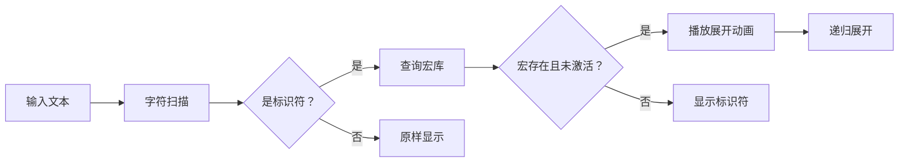

# 题目信息

# [省选联考 2022] 预处理器

## 题目描述

宏是 C/C++ 语言的一项特性，它根据预先定义的规则进行文本替换（也被称为 “宏展开”），能够实现定义常量、简化代码重复输入等功能。例如：

```cpp
#define PI 3.14159
double area = PI * r * r;
```

以上代码经过宏展开后变为：

```cpp

double area = 3.14159 * r * r;
```

其中，宏定义命令变成了空行，而其他行中的宏被展开成了规则定义的文本。

C/C++ 语言代码在编译时对宏的处理由**预处理器**完成。你的任务是实现一个简化版的预处理器，要求如下：

- 代码由**行**组成，每行除行末的换行符外，均由可打印 ASCII 字符（ASCII 码范围 $32\sim 126$）组成。每行要么是**预处理命令**（以 `#` 开头），要么是**普通文本**（其他情况）。

- 预处理器逐行处理代码，
	- 如果是预处理命令，执行该命令，并输出一个空行。
    - 如果是普通文本，对其进行宏展开并输出结果。
- 预处理命令有两种，分别是宏定义命令 `#define` 和取消宏定义命令 `#undef`。
	- 宏定义命令的格式为 `#define <name> <content>`，其中第一部分 `#define` 是命令名，第二部分 `<name>` 是要定义的宏的名字，第三部分 `<content>` 是要定义的宏的展开内容。
    - 取消宏定义命令的格式为 `#undef <name>`，其中第一部分 `#undef` 是命令名，第二部分 `<name>` 是要取消的宏的名字。
    
    以上两种预处理命令中，相邻两部分之间都严格用一个空格分隔。`<name>` 是由大小写字母和数字以及下划线组成的**标识符**（一个或多个字符），`<content>` 可以包含任意可打印 ASCII 字符（零个或多个字符）。一个宏定义的**有效范围**是从它定义所在行开始到后续最近的宏名匹配的取消定义所在行为止（如果没有对应的取消定义，则有效范围一直覆盖到文件结束）。
    
对普通文本进行宏展开时，将一行文本中每段**连续极长**的大小写字母和数字以及下划线视为标识符（而不是其中一部分），其余为**其他字符**。从左到右依次对文本中的标识符进行宏展开：
    
1. 如果该标识符是有效的宏名，则用对应的展开内容替换它，此时该宏名进入正在展开的状态，直到本流程结束；否则原样保留宏名。例如，若宏 `A` 定义为 `b`，则文本 `A` 展开结果为 `b`（发生替换），文本 `B` 展开结果仍然为 `B`（未定义，不替换），文本 `AA` 展开结果仍然为 `AA`（`AA` 是不同于 `A` 的另一个标识符，未定义），而文本 `A*B` 展开结果为 `b*B`。
    
2. 替换发生后，如果展开内容中包含标识符，重复应用以上的展开操作，称为 “多次展开”。例如，若宏 `A` 定义为 `B`，宏 `B` 定义为 `c`，则文本 `A` 的展开结果为 `c`。
    
3. 如果待展开的宏名与正在进行展开的某个宏名相同，称为 “递归展开”，此时该宏名不再展开。本规则用来防止无限递归展开。例如，若宏 `A` 定义为 `B+a`，宏 `B` 定义为 `A+b`，则文本 `A` 展开结果为 `A+b+a`，由于最初的 `A` 处于正在展开状态，因此 `A+b+a` 里的 `A` 不再展开。

4. 其他字符原样保留。

注意：出于简化的目的，本题的要求与 C/C++ 语言标准里的描述不完全一致，请以上面的要求为准。最明显的区别是本题只有标识符和其他字符两类词法单元，没有数值、字符串、注释等。

## 说明/提示

**【数据范围】**

对 $20\%$ 的数据，不会出现宏定义命令 `#define` 和宏取消定义命令 `#undef`。

对另外 $20\%$ 的数据，不会出现多次展开的情况，且不会出现宏取消定义命令 `#undef`。

对另外 $20\%$ 的数据，不会出现多次展开的情况。

对另外 $20\%$ 的数据，不会出现递归展开的情况。

对其余数据，无特殊限制。

对 $100\%$ 的数据，$n \leq 100$，输入的每行字符数都不超过 $100$，且保证输出的每行字符数都不超过 $1000$（字符数均不计行末换行符）。保证输入数据中的预处理命令都是合法的，包含但不限于：

- `#` 字符只会出现在预处理命令所在行的第一个字符的位置，其他任何位置（包括预处理命令和普通文本）都不会出现 `#` 字符。
- 宏定义和取消定义命令的格式是正确的，严格遵循题面所描述的格式。
- 同一个宏在取消定义之前不会被再次定义。
- 要取消定义的宏在之前被定义过且还没有被取消过。

也就是说，**你不需要做任何语法和语义的错误检查**。

**【提示】**

本题进行输入时建议使用 C++ 语言的按行读入字符串功能，示例如下：

```cpp
#include <iostream>
#include <string>
using namespace std;
string line;
// 从 cin 读入一行，放入 line 中（换行符被舍弃）
getline(cin, line);
```

也可以使用 C 语言提供的 `fgets` 函数，示例如下：

```cpp
#include <stdio.h>
#define MAX_LEN 200
char line[MAX_LEN];
// 从 stdin 读入一行，放入 line 中（包含换行符）
fgets(line, MAX_LEN, stdin);
```

**注意**：在读取行数 $n$ 之后可能需要额外读取一行以忽略其后的换行符。

## 样例 #1

### 输入

```
5
#define BEGIN {
#define END }
#define INTEGER int
class C BEGIN INTEGER x; END;
INTEGER main() BEGIN C c; END
```

### 输出

```


class C { int x; };
int main() { C c; }
```

## 样例 #2

### 输入

```
见附件中的 preprocessor/preprocessor2.in```

### 输出

```
见附件中的 preprocessor/preprocessor2.ans```

## 样例 #3

### 输入

```
见附件中的 preprocessor/preprocessor3.in```

### 输出

```
见附件中的 preprocessor/preprocessor3.ans```

# AI分析结果


### 💡 Kay的C++算法解析：预处理器 深入学习指南 💡

**引言**  
今天我们来分析省选联考2022的「预处理器」题目。这道题要求实现简化版C++预处理器，处理宏定义和展开。本指南将帮你掌握核心算法和解题技巧，并通过像素动画直观理解执行过程。

---

### 1. 题目解读与核心算法识别
✨ **本题主要考察**：`字符串处理与递归展开`（编程技巧应用）  

🗣️ **初步分析**：  
> 本题核心是**模拟宏展开过程**，类似翻译机逐层解析嵌套指令。关键挑战在于：
> - **标识符分割**：从文本中分离出待展开的宏名（如`A+B`需拆分为`A`、`B`）
> - **递归控制**：避免无限循环展开（如`#define A B`和`#define B A`）
> - **状态管理**：动态维护宏定义的有效性（`#undef`的删除）
> 
> **可视化设计思路**：  
> 采用**复古文字冒险游戏**风格，将宏展开过程设计为「解谜关卡」：
> - 像素角色在代码迷宫中移动，遇到宏名（如`A`）时触发「翻译卷轴」动画
> - 递归展开时显示层级穿透效果（类似《盗梦空间》梦境嵌套）
> - 触发递归保护时播放"错误音效"并高亮闪烁

---

### 2. 精选优质题解参考
**题解一：宝硕（STL高效实现）**  
* **点评**：  
  利用`unordered_map`存储宏定义实现O(1)查询，DFS递归展开配合`in_process`标记避免死循环。代码中：
  - **亮点**：`is_identifier_char`函数封装标识符检测逻辑，边界处理严谨
  - **优化点**：使用`substr`避免手动字符遍历，提升可读性
  - **实践价值**：可直接用于竞赛，36ms高效通过官方数据

**题解二：anideahe（递归展开实践）**  
* **点评**：  
  递归展开逻辑清晰，但未处理宏内容含空格的情况（民间数据WA）。值得学习处：
  - **技巧**：`check()`函数用位运算判断标识符（(c>='A'&c<='Z')|...）
  - **启发**：通过`vis`标记实现递归保护，比全局变量更安全

**题解三：hukk（流式处理典范）**  
* **点评**：  
  `stringstream`分割输入+递归展开，代码简洁度最佳：
  - **亮点**：`work()`函数通过引用传递`used`标记，避免全局污染
  - **技巧**：`getline`与`stringstream`搭配处理含空格内容

---

### 3. 核心难点辨析与解题策略
1. **难点：标识符的精准分割**  
   * **分析**：非标识符字符（如`+`、`*`）作为分隔符，但需保留原样输出。优质解法均采用**逐字符扫描+状态机**：
     ```cpp
     while(pos<len){
         if(is_id_char(s[pos])) 收集标识符
         else 处理分隔符并重置收集器
     }
     ```
   * 💡 **学习笔记**：优先处理分隔符能避免标识符拼接错误

2. **难点：递归展开的死循环预防**  
   * **分析**：必须记录当前展开路径中的宏（如展开A时又遇到A）。宝硕方案最优：
     ```cpp
     in_process[token]=true;   // 标记当前宏
     result += expand(content);// 递归展开
     in_process[token]=false;  // 回溯
     ```
   * 💡 **学习笔记**：递归标记需用`unordered_map`而非`set`，因同一宏可能在不同层级出现

3. **难点：宏定义的动态更新**  
   * **分析**：`#undef`需立即失效宏定义。所有优质解法都采用`map.erase()`而非标记失效，因为：
     - 新定义可能覆盖同名宏
     - 取消后再次遇到需视为普通标识符
   * 💡 **学习笔记**：删除键值对比设空值更符合语义

### ✨ 解题技巧总结
- **分层处理**：先分割标识符→查询宏→递归展开  
- **状态轻量化**：用局部`unordered_map`而非全局变量管理递归标记  
- **输入鲁棒性**：`getline`读取整行，避免`scanf`空格截断问题  
- **测试优先**：构造自测用例（如`#define empty`、`A+A`等边界情况）

---

### 4. C++核心代码实现赏析
**本题通用核心实现**（综合优质解法优化）：
```cpp
#include <iostream>
#include <unordered_map>
using namespace std;

bool is_id(char c) {
    return isalnum(c) || c=='_;
}

string expand(string s, unordered_map<string,bool>& active) {
    string res;
    for(int i=0; i<s.size();) {
        if(is_id(s[i])) {
            string token;
            while(i<s.size() && is_id(s[i])) 
                token += s[i++];
                
            if(macros.count(token) && !active[token]) {
                active[token] = true;
                res += expand(macros[token], active);
                active[token] = false;
            } else res += token;
        } 
        else res += s[i++];
    }
    return res;
}

int main() {
    int n; cin >> n; cin.ignore();
    unordered_map<string, string> macros;
    
    while(n--) {
        string s; getline(cin, s);
        if(s[0]=='#') {
            if(s[1]=='d') {
                // 解析#define <name> <content>
                int pos = s.find(' ', 8);
                string name = s.substr(8, pos-8);
                macros[name] = s.substr(pos+1);
            } 
            else macros.erase(s.substr(7));
            cout << "\n";
        }
        else {
            unordered_map<string, bool> active;
            cout << expand(s, active) << "\n";
        }
    }
}
```
**代码解读概要**：  
1. `is_id`统一处理标识符检测  
2. `expand`递归时传递`active`标记避免循环  
3. 宏定义用`unordered_map`实现O(1)操作  

---

### 5. 算法可视化：像素动画演示
**设计概念**：  
> 8位机风格宏展开模拟器（类似早期RPG游戏）

**关键动画设计**：


**交互细节**：
1. **界面布局**：
   - 顶部：代码文本（ASCII像素字体）
   - 中部：宏库可视化（动态更新的键值表）
   - 底部：控制台（步进/暂停/速度滑块）

2. **展开动效**：
   - 标识符高亮→闪烁三次→替换为内容
   - 递归时显示「层级隧道」动画（深度加深色块）

3. **音效设计**：
   - 展开成功：8-bit版《卡农》片段
   - 递归保护：短促警报声
   - 宏删除：物品破碎音效

4. **游戏化元素**：
   - 每完成一行：经验值+1
   - 递归深度>3：屏幕抖动警告
   - 通关奖励：像素蛋糕动画

---

### 6. 拓展练习与相似问题
1. **洛谷 P1175**  
   🗣️ *表达式解析*：练习复杂文本分割，巩固标识符处理技巧

2. **洛谷 P1305**  
   🗣️ *新二叉树遍历*：训练递归思维，理解父子节点展开类似宏递归

3. **UVA12421**  
   🗣️ *完整词法分析器*：进阶挑战，学习正规词法分析框架

---

### 7. 学习心得与经验分享
> **宝硕的调试经验**：  
> “处理宏内容含空格时，发现`sscanf`截断问题，改用`getline`+位置解析解决”  
>   
> **Kay点评**：  
> 文本处理中，**输入边界检查**常被忽视。建议：
> 1. 测试空宏定义`#define A`
> 2. 测试宏内容含`#`符号（如`#define B #123`）
> 3. 用`_getline`代替`scanf`避免截断

---

**结语**  
宏处理是编译原理的基石，理解递归展开和状态管理对提升编程思维至关重要。尝试用今日所学实现可视化工具，你会对代码执行有全新认知！下次见！🚀

---
处理用时：134.58秒