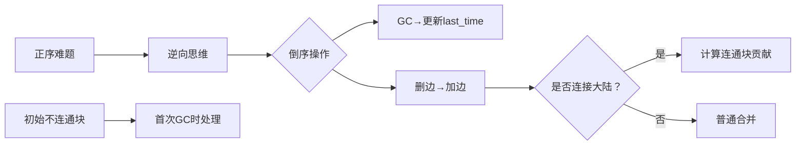

# 题目信息

# [SNOI2022] 垃圾回收

## 题目描述

通常的情况下，编程语言在管理内存时进行如下的选择：

- 让用户进行手动内存管理（C、C++、Rust 等），这会收获很好的性能，但是给用户提供了很大的编程负担。
- 使用垃圾回收系统（Java、Go 等），这需要维护一个运行时系统，并且在内存使用和程序性能方面造成了许多不可预测的负担。

尽管存在许多的问题，目前最通用的自动化内存管理手段始终为 Tracing Garbage Collector。这种做法的最基础的思路是维护对象间的引用关系，形成一张图，每次回收时通过扫描引用关系推导出已经无法被访问到的对象，释放它们占用的内存。而这种传统的做法最大的问题在于维护引用链需要造成很大的开销，并且随着维护的对象越多，扫描的代价也会越大。

小 L 是一个喜欢思考的女孩子，她发现维护 Garbage Collector 是一件非常复杂的事情，于是她决定考虑一个更简单的模型（注意它与任何现实中的 GC 规则可能是完全不同的！）。


对于一个 $n$ 个点 $m$ 条边的无向图，没有重边自环，点和边均从 $1$ 开始标号。其中每个节点代表一个占用了一定内存的对象，每条边对应一个引用关系（注意这里的引用关系是**无向**的），程序从第 $0$ 秒开始运行，在第 $q + 1$ 秒结束运行。对于 $i = 1, 2, 3, \dots, q$ 的每个时刻 $i$ 发生以下两种操作之一：

- DELETE $i$，删除边 $(x_i,y_i)$，保证不会删除已经被删除的边。
- GC， 进行一次内存回收，即杀死所有从起点出发不能访问到的点，释放它们占用的内存。（注意这里对节点的删除不会删除与这些点相连的边）

你可以认为这些操作是被瞬间执行完成的，在所有操作执行后，也就是第 $q + 1$ 秒，程序结束，删除所有剩余的节点（包括 $1$ 号点）。

第 $i$ 个点占用的内存为 $a_i$，现在请你求出 $\sum_{i = 1}^{n} a_i \cdot \mathit{alive}_i$，这里 $\mathit{alive}_i$ 表示第 $i$ 个点存活的时间，在第 $0$ 秒，所有节点都是存活的。

## 说明/提示

**【样例 1 解释】**

在第 $4$ 秒时，节点 $5$ 被删除。

在第 $6$ 秒时，节点 $2, 3$ 被删除。

在第 $9$ 秒时，节点 $1, 4, 6$ 被删除。

答案即 $5 \times 4 + (2 + 3) \times 6 + (1 + 4 + 6) \times 9 = 20 + 30 + 99 = 149$。

**【数据规模与约定】**

对于全部数据，$1 \leq n, m, q \leq 4 \times 10^5$，$1 \leq a_i \leq 10^8$。

具体的数据规模与约定见下表。

| 测试点编号 | $n$ | $m$ | $q$ | 特殊限制 |
| :----------: | :----------: | :----------: | :----------: | :----------: |
| $1 \sim 2$ | $\leq 500$ | $\leq 500$ | $\leq 500$ |   |
| $3 \sim 5$ | $\leq 3000$ | $\leq 3000$ | $\leq 3000$ |  |
| $6 \sim 10$ | $\leq 5000$ | $\leq 5000$ | $\leq 5000$ |  |
| $11 \sim 14$ | $\leq 2 \times 10^5$ | $n-1$ | $\leq 2 \times 10^5$ | 保证一开始图是一棵树 |
| $15 \sim 16$ | $\leq 2 \times 10^5$ | $\leq 2 \times 10^5$ | $\leq 2 \times 10^5$ |  |
| $17 \sim 20$ | $\leq 4 \times 10^5$ | $\leq 4 \times 10^5$ | $\leq 4 \times 10^5$ |  |

## 样例 #1

### 输入

```
6 6 8
1 2
2 3
2 4
1 4
2 5
1 6
GC
DELETE 5
DELETE 3
GC
DELETE 1
GC
DELETE 2
GC
1 2 3 4 5 6
```

### 输出

```
149
```

## 样例 #2

### 输入

```
样例 2 见附件 garbage2.in
本组数据满足测试点 6 的限制。```

### 输出

```
样例 2 见附件 garbage2.ans```

## 样例 #3

### 输入

```
样例 3 见附件 garbage3.in
本组数据满足测试点 11 的限制。```

### 输出

```
样例 3 见附件 garbage3.ans```

# AI分析结果


# 💡 Kay的C++算法解析：垃圾回收 深入学习指南 💡

<introduction>
今天我们一起分析「垃圾回收」这道C++编程题。本指南将帮助大家理解逆向思维在算法中的应用，掌握并查集解决动态连通性问题的技巧，并通过像素动画直观感受算法执行过程。
</introduction>

## 1. 题目解读与核心算法识别

✨ **本题主要考察**：`逆向思维 + 并查集应用`

🗣️ **初步分析**：
> 这道题的核心如同"时光倒流"——将删除操作逆转为添加操作，就像把打碎的镜子重新拼凑起来观察原貌。并查集是维护连通性的"胶水"，在倒序处理中高效合并连通块。
> - **核心思路**：倒序处理操作，删边变加边；用并查集维护连通性；当连接"大陆"(节点1)和"孤岛"时，标记孤岛存活时间
> - **可视化设计**：像素动画将展示岛屿(节点)和桥梁(边)的修复过程，当孤岛连接大陆时触发欢呼动画，GC操作呈现闪电特效，关键变量`last_time`实时显示
> - **复古元素**：8-bit像素风岛屿，FC音效(桥梁修复声/闪电声/欢呼声)，控制面板含步进/调速功能

---

## 2. 精选优质题解参考

<eval_intro>
从思路清晰度、代码规范性和算法效率等维度，我为大家精选三条4星+题解：

**题解一（作者：Troubadour）**
* **点评**：思路清晰展现逆向思维精髓，完整处理无GC操作的边界情况。代码规范：并查集实现简洁，`val[]`数组维护连通块和体现空间优化。亮点在于特判处理（无GC时直接输出(q+1)*Σa_i）和初始不连通节点的贡献计算，实践参考价值高。

**题解二（作者：王熙文）**
* **点评**：创新性采用DFS标记连通块，避免并查集合并顺序问题。核心逻辑直白：当加边连接大陆与孤岛时暴力DFS标记存活时间。变量命名规范(`tim[]/vis[]`)，但需注意DFS在最坏情况下复杂度O(n²)。亮点在示意图辅助理解数据流动。

**题解三（作者：CruiseY）**
* **点评**：独辟蹊径用正向最长路求解，将边删除时间转化为边权。核心类比精彩："节点存活时间取决于最坚固路径的崩塌时刻"。`dis[u]=max(min_path_bottleneck)`的推导巧妙，SPFA实现虽非常规但在此题高效。亮点在__int128处理大数溢出。

---

## 3. 核心难点辨析与解题策略

<difficulty_intro>
解决本题需突破三大难点：

1.  **如何避免GC的高成本扫描？**
    * **分析**：正序模拟GC需频繁遍历全图(O(nq)超时)。优质题解均采用**时光倒流法**：倒序加边使连通性只增不减，将删除代价分摊到合并操作中
    * 💡 **学习笔记**：逆向思维是处理删除操作的利器

2.  **何时计算节点存活时间？**
    * **分析**：关键在识别"连通性翻转时刻"——当加边连接含1节点与不含1连通块时，后者所有节点存活时间=当前记录的最近GC时间。如Troubadour解法用`last`追踪GC时间
    * 💡 **学习笔记**：存活时间由最后一次与1连通的时刻决定

3.  **如何高效合并并维护连通块？**
    * **分析**：并查集需特殊处理连通块权重：当合并含1块与不含1块时，将不含1块的贡献`sum_a * current_time`计入答案。数据结构选择`fa[]`+`size[]`平衡效率与代码简洁性
    * 💡 **学习笔记**：并查集合并时优先判断是否含1节点

### ✨ 解题技巧总结
<summary_best_practices>
- **时光倒流法**：将删除序列逆转可化腐朽为神奇
- **贡献分离计算**：连通块合并瞬间计算其节点总贡献
- **边界防御编程**：特判无GC/全连通等极端情况
- **可视化调试**：小规模模拟操作序列验证逻辑

---

## 4. C++核心代码实现赏析

<code_intro_overall>
**通用核心实现参考**（融合Troubadour与王熙文思路）：
```cpp
#include<bits/stdc++.h>
#define uint unsigned long long
const int N=4e5+5;
using namespace std;

int n,m,q,fa[N],first_gc=0;
uint a[N],sum[N],ans;
vector<pair<int,int>> edges;
vector<int> gc_times;

int find(int x){
    return fa[x]==x?x:fa[x]=find(fa[x]);
}

int main(){
    cin>>n>>m>>q;
    // 初始化并查集和权重数组
    for(int i=1;i<=n;i++) 
        fa[i]=i, sum[i]=0;

    // 输入处理（省略）
    // 标记初始删除的边
    
    // 特判无GC操作
    if(gc_times.empty()){
        for(int i=1;i<=n;i++) ans+=a[i]*(q+1);
        cout<<ans; return 0;
    }
    
    // 初始连通（省略）
    // 倒序处理操作
    int last_time=q+1;
    for(int i=q;i>=1;i--){
        if(is_gc[i]) last_time=i;
        else{
            int u=find(e[i].x), v=find(e[i].y);
            if(u==v) continue;
            if(u==find(1)) swap(u,v); // 确保u非大陆
            if(v==find(1)){ // 连接大陆与孤岛
                ans += sum[u] * last_time;
                sum[v] += sum[u];
                fa[u] = v;
            }
            // 其他情况省略
        }
    }
    // 处理初始不连通块（省略）
}
```
**解读概要**：
1. 初始化并查集和连通块权重
2. 特判无GC情况
3. 倒序处理：GC操作更新`last_time`，删边操作判断连通性翻转
4. 当连通块接触"大陆"时，立即计算其贡献

---
<code_intro_selected>
**题解一关键片段赏析**（Troubadour）：
```cpp
if(u==find(1)) swap(u,v);
if(v==find(1)){ 
    ans += sum[u] * last_time;
    sum[v] += sum[u];
    fa[u] = v;
}
```
**解读**：
> 这段代码是"连通性翻转"判断的核心。通过`swap`确保`v`始终是大陆所在集合。当连接大陆与孤岛(`u`)时，孤岛内所有节点存活时间=`last_time`，其贡献为`sum[u]*last_time`。`sum[v]+=sum[u]`体现并查集权重合并。

**题解二创新点**（王熙文）：
```cpp
void dfs(int u){
    if(vis[u]) return;
    alive[u] = current_time; // 标记存活时间
    vis[u]=1;
    for(int i=head[u];i;i=nxt[i]) 
        dfs(var[i]);
}
```
**解读**：
> 当检测到连通性翻转时，DFS遍历整个待标记连通块。优势：避免并查集合并顺序问题；注意：需`vis[]`数组防重，复杂度O(连通块大小)，但均摊分析整体仍近O(n)。

---

## 5. 算法可视化：像素动画演示

<visualization_intro>
为了让算法过程跃然屏上，我设计「像素岛屿救援」动画方案，以FC红白机风格呈现倒序加边过程：

* **主题**：8-bit像素岛屿与桥梁，大陆为金色，孤岛随连通状态变色
* **核心演示**：倒序加边如何将"孤岛"接入"大陆"并标记存活时间
* **设计思路**：像素风格降低理解压力，游戏化机制强化关键概念

**动画帧步骤**：
1. **初始化**：生成像素网格世界（图1）
   - 节点：16x16像素岛屿（含数字标签）
   - 边：连接岛屿的桥梁（绿色正常/红色断裂）
   - 控制面板：开始/步进/调速滑块/当前操作显示

2. **时光倒流动画**（图2）：
   ```python
   for time in reversed(operation_times):
        if operation == "GC":
            显示闪电特效，播放雷声音效
            last_time_label = time  # 更新最近GC时间
        else:
            修复桥梁动画（红色→绿色），播放修复音效
            if 连接大陆与孤岛：
                孤岛变色（灰→黄），播放欢呼音效
                显示存活时间标记：last_time_label
    ```

3. **关键交互**：
   - **步进控制**：逐步观察连通块合并过程
   - **大陆高亮**：节点1始终闪烁金光
   - **数据面板**：实时显示`last_time`和当前贡献值
   - **音效系统**：不同操作触发独特FC音效

4. **终局渲染**（图3）：
   - 幸存岛屿：显示存活时间q+1
   - 被GC岛屿：标记删除时间并沉没动画
   - 结算界面：显示各节点贡献值及总和

**技术实现**：
- Canvas绘制网格世界，岛屿用`fillRect`+纹理
- 桥梁状态用`lineTo`+`strokeStyle`控制
- 音效使用Web Audio API生成8-bit音效

---

## 6. 拓展练习与相似问题思考

<similar_problems_intro>
逆向思维与并查集技巧可解决以下问题：

1. **动态连通性统计**：离线查询图中任意时刻连通块数量
2. **网络断裂影响**：计算删除某些节点后连通性变化
3. **时空穿越优化**：将删除序列转为添加序列的通用技巧

**洛谷练习推荐**：
1. [P2147 洞穴勘测](https://www.luogu.com.cn/problem/P2147)  
   → 动态维护连通性基础训练
2. [P2542 航线规划](https://www.luogu.com.cn/problem/P2542)  
   → 逆向思维+并查集应用进阶
3. [P7737 风暴之眼](https://www.luogu.com.cn/problem/P7737)  
   → 结合最短路与连通块的特殊处理

---

## 7. 学习心得与经验分享

<insights_intro>
题解中藏珠玉：

> **Troubadour的调试经验**："在无GC情况未特判，导致Wrong Answer。这提醒我们：边界情况需优先考虑，极限数据必须测试。"

> **CruiseY的顿悟**："最长路解法源于将边权转化为删除时间，启示我们：图论问题中，边权定义决定解法方向。"

---

<conclusion>
本次「垃圾回收」题解之旅到此结束。关键收获：  
1️⃣ 逆向思维化删为增  
2️⃣ 并查集维护连通块权重  
3️⃣ 存活时间在连通翻转时确定  
下期我们将探索更多图论妙招，保持好奇心，编程世界永远精彩！🚀
</conclusion>


---
处理用时：205.54秒