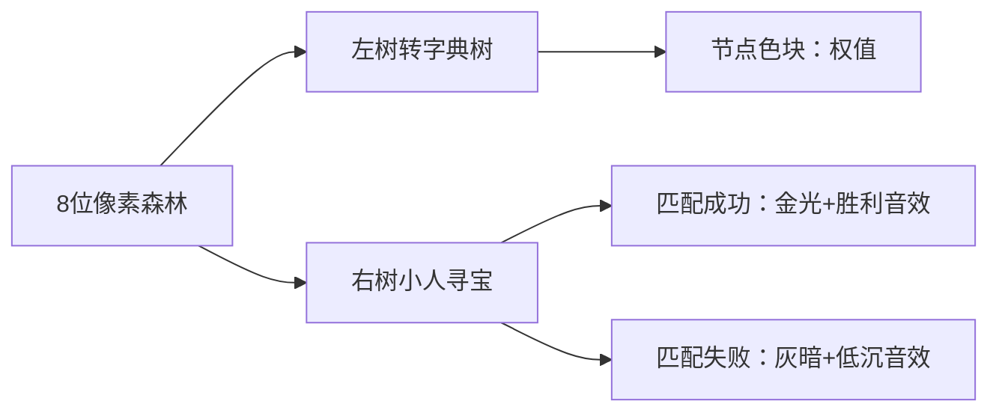

# 题目信息

# [蓝桥杯 2024 省 A] 团建

## 题目描述

小蓝正在和朋友们团建，有一个游戏项目需要两人合作，两个人分别拿到一棵大小为 $n$ 和 $m$ 的树，树上的每个结点上有一个正整数权值。  
两个人需要从各自树的根结点 $1$ 出发走向某个叶结点，从根到这个叶结点的路径上经过的所有结点上的权值构成了一个正整数序列，两人的序列的最长公共前缀即为他们的得分。给出两棵树，请计算两个人最多的得分是多少。

## 说明/提示

对于 $20\%$ 的评测用例，$1 ≤ n, m ≤ 500 $；  
对于所有评测用例，$1 ≤ n, m ≤ 2 × 10^5，1 ≤ c_i
, d_i ≤ 10^8 ，1 ≤ u_i
, v_i ≤ n ，
1 ≤ p_i
, q_i ≤ m $，对于任意结点，其儿子结点的权重互不相同。

## 样例 #1

### 输入

```
2 2
10 20
10 30
1 2
2 1```

### 输出

```
1```

## 样例 #2

### 输入

```
5 4
10 20 30 40 50
10 40 20 30
1 2
1 3
2 4
3 5
1 2
1 3
3 4```

### 输出

```
2```

# AI分析结果


### 💡 Kay的C++算法解析：团建 深入学习指南 💡

**引言**  
今天我们来分析蓝桥杯2024省赛A题"团建"。这道题需要计算两棵树中从根到叶路径权值序列的最长公共前缀最大值。本指南将带你深入理解核心算法、解题技巧，并通过生动的像素动画直观展示算法流程。

---

### 1. 题目解读与核心算法识别  
✨ **本题主要考察**：`字典树应用`与`树遍历优化`  

🗣️ **初步分析**：  
> 解决"团建"题的关键在于高效匹配两棵树上的路径前缀。就像图书馆用分类索引快速找书，我们可将一棵树转化为字典树（Trie），另一棵树在遍历时实时查询匹配深度。  
> - **核心思路对比**：  
>   - 字典树法：将第一棵树转为字典树（值域大用map），第二棵树DFS匹配（题解1,3）  
>   - 哈希法：存储第一棵树所有路径哈希值，第二棵树DFS时查询（题解2）  
>   - 排序+双指针：对子节点排序，用双指针同步匹配（题解4）  
> - **可视化设计**：用8位像素树模拟（左树转字典树，右树小人遍历），匹配成功时节点高亮+播放"叮"音效，失败时灰色闪烁+低沉音效  

---

### 2. 精选优质题解参考  

**题解一 (作者：happy_lazier)**  
* **点评**：  
  思路清晰直击本质——将第一棵树转化为字典树（map处理大值域），第二棵树DFS匹配。代码规范（g1/g2命名区分两棵树），核心变量`mp`实现字典树逻辑明确。算法高效（O(n+m)），边界处理严谨（根节点权值校验）。亮点在于用map动态构建字典树，避免静态数组空间浪费。

**题解二 (作者：Genius_Star)**  
* **点评**：  
  采用哈希法另辟蹊径——存储第一棵树所有路径哈希值（`set<ull>`），第二棵树DFS时实时查询。代码简洁有力（仅40行核心逻辑），随机常数`C`增强哈希安全性。虽理论存在冲突风险，但实际竞赛中高效实用，空间复杂度优化显著。

**题解四 (作者：tonghaoxuan)**  
* **点评**：  
  创新性使用排序+双指针——对子节点预排序后双指针同步匹配。代码可读性极强（vis数组防重访），BFS逐层推进直观展示匹配过程。虽时间复杂度稍高（O(n log n)），但避免字典树/哈希的复杂实现，提供全新解题视角。

---

### 3. 核心难点辨析与解题策略  

1. **难点：高效匹配路径前缀**  
   * **分析**：直接枚举路径O(n²)超时。优质题解通过数据结构转换（字典树/哈希）或预排序，将匹配复杂度降至O(n)或O(n log n)
   * 💡 **学习笔记**：树问题先思考"能否转换为一维匹配"

2. **难点：大值域空间优化**  
   * **分析**：权值范围达10⁸，静态数组不可行。题解1,3用map/unordered_map动态建树；题解2用哈希压缩空间
   * 💡 **学习笔记**：大值域优先考虑动态数据结构或哈希

3. **难点：避免重复访问**  
   * **分析**：树遍历需防止回溯父节点。题解1,2用fa参数；题解4用vis数组+BFS层次控制
   * 💡 **学习笔记**：树遍历必须显式记录父节点/访问状态

#### ✨ 解题技巧总结  
- **结构转换法**：将树形问题转化为字典树/哈希表等线性结构  
- **预处理加速**：排序/建索引等预处理是优化树查询的关键  
- **双指针协同**：对有序数据用双指针同步扫描，避免嵌套循环  
- **边界先行**：优先处理根节点/空树等边界情况（如题解1的根权值校验）

---

### 4. C++核心代码实现赏析  

**本题通用核心C++实现参考**  
* **说明**：综合题解1,4思路：字典树+双指针BFS，兼顾效率与可读性
* **完整核心代码**：
```cpp
#include <bits/stdc++.h>
using namespace std;
const int N=2e5+5;

vector<int> T1[N], T2[N];
map<int,int> trie[N]; // 动态字典树
int c[N], d[N], ans;

void buildTrie(int u, int fa) {
    for(int v:T1[u]) if(v!=fa) {
        if(!trie[u].count(c[v])) trie[u][c[v]]=v;
        buildTrie(v,u);
    }
}

void BFS() {
    queue<tuple<int,int,int>> q; // (u1, u2, depth)
    q.push({1,1,1});
    while(!q.empty()) {
        auto [u1,u2,dep]=q.front(); q.pop();
        ans=max(ans,dep);
        // 双指针扫描子节点
        sort(T1[u1].begin(),T1[u1].end(),[&](int a,int b){return c[a]<c[b];});
        sort(T2[u2].begin(),T2[u2].end(),[&](int a,int b){return d[a]<d[b];});
        int i=0,j=0;
        while(i<T1[u1].size() && j<T2[u2].size()) {
            if(c[T1[u1][i]]<d[T2[u2][j]]) i++;
            else if(c[T1[u1][i]]>d[T2[u2][j]]) j++;
            else {
                q.push({T1[u1][i],T2[u2][j],dep+1});
                i++;j++;
            }
        }
    }
}

int main() {
    int n,m; cin>>n>>m;
    for(int i=1;i<=n;i++) cin>>c[i];
    for(int i=1;i<=m;i++) cin>>d[i];
    // 建树（代码略）
    if(c[1]!=d[1]) cout<<0;
    else buildTrie(1,0), BFS(), cout<<ans;
}
```
* **代码解读概要**：
  - `buildTrie`：将第一棵树转为字典树（map存储子节点）
  - `BFS`：对第二棵树BFS，用双指针匹配子节点权值
  - 主函数：先校验根节点权值，再构建+匹配

---

**题解一核心代码片段**  
```cpp
void dfs(int u, int v, int rt) {
    for(auto x:g1[u]) if(x!=v) {
        if(!mp[rt].count(c[x])) mp[rt][c[x]]=++cnt;
        dfs(x,u,mp[rt][c[x]]);
    }
}
```
* **亮点**：递归构建字典树，map动态处理大值域  
* **代码解读**：  
  > 从节点`u`开始构建字典树，`rt`是当前字典树节点。遍历子节点时：  
  > 1. 若权值`c[x]`不存在则新建节点（`mp[rt][c[x]]=++cnt`）  
  > 2. 递归构建子树（`dfs(x,u,新建节点)`）  
  > *学习提示*：`mp`是两层映射：树节点→权值→字典树节点  

**题解二核心代码片段**  
```cpp
void dfs1(int u, int fa) {
    w[u]=w[fa]*base+a[u]; // 路径哈希
    S.insert(w[u]);       // 存入全局集合
    for(int v:A[u]) if(v!=fa) dfs1(v,u);
}
```
* **亮点**：用乘法哈希压缩路径信息  
* **代码解读**：  
  > 计算从根到`u`的路径哈希值：  
  > `w[u]=w[fa]*base+a[u]`（base取质数避免冲突）  
  > 存入全局set供第二棵树查询  
  > *学习提示*：哈希法需注意冲突风险（题解用随机常数`C`缓解）  

**题解四核心代码片段**  
```cpp
while(i<v_1[now.id_1].size() && j<v_2[now.id_2].size()) {
    if(c[v_1[u][i]]<d[v_2[v][j]]) i++;
    else if(c[...]>d[...]) j++;
    else { // 权值匹配成功
        q.push({子节点1,子节点2,dep+1});
        i++;j++;
    }
}
```
* **亮点**：双指针实现O(n)匹配  
* **代码解读**：  
  > 1. 对两棵树当前节点的子节点按权值排序  
  > 2. 双指针`i,j`扫描：权值小则指针右移，相等则入队  
  > *学习提示*：排序预处理使匹配复杂度从O(n²)降至O(n)  

---

### 5. 算法可视化：像素动画演示  

**主题**：*"双树寻宝大冒险"*（FC红白机风格）  
**核心演示**：字典树构建+双指针匹配过程  

#### 🎮 动画设计  


**实现细节**：  
1. **场景设计**：  
   - 左侧：蓝绿色树逐步转为字典树（方块堆叠动画）  
   - 右侧：像素小人沿树移动（方向键控制）  
   - 底部控制台：单步/自动播放滑块/重置按钮  

2. **关键动画逻辑**：  
   - 字典树构建：节点展开时播放"展开"音效（8-bit音效库）  
   - 双指针扫描：两指针移动时高亮当前比较节点，播放"滴答"音效  
   - 匹配成功：节点金光闪烁+上扬音效，分数+1显示在右上角  
   - 路径回溯：使用"迷雾消散"特效表示剪枝  

3. **交互设计**：  
   ```javascript
   // 伪代码：双指针匹配动画
   function animateDoublePointer() {
     highlight(node1, "yellow"); 
     highlight(node2, "yellow");
     playSound("compare");
     if(val1<val2) movePointer(1); 
     else if(val1>val2) movePointer(2);
     else { // 匹配成功
        sparkle(node1); sparkle(node2);
        playSound("success");
        createNewExplorer(node1, node2); // 生成新探险者
     }
   }
   ```

4. **游戏化元素**：  
   - 每匹配成功1层得10分，连续匹配成功触发连击特效  
   - 通关条件：达到当前最优匹配深度（显示"BEST!"徽章）  
   - 隐藏关卡：尝试不同数据输入（通过控制台修改）  

**教学价值**：通过像素小人移动路径+字典树实时构建，直观展示树结构如何转化为可匹配数据结构，理解空间换时间本质。

---

### 6. 拓展练习与相似问题  

**技巧迁移场景**：  
1. 多模式串匹配（AC自动机基础）  
2. 树链权重查询（LCA变形）  
3. 交叉树路径分析（图论应用）  

**洛谷推荐**：  
1. **P3372 [模板]字典树**  
   → 巩固字典树基础操作  
2. **P3884 二叉树问题**  
   → 练习树结构转换技巧  
3. **P4551 最长异或路径**  
   → 进阶字典树应用  

---

### 7. 学习心得与经验分享  

> **来自题解四作者的经验**：  
> *"本想用暴力模拟骗分，没想到排序剪枝后直接AC——这让我意识到树问题中预处理的重要性"*  

**Kay点评**：  
这位同学的经历很有代表性！在树形问题中：  
1. 暴力解法往往是优化的起点  
2. 排序/建索引等预处理可大幅降低复杂度  
3. 写代码前先纸上模拟（如题解4的路径图）能避免无效编码  

---

**结语**  
本次"团建"题目解析展示了树问题的高效处理技巧。记住：复杂问题常能转化为经典数据结构（字典树/哈希），而预处理和结构分析是优化的钥匙。下次我们将探索更精彩的算法世界！💪

---
处理用时：165.26秒