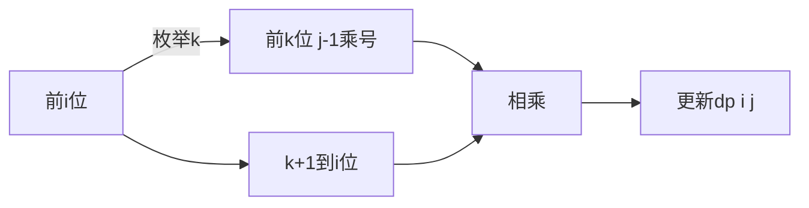

# 题目信息

# [NOIP 2000 提高组] 乘积最大

## 题目背景

NOIP2000 提高组 T2

## 题目描述

今年是国际数学联盟确定的“2000——世界数学年”，又恰逢我国著名数学家华罗庚先生诞辰 90 周年。在华罗庚先生的家乡江苏金坛，组织了一场别开生面的数学智力竞赛的活动，你的一个好朋友 XZ 也有幸得以参加。活动中，主持人给所有参加活动的选手出了这样一道题目：


设有一个长度为 $N$ 的数字串，要求选手使用 $K$ 个乘号将它分成 $K+1$ 个部分，找出一种分法，使得这 $K+1$ 个部分的乘积能够为最大。


同时，为了帮助选手能够正确理解题意，主持人还举了如下的一个例子：


有一个数字串：$312$，当 $N=3,K=1$ 时会有以下两种分法：

1. $3  \times  12=36$ 
2. $31  \times   2=62$  

   
这时，符合题目要求的结果是：$31  \times  2 = 62$。


现在，请你帮助你的好朋友 XZ 设计一个程序，求得正确的答案。


## 说明/提示

**数据范围与约定**

对于 $60\%$ 的测试数据满足 $6≤N≤20$。  
对于所有测试数据，$6≤N≤40,1≤K≤6$。


## 样例 #1

### 输入

```
4 2
1231
```

### 输出

```
62```

# AI分析结果


### 💡 Kay的C++算法解析：乘积最大 深入学习指南 💡

**引言**  
今天我们一起分析NOIP2000提高组"乘积最大"题目。这道题要求将长度为N的数字串插入K个乘号，分成K+1段后求最大乘积。本指南将带您深入理解动态规划与高精度算法的精妙配合。

---

### 1. 题目解读与核心算法识别
✨ **本题主要考察**：`动态规划` + `高精度应用`

🗣️ **初步分析**：  
> 这道题就像把数字串切成K+1段拼成最大乘积的披萨🍕。核心技巧是**动态规划**——记录切割过程中的局部最优解，逐步构建全局最优解。难点在于：  
> - 数字串长度≤40位，必须用高精度存储  
> - 需精确设计状态转移避免重复计算  
>  
> **可视化设计思路**：  
> 采用8位像素风格（类似FC游戏）动态展示数字串切割过程：
> - 红色闪烁块标识当前乘号位置  
> - 左侧区域显示已计算的dp值（绿色深浅表大小）  
> - 右侧蓝色块表示新切割的数字段  
> - 乘法过程用像素方块进位动画呈现  
> 音效设计：切割声"咔嚓"，乘法"叮"，最大值"胜利号角"🎺

---

### 2. 精选优质题解参考
**题解一：liar_white (5星)**  
* **点评**：  
  这份题解展现了教科书级的DP实现：  
  - **思路**：用`cut[i][j]`表示前i位放j个乘号的最大值，通过枚举最后一个乘号位置实现状态转移  
  - **代码**：高精度用结构体封装（含存在标记exi），变量命名清晰（culc/mul/Max）  
  - **算法**：O(n²k)复杂度合理，乘法用竖式算法避免溢出  
  - **实践**：完整处理边界条件，可直接用于竞赛  

**题解二：kuaiCreator (4星)**  
* **点评**：  
  - **思路**：精炼定义`dp[i][j]`为前i位分j段的最大值，转移方程简洁  
  - **代码**：提供非高精度版DP框架，帮助初学者理解核心逻辑  
  - **亮点**：配套状态转移示意图（7dcxuwoe.png）直观展示切割过程  

**题解三：FastIO_DP (4星)**  
* **点评**：  
  - **思路**：线性DP标准实现，状态定义与kuaiCreator一致  
  - **代码**：高精度通过运算符重载实现（BI结构体），使主逻辑简洁  
  - **实践**：完整包含字符串转高精度函数，可直接运行  

---

### 3. 核心难点辨析与解题策略
1. **状态定义**  
   *分析*：优质题解统一用`dp[i][j]`表示前i位用j个乘号的最大值。关键要确保状态覆盖所有子问题且无后效性，如`liar_white`的cut[i][j]  
   💡 **学习笔记**：好的状态定义应像"时间胶囊"⏳，完整封装子问题解  

2. **状态转移**  
   *分析*：必须枚举最后一个乘号位置k（范围j≤k<i），转移式为：  
   `dp[i][j] = max(dp[k][j-1] × num(k+1,i))`  
   💡 **学习笔记**：转移方程是DP的"传动轴"，连接子问题与全局解  

3. **高精度实现**  
   *分析*：三种高效方案：
   - 结构体+竖式乘法（liar_white）
   - 运算符重载（FastIO_DP）  
   - 预计算num[l][r]区间值（kuaiCreator）  
   💡 **学习笔记**：高精度是解决大数问题的"机械臂"🤖  

✨ **解题技巧总结**：  
- **问题分解**：将切割问题转化为阶段性决策  
- **模块化**：分离高精度运算与DP逻辑  
- **边界测试**：特别注意K=0/N=1等特殊情况  

---

### 4. C++核心代码实现赏析
**通用核心C++实现**  
```cpp
#include <iostream>
#include <vector>
#include <string>
using namespace std;

struct BigInt {
    vector<int> digits;
    // 构造函数、乘法重载、比较运算符等
    // 详见liar_white和FastIO_DP的实现
};

int main() {
    int N, K;
    string numStr;
    cin >> N >> K >> numStr;
    
    // 初始化dp[i][j]和num数组
    vector<vector<BigInt>> dp(N+1, vector<BigInt>(K+1));
    vector<vector<BigInt>> num(N+1, vector<BigInt>(N+1));
    
    // 预计算数字区间值
    for(int i=1; i<=N; i++) 
        for(int j=i; j<=N; j++)
            num[i][j] = strToBigInt(numStr.substr(i-1,j-i+1));
    
    // DP初始化及转移
    for(int i=1; i<=N; i++) {
        dp[i][0] = num[1][i];
        for(int j=1; j<=min(K,i-1); j++) 
            for(int k=j; k<i; k++)
                dp[i][j] = max(dp[i][j], dp[k][j-1] * num[k+1][i]);
    }
    
    cout << dp[N][K].toString();
}
```

**题解片段赏析**  
1. **liar_white的核心转移**  
```cpp
for(int i=1; i<=n; i++){
    cut[i][1]=culc(1,i); 
    for(int j=2; j<=k; j++) 
        for(int fr=j-1; fr<i; fr++)
            cut[i][j]=Max(cut[i][j], mul(cut[fr][j-1], culc(fr+1,i)));
}
```
> **解读**：  
> - `culc(1,i)`计算子串[1,i]的数值（反向存储）  
> - 三重循环分别控制：数字位置i、乘号数j、最后一个乘号位置fr  
> - `mul`实现高精度乘法，`Max`比较结果大小  

2. **FastIO_DP的运算符重载**  
```cpp
BI operator*(const BI& o) const {
    BI res;
    for(int i=0; i<len; i++) 
        for(int j=0; j<o.len; j++) 
            res.d[i+j] += d[i]*o.d[j]; // 竖式乘法核心
    // 进位处理...
}
```
> **解读**：  
> - 重载`*`运算符使DP转移更简洁（`dp[k][j-1] * num[k+1][i]`）  
> - 二维循环实现乘法本质，i+j定位结果数位  

---

### 5. 算法可视化：像素动画演示
**主题**：数字切割大冒险（8位像素风）  

**核心演示**：  
1. **场景初始化**  
   - 数字串显示为40个像素块（FC风格）  
   - 控制面板：步进/暂停/速度滑块（调速范围1x-5x）  

2. **DP状态转移演示**  

   - **当前操作**：红色闪烁块标识k位置  
   - **数据变化**：  
     * 左侧区域渐变绿色（深度表dp值大小）  
     * 右侧蓝色块展示num(k+1,i)的值  
     * 乘法过程：数字块碰撞→迸发进位火花✨  

3. **游戏化元素**  
   - 每完成一个状态转移得10分💯  
   - 超过历史最大值播放"胜利音效"🎵  
   - 背景音乐：8位芯片版《卡农》  

**技术实现**：  
- Canvas绘制数字块/状态矩阵  
- 音效触发：乘号放置→"咔嚓"，进位→"嘀"，最大值→"号角"  

---

### 6. 拓展练习与相似问题
**通用技巧迁移**：  
1. 分割问题 → P1045 回文数  
2. 高精度DP → P1090 合并果子（加强版）  
3. 最优化分割 → P1435 字串变换  

**洛谷推荐**：  
1. **P1045**  
   🗣️ 巩固高精度与状态转移，数据规模更大  
2. **P1090**  
   🗣️ 练习贪心与DP的抉择，需高精度  
3. **P1435**  
   🗣️ 类似分割思想，考察字符串处理  

---

### 7. 学习心得与经验分享
> **参考经验 (来自 liar_white)**：  
> "写注释感觉像白痴代码" → 复杂代码的详细注释反而体现专业性  
>  
> **点评**：  
> 调试时增加中间变量（如文中的tmp）是定位问题的利器。建议：  
> - 每完成一个模块立即测试边界值  
> - 用`cout`输出关键状态（如dp[3][1]）  
> - 模拟小数据（如N=3,K=1）逐步验证  

---

### 结语  
通过本次分析，相信大家已掌握乘积最大问题的核心解法。记住：动态规划是"记忆的艺术"，高精度是"数位的舞蹈"💃。下次遇到类似问题，不妨先画状态转移图！

---
处理用时：127.08秒