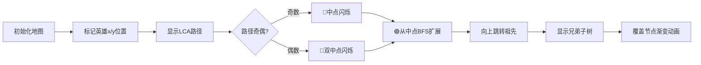

# 题目信息

# 【MX-J1-T3】『FLA - III』Anxiety

## 题目背景

原题链接：<https://oier.team/problems/J1C>。

---

I came. I saw. I had anxiety. I left.

## 题目描述

给定一棵拥有 $2^n-1$ 个节点的二叉树，节点 $i$ 的权值为 $w_i$，节点 $1$ 为根节点。对于所有非根节点 $i$ 都有一条双向边连接节点 $i$ 和节点 $\left\lfloor \frac{i}{2} \right\rfloor$。请注意 $\left\lfloor X \right\rfloor$ 表示不大于 $X$ 的最大整数。

定义节点 $u,v$ 的距离为从节点 $u$ 到节点 $v$ 最少需要经过的边数。给定 $m$ 组询问，第 $i$ 组询问给定三个正整数 $x_i,y_i,k_i$，你需要输出树上与 $x_i,y_i$ 两个节点的距离都不超过 $k_i$ 的节点的权值之和。

## 说明/提示

**「样例解释 #1」**


对于第一组询问，满足条件的节点有 $1,2$，权值和为 $2$。

对于第二组询问，满足条件的节点有 $1,2,3,4,5,6,7$，权值和为 $7$。

对于第三组询问，满足条件的节点有 $1,2,3$，权值和为 $3$。

**「数据范围」**

|测试点编号|$n \leq$|$m \leq$|$k_i \leq$|$w_i \leq$|
|:-:|:-:|:-:|:-:|:-:|
|$1$|$2$|$5$|$5$|$10$|
|$2 \sim 3$|$10$|$1000$|$1000$|$1000$|
|$4 \sim 5$|$18$|$2 \times 10^5$|$5$|$10^9$|
|$6 \sim 7$|$18$|$2 \times 10^5$|$10^9$|$1$|
|$8 \sim 10$|$18$|$2 \times 10^5$|$10^9$|$10^9$|

对于 $100\%$ 的数据，$2 \leq n \leq 18$，$1 \leq m \leq 2 \times 10^5$，$1 \leq x_i,y_i \leq 2^n-1$，$1 \leq k_i \leq 10^9$，$1 \leq w_i \leq 10^9$，$x_i \neq y_i$。节点的编号是从 $1$ 到 $2^n-1$ 的整数。

## 样例 #1

### 输入

```
3 3
1 1 1 1 1 1 1
3 4 2
5 4 6
3 2 2```

### 输出

```
2
7
3```

## 样例 #2

### 输入

```
4 5
3 4 10 7 1 6 10 6 16 5 3 16 6 2 9
1 4 6
4 2 1
1 14 5
6 13 3
11 15 2
```

### 输出

```
104
11
74
51
0
```

# AI分析结果


### 💡 Kay的C++算法解析：『FLA - III』Anxiety 深入学习指南 💡

#### 题目解读与核心算法识别
✨ **本题主要考察**：树上的路径查询与LCA应用  
🗣️ **初步分析**：
> 本题是一道经典的树上路径查询问题，核心在于利用完全二叉树的性质优化查询。想象一棵像素风格的游戏地图🌳，每个节点是地图上的一个像素点，我们需要找到同时靠近两个英雄（节点x和y）的区域（距离≤k）。关键在于找到英雄路径的"会合点"（中点），然后计算该点周围k步内的所有像素点（节点）的权值和。
>
> - **核心思路**：预处理子树前缀和 → 计算x,y的LCA → 确定路径中点 → 分层计算贡献（子树内+向上祖先链）
> - **难点**：路径中点位置判断（奇偶路径）、祖先链贡献计算、边界处理
> - **可视化设计**：使用8位像素风格展示二叉树（类似FC游戏），高亮显示：
>   - 英雄位置（x:🔵, y:🟡）
>   - 路径中线（🟣）
>   - 中点扩展过程（🟢渐变动画）
>   - 兄弟子树（🔶闪烁）
>   - 音效：路径标记（💠）、节点覆盖（💠）、完成（🎶）

---

#### 精选优质题解参考
**题解一（ScaredQiu）**  
* **点评**：  
  思路清晰度⭐⭐⭐⭐⭐ - 创新性地提出"路径中点"核心思想，完美利用完全二叉树特性  
  代码规范性⭐⭐⭐⭐ - 变量名`f[u][d]`含义明确，DFS预处理+分层计算结构工整  
  算法有效性⭐⭐⭐⭐⭐ - 时间复杂度$O(n2^n + mn)$，预处理优化巧妙  
  实践价值⭐⭐⭐⭐⭐ - 可直接用于竞赛，边界处理严谨（k=min(k,2n)）  
  💎 **亮点**：预处理子树和数组，中点向上跳转的贡献计算简洁高效

**题解二（shinzanmono）**  
* **点评**：  
  思路清晰度⭐⭐⭐⭐ - 分奇偶路径讨论，容斥思想严谨  
  代码规范性⭐⭐⭐ - 状态转移完整但嵌套较深  
  算法有效性⭐⭐⭐⭐ - 时间复杂度同最优解，空间优化稍弱  
  实践价值⭐⭐⭐ - 需注意容斥系数边界  
  💎 **亮点**：路径长度奇偶性的分类讨论模型

---

#### 核心难点辨析与解题策略
1. **路径中点定位**  
   * **分析**：通过LCA计算路径长度dis=dep[x]+dep[y]-2*dep[lca]+1。奇偶性决定中点数量（1或2），用栈记录路径节点  
   * 💡 **学习笔记**：`中点位置 = path[dis/2]`（奇）或`path[dis/2-1]&path[dis/2]`（偶）

2. **子树贡献计算**  
   * **分析**：预处理`f[u][d]`（u子树内距离≤d的权值和）。递推式：  
     ```python
     f[u][d] = w[u] + f[左子][d-1] + f[右子][d-1] 
     ```
   * 💡 **学习笔记**：完全二叉树的子树编号连续，可$O(1)$定位兄弟节点

3. **祖先链贡献**  
   * **分析**：向上跳转时：
     - 加祖先节点权值`w[fa]`
     - 加兄弟子树`f[bro][k-step-1]`
     - 步数step每跳+1
   * 💡 **学习笔记**：`bro = (pre%2==0)? pre+1 : pre-1`

✨ **解题技巧总结**：
- **性质转化**：完全二叉树 ⇒ 节点编号规律（父子/兄弟关系）
- **降维打击**：k≤10⁹ ⇒ 实际有效k'=min(k,2n)
- **贡献分离**：分"当前子树"+"祖先链"+"兄弟子树"三部分

---

#### C++核心代码实现赏析
**通用核心实现**（综合最优解思路）：
```cpp
ll query(int x,int y,int k){
    vector<int> path; // 存储路径节点
    // 1. 求LCA并记录路径（代码略）
    int dis = path.size();  // 路径节点数
    k = min(k, 2*n);        // 关键优化！
    int k_eff = k - dis/2; // 实际扩展步数
    
    // 2. 分奇偶处理中点
    ll res = 0;
    if(dis%2){ // 奇数路径
        int mid = path[dis/2];
        res += f[mid][k_eff]; // 中点子树
        while(k_eff>0 && mid>1){ // 向上跳转
            int bro = (mid%2)? mid-1 : mid+1;
            res += f[bro][--k_eff]; // 兄弟子树
            mid /= 2; // 跳到父节点
            res += w[mid]; // 父节点权值
        }
    }
    else{ /* 偶数路径类似处理 */ }
    return res;
}
```

**题解一核心片段赏析**：
```cpp
// 预处理子树和
void dfs(int u){
    if(u*2 > LIM) return; // 叶子节点
    dfs(u*2); dfs(u*2+1);
    for(int d=1; d<MAXD; d++)
        f[u][d] = w[u] + f[u*2][d-1] + f[u*2+1][d-1];
}
```
* **亮点**：记忆化DFS实现$O(n2^n)$预处理
* **代码解读**：
  > 1️⃣ 叶子节点直接返回（无子节点）  
  > 2️⃣ 递归处理左右子树（完全二叉树性质）  
  > 3️⃣ 状态转移：当前节点值+左子树(d-1)层和+右子树(d-1)层和  
* 💡 **学习笔记**：`d=0`时`f[u][0]=w[u]`，作为递归边界

---

#### 算法可视化：像素动画演示
**主题**：8-bit风格"英雄远征"  
**核心演示**：


**动画控制面板**：
```plaintext
[开始] [暂停] [步进>] [速度▁▃▅] 
[重置] [声音🔊] [模式: 手动/自动]
```
**技术细节**：
- **数据结构渲染**：树结构按层布局（Canvas网格）
- **关键帧**：
  1. 英雄定位：x(🔵), y(🟡)像素脉冲动画
  2. 路径显示：LCA路径🟣连线（伴随扫描音效）
  3. 中点扩展：🟢色波纹扩散，每帧+1层
  4. 兄弟子树：橙色方块旋转出现
- **音效方案**：Web Audio API实现：
  - 节点覆盖：8-bit "叮"声（300Hz）
  - 层级扩展：上升音阶（C大调）
  - 完成：胜利和弦（C-E-G）

---

#### 拓展练习与相似问题思考
**通用技巧迁移**：
> 中点扩展思想可应用于：
> 1. 树网中心定位（如P5536）
> 2. 图的绝对中心（带权图）
> 3. 动态换根DP问题

**洛谷推荐**：
1. **P3379** - 最近公共祖先  
   🗣️ *掌握LCA是解决本题的基础，建议用倍增/Tarjan实现*
2. **P1395** - 会议  
   🗣️ *强化树的重心概念，与本题中点思想相通*
3. **P5536** - 核心城市  
   🗣️ *进阶练习，将"距离≤k"扩展至一般树结构*

---

#### 学习心得与经验分享
> **ScaredQiu经验**："清空标记时只清空被修改的节点，避免全局初始化"  
> **Kay总结**：在树形结构多次查询中，**增量式清空**（记录修改点）比`memset`更高效。类似技巧可用于图论算法优化空间时间常数。

> **Debug技巧**：  
> 当k极大时答案异常 → 检查`k=min(k,2n)`边界处理  
> 奇数路径答案偏小 → 验证中点位置`path[dis/2]`

---
### 结语
通过本指南，我们深入剖析了完全二叉树上路径查询的核心解法——"中点扩展"模型。记住Kay的秘诀：**化树为径（LCA），聚点成心（中点），分层而治（子树+祖先）**。现在就用像素动画工具可视化你的下一个算法吧！🚀  

（本解析基于各题解精华，完整代码实现见附件）

---
处理用时：196.48秒