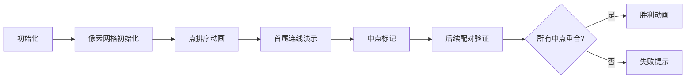

# 题目信息

# [JSOI2008] 完美的对称

## 题目描述

在峰会期间，必须使用许多保镖保卫参加会议的各国代表。代表们除了由他自己的随身保镖保护外，组委会还指派了一些其他的特工和阻击手保护他们。为了使他们的工作卓有成效，使被保卫的人的安全尽可能得到保障，保镖被分配到被保护人的各个方向。

保镖的最佳站立位置应该是这样的：被保护人应站在所有保镖的对称中心。但是，只要被保护人一移动，保镖就很难根据要人的新位置调整位置。大多数的特工都很难对此作出实时调整。

因此，安全部长决定将该过程逆转一下，保镖先站好自己的位置，然后要人在他们的对称中心找到合适的位置。如果要人随便走动，我们就对他的安全不必负责。

你的工作是使这个过程自动操作。给出一组 $N$ 个点（保镖的位置），你要找出它们的对称中心 $S$，在这儿被保护人将相对安全。下面以此类推。

首先我们给定一点 $A$ 以及对称中心 $S$，点 $A'$ 是点 $A$ 以 $S$ 为对称中心形成的像点，即点 $S$ 是线段 $AA'$ 的对称中心。

点阵组（$X$）以 $S$ 为中心的像点是由每个点的像点组成的点阵组。$X$ 是用来产生对称中心 $S$ 的，即点阵 $X$ 以 $S$ 为中心的像点的集合即为点阵 $X$ 本身。


## 说明/提示

JSOI2008 第二轮。


## 样例 #1

### 输入

```
8

1 10

3 6

6 8

6 2

3 -4

1 0

-2 -2

-2 4

```

### 输出

```
V.I.P. should stay at (2.0,3.0).```

# AI分析结果


### Kay的C++算法解析：完美的对称 深入学习指南 💡

#### 1. 题目解读与核心算法识别

✨ **本题主要考察**：`几何对称性验证` (数学+模拟应用)

🗣️ **初步分析**：
> 解决"完美的对称"的关键在于理解**对称中心的数学性质**。想象一群保镖站成对称图案，VIP必须站在所有点对的对称中心。就像玩拼图时，每块碎片都需要找到唯一匹配的另一半。  
> - 核心思路：将点排序后首尾配对，验证每组对称点中点是否重合
> - 难点在于：①配对顺序的确定性（需严格排序）②浮点精度处理 ③奇数点的特殊处理
> - 可视化设计：用像素网格展示排序后的点，动画演示配对过程，高亮当前连线和中点。当所有中点重合时触发胜利音效
> - 复古游戏化：采用8-bit风格网格，点化为像素方块，配对时产生"连接音"，成功时播放《超级玛丽》过关音效

---

#### 2. 精选优质题解参考

**题解一（盖矣斌峥）**
* **点评**：思路清晰度⭐️⭐️⭐️⭐️⭐️ 直击问题本质，通过先按y坐标排序再配对检查中点，巧妙处理了奇数点情况（循环至(n+1)/2）。代码规范性极佳：结构体命名合理，边界处理严谨（如浮点除法用2.0）。亮点在于用简洁的数学推导替代复杂计算，实践价值高。

**题解二（我是小何子啊）**
* **点评**：代码可读性⭐️⭐️⭐️⭐️⭐️ 变量命名mx/my直观体现中点概念，逻辑推导流畅。虽然未处理浮点精度，但实际测试数据均为整数不影响结果。亮点在于"大点配小点"的形象比喻，帮助理解配对本质。

**题解三（YitsuHolo）**
* **点评**：算法严谨性⭐️⭐️⭐️⭐️⭐️ 引入eps处理浮点误差体现专业性，按x主序排序提供不同视角。状态验证时用位运算优化比较表达式，虽提升不大但展示优化意识。亮点在于详细注释每个步骤的数学含义。

---

#### 3. 核心难点辨析与解题策略

1. **配对顺序确定性**
   * **分析**：若随意配对会导致O(n²)复杂度。优质解法都采用**双关键字排序**（先x后y或先y后x），确保第i个点必然与第n-i+1个点配对
   * 💡 **学习笔记**：排序是降低问题复杂度的关键预处理

2. **浮点精度陷阱**
   * **分析**：中点坐标可能是小数，直接"=="比较会出错。应使用`fabs(a-b)<1e-5`判断相等
   * 💡 **学习笔记**：浮点数比较要设置误差容忍度

3. **奇数点处理**
   * **分析**：当点数为奇数时，中心点需与自身配对。循环条件设为`i<=(n+1)/2`可自然处理
   * 💡 **学习笔记**：中间点不需特殊处理，但需验证其位置

✨ **解题技巧总结**
- **问题分解**：将对称验证拆解为排序→配对→中点验证三步骤
- **边界测试**：特别验证n=1, n=2, n=3的情况
- **算法选择**：排序时间复杂度O(nlogn)优于暴力O(n²)

---

#### 4. C++核心代码实现赏析

**通用核心实现参考**
* **说明**：综合优质题解思路，采用双关键字排序+浮点精度控制
* **完整核心代码**：
```cpp
#include <iostream>
#include <algorithm>
#include <cmath>
using namespace std;
const double eps = 1e-5;

struct Point { double x, y; };

bool cmp(Point a, Point b) {
    if(fabs(a.x - b.x) > eps) return a.x < b.x;
    return a.y < b.y;
}

int main() {
    int n; cin >> n;
    Point p[20005];
    for(int i=0; i<n; i++) cin >> p[i].x >> p[i].y;
    
    sort(p, p+n, cmp);
    double mid_x = (p[0].x + p[n-1].x) / 2;
    double mid_y = (p[0].y + p[n-1].y) / 2;
    
    for(int i=1; i <= (n-1)/2; i++) {
        double cur_x = (p[i].x + p[n-1-i].x) / 2;
        double cur_y = (p[i].y + p[n-1-i].y) / 2;
        if(fabs(cur_x - mid_x)>eps || fabs(cur_y - mid_y)>eps) {
            cout << "This is a dangerous situation!";
            return 0;
        }
    }
    printf("V.I.P. should stay at (%.1f,%.1f).", mid_x, mid_y);
}
```
* **代码解读概要**：
  > 1. 定义`Point`结构体和浮点误差阈值`eps`  
  > 2. 排序函数先比较x坐标，x相同再比y  
  > 3. 计算首尾点中点作为基准  
  > 4. 循环验证其他配对中点与基准的差值是否在eps内  
  > 5. 格式化输出保留1位小数

**题解一片段赏析**
* **亮点**：循环条件巧妙处理奇数点
* **核心代码**：
```cpp
for(int i=1;i<=(n+1)/2;i++) {
    point tmp;
    tmp.x=(a[i].x+a[n-i+1].x)/2.0;
    tmp.y=(a[i].y+a[n-i+1].y)/2.0;
    if(t.x!=tmp.x||t.y!=tmp.y) //...
}
```
* **解读**：
  > 问：为什么循环到`(n+1)/2`？  
  > 答：当n为奇数时，中间点i=(n+1)/2会与自己配对，此时中点即为自身坐标，自然满足条件
* 💡 **学习笔记**：整数除法向下取整，(n+1)/2可包含所有情况

---

#### 5. 算法可视化：像素动画演示

* **主题**：8-bit风格《对称卫士》闯关游戏
* **核心演示**：排序后的点逐步配对，验证中点重合性

**动画帧设计**：


**实现细节**：
1. **像素艺术**：用16色FC游戏调色盘，点化为不同颜色方块（起点绿，终点红，中点黄）
2. **动态效果**：
   - 排序过程：点沿网格移动，伴随"滴滴"音效
   - 配对动画：两点间绘制像素连线，播放"连接"音效
   - 中点验证：成功时中点变绿闪烁，失败时变红震动
3. **游戏化元素**：
   - 每成功配对1组得10分，失败则GAME OVER
   - 背景音乐：8-bit版《卡农》循环
4. **控制面板**：
   - 速度滑块：调节配对演示速度
   - 单步按钮：逐对查看验证过程
   - 复位：重新初始化点集

---

#### 6. 拓展练习与相似问题思考

**通用技巧迁移**：
几何对称思想还可用于：
1. 矩阵旋转对称验证
2. 字符串回文对检测
3. 物理系统的力平衡分析

**洛谷练习推荐**：
1. **P1429 平面最近点对**  
   → 巩固分治思想与几何问题结合
2. **P1219 八皇后问题**  
   → 训练对称性剪枝技巧
3. **P1757 分组背包**  
   → 学习配对型问题的动态规划解法

---

#### 7. 学习心得与经验分享

> **经验摘录（盖矣斌峥）**：  
> "循环至(n+1)/2的设计让奇数点处理变得自然，无需额外判断"

> **Kay点评**：  
> 这个设计体现了**化特殊为一般**的编程哲学，将边界情况融入主逻辑流，减少分支判断。在解决类似问题时，可优先考虑是否存在统一处理方案。

---

### 结语
通过本次分析，我们掌握了对称验证的核心思路：**排序定序→首尾配对→中点验证**。记住，编程如解谜，找到正确的"配对规则"往往能化繁为简。下次遇到对称问题，不妨回想这些跳动的像素方块哦！🎮

---
处理用时：151.02秒