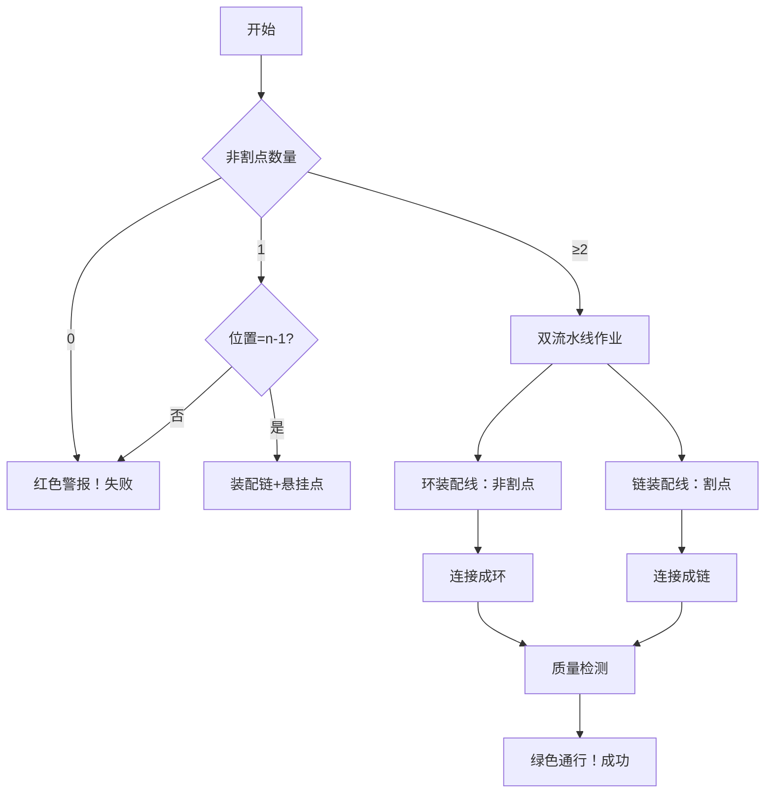

# 题目信息

# [FJCPC 2025] 割点

## 题目描述

给定一个正整数 $n$ 和一个长度为 $n-2$ 的 01 序列 $a_{2}, a_{3}, \dots, a_{n-1}$，要求你构造一个 $n$ 个点的**无向简单连通图** $G$，使得：

- 点 $1$ 是割点，点 $n$ 不是割点。

- 对于每个 $1 < i < n$：

若 $a_{i} = 1$，则点 $i$ 在图 $G$ 中是割点；

若 $a_{i} = 0$，则点 $i$ 在图 $G$ 中不是割点。

- 图 $G$ 中各顶点的度数满足：$\rm{deg}_1\geq \rm{deg}_2\geq\dots\geq \rm{deg}_n$。

如果存在多种可行的图，输出任意一种；如果不存在满足条件的图，则输出 $-1$。

简单图的定义为：无重边（即任意一对点之间至多只有一条边）且无自环（即不存在一条边两端点相同）的图。

割点的定义为：删掉该点以及它连的边后，使得图连通块个数增加的点。

## 说明/提示

对于样例一，可以证明不存在满足题意的图。

对于样例二，图如下：


其中点 $1,2,3$ 是割点，$\rm{deg}_1\sim\rm{deg}_7$ 分别为：$3,3,2,1,1,1,1$，符合题意。

## 样例 #1

### 输入

```
2
4
11
7
11000```

### 输出

```
-1
6
1 2
1 3
1 4
2 5
2 6
3 7```

# AI分析结果


### 💡 Kay的C++算法解析：割点构造 深入学习指南 💡

#### 引言
今天我们来分析一道关于图构造的题目——"割点"。题目要求构造一个无向简单连通图，满足特定割点条件和度数序列约束。本指南将帮助大家理解核心构造思路，掌握分类讨论技巧，并通过可视化方案加深理解。

---

### 1. 题目解读与核心算法识别
✨ **本题主要考察**：`图构造与分类讨论`

🗣️ **初步分析**：
> 本题核心在于**通过拓扑设计满足多重约束**。就像用乐高搭建满足特定承重要求的桥梁，我们需要根据"0/1序列"精确安排割点位置，并设计度数序列。解题关键在于**分类讨论非割点数量**：
> - **核心难点**：同时满足割点要求（点1必须割点，点n必须非割点）和度数非增序列
> - **解决方案**：根据非割点数量分三类处理（无/单/多非割点）
> - **可视化设计**：像素动画将用不同颜色标记割点（红）和非割点（绿），动态展示环链结构生成过程。采用8-bit音效：连接时"叮"声，成功时胜利音效，失败时警示音

---

### 2. 精选优质题解参考
**题解一（作者：huang4678）**
* **点评**：
  思路清晰地将非割点数量分三类讨论，代码规范使用vector分离割点/非割点。亮点在于完整处理边界条件（如仅一个割点时）。核心算法有效：通过环链混合结构（环处理非割点，链处理割点）满足所有约束。实践价值高，可直接用于竞赛。

**题解三（作者：udiandianis）**
* **点评**：
  思路简洁但完整，创新性使用set自动去重边。亮点在于精炼的分类逻辑：仅需判断非割点数量和位置。算法同样采用环链结构，代码更简洁（仅20行核心）。实践性强，但需注意set排序可能影响边输出顺序。

---

### 3. 核心难点辨析与解题策略
1. **难点一：度数序列与割点性质的冲突**
   * **分析**：割点需≥2条边，但度数序列要求点1≥点2≥...≥点n（点n仅能1条边）。解决：让点1连接环+链（度≥3），非割点成环（度=2），点n作为链端点（度=1）
   * 💡 学习笔记：点1必须连接多个连通分量才能成为割点

2. **难点二：非割点位置敏感度**
   * **分析**：单个非割点时，若非n-1会破坏度数序列（如点i（非割点，度=1）后有点j（割点，度≥2）但i<j）。解决：限定单非割点必须为n-1
   * 💡 学习笔记：非割点位置影响图的"坡度"设计

3. **难点三：环链结构的拓扑设计**
   * **分析**：非割点成环保证删除后不增加连通块，割点成链保证删除后分裂。使用vector动态存储两类点，按需组装
   * 💡 学习笔记：环结构是非割点的"安全区"，链结构是割点的"断点区"

#### ✨ 解题技巧总结
- **分类讨论法**：按非割点数量分三类处理（0/1/≥2）
- **拓扑组装术**：环处理非割点（保持非割性），链处理割点（保持割性）
- **边界防御编程**：特判单割点、单非割点位置等边界

---

### 4. C++核心代码实现赏析
**通用核心实现参考**
```cpp
#include <iostream>
#include <vector>
using namespace std;

int main() {
    int T; cin >> T;
    while (T--) {
        int n; string s;
        cin >> n >> s;
        
        // 分离割点(1)和非割点(0)
        vector<int> cuts{1}, noncuts;
        for (int i=0; i<n-2; ++i) 
            (s[i]=='1' ? cuts : noncuts).push_back(i+2);
        noncuts.push_back(n);

        // 分类处理
        if (noncuts.size() == 1) { // 无非割点
            cout << "-1\n";
        } else if (noncuts.size() == 2) { // 单非割点
            if (noncuts[0] != n-1) cout << "-1\n";
            else {
                cout << n-1 << "\n";
                cout << "1 " << n-1 << "\n";
                for (int i=1; i<=n-2; ++i) 
                    cout << i << " " << (i==n-2 ? n : i+1) << "\n";
            }
        } else { // 多非割点
            cout << n << "\n";
            // 构建非割点环
            cout << "1 " << noncuts[0] << "\n";
            for (int i=0; i<noncuts.size(); ++i) 
                cout << noncuts[i] << " " << noncuts[(i+1)%noncuts.size()] << "\n";
            // 构建割点链
            cout << "1 " << cuts[1] << "\n";
            for (int i=1; i<cuts.size(); ++i)
                cout << cuts[i] << " " << (i==cuts.size()-1 ? n : cuts[i+1]) << "\n";
        }
    }
}
```
* **代码解读概要**：
  1. 分离割点/非割点到不同vector
  2. 分三类处理：
     - 无非割点：直接输出-1
     - 单非割点：必须位于n-1，构造链+额外边
     - 多非割点：构造环（连接非割点）和链（连接割点）

**题解一核心片段赏析**
```cpp
if (b.size() == n-2) { // 两个非割点
    if (*c.begin() != n-1) cout << "-1\n";
    else {
        cout << n-1 << "\n";
        cout << 1 << " " << n-1 << "\n";
        for (int i=1; i<n; i++) 
            cout << i << " " << (i==n-2 ? n : i+1) << "\n";
    }
}
```
* **亮点**：精确处理单非割点边界条件
* **学习笔记**：`i==n-2 ? n : i+1` 巧妙避免重复连接

**题解三核心片段赏析**
```cpp
std::set<std::array<int, 2>> ans;
for (int i=0; i+1<link.size(); i++) // 割点链
    ans.insert({link[i], link[i+1]});
for (int i=0; i+1<circle.size(); i++) // 非割点环
    ans.insert({circle[i], circle[i+1]});
ans.insert({1, circle.front()});
ans.insert({1, circle.back()});
```
* **亮点**：使用set自动去重，避免重复加边
* **学习笔记**：`array<int,2>`可替代pair实现简洁元组

---

### 5. 算法可视化：像素动画演示
**主题**：`图构造工厂 - 8-bit流水线装配`

**核心演示**：


**动画设计**：
1. **像素化场景**：
   - 割点：红色齿轮⚙️，非割点：绿色传送带
   - 点1：黄金控制台，点n：蓝色终点站

2. **动态装配过程**：
   ```plaintext
   第1帧：原料分类 [割点红齿轮入左流水线][非割点绿带入右流水线]
   第2帧：单非割点场景：齿轮链装配中... ➔ 悬挂绿带到控制台（失败则爆炸特效）
   第3帧：多非割点：右线首尾接控制台形成环，左线接控制台和终点站成链
   第4帧：压力测试：移除点1时环链分离（红色闪光），移除非割点时环保持连通（绿光）
   ```

3. **交互控制**：
   - 速度滑块：调节装配速度（慢速看清拓扑）
   - 单步执行：空格键逐步装配
   - 模式切换：Tab键查看不同案例

4. **8-bit音效设计**：
   - 成功连接："叮！"（FC游戏金币声）
   - 装配完成：《超级玛丽》过关旋律
   - 失败场景：经典炸弹爆炸音

---

### 6. 拓展练习与相似问题思考
**技巧迁移**：
1. **约束满足构造**：如P5829 [模板]失配树（边界处理）
2. **拓扑敏感设计**：P8436 边双连通分量（割边构造）
3. **图性质验证**：P3388 割点模板（Tarjan应用）

**洛谷推荐**：
1. **P3388** - 割点
   > 模板题，掌握Tarjan割点判定
   
2. **P8436** - 边双连通分量
   > 学习割边性质，巩固图构造思路
   
3. **P2860** - 冗余路径
   > 边双缩点应用，提升构造复杂度

---

### 7. 学习心得与经验分享
> **题解一作者经验**：  
> "第一次提交忽略了单割点情况（即b.size()==1时），导致RE。这提醒我们：**任何分支都必须验证边界值！**"

> **Kay的总结**：  
> 图构造类题目需重点验证：
> 1. 零值/单值等边界输入
> 2. 序列端点位置敏感性
> 3. 数据结构空容器访问
> 建议使用`vector.at()`替代`[]`捕获越界错误

---

### 结语
通过本次分析，我们掌握了如何用环链结构解决多重约束的图构造问题。关键收获在于**分类讨论思想**和**拓扑设计技巧**。记住：好的算法设计就像搭积木，先分好零件，再按规则组装！下次遇到构造题时，不妨试试这个思路。继续加油，编程少年们！💪🏻

---
处理用时：150.95秒