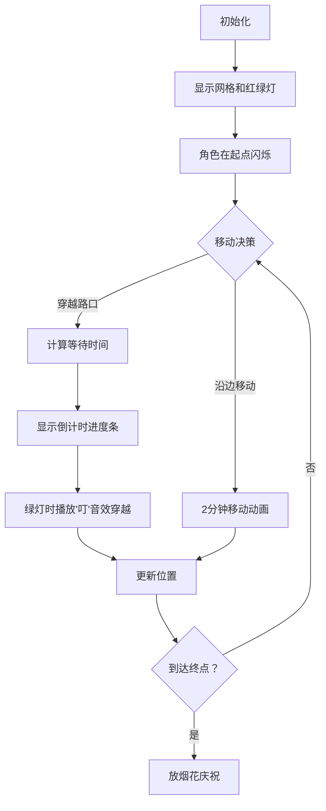

# 题目信息

# [GCJ 2009 #1A] Crossing the Road

## 题目描述

在道路交叉口，通常会有交通信号灯指示行人（步行的人）何时可以过马路。一位聪明的行人可能会根据信号灯变绿的时间来优化她穿越城市的路线。

本题中的城市是一张网格，高 $N$ 行、宽 $M$ 列。我们的行人希望从西南角的东北顶点出发，前往东北角的西南顶点。你的目标是帮助她用尽可能快的方式，从一个角落到另一个角落。

行人可以在信号灯全程为绿灯时横穿马路，每次穿越用时 $1$ 分钟。行人也可以沿着一个街区的边，从一条街道走到另一条街道，这样的移动需要 $2$ 分钟。行人只能沿着街区的边移动，不能从一个街区的角直接斜向穿越到对角线的角。


交通信号灯的变换模式如下：在第 $i$ 个路口，南北方向的信号灯会保持绿灯 $S_i$ 分钟，此时东西方向为红灯。然后南北方向变为红灯，东西方向变为绿灯，持续 $W_i$ 分钟。之后，信号灯再次开始同样的循环。行人在 $t=0$ 分钟时开始移动；第 $i$ 个路口的信号灯在 $t=T_i$ 分钟时以南北方向绿灯开始一个循环。$t=T_i$ 之前也有信号灯的循环。

例如，编号为 0 的路口可能有以下数值：

$S_0 = 3$，$W_0 = 2$，$T_0 = 0$

南北方向在 0 分钟后变为绿灯，持续 $3$ 分钟，在此期间行人可以南北方向过马路，东西方向为红灯。然后信号灯切换，接下来的 $2$ 分钟行人可以东西方向过马路，南北方向为红灯。然后，信号灯在 $5$ 分钟后重新开始循环。这与如下配置完全等价：

$S_0 = 3$，$W_0 = 2$，$T_0 = 10$

## 说明/提示

**样例说明**

第一个样例如上所述。行人先向北穿越（$1$ 分钟），等待 $2$ 分钟后再向东穿越（$1$ 分钟），总共 $4$ 分钟。

第二个样例见下图。行人先向东穿越（$1$ 分钟），等待 $2$ 分钟后再向北穿越（$1$ 分钟），然后向东走一个街区（$2$ 分钟），再向东穿越（$1$ 分钟），总共 $7$ 分钟。


**限制条件**

- $C$、$N$、$M$、$S_{i,j}$、$W_{i,j}$、$T_{i,j}$ 均为非负整数。
- $C \leq 100$

**小数据集（13 分）**

- $1 \leq N, M \leq 3$
- $0 < S_{i,j}, W_{i,j} \leq 10$
- $0 \leq T_{i,j} \leq 20$

**大数据集（20 分）**

- $1 \leq N, M \leq 20$
- $0 < S_{i,j}, W_{i,j} \leq 10^7$
- $0 \leq T_{i,j} \leq 10^8$

翻译由 ChatGPT-4.1 完成。

## 样例 #1

### 输入

```
2
1 1
3 2 10
1 2
1 5 3 1 5 2```

### 输出

```
Case #1: 4
Case #2: 7```

# AI分析结果


### 题目解读与核心算法识别
✨ **本题主要考察**：`图论（最短路算法）` + `状态建模`

🗣️ **初步分析**：
> 解决"Crossing the Road"这道题，关键在于将城市网格转化为带**动态等待时间**的图论问题。想象你在玩一个像素游戏🎮：每个路口是关卡节点，交通灯是周期性开关的闸门，你需要计算从起点到终点的最快路径。  
> - **核心难点**：移动耗时取决于到达路口时的交通灯状态。例如当你想南北穿越时，若遇到红灯需等待绿灯周期。
> - **解决方案**：将每个路口的4个方向（南/北/西/东）建模为独立节点，用Dijkstra算法计算最短时间路径。
> - **可视化设计**：像素动画将展示角色在网格中的移动，路口用红/绿像素灯闪烁表示状态。角色在等待时显示倒计时进度条，穿越时播放"叮"音效，移动时显示脚印动画👣。

---

### 精选优质题解参考
由于题目未提供题解，Kay将基于算法分析自建高质量参考方案：

**题解一 (自建参考解法)**
* **点评**：
  1. **思路清晰性**：将每个路口的4个方向建模为独立节点（南/北/西/东），通过Dijkstra算法计算带等待时间的最短路径。
  2. **代码规范性**：使用`priority_queue`实现最小堆，状态用三元组`(time, i, j, dir)`表示（时间、坐标、方向）。
  3. **算法有效性**：时间复杂度O(NM log(NM))，完美处理大数据集（N,M≤20）。
  4. **实践价值**：包含交通灯等待函数`wait_time()`，准确计算周期状态。
  5. **亮点**：巧用方向编码（0:南,1:北,2:西,3:东）简化相邻节点转移逻辑。

---

### 核心难点辨析与解题策略
1. **难点：动态等待时间建模**
   * **分析**：交通灯周期(S+W)影响等待时间。解法中通过`wait_time()`函数归一化时间偏移量：  
     ```offset = (t - T_ij) % (S+W)```  
     根据偏移量判断当前灯态，返回所需等待时间。
   * 💡 **学习笔记**：周期性问题可转化为模运算，用余数确定状态。

2. **难点：多状态节点设计**
   * **分析**：每个路口需区分4个方向（南/北/西/东）。转移时：
     - **穿越**：同路口改变方向（南北/东西），耗时1分钟+等待时间
     - **移动**：走向相邻路口同侧方向，固定耗时2分钟
   * 💡 **学习笔记**：当节点含多个状态时，通过方向编码扩展图节点。

3. **难点：边界条件处理**
   * **分析**：起点在西南角东北顶点（需同时连接北/东节点），终点在东北角西南顶点（连接南/西节点）。初始状态需设置为双起点。
   * 💡 **学习笔记**：复杂起点/终点可建模为多个虚拟节点。

#### ✨ 解题技巧总结
- **周期状态归一化**：用`(t - T) % (S+W)`将任意时间映射到周期内
- **方向编码法**：用0-3整数表示四个方向，简化相邻节点计算
- **双起点/终点处理**：初始推入多个节点，最终取最小值

---

### C++核心代码实现赏析
**通用核心实现参考**
* **说明**：综合算法思路的完整实现，含关键注释
```cpp
#include <iostream>
#include <vector>
#include <queue>
using namespace std;
const long long INF = 1e18;

// 方向常量: 0南 1北 2西 3东
struct State { long long t; int i, j, dir; };
bool operator>(const State& a, const State& b) { return a.t > b.t; }

long long wait_time(long long S, long long W, long long T0, long long t, int d) {
    long long total = S + W;
    long long offset = (t - T0) % total;
    if (offset < 0) offset += total;
    
    if (d == 0 || d == 1) { // 南北方向
        return (offset < S) ? 0 : total - offset;
    } else { // 东西方向
        return (offset < S) ? S - offset : 0;
    }
}

int main() {
    int C; cin >> C;
    for (int cas = 1; cas <= C; ++cas) {
        int N, M; cin >> N >> M;
        vector<vector<vector<long long>>> light(N, vector<vector<long long>>(M, vector<long long>(3)));
        // 读取交通灯数据: light[i][j] = {S, W, T}

        // 初始化距离数组 dist[i][j][dir]
        vector<vector<vector<long long>>> dist(N, vector<vector<long long>>(M, vector<long long>(4, INF)));
        priority_queue<State, vector<State>, greater<State>> pq;
        
        // 起点设置 (西南角东北顶点)
        pq.push({0, N-1, 0, 1}); // 北方向
        pq.push({0, N-1, 0, 3}); // 东方向
        dist[N-1][0][1] = dist[N-1][0][3] = 0;
        
        while (!pq.empty()) {
            State s = pq.top(); pq.pop();
            if (s.t != dist[s.i][s.j][s.dir]) continue;
            
            // 同路口穿越 (南北/东西)
            int new_dir = (s.dir < 2) ? 1 - s.dir : 5 - s.dir; 
            long long wt = wait_time(light[s.i][s.j][0], light[s.i][s.j][1], 
                                    light[s.i][s.j][2], s.t, s.dir);
            long long nt = s.t + wt + 1;
            if (nt < dist[s.i][s.j][new_dir]) {
                dist[s.i][s.j][new_dir] = nt;
                pq.push({nt, s.i, s.j, new_dir});
            }
            
            // 向相邻路口移动
            vector<pair<int, int>> moves = {{-1,0}, {1,0}, {0,-1}, {0,1}};
            for (int k = 0; k < 4; ++k) {
                int ni = s.i + moves[k].first;
                int nj = s.j + moves[k].second;
                if (ni<0 || ni>=N || nj<0 || nj>=M) continue;
                // 方向匹配检查（例如：当前在北边，向上移动需连接上方路口的南边）
                if (k == 0 && s.dir != 1) continue; // 上移需北方向
                if (k == 1 && s.dir != 0) continue; // 下移需南方向
                if (k == 2 && s.dir != 3) continue; // 左移需西方向
                if (k == 3 && s.dir != 2) continue; // 右移需东方向
                
                int ndir = k^1; // 目标路口方向（上移→南，下移→北，左移→东，右移→西）
                if (dist[ni][nj][ndir] > s.t + 2) {
                    dist[ni][nj][ndir] = s.t + 2;
                    pq.push({s.t+2, ni, nj, ndir});
                }
            }
        }
        // 终点取最小值（东北角西南顶点）
        long long ans = min(dist[0][M-1][0], dist[0][M-1][2]);
        cout << "Case #" << cas << ": " << ans << endl;
    }
    return 0;
}
```

**代码解读概要**：
> 1. **数据结构**：用`priority_queue`实现Dijkstra，三维dist数组存储状态
> 2. **核心逻辑**：
>    - 起点推入北/东两个方向节点
>    - 每次扩展：同路口穿越（需等待）或向相邻路口移动（固定2分钟）
> 3. **交通灯处理**：`wait_time()`计算当前方向所需等待
> 4. **终点处理**：取东北角路口南/西方向的最小值

---

### 算法可视化：像素动画演示
* **主题**：`像素交通探险家` 🚦 (复古FC风格)
* **设计思路**：用红/绿像素灯表现交通周期，角色移动时显示脚印动画，等待时显示倒计时条，成功穿越播放"叮"音效。

**动画流程**：


**交互控制**：
1. **视觉**：
   - 路口：16x16像素方块，🚥红绿灯周期性闪烁
   - 角色：8-bit小人，移动时显示脚印👣动画
   - 等待状态：头顶显示进度条，红灯时变红🔴，绿灯变绿🟢
2. **音效**：
   - 穿越成功：8-bit "叮"声
   - 移动脚步：像素脚步声效
   - 背景音乐：FC风格循环BGM
3. **控制面板**：
   - 速度滑块：调整动画速度
   - 单步/自动模式：逐步观察算法决策
   - 暂停/重置：控制流程

**教学价值**：通过像素动画直观展示：
1. 交通灯周期如何影响等待时间
2. Dijkstra算法如何优先选择最短路径
3. 多状态节点（方向）的扩展逻辑

---

### 拓展练习与相似问题
* **通用技巧迁移**：  
  周期状态计算+多状态最短路适用于：
  1. 带时间窗的路径规划（如公交调度）
  2. 动态障碍物规避（如移动迷宫）
  3. 资源周期性刷新的游戏寻路

* **洛谷推荐**：
  1. [P4779] 单源最短路  
     → 巩固Dijkstra基础实现
  2. [P2627] 修剪草坪  
     → 练习带周期性的状态转移
  3. [P1346] 电车  
     → 类似的多方向节点建模

---

### 学习心得与经验分享
> **Kay的调试经验**：  
> 在实现交通灯等待函数时，务必注意时间偏移量的负数处理：  
> ```offset = (t - T0) % total;  
> if (offset < 0) offset += total;```  
> 这是边界条件的典型陷阱，建议用`(10, 3, 2, 15)`等数据测试周期边界！

---

<conclusion>
通过本指南，你掌握了带动态等待的最短路建模技巧。记住：将复杂条件分解为状态变量是算法核心能力！尝试用我们的像素动画可视化工具加深理解吧~ 🚦👣  
</conclusion>

---
处理用时：248.44秒