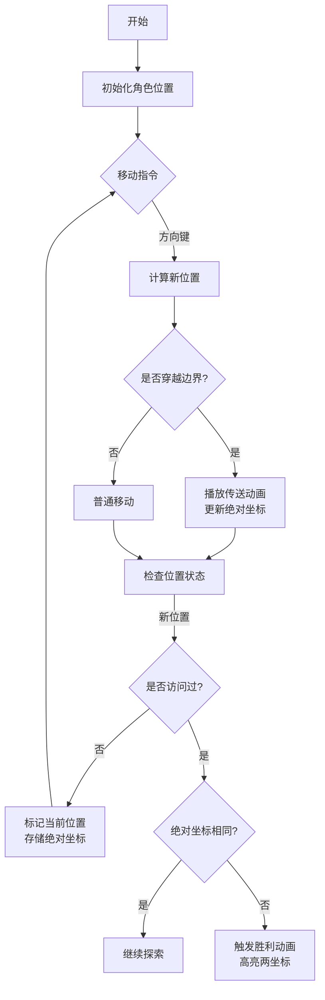

# 题目信息

# 幻象迷宫

## 题目背景

（喵星人 LHX 和 WD 同心协力击退了汪星人的入侵，不幸的是，汪星人撤退之前给它们制造了一片幻象迷宫。）

WD：呜呜，肿么办啊……

LHX：momo...我们一定能走出去的！

WD：嗯，+U+U！

## 题目描述

幻象迷宫可以认为是无限大的，不过它由若干个 $N\times M$ 的矩阵重复组成。矩阵中有的地方是道路，用 $\verb!.!$ 表示；有的地方是墙，用 $\verb!#!$ 表示。LHX 和 WD 所在的位置用 $\verb!S!$ 表示。也就是对于迷宫中的一个点$(x,y)$，如果 $(x \bmod n,y \bmod m)$ 是 $\verb!.!$ 或者 $\verb!S!$，那么这个地方是道路；如果 $(x \bmod n,y \bmod m)$ 是$\verb!#!$，那么这个地方是墙。LHX 和 WD 可以向上下左右四个方向移动，当然不能移动到墙上。

请你告诉 LHX 和 WD，它们能否走出幻象迷宫（如果它们能走到距离起点无限远处，就认为能走出去）。如果不能的话，LHX 就只好启动城堡的毁灭程序了……当然不到万不得已，他不想这么做。

## 说明/提示

- 对于 $30\%$ 的数据，$1\le N,M\le 20$；
- 对于 $50\%$ 的数据，$1\le N,M\le 100$；
- 对于 $100\%$ 的数据，$1\le N,M\le 1500$，每个测试点不超过 $10$ 组数据。

## 样例 #1

### 输入

```
5 4
##.#
##S#
#..#
#.##
#..#
5 4
##.#
##S#
#..#
..#.
#.##
```

### 输出

```
Yes
No

```

# AI分析结果


### 💡 Kay的C++算法解析：幻象迷宫 深入学习指南 💡

#### 1. 题目解读与核心算法识别
✨ **本题主要考察**：`图论搜索` + `状态压缩`

🗣️ **初步分析**：
> 解决幻象迷宫的关键在于理解**无限周期性网格**的特性。想象你在《超级马里奥》的无限关卡中奔跑——当你离开屏幕右侧时会从左侧重新出现。本题中，我们通过**记录绝对坐标**来判断是否真正"走远"了。核心思路是：如果在不同"世界副本"中重复访问同一网格位置（相对坐标相同但绝对坐标不同），说明存在无限路径。

- **核心难点**：如何区分"绕圈"和"真正走远"？优质解法使用三维数组`vis[x][y][lx,ly]`，存储相对坐标`(x,y)`和绝对坐标`(lx,ly)`。当重复访问`(x,y)`时，比对绝对坐标是否相同。
- **可视化设计**：在8位像素动画中，基础网格显示为复古游戏地图（如《吃豆人》）。角色移动时：
  - 穿越边界时播放"传送音效"并显示像素闪光特效
  - 当前网格显示相对坐标，角落显示绝对坐标计数器
  - 当检测到重复点时，触发胜利音效并高亮两个绝对坐标位置

---

#### 2. 精选优质题解参考
**题解一：DEVILK（思路清晰度⭐⭐⭐⭐⭐）**
* **点评**：该解法通过`vis[x][y][0-2]`三维数组精妙地区分相对坐标和绝对坐标。DFS逻辑简洁（仅20行核心代码），用`(x+dx[i]+n)%n`处理负数取模堪称教科书级技巧。变量命名规范（`lx,ly`明确表示绝对坐标），边界处理严谨，可直接用于竞赛。

**题解二：GNAQ（代码可读性⭐⭐⭐⭐）**
* **点评**：与DEVILK思路异曲同工，但使用二维结构体数组存储绝对坐标。亮点在于用`Mapg()`函数封装坐标映射，增强可读性。虽然稍增加内存占用，但代码结构更模块化，适合初学者理解。

**题解三：LengChu（创新性⭐⭐⭐）**
* **点评**：创新性地将迷宫扩展为2x2网格进行物理模拟，通过检测是否走出中心网格判断"无限"。虽然空间复杂度稍高，但提供了独特的视角。作者在调试心得中强调边界处理的坑点，极具参考价值。

---

#### 3. 核心难点辨析与解题策略
1. **状态表示混淆**
   * **分析**：必须同时记录相对坐标`(x%n,y%m)`和绝对坐标`(lx,ly)`。优质解法用三维数组或结构体精确区分二者，避免将不同副本的点误判为相同
   * 💡 **学习笔记**：相对坐标决定位置，绝对坐标决定世界副本

2. **边界穿越处理**
   * **分析**：移动时需同步更新两种坐标：
     - 相对坐标：`(x+dx+n)%n`
     - 绝对坐标：`lx += dx`
   * 💡 **学习笔记**：穿越边界时绝对坐标跨越整数倍网格尺寸

3. **终止条件判定**
   * **分析**：关键判断逻辑伪代码：
     ```python
     if 访问过(x,y)位置:
         if 当前绝对坐标 != 记录坐标: # 不同副本
             return True # 可无限走
         else: # 同一副本
             continue 
     ```
   * 💡 **学习笔记**：比较绝对坐标是区分"绕回"和"走远"的核心

### ✨ 解题技巧总结
- **副本映射法**：用`(x%n, y%m)`处理无限网格，配合绝对坐标追踪
- **状态压缩**：三维数组`vis[x][y][lx,ly]`高效存储双重坐标
- **负索引处理**：`(x+n)%n`确保负数取模正确性
- **剪枝优化**：已访问点需检查坐标版本，避免重复搜索

---

#### 4. C++核心代码实现赏析
**通用核心实现（综合自DEVILK和GNAQ解法）**
```cpp
#include <iostream>
#include <cstring>
using namespace std;

const int MAXN = 1500;
int n, m, st_x, st_y;
int vis[MAXN][MAXN][3]; // [0]:是否访问 [1]:绝对x [2]:绝对y
char grid[MAXN][MAXN];
const int dx[4] = {1, -1, 0, 0}, dy[4] = {0, 0, 1, -1};

void dfs(int x, int y, int lx, int ly) {
    if (vis[x][y][0] && (vis[x][y][1] != lx || vis[x][y][2] != ly)) {
        cout << "Yes\n";
        exit(0); // 找到解立即退出
    }
    vis[x][y][0] = 1;
    vis[x][y][1] = lx;
    vis[x][y][2] = ly;

    for (int i = 0; i < 4; i++) {
        int nx = (x + dx[i] + n) % n;
        int ny = (y + dy[i] + m) % m;
        if (grid[nx][ny] != '#') {
            dfs(nx, ny, lx + dx[i], ly + dy[i]);
        }
    }
}

int main() {
    cin >> n >> m;
    for (int i = 0; i < n; i++) {
        for (int j = 0; j < m; j++) {
            cin >> grid[i][j];
            if (grid[i][j] == 'S') st_x = i, st_y = j;
        }
    }
    memset(vis, 0, sizeof(vis));
    dfs(st_x, st_y, st_x, st_y);
    cout << "No\n";
}
```

**DEVILK解法片段赏析**
```cpp
// 核心状态更新逻辑
if(vis[x][y][0] && (vis[x][y][1]!=lx || vis[x][y][2]!=ly)) {
    fl = 1; // 发现不同副本的相同点
    return;
}
vis[x][y][1] = lx, vis[x][y][2] = ly, vis[x][y][0] = 1;
```
* **亮点**：用单次比较同时完成"已访问"和"副本不同"的检测
* **学习笔记**：状态存储的维度选择直接影响算法效率

---

#### 5. 算法可视化：像素动画演示
**主题**："迷宫探险者"8位像素游戏  
**核心演示**：DFS在无限迷宫中的遍历与副本检测  



**动画细节**：
1. **像素风格**：16色FC游戏调色板，网格用10x10像素块
2. **坐标显示**：屏幕下方显示`(相对x,y) | (绝对lx,ly)`
3. **关键特效**：
   - 穿越边界：角色闪烁+彩虹粒子效果
   - 重复检测：两个副本点用红蓝光柱连接
4. **交互控制**：
   - 方向键单步移动
   - A键自动演示（速度可调）
   - R键重置

---

#### 6. 拓展练习与相似问题
**通用技巧迁移**：
1. **周期性状态处理**：如[P1514]引水入城的水源覆盖问题
2. **无限网格BFS**：如[P1825]穿越虫洞的传送机制
3. **状态压缩搜索**：如[P4017]最大食物链计数

**洛谷推荐**：
1. **P1141 01迷宫** - 连通块与坐标映射基础
   > 巩固相对坐标与绝对坐标的转换思维
2. **P1825 [USACO11OPEN]Corn Maze S** - 传送门机制
   > 学习跨区域状态跳转的实现
3. **P4017 最大食物链计数** - 状态压缩DP
   > 掌握高效状态存储技巧

---

#### 7. 学习心得与经验分享
> **来自DEVILK的调试经验**："在实现取模运算时，负数处理`(x+dx+n)%n`这个技巧让我调试了2小时——务必理解负数取模的特性！"  
> **Kay总结**：算法实现中，边界条件处理往往占据80%的调试时间。建议：
> 1. 用`assert()`验证坐标转换
> 2. 打印初始5步的完整坐标
> 3. 对负方向移动单独测试

---

本次解析揭示了无限迷宫问题的核心本质：**通过状态压缩将无限问题有限化**。记住这个思维模型，你就能攻克更多拓扑结构问题！下次我们将探索动态规划中的状态压缩技巧，敬请期待！🚀

---
处理用时：127.03秒