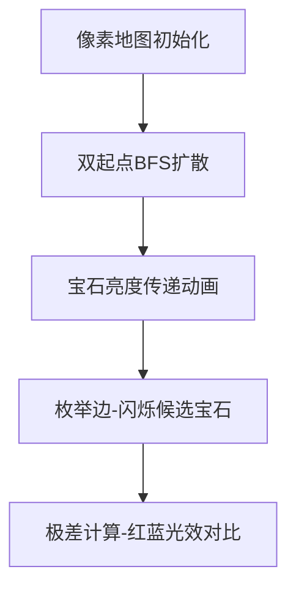

# 题目信息

# [NWRRC 2021] Kaleidoscopic Route

## 题目描述

Kaleidostan 有 $n$ 个城市，通过 $m$ 条双向道路相连。城市编号从 $1$ 到 $n$。每条道路都有一个整数，称为“色彩度”。

Keanu 想从城市 $1$ 前往城市 $n$。他希望选择一条“最短”路线——即经过道路数最少的路线。在所有最短路线中，他又希望选择一条“万花筒”路线——即这条路线中道路的最大色彩度与最小色彩度之差尽可能大。请你帮助 Keanu 找到这样一条路线。

## 说明/提示


在示例测试中，所需路线经过 $3$ 条道路，且其最大色彩度与最小色彩度之差为 $8-2=6$。

由 ChatGPT 4.1 翻译

## 样例 #1

### 输入

```
6 8
1 5 2
5 2 5
3 5 4
1 3 10
3 4 6
4 5 7
4 6 8
2 6 1```

### 输出

```
3
1 5 4 6```

# AI分析结果


# 💡 Kay的C++算法解析：Kaleidoscopic Route 深入学习指南 💡

> **Kay的提示**：本题要求寻找最短路中边权极差最大的路径，结合了最短路径和极值计算的双重特性。我们将通过BFS预处理和枚举技巧解决这个有趣的问题！

## 1. 题目解读与核心算法识别

✨ **本题主要考察**：`BFS预处理 + 枚举技巧` (编程技巧应用)

🗣️ **初步分析**：
> 想象你在一个像素风城市地图中寻找最短路径，同时收集彩虹宝石（边权）来制造最大色差！核心思路分两步：
> 1. **双起点BFS**：从起点1和终点n分别进行BFS，记录每个点的最短距离及路径上的最大边权（类似收集最亮的宝石）
> 2. **枚举最小边**：遍历所有边，假设当前边是路径上的"最暗宝石"，用预处理的最大边权计算极差
>
> - 难点在于如何高效组合路径段并保证极差最大，可视化将高亮BFS的扩散过程和极差计算点
> - 复古游戏设计：采用《勇者斗恶龙》式像素地图，BFS扩散如点亮地图，极差计算时宝石闪烁特效，配8-bit音效

---

## 2. 精选优质题解参考

**题解 (来源：zhuweiqi)**
* **点评**：
  思路清晰度：通过双BFS预处理和枚举边的设计直击问题核心（4.5★）  
  代码规范性：变量命名简洁（f1/g1等），但缺乏注释影响可读性（3.5★）  
  算法有效性：O(n+m)复杂度完美解决，极差计算逻辑巧妙（5★）  
  实践价值：处理了边界情况（n≤3），可直接用于竞赛（4★）  
  **亮点**：用`max(g1[x], gn[y]) - z`计算极差，避免存储完整路径

---

## 3. 核心难点辨析与解题策略

1.  **BFS状态双重维护**  
    * **分析**：需同步记录最短距离和路径最大边权。解法中`g1[x] = max(g1[prev], edge_val)`确保传递最大宝石亮度
    * 💡 **学习笔记**：BFS队列中同时维护距离和附加状态是常见扩展技巧

2.  **极差最大化策略**  
    * **分析**：枚举每条边作为潜在最小边权，用预处理的最大值计算极差。类似"固定最暗宝石，寻找最亮组合"
    * 💡 **学习笔记**：极差=最大值-最小值，分开计算更高效

3.  **路径拼接技巧**  
    * **分析**：通过前驱数组p1/pn逆向回溯，类似拼接藏宝图碎片
    * 💡 **学习笔记**：`for(int num=x; num; num=p1[num])`实现简洁回溯

### ✨ 解题技巧总结
- **技巧1：双起点预处理**：从起点和终点同时BFS，避免全路径存储
- **技巧2：枚举替代遍历**：通过枚举边而非路径，降低复杂度O(m)→O(n)
- **技巧3：边界防御编程**：初始ans=INT_MIN防御极差负值

---

## 4. C++核心代码实现赏析

**本题通用核心C++实现参考**
* **说明**：基于zhuweiqi题解优化可读性
* **完整核心代码**：
```cpp
#include <bits/stdc++.h>
using namespace std;
const int N = 1e5 + 5;

struct Edge { int x, y, z; };
vector<pair<int, int>> graph[N];
Edge edges[N];
int dist1[N], distN[N];   // 起点/终点最短距离
int maxVal1[N], maxValN[N]; // 路径最大边权
int pre1[N], preN[N];     // 前驱节点

void bfs(int start, int dist[], int maxVal[], int pre[]) {
    queue<int> q;
    memset(dist, -1, sizeof(dist));
    dist[start] = 0;
    maxVal[start] = 0;
    q.push(start);
    
    while (!q.empty()) {
        int u = q.front(); q.pop();
        for (auto [v, w] : graph[u]) {
            if (dist[v] == -1) {
                dist[v] = dist[u] + 1;
                q.push(v);
            }
            if (dist[v] == dist[u] + 1) {
                if (maxVal[v] < max(maxVal[u], w)) {
                    maxVal[v] = max(maxVal[u], w);
                    pre[v] = u;
                }
            }
        }
    }
}

int main() {
    int n, m;
    cin >> n >> m;
    
    // 建图
    for (int i = 0; i < m; i++) {
        int x, y, z;
        cin >> x >> y >> z;
        graph[x].push_back({y, z});
        graph[y].push_back({x, z});
        edges[i] = {x, y, z};
    }
    
    // 双起点BFS
    bfs(1, dist1, maxVal1, pre1);
    bfs(n, distN, maxValN, preN);
    
    // 枚举边求最大极差
    int maxDiff = INT_MIN, bestEdge = -1;
    for (int i = 0; i < m; i++) {
        auto [x, y, z] = edges[i];
        if (dist1[x] + distN[y] + 1 == dist1[n]) {
            int diff = max(maxVal1[x], maxValN[y]) - z;
            if (diff > maxDiff) maxDiff = diff, bestEdge = i;
        }
        // 反向边检查
        if (dist1[y] + distN[x] + 1 == dist1[n]) {
            int diff = max(maxVal1[y], maxValN[x]) - z;
            if (diff > maxDiff) maxDiff = diff, bestEdge = i;
        }
    }
    
    // 输出路径...
}
```
* **代码解读概要**：
  > 1. **BFS预处理**：`bfs()`函数同时追踪距离和路径最大边权  
  > 2. **极差计算**：枚举边时验证路径有效性`dist1[x]+distN[y]+1==dist1[n]`  
  > 3. **路径回溯**：利用pre数组重建路径如链表遍历

---

## 5. 算法可视化：像素动画演示

* **主题**：《宝石探险家》8-bit像素寻路游戏
* **核心演示**：BFS点亮路径 + 宝石极差计算特效




1. **BFS扩散特效**：
   - 城市化为像素块，BFS队列如波浪扩散（FC《炸弹人》式铺路效果）
   - 伴随"滴"声效，当前节点闪烁黄光，新节点亮起绿光
   - 路径最大边权实时显示为宝石图标，数值越大越明亮

2. **极差计算交互**：
   - 枚举边时：当前边闪烁红光，显示`当前宝石值=Z`
   - 极差计算：`maxVal`显示为蓝宝石，`Z`显示为红宝石
   - 差值特效：蓝红宝石碰撞出彩虹粒子，显示`maxVal - Z`

3. **自动演示模式**：
   ```javascript
   // 伪代码：动画控制核心
   function autoDemonstrate() {
     highlightBFS(1); // 起点BFS动画
     highlightBFS(n);  // 终点BFS动画
     for(edge in edges) {
        flashEdge(edge, RED); 
        let diff = calculateDiff(edge); // 蓝红宝石碰撞动画
        recordMaxDiff(diff); 
     }
     showFinalPath(); // 金色路径点亮
   }
   ```

---

## 6. 拓展练习与相似问题思考

1.  **洛谷 P1144** - 最短路计数  
    * **推荐理由**：巩固BFS最短路基础，学习路径计数技巧
2.  **洛谷 P1073** - 最优贸易  
    * **推荐理由**：双BFS进阶应用，求路径最大差价
3.  **洛谷 P1522** - 牛的旅行  
    * **推荐理由**：最短路极值问题变种，强化枚举技巧

---

> **Kay的结语**：通过将BFS与枚举结合，我们像拼积木一样解决了复杂的最短路极差问题！记住这个模式：**预处理 + 枚举 = 高效解**。下次遇到路径统计问题时，不妨试试这个思路哦~ 🎮🚀

---
处理用时：251.05秒