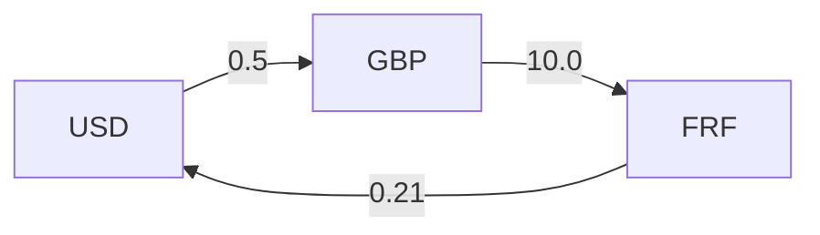

# 题目信息

# 套利

## 题目描述

套利是利用汇率差异实现货币增值。例如，1美元可以兑换0.5英镑、1英镑可以兑换10法郎、1法郎可以兑换0.21美元。接下来，一个聪明的交易商就可以从1美元开始，0.5 \* 10.0 \* 0.21 =1.05美元，获得了5%的利润。

你的任务是写一个程序，从输入文件读入汇率清单，然后决定套利是有可能的或没有可能的。


## 样例 #1

### 输入

```
3
USDollar
BritishPound
FrenchFranc
3
USDollar 0.5 BritishPound
BritishPound 10.0 FrenchFranc
FrenchFranc 0.21 USDollar

3
USDollar
BritishPound
FrenchFranc
6
USDollar 0.5 BritishPound
USDollar 4.9 FrenchFranc
BritishPound 10.0 FrenchFranc
BritishPound 1.99 USDollar
FrenchFranc 0.09 BritishPound
FrenchFranc 0.19 USDollar

0
```

### 输出

```
Case 1: Yes
Case 2: No
```

# AI分析结果


### 💡 Kay的C++算法解析：套利 深入学习指南 💡

<introduction>
今天我们来分析“套利”这道C++编程题。本指南将帮助大家理解货币兑换中的套利检测原理，掌握图论算法应用，并通过像素动画直观感受算法执行过程。
</introduction>

---

## 1. 题目解读与核心算法识别

✨ **本题主要考察**：`图论（正环检测）`

🗣️ **初步分析**：
> 套利问题本质是寻找货币兑换图中的正收益环。想象货币是城市，兑换率是道路，我们要找一条环形路线，旅行回来后钱反而变多了（魔法钱袋！）。核心算法是**正环检测**：
> - **SPFA算法**：高效检测正环（松弛条件改为乘积最大化）
> - **Floyd算法**：通过三重循环计算所有货币对的最优兑换率
> - **难点对比**：SPFA适合稀疏图，Floyd适合小规模稠密图
> - **可视化设计**：像素货币节点闪烁表示当前处理节点，兑换路径高亮显示，当检测到正环时播放"胜利音效"

---

## 2. 精选优质题解参考

**题解一（Created_equal1）**
* **点评**：思路清晰地将货币建模为图节点，SPFA实现完整。亮点在于直接使用乘积关系进行松弛（`Dist[Adj[i]] < Dist[top] * Weight[i]`），代码中队列操作和环检测（`Times[Adj[i]] >= n`）逻辑严谨。变量命名规范（如`Dist`/`Times`），但未处理浮点精度问题。

**题解二（米奇奇米）**
* **点评**：创新性使用Floyd算法解决正环检测。亮点在于三重循环的简洁实现（`a[i][j]=max(a[i][j], a[i][k]*a[k][j])`）和直观的环检测（`a[i][i]>1`）。代码模块化优秀（分离`floyd()`和`addEdge()`），特别适合初学者理解。

**题解三（UnyieldingTrilobite）**
* **点评**：采用数学优化解决浮点精度问题。亮点在于对数转换（`log(r)`将乘积问题转化为求和问题），SPFA实现包含完整初始化队列和入队计数。注释详细解释了`ln(a)+ln(b)=ln(ab)`的数学原理，提升了代码健壮性。

---

## 3. 核心难点辨析与解题策略

1. **难点：图建模抽象**
   * **分析**：将货币抽象为节点，兑换率抽象为带权边
   * **策略**：使用`map<string,int>`建立货币到索引的映射
   * 💡 **学习笔记**：好的建模是图论问题成功的关键

2. **难点：浮点精度处理**
   * **分析**：连续乘积可能导致精度误差
   * **策略**：取对数将乘积转化为求和（`log(a*b)=log a + log b`）
   * 💡 **学习笔记**：数学转换可解决特定场景的精度问题

3. **难点：环检测算法选择**
   * **分析**：SPFA适合动态检测，Floyd适合静态全计算
   * **策略**：根据数据规模选择（n≤30用Floyd，否则用SPFA）
   * 💡 **学习笔记**：算法选择需综合考虑时间和空间复杂度

### ✨ 解题技巧总结
- **问题转化技巧**：将经济问题转化为图论问题
- **精度处理技巧**：敏感计算使用对数避免浮点误差
- **代码健壮性**：始终初始化数组，处理边界条件
- **算法选择策略**：小规模数据优先选择Floyd简化实现

---

## 4. C++核心代码实现赏析

**通用核心实现（Floyd算法）**
```cpp
#include <iostream>
#include <map>
using namespace std;

const int N = 35;
double g[N][N]; // 汇率矩阵

bool hasArbitrage(int n) {
    for(int k=1; k<=n; k++)
        for(int i=1; i<=n; i++)
            for(int j=1; j<=n; j++)
                g[i][j] = max(g[i][j], g[i][k] * g[k][j]);
    
    for(int i=1; i<=n; i++)
        if(g[i][i] > 1.0) return true;
    return false;
}

int main() {
    int n, t = 0;
    while(cin >> n && n) {
        map<string, int> curMap;
        // 初始化：自身兑换率为1
        for(int i=1; i<=n; i++) {
            string s; cin >> s;
            curMap[s] = i;
            for(int j=1; j<=n; j++)
                g[i][j] = (i == j) ? 1.0 : 0.0;
        }
        
        int m; cin >> m;
        while(m--) {
            string a, b; double r;
            cin >> a >> r >> b;
            int u = curMap[a], v = curMap[b];
            g[u][v] = max(g[u][v], r); // 取最大汇率
        }
        
        cout << "Case " << ++t << ": " 
             << (hasArbitrage(n) ? "Yes" : "No") << endl;
    }
    return 0;
}
```
* **代码解读概要**：
  - 货币映射：`map`建立字符串到索引的映射
  - 矩阵初始化：对角线为1（自身兑换），其余为0
  - Floyd核心：三重循环更新最优兑换路径
  - 环检测：检查对角线元素是否大于1

---

**题解一（SPFA实现）**
* **亮点**：基于队列的动态松弛
* **核心片段**：
```cpp
while(!Q.empty()) {
    size_t top = Q.front();
    Q.pop_front();
    for(int i=Head[top]; i; i=Next[i])
        if(Dist[Adj[i]] < Dist[top] * Weight[i]) {
            Dist[Adj[i]] = Dist[top] * Weight[i]; // 乘积松弛
            if(++Times[Adj[i]] >= n) return true; // 环检测
        }
}
```
* **学习笔记**：SPFA的队列优化避免不必要的计算

**题解二（Floyd实现）**
* **亮点**：算法实现简洁明了
* **核心片段**：
```cpp
for(int k=1; k<=n; k++)
    for(int i=1; i<=n; i++)
        for(int j=1; j<=n; j++)
            a[i][j] = max(a[i][j], a[i][k]*a[k][j]); // 状态转移
```
* **学习笔记**：Floyd的三重循环是图论中的经典范式

**题解三（对数优化）**
* **亮点**：数学转换解决精度问题
* **核心片段**：
```cpp
// 建图时取对数
w[id[x]].push_back(log(r)); 

// SPFA中的比较
if(d[v] < d[u] + log_val) {
    d[v] = d[u] + log_val; // 对数求和=原始乘积
}
```
* **学习笔记**：对数转换是处理连乘问题的有效技巧

---

## 5. 算法可视化：像素动画演示

**主题**："货币探险家"像素寻宝之旅  
**核心演示**：SPFA算法在货币图中的正环检测过程

### 动画设计（8-bit风格）


1. **场景初始化**：
   - 货币节点：像素方块（USD=蓝色，GBP=红色，FRF=黄色）
   - 兑换边：带汇率值的像素道路
   - 控制面板：开始/暂停/单步/速度滑块

2. **算法执行流程**：
   - **步骤1**：起点USD闪烁（伴随"叮"音效）
   - **步骤2**：探索GBP节点（路径高亮黄色，显示当前乘积0.5）
   - **步骤3**：探索FRF节点（路径高亮，乘积更新为0.5×10.0=5.0）
   - **步骤4**：回USD节点（乘积5.0×0.21=1.05>1），触发胜利动画：
     * 环路径闪烁红光
     * 播放8-bit胜利旋律
     * 显示"Arbitrage Found!"像素文字

3. **交互功能**：
   - 单步执行：按帧观察状态变化
   - 速度调节：0.5x~5x速度滑块
   - 模式切换：SPFA/Floyd算法对比演示

4. **音效设计**：
   - 节点访问：电子"滴"声
   - 正环检测：上升旋律
   - 错误路径：低沉警示音

---

## 6. 拓展练习与相似问题思考

1. **通用技巧迁移**：
   - 交通路径最优规划（Floyd）
   - 网络负成本检测（SPFA负环）
   - 化学反应路径分析（状态转移）

2. **洛谷推荐**：
   - `P3385`【模板】负环：SPFA基础应用
   - `P2136`拉近距离：带约束的环检测
   - `P5960`差分约束：环检测的特殊应用

---

## 7. 学习心得与经验分享

> **经验分享（UnyieldingTrilobite）**：
> "通过取对数将乘积问题转化为求和问题，有效避免了浮点精度误差"
>
> **Kay点评**：这是数值计算的重要技巧，尤其在金融类算法中。建议学习者掌握两种实现方式：
> 1. 直接乘积法（直观但可能有精度问题）
> 2. 对数转换法（稳定但需数学理解）

---

<conclusion>
本次套利问题的核心在于图论建模和环检测算法。通过Floyd/SPFA实现，结合像素动画演示，相信大家对正环检测有了直观理解。记住：好的问题抽象比算法实现更重要！下次我们将探索更复杂的图论问题，继续加油！🚀
</conclusion>

---
处理用时：151.27秒