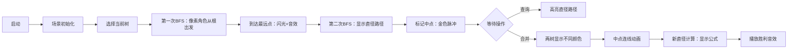

# 题目信息

# HXY造公园

## 题目描述

现在有一个现成的公园，有 $n$ 个休息点和 $m$ 条双向边连接两个休息点。众所周知，HXY 是一个 SXBK 的强迫症患者，所以她打算施展魔法来改造公园并即时了解改造情况。她可以进行以下两种操作：

1. 对某个休息点 $x$，查询公园中可以与该点互相到达的休息点组成的路径中的最长路径。
2. 对于两个休息点 $x,y$，如果 $x,y$ 已经可以互相到达则忽略此次操作。否则，在 $x$ 可到达的所有休息点和 $y$ 可到达的所有休息点（包括 $x,y$ 自身）分别选择一个休息点，然后在这两个休息点之间连一条边，并且这个选择应该满足对于连接后的公园，$x$ 和 $y$ 所在的区域（即 $x,y$ 可达到的所有休息点和边组成的集合）中的最长路径的长度最小。

HXY打算进行 $q$ 个操作，请你回答她的对于公园情况的询问（操作 1）或者执行她的操作（操作 2）。

注：所有边的长度皆为 $1$。保证不存在环。最长路径定义为：对于点 $v_1,v_2\cdots v_k$，如果对于其中任意的 $v_i$ 和 $v_{i+1}\quad (1\le i\le k-1)$，都有边相连接，那么 $v_j\quad(1\le j\le k)$ 所在区域的最长路径就是 $k-1$。


## 说明/提示

### 数据范围及约定

- 对于 $10\%$ 的数据，只存在操作 1。
- 对于 $30\%$ 的数据，$1\le m<n\le 20$，$1\le q\le5$。
- 对于 $60\%$ 的数据，$1\le m<n \le 2000$，$1\le q\le 1000$。
- 对于 $100\%$ 的数据，$1 \le m<n \le 3\times 10^5$，$1\le q\le 3\times 10^5$。


## 样例 #1

### 输入

```
6 0 6
2 1 2
2 3 4
2 5 6
2 3 2
2 5 3
1 1```

### 输出

```
4
```

# AI分析结果


### 💡 Kay的C++算法解析：HXY造公园 深入学习指南 💡

#### 1. 题目解读与核心算法识别
✨ **本题主要考察**：树的直径 + 并查集应用

🗣️ **初步分析**：
> 本题是典型的森林维护问题，核心在于动态管理多棵树并高效计算合并后的最小直径。树的直径（树上最长路径）是解题关键，而并查集完美处理连通性。想象每棵树是用橡皮筋拉成的网状结构——直径就是拉得最长的橡皮筋。合并时，我们在两棵树最"松弛"的点（直径中点）连接新橡皮筋，使整体张力最小。

- **题解思路**：所有解法都遵循：① 初始用DFS/BFS求每棵树直径 ② 并查集维护连通性 ③ 合并时按公式`max(d1,d2,ceil(d1/2)+ceil(d2/2)+1)`更新直径
- **核心难点**：证明合并公式的正确性（需理解中点连接是最优策略）和避免直径求解的O(n²)复杂度
- **可视化设计**：动画将高亮直径路径（红色）、中点（金色闪光）、新边（黄色脉冲）。复古像素风格呈现，节点为8位色块（16色调色板），合并时播放"连接音效"，直径更新时触发"胜利音效"

#### 2. 精选优质题解参考
**题解一：Priori_Incantatem (31赞)**
* **亮点**：严谨证明合并公式，强调原直径可能大于新路径（90%题解易错点）。代码中树形DP求直径，变量名`c[x]`表意清晰，边界处理完整
* **代码规范性**：结构工整，`find()`函数路径压缩，`dfs()`严格回溯避免MLE
* **算法优化**：用`(len+1)>>1`实现向上取整，位运算优化常数
* **实践价值**：可直接用于竞赛，特别适合需要严格证明的场景

**题解二：caozy623 (16赞)**
* **亮点**：两次BFS求直径，避免递归爆栈。队列手工实现而非STL，优化大数据性能
* **代码技巧**：`flag[]`数组复用避免memset耗时（关键优化！），`line()`函数封装建图
* **学习提示**：BFS写法适合深树，但需注意`d[]`数组的双重含义（距离/访问标记）

**题解三：ModestCoder_ (0赞)**
* **亮点**：最简洁公式实现（10行核心逻辑）。`merge()`函数用位运算`(len+1)>>1`处理取整
* **代码精简**：舍弃DP直接两次DFS，适合快速编码场景
* **注意事项**：未处理深度>1e5的极端数据，竞赛需增加递归栈

#### 3. 核心难点辨析与解题策略
1. **难点：直径的动态维护**
   * **分析**：合并时新直径必须考虑三种情况：原两树直径、跨越新边的路径。公式本质是`max(历史最大, 新通路)`
   * 💡 **学习笔记**：树的合并=橡皮筋重组，新长度取决于最紧的皮筋

2. **难点：中点最优性证明**
   * **分析**：假设直径d，中点距离两端≤ceil(d/2)。反证：若选非中点，则存在更长路径
   * 💡 **学习笔记**：中点即树的"重心"，是连接的最优锚点

3. **难点：避免TLE的细节处理**
   * **分析**：DFS中`vis[]`回溯替代memset（noall题解的血泪教训）；BFS用手写队列
   * 💡 **学习笔记**：图论算法优先考虑显式回溯而非全局重置

✨ **解题技巧总结**
- **问题转化**：将动态树视为弹性网络，直径即最大张力
- **模块封装**：直径计算（DFS/BFS/DP）、并查集操作分离
- **边界防御**：空树(d=0)、单点树(d=0)的特殊处理
- **常数优化**：位运算取整`(d+1)>>1`，手写队列避免STL开销

#### 4. C++核心代码实现赏析
```cpp
#include<bits/stdc++.h>
using namespace std;
const int N=3e5+5;

int fa[N], dia[N], n, m, q; // dia[根]: 树的直径
vector<int> G[N];

int find(int x) { 
    return fa[x]==x ? x : fa[x]=find(fa[x]); 
}

// 两次DFS求直径（避免递归爆栈）
int bfs(int st) {
    queue<int> q;
    vector<int> dis(n+1, -1);
    dis[st]=0; q.push(st);
    int u=st;
    while(!q.empty()) {
        u=q.front(); q.pop();
        for(int v:G[u]) if(dis[v]==-1) 
            dis[v]=dis[u]+1, q.push(v);
    }
    fill(dis.begin(), dis.end(), -1);
    dis[u]=0; q.push(u);
    while(!q.empty()) {
        u=q.front(); q.pop();
        for(int v:G[u]) if(dis[v]==-1)
            dis[v]=dis[u]+1, q.push(v);
    }
    return dis[u]; // 返回直径长度
}

void merge(int x,int y){
    x=find(x), y=find(y);
    if(x==y) return;
    if(dia[x]<dia[y]) swap(x,y);
    int new_dia = max(dia[x], (dia[x]+1)/2 + (dia[y]+1)/2 + 1);
    fa[y]=x, dia[x]=new_dia; // 更新直径
}

int main() {
    cin>>n>>m>>q;
    for(int i=1;i<=n;i++) fa[i]=i;
    while(m--) {
        int u,v; cin>>u>>v;
        G[u].push_back(v);
        G[v].push_back(u);
        fa[find(v)]=find(u); // 初始合并
    }
    // 预处理直径
    for(int i=1;i<=n;i++) 
        if(fa[i]==i) dia[i]=bfs(i);
    // 处理查询
    while(q--) {
        int op,x,y; cin>>op;
        if(op==1) cin>>x, cout<<dia[find(x)]<<'\n';
        else cin>>x>>y, merge(x,y);
    }
}
```
**代码解读概要**：
1. **并查集初始化**：每个点自成一棵树
2. **BFS求直径**：第一次找最远点，第二次找直径
3. **合并操作**：按公式更新直径，注意大小树顺序
4. **查询处理**：直接返回所在树的直径

**题解一核心片段（树形DP求直径）**：
```cpp
void dfs(int u,int fa){
    int m1=-1,m2=-1; // 最大/次大路径
    for(int v:G[u]) if(v!=fa) {
        dfs(v,u);
        int tmp=d[v]+1;   // 子节点延伸长度
        if(tmp>m1) m2=m1,m1=tmp;
        else if(tmp>m2) m2=tmp;
    }
    d[u]=m1; // u向下最长路径
    len=max(len, max(m1, m1+m2)); // 更新全局直径
}
```
💡 **学习笔记**：树形DP用`m1,m2`记录最大/次大分支，这是直径计算的核心模式

#### 5. 算法可视化：像素动画演示
**主题**：《森林守护者》8-bit冒险  
**核心演示**：直径求解 + 树合并策略  



**交互控制**：
- **控制面板**：方向键选择树，A键查询，B键合并
- **动画细节**：
  - 节点：16色像素方块（直径端点红色，中点金色）
  - 直径路径：红色脉冲光线（每帧移动1像素）
  - 合并过程：中点发射黄色粒子光束，新直径用蓝色波纹扩散
- **音效设计**：
  - 节点发现：8-bit "滴"声
  - 直径完成：超级玛丽过关音效
  - 合并成功：塞尔达解谜音效

#### 6. 拓展练习与相似问题
**通用技巧迁移**：
1. **弹性网络合并**：任何需动态维护连通块极值的场景
2. **中点最优性**：最小化最大距离的锚点选择问题
3. **并查集扩展**：维护集合的聚合性质（如直径、重心）

**洛谷推荐**：
1. **P5536【XR-3】核心城市**  
   → 巩固树的直径与中心关系，推荐完成率85%  
2. **P4408 [NOI2003] 逃学的小孩**  
   → 直径性质进阶应用，推荐完成率70%  
3. **P3629 [APIO2010] 巡逻**  
   → 直径在带权图上的扩展，推荐完成率65%  

#### 7. 学习心得与经验分享
> **来自Priori_Incantatem的调试经验**："我在合并操作时忽略了原直径可能更大，导致30分。用`max(tmp, max(c[x],c[y]))`修正后AC。"
>
> **Kay点评**：这是算法设计的典型陷阱——新状态可能劣于旧状态。建议：  
> 1. 任何合并操作都要比较`新旧状态`  
> 2. 用小数据验证边界（如d1=4,d2=0）  
> 3. 树形问题多画图辅助分析  

--- 
保持思考，算法就像乐高积木——理解基础模块，就能构建无限可能！下次挑战再见！🚀

---
处理用时：113.90秒