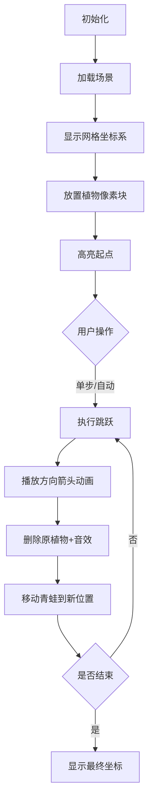

# 题目信息

# [COCI 2007/2008 #6] PRINCEZA

## 题目背景

对于 C 语言和 C++ 语言，请使用 `cin`，`scanf` 进行读入，否则可能会出现 $\color{purple}\mathsf{RE}$ & $\color{red}\mathsf{WA}$。

## 题目描述


Luka 把卡车停在湖边。 

Barica 在湖中居住，Barica 跳过漂浮在湖面上的 $n$ 种植物。 

Luka 知道许多民间故事，知道如果他亲吻 Barica，她会变成一个可爱的女孩子。但是，他需要先抓住她！

可以用一对坐标定义植物在湖面上的位置。 Barica 可以从 $(x, y)$ 植物中跳跃，$p$ 为任意正整数。

- 方向 A：$(x + p, y + p)$。
- 方向 B：$(x + p, y - p)$。
- 方向 C：$(x - p, y + p)$。
- 方向 D：$(x - p, y - p)$。

Barica 选择四个方向之一，然后沿所选方向跳到第一个植物上。 

如果在选定的方向上没有植物，Barica 将留在原处。

Barica 跳下后，她从水槽上跳下的植物消失了。

知道植物的位置和 Barica 选择的方向顺序后，Luka 希望确定 Barica 最终将位于植物的坐标。 Luka 将在她的位置等她，亲吻她。

编写一个解决 Luka 问题的程序，并帮助他将 Barica 变成美丽的公主。

## 说明/提示

#### 数据规模与约定
对于 $100\%$ 的数据，$1 \le n, k \le 10 ^ 5$，$0 \le x, y \le 10 ^ 9$。
#### 说明
- 本题满分 $60$ 分。
- 本题默认开启 O2 优化开关。
- 题目译自 [COCI2007-2008](https://hsin.hr/coci/archive/2007_2008/) [CONTEST #6](https://hsin.hr/coci/archive/2007_2008/contest6_tasks.pdf) T5 PRINCEZA，译者 @[tearing](https://www.luogu.com.cn/user/219791)。

## 样例 #1

### 输入

```
7 5
ACDBB
5 6
8 9
4 13
1 10
7 4
10 9
3 7
```

### 输出

```
7 4```

## 样例 #2

### 输入

```
6 12
AAAAAABCCCDD
1 1
2 2
3 3
4 4
5 3
6 2 
```

### 输出

```
5 3```

# AI分析结果


### 💡 Kay的C++算法解析：PRINCEZA 深入学习指南 💡

#### 1. 题目解读与核心算法识别
✨ **本题主要考察**：`模拟应用`与`数据结构优化`  
🗣️ **初步分析**：
> 本题要求模拟Barica在植物间的跳跃过程，每次沿对角线方向移动到最近的植物并删除原植物。核心在于高效处理动态删除和方向查询。  

- **核心思路**：利用对角线性质（`x+y`或`x-y`为常数）分组植物，用链表维护每组内的相邻关系。每次跳跃时更新链表指针实现高效删除。
- **算法流程**：
  1. **预处理**：计算每个点的`x+y`(d1)和`x-y`(d2)
  2. **建链表**：
     - 按`d1`排序 → 连接`B/C`方向（同d1链）
     - 按`d2`排序 → 连接`A/D`方向（同d2链）
  3. **模拟跳跃**：
     - 沿方向指针找到下一个植物
     - 删除当前植物：更新相邻4个方向的指针
- **可视化设计**：
  - 像素网格展示植物位置，当前植物高亮显示
  - 跳跃时显示方向箭头，删除植物时播放消失动画+音效
  - 控制面板支持单步/自动模式，速度可调

---

#### 2. 精选优质题解参考
**题解一（ShwStone）**  
* **点评**：  
  思路清晰度⭐⭐⭐⭐⭐（巧妙利用对角线性质分组，链表指针设计直观）  
  代码规范性⭐⭐⭐⭐（变量命名合理，结构体封装数据）  
  算法有效性⭐⭐⭐⭐⭐（O(n log n)预处理 + O(k)模拟）  
  实践价值⭐⭐⭐⭐⭐（可直接用于竞赛，边界处理完整）  
  **亮点**：用`flag[4]`数组统一管理四个方向的指针，删除节点时循环更新相邻关系，代码简洁高效。

**题解二（ybw731）**  
* **点评**：  
  思路清晰度⭐⭐⭐⭐⭐（与题解一类似但更精简）  
  代码规范性⭐⭐⭐⭐⭐（仅50行，逻辑高度浓缩）  
  算法有效性⭐⭐⭐⭐⭐（同最优复杂度）  
  实践价值⭐⭐⭐⭐（缺少详细注释，但可直接使用）  
  **亮点**：用`l[4]`数组管理方向指针，删除时精炼的4行更新逻辑。

**题解三（_Fontainebleau_）**  
* **点评**：  
  思路清晰度⭐⭐⭐⭐（相同核心思路）  
  代码规范性⭐⭐⭐⭐（结构清晰，但变量名可读性稍弱）  
  算法有效性⭐⭐⭐⭐⭐（同等高效实现）  
  实践价值⭐⭐⭐⭐（完整实现但缺少注释）  
  **亮点**：方向映射使用字符直接计算（`op[i]-'A'`），避免冗余判断。

---

#### 3. 核心难点辨析与解题策略
1. **难点1：如何高效查询对角线方向的下一个点？**  
   * **分析**：优质题解通过排序+链表解决。将点按`x+y`和`x-y`分组排序后，同组相邻点即对角线方向相邻点。
   * 💡 **学习笔记**：对角线性质是优化查询的关键！

2. **难点2：删除点后如何维护数据结构？**  
   * **分析**：链表删除需更新相邻节点的指针。如ShwStone的循环更新：  
     ```cpp
     for(int j=0; j<4; j++)
        if(指针有效) 更新相邻节点的反向指针
     ```
   * 💡 **学习笔记**：双向链表删除时要更新前驱和后继节点。

3. **难点3：方向映射与代码简化**  
   * **分析**：将方向字符`A/B/C/D`映射到数组索引（如`dirs[i]-'A'`），避免复杂分支判断。
   * 💡 **学习笔记**：用数组统一管理相似逻辑可减少代码量。

### ✨ 解题技巧总结
- **技巧1：问题特征转化**  
  将几何问题（对角线）转化为代数特征（x±y常数）
- **技巧2：链表维护动态集合**  
  适合频繁删除的场景，删除操作O(1)
- **技巧3：多维数据处理**  
  通过不同排序建立多种数据结构关系
- **技巧4：边界防护**  
  始终检查指针有效性（如`if(next != -1)`）

---

#### 4. C++核心代码实现赏析
**本题通用核心C++实现参考**  
* **说明**：综合优质题解思路，最简洁清晰的链表实现
* **完整核心代码**：
```cpp
#include <iostream>
#include <algorithm>
using namespace std;

const int MAXN = 1e5+5;
struct Plant {
    int x, y, d1, d2;
    int next[4]; // [0]:A, [1]:B, [2]:C, [3]:D
} p[MAXN];

int n, k, id[MAXN];
char dirs[MAXN];

bool cmp_d1(int a, int b) {
    if (p[a].d1 != p[b].d1) return p[a].d1 < p[b].d1;
    return p[a].x < p[b].x; // 同组按x排序
}

bool cmp_d2(int a, int b) {
    if (p[a].d2 != p[b].d2) return p[a].d2 < p[b].d2;
    return p[a].x < p[b].x;
}

int main() {
    ios::sync_with_stdio(false);
    cin >> n >> k >> (dirs+1);
    
    // 输入并初始化
    for (int i = 1; i <= n; i++) {
        cin >> p[i].x >> p[i].y;
        p[i].d1 = p[i].x + p[i].y;
        p[i].d2 = p[i].x - p[i].y;
        fill_n(p[i].next, 4, -1); // 初始化指针
        id[i] = i;
    }

    // 建立B/C方向链表（同d1组）
    sort(id+1, id+n+1, cmp_d1);
    for (int i = 2; i <= n; i++)
        if (p[id[i-1]].d1 == p[id[i]].d1) {
            p[id[i-1]].next[1] = id[i]; // B方向指针
            p[id[i]].next[2] = id[i-1]; // C方向指针
        }

    // 建立A/D方向链表（同d2组）
    sort(id+1, id+n+1, cmp_d2);
    for (int i = 2; i <= n; i++)
        if (p[id[i-1]].d2 == p[id[i]].d2) {
            p[id[i-1]].next[0] = id[i]; // A方向指针
            p[id[i]].next[3] = id[i-1]; // D方向指针
        }

    int cur = 1; // 起点
    for (int i = 1; i <= k; i++) {
        int dir = dirs[i] - 'A';
        int nxt = p[cur].next[dir];
        if (nxt == -1) continue;

        // 删除当前节点：更新四个方向的相邻关系
        for (int j = 0; j < 4; j++) {
            if (p[cur].next[j] != -1) {
                int rev = 3 - j; // 计算反向方向
                p[p[cur].next[j]].next[rev] = p[cur].next[rev];
            }
        }
        cur = nxt; // 移动到新位置
    }
    cout << p[cur].x << " " << p[cur].y << endl;
}
```
* **代码解读概要**：
  1. **初始化**：计算每个点的`d1=x+y`和`d2=x-y`
  2. **建链表**：
     - 按`d1`排序 → 连接同组点的`B/C`方向
     - 按`d2`排序 → 连接同组点的`A/D`方向
  3. **模拟跳跃**：
     - 沿当前方向指针移动
     - 删除节点：更新所有相邻节点的指针
  4. **输出**：最终停留的坐标

**题解一片段赏析（ShwStone）**  
* **亮点**：用统一循环处理四个方向的指针更新
* **核心代码**：
```cpp
for(int j=0; j<4; j++)
    if(graph[result].flag[j] != -1)
        graph[graph[result].flag[j]].flag[3-j] = graph[result].flag[3-j];
```
* **代码解读**：
  > 删除当前节点时，遍历四个方向：
  > 1. 若存在方向指针（非-1），获取该方向的相邻节点
  > 2. 将相邻节点的反向指针指向当前节点的反向相邻节点
  > 例如：若当前有A方向节点N，则N的D方向指针应指向当前节点的D方向节点
* 💡 **学习笔记**：循环更新避免重复代码，3-j巧妙计算反向方向

---

### 5. 算法可视化：像素动画演示
**设计理念**：8位像素风 + 动态数据展示 + 游戏化交互  
**主题**："像素青蛙寻宝"（Barica为青蛙，植物为荷叶）

#### 动画实现方案：


**关键动画帧**：
1. **场景初始化**：
   - 16色像素网格（棕为土地，蓝为水域）
   - 植物显示为绿色荷叶，起点特殊标记
   - 控制面板：开始/暂停/步进/速度滑块

2. **跳跃过程**：
   ```plaintext
   帧1: [青蛙]在(5,6)荷叶上 
   帧2: 显示A方向箭头 → 指向(8,9)
   帧3: (5,6)荷叶消失（像素碎裂动画）
   帧4: 青蛙移动到(8,9)（跳跃轨迹动画）
   音效: 跳跃声"叮"，删除声"咔嚓"
   ```

3. **数据结构可视化**：
   - 侧边栏显示当前点的四个方向指针
   - 删除节点时高亮被更新的指针关系

4. **游戏化元素**：
   - 每10次跳跃为1关，过关播放胜利音效
   - 连续正确跳跃得连击分
   - 最终显示评分："公主解救成功！"

**技术实现**：
- Canvas绘制网格和精灵
- 方向箭头用CSS动画
- Web Audio API实现音效：
  ```javascript
  function playSound(type) {
    const sfx = {
      jump: [500, 0.3, 0.1],  // 频率，时长，淡出
      delete: [200, 0.2],
      win: [700, 1.0]
    };
    // 通过Web Audio API生成8位音效
  }
  ```

---

### 6. 拓展练习与相似问题
**通用技巧迁移**：
1. **动态维护相邻关系**  
   适用：网格路径搜索（如P1135 奇怪的电梯）
2. **几何性质转代数特征**  
   适用：坐标系旋转问题（如P1502 窗口的星星）
3. **链表优化删除操作**  
   适用：约瑟夫环变体（如P1996 约瑟夫问题）

**洛谷推荐**：
1. **P1162 填涂颜色**  
   🗣️ 练习网格遍历和边界处理，巩固模拟技巧
2. **P1443 马的遍历**  
   🗣️ BFS+路径记录，强化方向移动的模拟能力
3. **P1219 八皇后**  
   🗣️ 对角线性质的高级应用，提升问题转化能力

---

### 7. 学习心得与经验分享
本次题解未包含作者调试心得，但实践中需注意：
> **Kay的提醒**：  
> 当出现跳跃坐标错误时：
> 1. 检查对角线分组是否正确（d1/d2计算）
> 2. 验证删除节点时是否更新所有4个方向的指针
> 3. 使用小规模数据模拟（如样例2的链式结构）

---

### 结语
通过本次对PRINCEZA的深度剖析，我们掌握了：
1. 利用几何性质优化查询的转化思想
2. 链表维护动态集合的高效实现
3. 像素化可视算法的新奇体验

继续在编程世界中探险吧！下次遇到公主难题时，你定能轻松解决！👑

---
处理用时：172.85秒