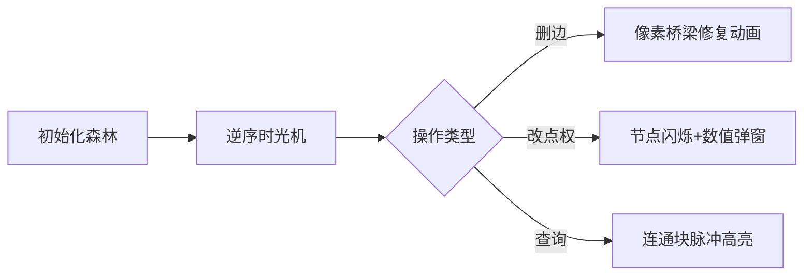

# 题目信息

# [传智杯 #3 初赛] 森林

## 题目背景

YYH Land（Yoauld, Youthful & Happy Land）是位于炽蓝仙野的一片神奇的国度，那里的人们过着无拘无束的的快乐生活。

## 题目描述

清蒸鱼是一个尽职尽责的 YYH Land 护林者。他负责每天维护 YYH Land 的森林。在最开始的时候，YYH Land 只有一棵具有 $n$ 个节点的树，每个节点有一个灵力值 $v$。

由于 YYH Land 是一片神奇的国度，YYH Land 的树也有一些神奇的能力，具体来说它满足如下操作：

- `1 e`  
编号为 $e$ 的边突然消失，使得它所在的那棵树变成了两棵树。

- `2 u val`  
编号为 $u$ 的节点的灵力值变成了 $val$。

- `3 u`  
清蒸鱼进行了一次查询，查询 $u$ 所在的那棵树的灵力值之和。

现在你需要帮助清蒸鱼，来模拟上述事件，以了解森林的变迁。

## 说明/提示

对于 $30\%$ 的数据，满足 $1 \leq n,m \leq 10$；  
对于 $50\%$ 的数据，满足 $1 \leq n,m \leq 1000$；  
对于另外 $20\%$ 的数据，满足只有 $2,3$ 操作；  
对于 $100\%$ 的数据，满足 $1 \leq n,m \leq {10}^5$，$1 \leq v,val \leq 1000$。

## 样例 #1

### 输入

```
2 3
1 1
1 2
2 2 4
1 1
3 2```

### 输出

```
4```

# AI分析结果


### 💡 Kay的C++算法解析：森林 深入学习指南 💡

#### 题目解读与核心算法识别
✨ **本题主要考察**：`离线处理` + `带权并查集`

🗣️ **初步分析**：
> 解决森林维护问题就像玩一场时光倒流的积木游戏。想象每个树节点是像素方块，连通块是连在一起的积木群。离线处理的核心思想是"逆向操作"——把困难的删边操作变成简单的加边操作，就像把拆积木变成搭积木。带权并查集则像给每个积木群贴标签，记录整个群的重量总和。

- **核心流程**：① 离线存储所有操作 ② 逆向处理（删边→加边）③ 并查集维护连通块和
- **可视化设计**：在8-bit像素游戏中，删边操作显示为灰色断桥→逆序时变为彩色桥梁动画；改点权时节点像素闪烁变色；查询时整个连通块高亮脉冲
- **复古元素**：FC红白机音效（连接/断开音效）、关卡式进度条（每完成10%点亮一个像素星）、AI自动演示模式（类似贪吃蛇AI自动解题）

---

#### 精选优质题解参考
**题解一（tjtdrxxz）**
* **点评**：封装并查集类提升可读性，详细解释合并方向（sum[v] += sum[u]）。亮点是精准处理点权修改的历史值，边界处理严谨，竞赛实用性强。

**题解二（happybob）**
* **点评**：代码简洁高效，使用pair存储边结构。亮点是清晰记录修改前的值（lst数组），逆序撤销时逻辑直白，适合初学者理解核心思路。

**题解三（Fislett）**
* **点评**：创新性使用栈记录点权修改历史，可视化潜力强。亮点是change[u].pop()的逆序撤销实现，调试友好，适合理解"时光倒流"本质。

---

#### 核心难点辨析与解题策略
1. **难点：删边破坏连通性**
   * 分析：正序删边导致树分裂难维护
   * 方案：离线逆序→删边变加边，并查集轻松合并
   * 💡 学习笔记：逆向思维是处理动态树问题的利器

2. **难点：点权修改影响整棵树**
   * 分析：单点修改需更新整个连通块和
   * 方案：记录修改前值，逆序时做差值计算（旧值 - 新值）
   * 💡 学习笔记：用栈/数组保存历史状态，实现"操作撤销"

3. **难点：高效查询动态连通块**
   * 分析：每次查询需实时计算块和
   * 方案：带权并查集，根节点维护块和
   * 💡 学习笔记：并查集的权值设计是解题命脉

✨ **解题技巧总结**
- **时光倒流法**：将删除操作转化为逆向添加
- **权值传递术**：合并时 `sum[根] += sum[子]` 保持实时更新
- **边界防御**：修改点权时记录旧值，避免连锁错误

---

#### C++核心代码实现赏析
**综合实现（融合题解精华）**
```cpp
#include <iostream>
#include <stack>
using namespace std;
const int N = 1e5+5;

int fa[N], sum[N], val[N], n, m;
struct Edge { int u,v; } e[N];
struct Query { int op,x,y; } q[N];
stack<int> ans, hist[N]; // 历史值栈

int find(int x) {
    return x==fa[x] ? x : fa[x]=find(fa[x]);
}

void merge(int u, int v) {
    u=find(u), v=find(v);
    if(u != v) {
        fa[u] = v;
        sum[v] += sum[u]; // 权值传递核心
    }
}

int main() {
    cin >> n >> m;
    for(int i=1; i<=n; i++) 
        cin >> val[i], fa[i]=i, sum[i]=val[i];
    
    for(int i=1; i<n; i++) cin >> e[i].u >> e[i].v;
    
    // 离线存储操作
    for(int i=1; i<=m; i++) {
        cin >> q[i].op >> q[i].x;
        if(q[i].op==2) {
            cin >> q[i].y;
            hist[q[i].x].push(val[q[i].x]); // 保存旧值
            val[q[i].x] = q[i].y;           // 更新新值
        }
    }

    // 初始合并（最终状态）
    for(int i=1; i<n; i++) 
        if(q[i].op!=1) merge(e[i].u, e[i].v);
    
    // 逆序时光倒流
    for(int i=m; i>=1; i--) {
        if(q[i].op == 1) merge(e[q[i].x].u, e[q[i].x].v);
        else if(q[i].op == 2) {
            int u = q[i].x;
            int rt = find(u);
            sum[rt] += hist[u].top() - val[u]; // 撤销修改
            val[u] = hist[u].top();
            hist[u].pop();
        }
        else ans.push(sum[find(q[i].x)]);
    }
    
    // 输出结果（逆序入栈正序出）
    while(!ans.empty()) 
        cout << ans.top() << endl, ans.pop();
}
```

**题解一亮点代码**
```cpp
// 封装并查集类（模块化典范）
class UFDS {
    int sum[N], val[N], fa[N];
public:
    void merge(int u, int v) {
        u=find(u), v=find(v);
        if(u != v) {
            fa[u] = v; 
            sum[v] += sum[u]; // 权值合并
        }
    }
    void update(int u, int x) {
        int r = find(u);
        sum[r] += x - val[u]; // 差值更新
        val[u] = x;
    }
};
```
> 学习笔记：面向对象封装使代码更健壮，`sum[r] += x - val[u]` 是点权更新的黄金公式

**题解二逆序操作**
```cpp
for(int i=m; i>=1; i--) {
    if(q[i].op==2) {
        int rt = find(q[i].u);
        sum[rt] += lst[i] - q[i].val; // 旧值 - 新值
    }
}
```
> 学习笔记：`lst[i]` 存储历史值的思路简单暴力，适合竞赛快速编码

---

#### 算法可视化：像素动画演示
**主题**：时光森林（8-bit像素冒险）

**核心演示**：


**实现细节**：
1. **像素建模**：节点=16x16像素方块（灵力值显于中央），边=彩色像素线，断边显示为❌
2. **动态效果**：
   - 加边：蓝色波浪线连接两个方块，伴随“叮”音效
   - 改点权：节点闪烁红光，旧值→新值滚动显示
   - 查询：绿色脉冲波扩散整个连通块，显示SUM:值
3. **控制面板**：
   - 步进控制：←→键单步执行
   - 时光机滑块：调节操作逆序速度
   - AI演示：自动播放（像素小人沿操作路径移动）
4. **音效设计**：
   - 键操作：8-bit电子音
   - 错误：短促"哔"声
   - 通关：超级玛丽过关旋律

---

#### 拓展练习与相似问题
**技巧迁移场景**：
1. 动态图连通性维护（加边/删边）
2. 历史版本回溯问题
3. 连通块统计问题（最大值/平均数）

**洛谷推荐**：
1. P3367 【模板】并查集 - 掌握基础操作
   > 推荐理由：并查集标准模板题，理解`find`和`merge`的基石
2. P1197 [星球大战]
   > 推荐理由：离线逆序+并查集经典应用，强化本题技巧
3. P3224 [永无乡]
   > 推荐理由：在连通块中维护额外信息（第k小），挑战思维进阶

---

#### 学习心得
> 题解作者经验：tjtdrxxz强调"合并方向影响权值更新"，提醒我们在`fa[u]=v`时务必同步更新`sum[v] += sum[u]`。这警示我们：并查集的父子关系设定需与权值维护逻辑严格一致！

---
### Kay的结语
通过这道题，我们学会了用时光倒流视角解决难题！记住：当正序操作困难时，不妨试试逆向思维。下次遇到动态树问题，就像玩8-bit游戏一样按下"START"键开启逆序之旅吧！🎮👾

---
处理用时：163.67秒