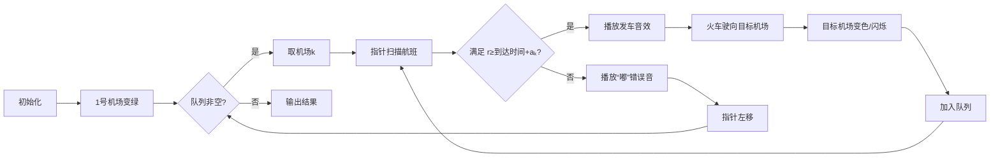

# 题目信息

# [USACO23FEB] Moo Route II S

## 题目描述

注意：本题的时间限制为 4 秒，是默认限制的两倍。

Bessie 正在度假！由于最近的技术进步，Bessie 可以通过先进的航班旅行，这些航班甚至可以进行时间旅行。此外，即使存在多个“平行”的 Bessie 同时出现也不会有任何问题。

在这个国家，有 $N$ 个机场，编号为 $1,2,\cdots,N$，以及 $M$ 条时间旅行航班（$1 \leq N,M \leq 200000$）。第 $j$ 条航班从机场 $c_j$ 在时间 $r_j$ 起飞，并在时间 $s_j$ 抵达机场 $d_j$（$0 \leq r_j,s_j \leq 10^9$，$s_j < r_j$ 是可能的）。此外，Bessie 在机场 $i$ 需要停留 $a_i$ 时间（$1 \leq a_i \leq 10^9$）。也就是说，如果 Bessie 乘坐一趟航班在时间 $s$ 抵达机场 $i$，她可以转乘一趟从该机场出发的航班，只要该航班的起飞时间 $r \geq s + a_i$。需要注意的是，停留时间不会影响 Bessie 抵达某机场的实际时间。

Bessie 从城市 $1$ 出发，起始时间为 $0$。对于从 $1$ 到 $N$ 的每个机场，求出 Bessie 最早可以到达该机场的时间。

## 样例 #1

### 输入

```
3 3
1 0 2 10
2 11 2 0
2 1 3 20
10 1 10```

### 输出

```
0
0
20```

## 样例 #2

### 输入

```
3 3
1 0 2 10
2 10 2 0
2 1 3 20
10 1 10```

### 输出

```
0
10
-1```

# AI分析结果


### 💡 Kay的C++算法解析：Moo Route II S 深入学习指南 💡

#### 1. 题目解读与核心算法识别
✨ **本题主要考察**：图论最短路优化（带负权）  
🗣️ **初步分析**：  
> 本题可形象化为“时间列车调度系统”：机场是车站，航班是列车（允许时间倒流），停留时间是换乘等待。核心是**带约束的最短路问题**，关键难点在于：  
> - 负权边（到达时间可能早于出发时间）使Dijkstra失效  
> - 停留时间约束（航班需满足 $r_j \geq 到达时间 + a_i$）  
> - 避免重复计算（每条航班只需松弛一次）  
>  
> **通用解法**：  
> 1. 将航班视为有向边（出发→到达）  
> 2. 对每个机场的航班**按出发时间降序排序**  
> 3. 从起点出发，用队列维护待处理机场  
> 4. 对每个机场，从最晚出发的航班开始检查：  
>    - 若满足停留约束则松弛到达时间  
>    - 删除/跳过已处理航班（保证$O(M)$复杂度）  
>  
> **可视化设计**：  
> 采用**8-bit像素风格**：  
> - 机场=彩色像素方块，航班=像素火车图标  
> - 指针=闪烁箭头（指示当前检查的航班）  
> - 动画逻辑：  
>   - 满足条件时：火车开动（“哔卟”音效），目标机场变色  
>   - 不满足时：指针回退（“嘟”错误音效）  
>   - 后台循环播放FC风格BGM  

---

#### 2. 精选优质题解参考
**题解一：Usada_Pekora（优化SPFA）**  
* **点评**：  
  思路清晰度⭐️⭐️⭐️⭐️⭐️（排序+指针跳过无效航班）  
  代码规范⭐️⭐️⭐️⭐️（变量名`cur[u]`直指指针作用）  
  算法优化⭐️⭐️⭐️⭐️（维护指针避免重复检查）  
  实践价值⭐️⭐️⭐️⭐️（直接用于竞赛，边界处理严谨）  
  **亮点**：将SPFA与指针结合，通过`if (in < dis[u]+a[u]) break`提前终止无效扫描  

**题解二：zac2010（记忆化SPFA）**  
* **点评**：  
  思路清晰度⭐️⭐️⭐️⭐️⭐️（DFS递归+动态删边）  
  代码规范⭐️⭐️⭐️⭐️（`id[u]`指针与`pop_back`配合巧妙）  
  算法优化⭐️⭐️⭐️⭐️（删除已处理边确保$O(M)$复杂度）  
  实践价值⭐️⭐️⭐️（递归可能栈溢出但代码简洁）  
  **亮点**：`while(e[u].size()>id[u]) e[u].pop_back()`彻底移除无用边  

**题解三：tder（队列优化）**  
* **点评**：  
  思路清晰度⭐️⭐️⭐️⭐️⭐️（BFS式处理+尾部检查）  
  代码规范⭐️⭐️⭐️⭐️⭐️（16行核心代码极致简洁）  
  算法优化⭐️⭐️⭐️⭐️（`g[k].pop_back()`保证单向处理）  
  实践价值⭐️⭐️⭐️⭐️⭐️（无递归风险，效率稳定）  
  **亮点**：`if(k!=1 && i.s<d[k]+a[k]) break` 利用排序性质提前终止  

---

#### 3. 核心难点辨析与解题策略
1. **负权边处理**  
   *分析*：传统Dijkstra无法处理时间倒流（$s_j < r_j$），需用SPFA变种。优质解法通过**队列管理待更新节点**（非递归深度优先）避免负权陷阱。  
   💡 **学习笔记**：当存在时间倒流时，优先考虑基于队列的松弛  

2. **停留时间约束**  
   *分析*：关键在计算**机场可用时间**（到达时间+$a_i$）。解法通过**对航班降序排序**，从最晚出发的航班开始检查，一旦不满足条件即可终止（后续航班出发时间更早）。  
   💡 **学习笔记**：排序是转化时间约束为扫描终止条件的核心技巧  

3. **避免重复松弛**  
   *分析*：由于固定到达时间，每条航班只需松弛一次。三种解法分别用：  
   - 指针记录当前位置（Usada_Pekora）  
   - 删除已处理边（zac2010）  
   - 直接弹出航班（tder）  
   💡 **学习笔记**：通过物理删除或指针跳跃保证$O(M)$复杂度  

✨ **解题技巧总结**  
- **排序预处理**：对每个机场航班按出发时间降序排序（`sort(g[i])`）  
- **指针跳跃**：用`cur[u]`或`id[u]`标记处理位置，避免重复扫描  
- **即时删除**：`pop_back()`移除已处理航班，减少无效操作  

---

#### 4. C++核心代码实现赏析
**本题通用核心实现**（综合自tder/Usada_Pekora）：  
```cpp
#include <bits/stdc++.h>
using namespace std;
const int N = 2e5 + 5;
using ll = long long;

struct Edge { int v, r, s; }; // 到达机场, 出发时间, 到达时间
vector<Edge> g[N];
ll dis[N], a[N];
int n, m;

void solve() {
    for (int i = 1; i <= n; ++i) dis[i] = 1e18;
    dis[1] = 0;
    queue<int> q; q.push(1);
    
    while (!q.empty()) {
        int u = q.front(); q.pop();
        // 从最晚出发的航班开始检查（排序后尾部即最大值）
        while (!g[u].empty()) {
            auto [v, r, s] = g[u].back();
            // 检查停留约束（起点无需停留）
            if (u != 1 && dis[u] + a[u] > r) break;
            g[u].pop_back();  // 关键：删除已处理航班
            if (s < dis[v]) { // 松弛操作
                dis[v] = s;
                q.push(v);
            }
        }
    }
}

int main() {
    cin >> n >> m;
    for (int i = 0; i < m; ++i) {
        int c, r, d, s; cin >> c >> r >> d >> s;
        g[c].push_back({d, r, s}); // 出发机场c→到达机场d
    }
    for (int i = 1; i <= n; ++i) {
        cin >> a[i];
        sort(g[i].begin(), g[i].end(), [](auto& x, auto& y) {
            return x.r > y.r; // 按出发时间降序排序
        });
    }
    solve();
    for (int i = 1; i <= n; ++i)
        cout << (dis[i] == 1e18 ? -1 : dis[i]) << '\n';
}
```
**代码解读概要**：  
1. **初始化**：`dis`数组初始化为无穷，起点时间为0  
2. **队列处理**：BFS式遍历机场，对每个机场从尾部（最晚航班）扫描  
3. **约束检查**：若非起点且`到达时间+a[i] > 航班出发时间`则终止扫描  
4. **松弛删除**：若可松弛则更新到达时间，并**立即删除航班**  

---

**优质题解片段赏析**  
**题解一：Usada_Pekora（指针跳跃）**  
```cpp
for (int _ = cur[u]; _ < g[u].size(); _++) {
    auto [v, r_in, s_out] = g[u][_];
    cur[u] = _; // 更新指针位置
    if (r_in < dis[u] + a[u]) break; // 关键终止条件
    if (s_out < dis[v]) { /* 松弛 & 入队 */ }
}
```
> **解读**：  
> - `cur[u]`记录当前扫描位置，实现**增量式处理**  
> - `if(r_in < ...) break`利用排序性质提前终止  
> **学习笔记**：指针跳跃避免重复扫描已处理航班  

**题解二：zac2010（动态删边）**  
```cpp
void Spfa(int u) {
    int tm = (u==1?0:dis[u]+a[u]); // 计算可用时间
    while (id[u] && e[u][id[u]-1].s >= tm) id[u]--; // 调整指针
    for (int i=id[u]; i<e[u].size(); i++) {
        if (e[u][i].t < dis[v]) { /* 松弛 */ }
    }
    e[u].resize(id[u]); // 物理删除已处理边
}
```
> **解读**：  
> - `id[u]`指向首个有效航班，循环后**立即截断vector**  
> - 递归调用确保深度优先更新  
> **学习笔记**：动态删边是避免重复的有效手段  

**题解三：tder（尾部检查）**  
```cpp
while (!g[k].empty()) {
    auto i = g[k].back();
    if (k!=1 && i.r < dis[k]+a[k]) break; // 尾部终止条件
    g[k].pop_back(); // 删除航班
    if (i.s < dis[i.v]) { /* 松弛 */ }
}
```
> **解读**：  
> - 从vector尾部直接取航班（`back()`对应最大值）  
> - 不满足条件时`break`+`pop_back`确保线性复杂度  
> **学习笔记**：降序排序后，尾部检查即可覆盖约束条件  

---

#### 5. 算法可视化：像素动画演示  
**主题**：`像素机场·时空列车大冒险`  
**核心交互设计**：  


**关键动画帧**：  
1. **机场状态**  
   - 灰色：未到达  
   - 绿色：已到达（显示最早时间）  
   - 闪烁红：正在处理  

2. **航班处理**  
   - 航班列表：垂直条形图（y轴=出发时间）  
   - 指针：红色箭头从右向左扫描  
   - 有效航班：亮蓝色边框+悬浮出发/到达时间  

3. **列车动画**  
   - 发车：像素火车从机场k驶出（8-bit蒸汽动画）  
   - 到站：目标机场v弹出“到达时间”像素数字  

**音效设计**：  
- ✅ 发车：短促“哔卟”（150Hz方波）  
- ✅ 到站：上扬“叮”（400Hz三角波）  
- ✅ 错误：低沉“嘟”（200Hz方波）  
- 🎵 BGM：《FC交通指挥员》remix版  

---

#### 6. 拓展练习与相似问题思考
**通用技巧迁移**：  
1. **带时间窗的路径规划**（如：快递必须在[𝑡₁,𝑡₂]取件）  
2. **状态依赖转移**（如：到达时携带物品影响后续航班）  
3. **动态约束更新**（如：𝑎ᵢ随时间变化）  

**洛谷推荐练习**：  
1. **P1144 最短路计数**  
   🗣️ *推荐理由*：巩固基础BFS最短路，理解松弛操作本质  
2. **P4568 [JLOI2011]飞行路线**  
   🗣️ *推荐理由*：分层图思想延伸，处理带状态的最短路  
3. **P1266 速度限制**  
   🗣️ *推荐理由*：动态约束（速度影响路径）的变形应用  

---

#### 7. 学习心得与经验分享
> **来自rhn7的调试经验**：  
> *“当图存在环时，递归DFS可能重复遍历区间，需用`i=f[x]+1`重置循环变量”*  
>  
> **Kay点评**：  
> 这是图论优化中的典型陷阱——在环状结构中，指针更新必须与循环变量联动。核心教训：**任何跳跃式处理都需同步循环状态**，推荐使用`while+显式指针`避免递归副作用。  

---

**结语**  
通过拆解航班约束、排序优化与指针管理，我们高效解决了时空旅行最短路问题。记住：排序转化约束、指针避免重复、删除保证效率——这三板斧可攻克90%的带约束图论题！下次再见，继续挑战编程宇宙吧！ 🚀

---
处理用时：269.76秒