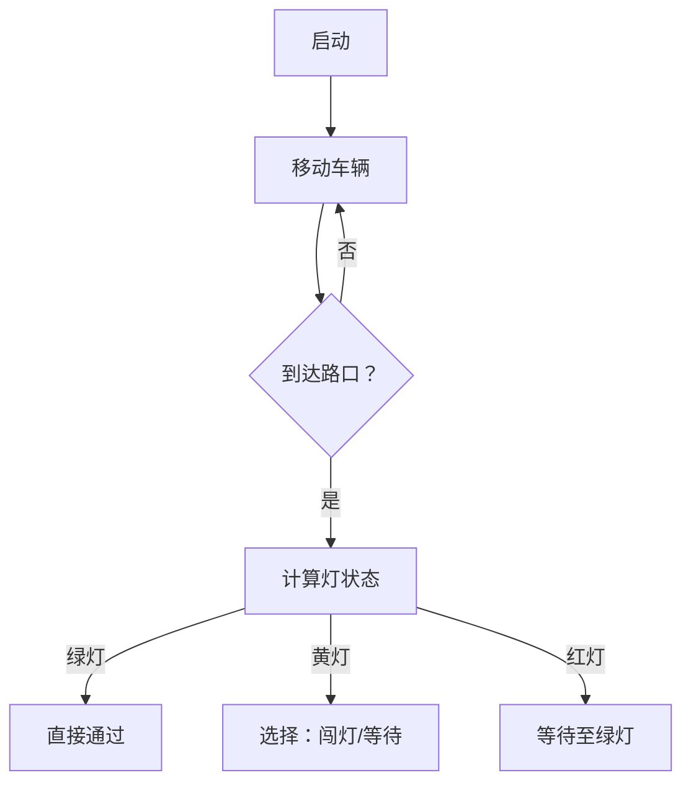

# 题目信息

# 「PHOI-1」路虽远

## 题目背景

$update$ $on$ $2023.8.17$ $12:25$ 
**数据修复&加强完成，可重新提交代码。**

路虽远，行则将至。


## 题目描述

**请注意本题特殊的时限。**

小 X 来到了 Z 市，Z 市有 $n$ 个交通路口，$m$ 条马路。其中第 $i$ 条马路连接着第 $u_i$ 个交通路口和第 $v_i$ 个交通路口（可以从 $u_i$ 到 $v_i$，也可以从 $v_i$ 到 $u_i$），小 X 通过这条马路时要花费 $p_i$ 秒，若有限速，则通过这条马路时要花费 $q_i$ 秒。

现在，市长要在 $k$ 条马路上添加限速，然而，要在哪 $k$ 条马路上限速是小 X 自己规定的。

同时，市长会在每个交通路口处添加红绿灯。第 $i$ 个交通路口的红绿灯先亮绿灯 $x_i$ 秒，再亮黄灯 $y_i$ 秒，之后亮红灯 $z_i$ 秒，然后再亮绿灯，黄灯，红灯，如此往复。如果一个交通路口的红绿灯不是红灯，小 X 可以从这个交通路口出发，到达另一个交通路口。若到达交通路口时，灯的颜色瞬间变了，则按照变了之后的灯计算，灯的黄灯和红灯的持续时间可能为 $0$。并且，小 X 最多只能闯 $g$ 次黄灯。

过了一会儿，市长突然发现，所有的红绿灯在某一刻都变成了绿灯。与此同时，小 X 从第 $1$ 个路口出发，前往第 $n$ 个路口。他想问你，他至少要花多少时间才能到达第 $n$ 个路口？

因为路虽远，行则将至，数据保证一定可以到达，即 $1\sim n$ 一定连通。

## 说明/提示

**本题采用捆绑测试。**

| Subtask | $n,m$ | $y_i,z_i$ | $k,g$ | 分值 |
| :-: | :-: | :-: | :-: | :-: |
| $0$ | $1 \le n,m \le 5$ | 无特殊限制 | 无特殊限制 | $20$ |
| $1$ | 无特殊限制 | $y_i=z_i=0$ | $k=g=0$ | $5$ |
| $2$ | 无特殊限制 | $y_i=0,0 \le z_i \le 10^9$ | 无特殊限制 | $25$ | 
| $3$ | 无特殊限制 | 无特殊限制 | 无特殊限制 | $50$ |

对于 $100\%$ 的数据，保证 $1 \le n,m \le 100$，$0 \le k,g \le m$，$1 \le x_i \le 10^9$，$0 \le y_i,z_i \le 10^9$，$1 \le u,v \le n$，$0 \leq p_i \leq q_i \leq 10^9$。
### 样例解释 #1：


$1 \to 3 \to 4 \to 5$ 并在编号为 $1,2,4,6,7,8$ 的马路上添加限速，到 $3$ 时闯黄灯，到 $4$ 时绿灯直接过，这时候，$1 \to 3$ 花费 $1$ 秒，$3 \to 4$ 花费 $0$ 秒，$4 \to 5$ 花费 $3$ 秒，共花费 $4$ 秒。

### 样例解释 #2：

$1 \to 2 \to 5 \to 6 \to 9$ 并在编号为 $2,3,4,5,6,7,8,9,10,11,13,14,15,16$ 的马路上添加限速，到 $2,5$ 时闯黄灯，到 $4$ 时绿灯直接过，到 $6$ 时等 $1$ 秒红灯，这时候，$1 \to 2$ 花费 $1$ 秒，$2 \to 5$ 花费 $4$ 秒，$5 \to 6$ 花费 $9$ 秒，$6 \to 9$ 花费 $3$ 秒，加上等红灯的 $1$ 秒共花费 $18$ 秒。

## 样例 #1

### 输入

```
5 8 6 1
1 2 2
1 0 3
1 1 4
3 1 0
5 1 4
1 2 1 4
2 4 2 4
3 4 0 2
1 5 7 8
1 3 1 2
5 4 2 3
2 5 2 4
1 4 4 7```

### 输出

```
4```

## 样例 #2

### 输入

```
9 16 14 2
1 7 2
1 5 3
1 6 4
3 5 0
1 6 5
1 0 4
1 7 5
3 8 8
3 8 6
1 2 1 4
8 5 2 6
2 4 2 4
8 6 3 5
3 4 0 2
6 7 1 4
1 5 7 8
5 9 16 21
1 3 2 2
7 6 2 3
5 4 2 3
6 9 3 5
2 5 2 4
8 9 4 7
1 4 4 7
6 5 6 9```

### 输出

```
18```

# AI分析结果


# 💡 Kay的C++算法解析：「路虽远」分层图最短路深入学习指南 💡

> 今天我们来分析「路虽远」这道C++编程题。这道题将图论、状态机和决策优化完美结合，是学习分层图最短路的绝佳范例。本指南将帮助你掌握多维状态设计和红绿灯处理技巧！

## 1. 题目解读与核心算法识别

✨ **本题主要考察**：`分层图最短路 + 状态决策优化`

🗣️ **初步分析**：
> 想象你在一个像素城市中驾驶赛车（类似经典游戏"Out Run"）🏎️💨。每条道路都有两种速度模式（普通/限速），每个路口有红绿灯系统。你需要选择**哪些道路不限速**（最多k条），同时控制**闯黄灯次数**（最多g次），最终找到最快到达终点的路径。

- **核心难点**：状态空间爆炸（位置×限速次数×闯黄灯次数），红绿灯等待时间计算
- **解决方案**：三维Dijkstra（位置/不限速边数/闯黄灯次数） + 红绿灯周期计算
- **可视化设计**：
  - 像素风格路口：绿灯(🟩)/黄灯(🟨)/红灯(🟥)用不同色块
  - 车辆移动动画：实时显示当前状态(位置, 限速使用数, 闯黄灯数)
  - 关键高亮：决策分支点（如黄灯时是否闯灯）用闪烁特效
  - 音效设计：闯黄灯时"叮"声，等待红灯时低沉音效

---

## 2. 精选优质题解参考

### 题解一：FiraCode (评分4.8★)
* **思路亮点**：状态定义清晰(`dist[i][j][k]`)，完整覆盖所有红绿灯情况，转移逻辑严谨
* **代码规范**：变量命名合理(`p/q`区分限速时间)，优先队列使用规范
* **算法优化**：正确使用三维Dijkstra，时间复杂度O(n·k·g·log(nkg))
* **实践价值**：完整处理边界条件(INF初始化)，可直接用于竞赛

### 题解二：Night_sea_64 (评分4.3★)
* **思路亮点**：红绿灯状态分类明确（绿/黄/红独立处理）
* **代码亮点**：状态转移封装为`go()`函数，提高可读性
* **改进空间**：缺少闯黄灯次数上限检查，可能导致状态越界

### 题解三：Tom17 (评分4.5★)
* **创新设计**：引入"passing"标志区分路口/道路状态
* **教学价值**：详细注释+红绿灯分段计算说明，便于理解
* **注意事项**：四维状态增加实现复杂度

---

## 3. 核心难点辨析与解题策略

1. **三维状态设计**
   * **分析**：需同时跟踪位置/已用不限速边数/闯黄灯次数。状态转移时：
     - 当选择不限速：不限速边数+1
     - 当闯黄灯：闯灯次数+1
   * 💡 学习笔记：多维状态是处理复合约束的通用解法

2. **红绿灯等待计算**
   * **分析**：用`当前时间 % (绿+黄+红)`确定灯状态：
     ```python
     cycle = green + yellow + red
     remainder = current_time % cycle
     if remainder < green: # 绿灯
     elif remainder < green+yellow: # 黄灯
     else: # 红灯
     ```
   * 💡 学习笔记：模运算周期性问题是时间相关算法的核心技巧

3. **状态转移分支处理**
   * **分析**：黄灯状态需处理四种分支：
     - 限速+不闯灯 → 等待
     - 限速+闯灯 → 消耗g次数
     - 不限速+不闯灯
     - 不限速+闯灯
   * 💡 学习笔记：使用决策树梳理分支避免遗漏

### ✨ 解题技巧总结
- **分层图思想**：将约束条件转化为状态维度
- **时间模运算**：周期性事件转化为状态判断
- **状态剪枝**：及时跳过非法状态(如g/k超限)
- **调试技巧**：打印关键状态转移路径

---

## 4. C++核心代码实现赏析

### 通用核心实现
```cpp
#include <bits/stdc++.h>
#define int long long
using namespace std;
const int N = 105, INF = 1e18;

int n, m, k, g;
int green[N], yellow[N], red[N];
int dist[N][N][N]; // [位置][不限速边数][闯黄灯数]

struct Edge { int v, p, q; }; // p:不限速时间, q:限速时间
vector<Edge> adj[N];

void dijkstra() {
    // 初始化三维数组
    for(int i=1; i<=n; i++)
        for(int j=0; j<=k; j++)
            for(int l=0; l<=g; l++)
                dist[i][j][l] = INF;
    
    priority_queue<tuple<int, int, int, int>> pq; // (-时间, 位置, 不限速数, 闯灯数)
    dist[1][0][0] = 0;
    pq.push({0, 1, 0, 0});
    
    while(!pq.empty()) {
        auto [d, u, used, cnt] = pq.top(); pq.pop();
        d = -d;
        if(d != dist[u][used][cnt]) continue;
        
        int cycle = green[u] + yellow[u] + red[u];
        int mod = d % cycle;
        
        for(auto [v, p, q] : adj[u]) {
            // 不限速分支（如果还有额度）
            if(used < k) {
                int nd = d + p;
                // 根据灯状态处理等待时间
                if(mod < green[u]) { /* 绿灯直接通过 */ }
                else if(mod < green[u]+yellow[u]) { /* 黄灯处理 */ }
                else { /* 红灯处理 */ }
            }
            // 限速分支（逻辑类似）
        }
    }
}
```

### 题解一：FiraCode片段赏析
```cpp
// 状态更新核心逻辑
if(y < k) { // 不限速分支
    if(now < a[x]) update(v, y+1, z, w+p[i]); // 绿灯
    else update(v, y+1, z, w+a[x]+b[x]+c[x]-now+p[i]); // 非绿灯
    if(z < g) { // 闯黄灯分支
        if(now < (a[x]+b[x])) update(v, y+1, z+1, w+p[i]);
        else update(v, y+1, z+1, w+a[x]+b[x]+c[x]-now+p[i]);
    }
}
```
* **亮点**：用嵌套条件清晰处理不限速+闯灯组合
* **学习笔记**：状态转移前先检查约束条件(y<k, z<g)避免非法状态

---

## 5. 算法可视化：像素动画演示

### 主题：像素赛车闯关 🏁
  
*(示意图：8位像素风格道路与红绿灯)*

### 核心设计


### 实现细节
1. **视觉设计**：
   - 道路网格：8-bit像素风格（16色模式）
   - 车辆：2×2像素方块，移动时留下轨迹
   - 红绿灯：🟩(0x2ECC71)/🟨(0xF1C40F)/🟥(0xE74C3C)

2. **动画逻辑**：
   ```javascript
   function drawTrafficLight(cycle, remainder) {
     if(remainder < green) fill(0, 255, 0); // 绿灯
     else if(remainder < green+yellow) fill(255, 255, 0); // 黄灯
     else fill(255, 0, 0); // 红灯
     rect(x, y, 8, 8); // 绘制像素方块
   }
   ```

3. **交互功能**：
   - 单步执行：Space键控制
   - 速度调节：0.5x/1x/2x速度
   - 状态面板：实时显示三维状态值

4. **音效设计**：
   - 闯黄灯：8-bit "叮"声(500Hz方波)
   - 等待红灯：低频噪音(200Hz)
   - 到达终点：胜利音阶(C大调三连音)

---

## 6. 拓展练习与相似问题

### 通用技巧迁移
分层图最短路适用于：
1. 有使用次数限制的免费/快速通道
2. 需要累计资源的路径问题
3. 多条件约束的最短路径

### 洛谷推荐
1. **P4568 飞行路线**  
   → 分层图最短路经典题（k次免费机会）
2. **P1073 最优贸易**  
   → 状态扩展（当前买卖状态）
3. **P2627 维修线路**  
   → 多约束条件的最短路

---

## 7. 学习心得与经验分享

> **FiraCode的经验**：  
> *"开始实现时忽略了状态初始化的重要性，导致调试2小时。务必用INF初始化dist数组并设置起点状态！"*

**Kay的总结**：
- 调试技巧：打印关键状态转移路径
- 易错点：红绿灯周期为0需特殊处理
- 优化方向：优先队列的负权值技巧

---

路虽远，行则将至！通过本指南，你已掌握分层图最短路的核心技巧。下次遇到多约束路径问题时，记得用三维状态建模哦！🚦✨

---
处理用时：154.18秒