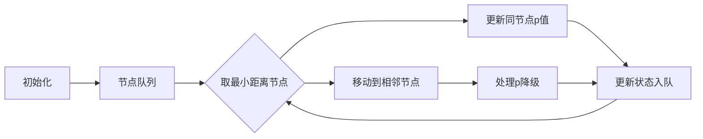

# 题目信息

# [NOI2025] 机器人

## 题目描述

NOI2025 正在绍兴举办，小 Y 为闭幕式表演制作了一个机器人并打算操控它从仓库走到礼堂。

绍兴的道路系统可以简化为 $n$ 个路口以及连接这些路口的 $m$ 条 **单行道路**，且每条道路有一定的长度。为了方便将道路系统录入机器人的芯片，小 Y 对每一个路口连接的所有道路进行了编号。具体而言，若有 $d$ 条道路以路口 $x$ 为起点，则这 $d$ 条道路会被小 Y 按照某种顺序编号为 $1 \sim d$，分别称作以 $x$ 为起点的第 $1 \sim d$ 条道路。

小 Y 的机器人内部有一个参数 $p$。给定参数 $p$ 的上限 $k$ 与修改费用 $v_1, v_2, \ldots, v_{k-1}, w_2, w_3, \ldots, w_k$。小 Y 将按照如下规则设置与修改机器人的参数：

- 初始时，小 Y 将参数 $p$ 设置为 $1$。
- 在 **任意时刻**，小 Y 可以远程控制机器人修改参数：
  - 若 $p < k$，则小 Y 可以花费 $v_p$ 的费用将 $p$ 增加 $1$，即 $p \leftarrow p + 1$；
  - 若 $p > 1$，则小 Y 可以花费 $w_p$ 的费用将 $p$ 减少 $1$，即 $p \leftarrow p - 1$。

初始时，小 Y 的机器人位于机器人仓库，即路口 $1$。当机器人位于路口 $x$ 时，记以路口 $x$ 为起点的第 $p$ 条道路的终点为 $y$，道路长度为 $z$，则小 Y 可以花费 $z$ 的费用操控机器人从 $x$ 走到 $y$。特别地，若以路口 $x$ 为起点的道路不足 $p$ 条，则小 Y 无法操控机器人走动。

小 Y 并不知道闭幕式表演所在的礼堂位于哪个路口，因此他需要对每个路口都做好准备。请你帮助他求出将机器人从仓库移动到每个路口所需费用的最小值。

## 说明/提示

### 样例 1 解释

小 Y 可以按照以下方案将机器人分别从仓库移动到路口 $1 \sim 4$：

- 对于路口 $1$：小 Y 的机器人初始时即位于路口 $1$，因此所需费用为 $0$。
- 对于路口 $2$：小 Y 操控机器人沿以路口 $1$ 为起点的第 $1$ 条道路走到路口 $2$，所需费用为 $5$。
- 对于路口 $3$：小 Y 将参数 $p$ 增加 $1$，然后操控机器人沿以路口 $1$ 为起点的第 $2$ 条道路走到路口 $3$，所需费用为 $2 + 1 = 3$。
- 对于路口 $4$：小 Y 将参数 $p$ 增加 $1$，然后操控机器人沿以路口 $1$ 为起点的第 $2$ 条道路走到路口 $3$，再操控机器人沿以路口 $3$ 为起点的第 $2$ 条道路走到路口 $4$，所需费用为 $2 + 1 + 1 = 4$。

可以证明，上述移动方案的所需费用均为最小值。

- 对于路口 $5$：由于小 Y 无法将机器人移动到路口 $5$，因此输出 $-1$。

### 样例 2

见选手目录下的 `robot/robot2.in` 与 `robot/robot2.ans`。

该样例满足测试点 $3 \sim 5$ 的约束条件。

### 样例 3

见选手目录下的 `robot/robot3.in` 与 `robot/robot3.ans`。

该样例满足测试点 $6 \sim 8$ 的约束条件。

### 样例 4

见选手目录下的 `robot/robot4.in` 与 `robot/robot4.ans`。

该样例满足测试点 $9, 10$ 的约束条件。

### 样例 5

见选手目录下的 `robot/robot5.in` 与 `robot/robot5.ans`。

该样例满足测试点 $16 \sim 18$ 的约束条件。

### 数据范围

对于所有测试数据，保证：

- $1 \leq n, m \leq 3 \times 10^5$，$1 \leq k \leq 2.5 \times 10^5$；
- 对于所有 $1 \leq i \leq k - 1$，均有 $0 \leq v_i \leq 10^9$；
- 对于所有 $2 \leq i \leq k$，均有 $0 \leq w_i \leq 10^9$；
- 对于所有 $1 \leq i \leq n$，均有 $0 \leq d_i \leq k$，且 $\sum_{i=1}^{n} d_i = m$；
- 对于所有 $1 \leq i \leq n$，$1 \leq j \leq d_i$，均有 $1 \leq y_{i,j} \leq n$，$1 \leq z_{i,j} \leq 10^9$。

::cute-table{tuack}

| 测试点编号 | $n, m \leq$ | $k \leq$ | 特殊性质 |
| :-: | :-: | :-: | :-: |
| $1, 2$ | $6$ | $6$ | C |
| $3 \sim 5$ | $10^3$ | $10^3$ | ^ |
| $6 \sim 8$ | $5 \times 10^4$ | $10^2$ | 无 |
| $9, 10$ | $10^5$ | $10^5$ | AB |
| $11, 12$ | ^ | ^ | A |
| $13 \sim 15$ | ^ | ^ | C |
| $16 \sim 18$ | ^ | ^ | 无 |
| $19, 20$ | $3 \times 10^5$ | $2.5 \times 10^5$ | ^ |

- 特殊性质 A：保证 $v_1 = v_2 = \cdots = v_{k-1} = 0$ 且 $w_2 = w_3 = \cdots = w_k = 0$。
- 特殊性质 B：保证对于所有 $1 \leq i \leq n$，$1 \leq j \leq d_i$，均有 $z_{i,j} = 1$。
- 特殊性质 C：保证至多存在 10 个 $i$ 满足 $d_i \geq 10$。

附加文件来自于 [QOJ](https://qoj.ac/contest/2315/problem/13079)。

## 样例 #1

### 输入

```
0
5 6 3
2 4
1 1
3 2 5 3 1 4 2
1 3 2
2 1 2 4 1
0
0```

### 输出

```
0 5 3 4 -1```

# AI分析结果


# 💡 Kay的C++算法解析：[NOI2025] 机器人 深入学习指南 💡

## 1. 题目解读与核心算法识别

✨ **本题主要考察**：`分层图最短路` 与 `状态优化`

🗣️ **初步分析**：
> 解决"机器人移动问题"的关键在于**将参数p融入状态设计**。想象机器人带着一个"遥控器"行走，每次移动需选择对应编号的道路。核心挑战在于：
> - 状态空间爆炸：直接设计`(位置, p参数)`状态会导致O(n×k)复杂度
> - 参数调整代价：修改p的代价随操作次数累积
>
> **创新解法**：利用"有效状态"思想——每个点只需考虑其出边对应的p值（共d_x种），将状态数压缩至O(m)。这就像为每个路口定制专属遥控器，而非携带万能遥控器。
>
> **可视化设计**：采用8位像素风格模拟机器人探索：
> - 网格表示路口，不同颜色像素块表示状态(p值)
> - 高亮当前操作：参数调整时显示v/w数值弹窗
> - 道路移动时显示z值消耗动画
> - 控制面板支持单步/自动播放，速度可调

---

## 2. 精选优质题解参考

### 题解一：作者_H17_（思路清晰，代码简洁）
* **点评**：  
  采用`map<int, int>`动态存储状态，避免预分配内存。亮点在于：
  - **状态转移完整**：同时处理同点p增减与跨点移动
  - **代码复用性高**：`up()`/`down()`函数封装参数修改代价
  - **实践价值**：直接使用STL容器，降低调试难度
  ```cpp
  // 核心逻辑：Dijkstra中的状态转移
  for(int i=1; i<=min(oud[u],p-1); i++)  // p减小时
  for(int i=p+1; i<=min(oud[u],k); i++)  // p增大时
  if(oud[u]>=p) { /* 移动操作 */ }       // 道路存在时
  ```

### 题解二：作者WsW_（结构严谨，空间优化）
* **点评**：  
  使用二维vector精确管理状态，亮点：
  - **空间控制**：`dis[i].assign(d[i]+1, Inf)`精准分配
  - **前缀和应用**：`gs()`函数高效计算参数调整代价
  - **边界处理**：显式处理`p=0`作为终止状态
  ```cpp
  // 关键优化：状态转移时预处理调整代价
  ll cost = cost0 + gs(p, i);  // 计算从当前p到目标i的代价
  if(cost < dis[to][i]) { /* 更新 */ }
  ```

### 题解三：作者thy21171（建图策略创新）
* **点评**：
  创新性边构建方案：
  - **跨层连接**：当p>目标点出度时，自动降级到最大可用p
  - **代价整合**：`w + sum_{i=d_y+1}^p w_i`合并移动与调整代价
  - **代码健壮性**：单独处理d[1]=0的边界情况
  ```cpp
  // 创新点：目标点p不足时的处理
  if(q >= p) { /* 直接连接 */ }  
  else {
      w += W[p] - W[q];  // 增加调整代价
      connect_to(y, q);  // 连接到最大可用p
  }
  ```

---

## 3. 核心难点辨析与解题策略

1. **状态空间爆炸**
   * **分析**：传统分层图需O(n×k)空间，但注意到每个点只需维护其出度范围内的p值
   * **解决**：动态创建状态（如使用map或vector<vector>），空间优化至O(m)

2. **参数调整代价计算**
   * **分析**：v_p/w_p的代价是累积的，且需支持任意p间跳跃计算
   * **解决**：预处理前缀和数组，实现O(1)代价查询
     ```cpp
     v_pre[i] = v_pre[i-1] + v[i];  // 递增代价前缀和
     w_pre[i] = w_pre[i-1] + w[i];  // 递减代价前缀和
     ```

3. **跨节点状态转移**
   * **分析**：当目标节点不支持当前p时需特殊处理
   * **解决**：两种策略：
     - 降级到目标节点最大可用p（增加调整代价）
     - 连接到专用终止状态（如thy21171的解法）

### ✨ 解题技巧总结
- **状态压缩**：每个点只维护实际存在的p状态
- **代价预计算**：前缀和加速参数调整代价查询
- **增量更新**：Dijkstra中同时处理移动和参数调整
- **边界防御**：显式处理出度为0或p超限的情况

---

## 4. C++核心代码实现赏析

**本题通用核心C++实现参考**
```cpp
#include <bits/stdc++.h>
using namespace std;
typedef long long ll;
const int N = 3e5+5;
const ll INF = 1e18;

vector<pair<int, int>> G[N];  // G[u]: (neighbor, weight)
vector<ll> dist[N];          // dist[u][p]: 状态距离
vector<bool> vis[N];         // 访问标记
ll v_pre[N], w_pre[N];       // 参数调整前缀和
int n, m, k;

// 计算从p1调整到p2的代价
inline ll adjust_cost(int p1, int p2) {
    if(p1 == p2) return 0;
    return p1 < p2 ? v_pre[p2-1] - v_pre[p1-1] 
                   : w_pre[p1] - w_pre[p2];
}

void dijkstra() {
    priority_queue<tuple<ll, int, int>> pq;
    dist[1][1] = 0;
    pq.emplace(0, 1, 1);
    
    while(!pq.empty()) {
        auto [d_val, u, p] = pq.top(); pq.pop();
        if(vis[u][p]) continue;
        vis[u][p] = true;
        
        // 同节点调整p
        if(p > 1) { /* 尝试p-1 */ }
        if(p < G[u].size()) { /* 尝试p+1 */ }
        
        // 沿道路移动
        if(p <= G[u].size()) {
            auto [v, w] = G[u][p-1];
            int new_p = min(p, (int)G[v].size()); // 自动降级
            ll cost = w + adjust_cost(p, new_p);
            if(dist[v][new_p] > d_val + cost) {
                dist[v][new_p] = d_val + cost;
                pq.emplace(-dist[v][new_p], v, new_p);
            }
        }
    }
}
```

**题解一核心片段赏析**  
* **亮点**：使用`gp_hash_table`实现紧凑状态存储
```cpp
gp_hash_table<int, int> dis[N], vis[N];
// 状态转移核心
for(int i=1; i<=min(oud[u],p-1); i++) {
    ll new_cost = d + down(p, i);
    if(!vis[u].count(i) || new_cost < dis[u][i]) {
        dis[u][i] = new_cost;
        q.push({new_cost, u, i});
    }
}
```

---

## 5. 算法可视化：像素动画演示

### 🎮 像素化机器人寻路模拟
**主题**：复古RPG风格的路径探索  
**核心演示**：Dijkstra算法在分层图中的执行过程  



**动画设计细节**：
1. **场景构建**：
   - 16色FC游戏风格调色板
   - 路口显示为不同颜色方块（仓库：金色，礼堂：红色）
   - 参数p用底部条形码显示

2. **动态效果**：
   - **状态更新**：当前处理的网格闪烁黄色边框
   - **参数调整**：显示`v_p`/`w_p`数值弹窗，伴随"滴"声
   - **道路移动**：机器人像素动画沿道路移动，显示`z`值消耗

3. **控制面板**：
   - 单步执行：按A键步进
   - 自动播放：B键启动/暂停，滑块调速
   - 状态追踪：L/R键切换观察不同p值状态

4. **音效设计**：
   - 移动："哔"声（8位方波音效）
   - 参数调整："叮"声（短促三角波）
   - 到达终点：胜利音阶（C大调上行）

**技术实现**：HTML5 Canvas绘制网格，Web Audio API生成音效，使用requestAnimationFrame实现平滑动画。

---

## 6. 拓展练习与相似问题思考

### 相似问题逻辑
分层图思想适用于三类问题：
1. **附加状态的最短路**（如剩余燃料、特殊通行证）
2. **多维状态决策**（如时间-费用权衡）
3. **状态受限的移动**（如特定朝向进入节点）

### 推荐练习（洛谷）
1. **P1073 最优贸易**  
   🗣️ *推荐理由*：状态分层思想应用，理解"在不同状态间转移"的价值计算

2. **P4568 飞行路线**  
   🗣️ *推荐理由*：经典分层图问题，掌握"用层数表示特殊操作次数"

3. **P4011 孤岛营救问题**  
   🗣️ *推荐理由*：结合状态压缩与分层图，练习用位运算管理钥匙状态

---

## 7. 学习心得与经验分享

> **来自_H17_的调试经验**：  
> "在实现时特别注意`p`的索引范围，我因未处理`p>当前节点出度`的情况WA了两次。建议在Dijkstra内显式添加判断：`if(oud[u] < p) continue;`"

> **Kay的总结**：  
> 调试此类问题时，关键是在状态转移前**预判目标状态的有效性**。可添加临时日志输出：
> ```cpp
> printf("At node=%d p=%d: try move to %d (max_p=%d)\n", 
>        u, p, v, oud[v]);
> ```
> 当目标节点的最大p小于当前p时，必须触发降级操作或终止转移。

---

本次解析结合了分层图优化、状态压缩和Dijkstra算法精要。记住：**优秀算法设计=问题特性洞察+数据结构创新**。继续挑战更高维的状态优化问题吧！🚀

---
处理用时：125.36秒